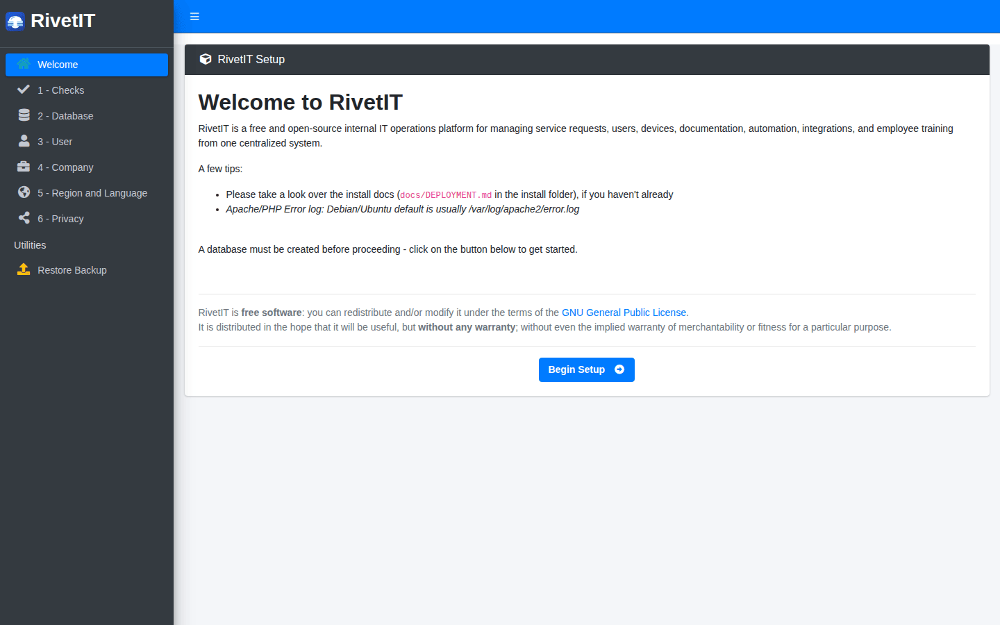
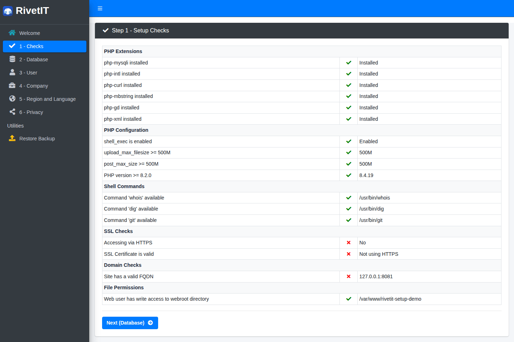
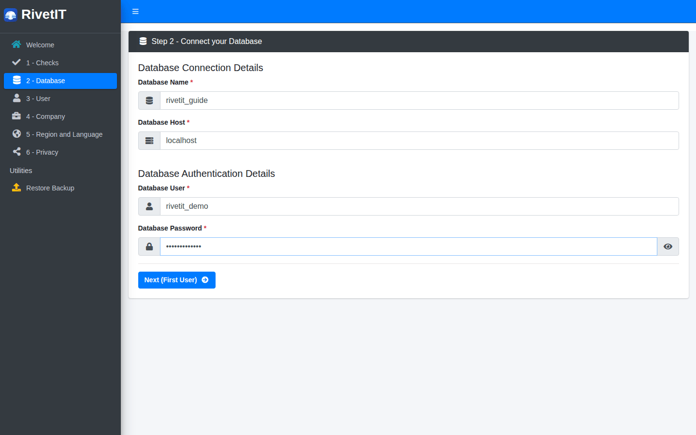
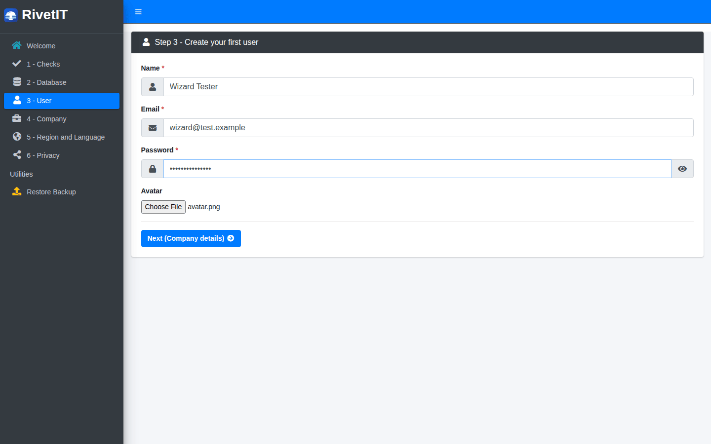
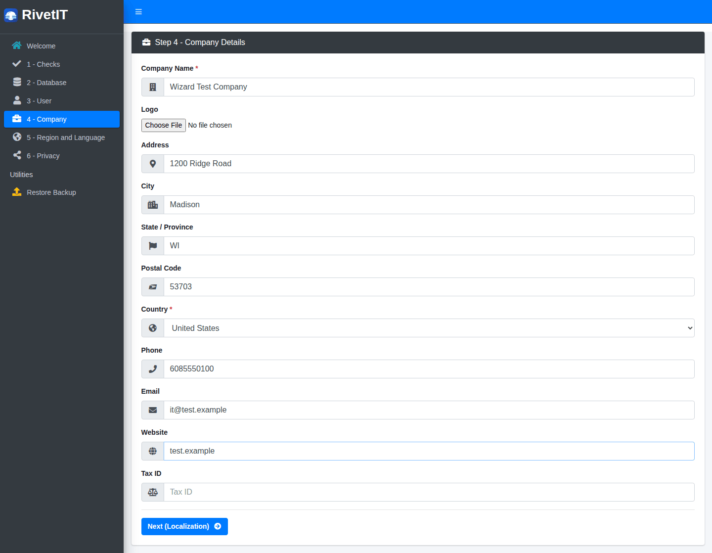
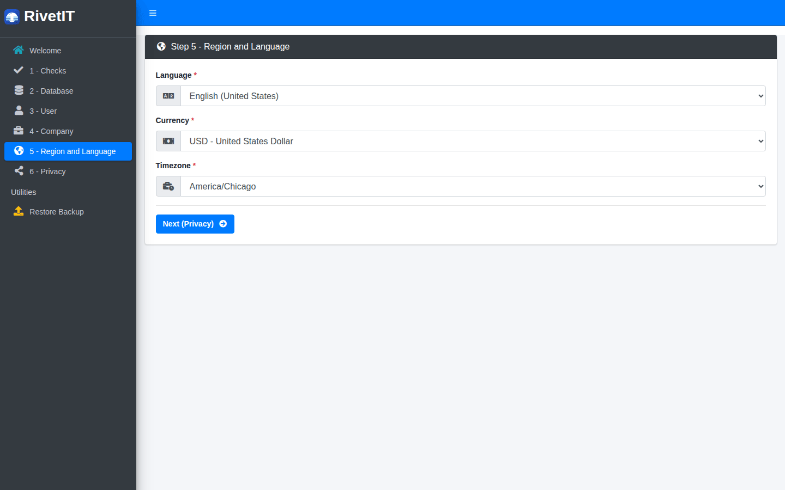
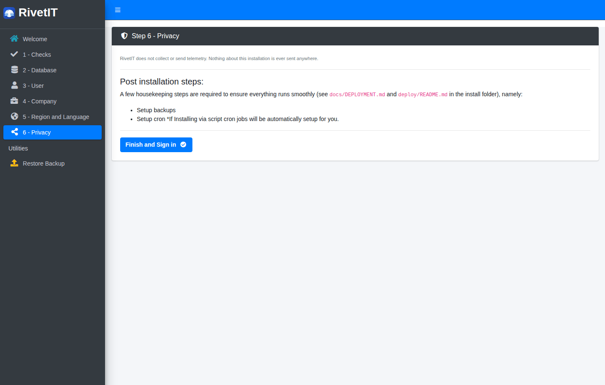
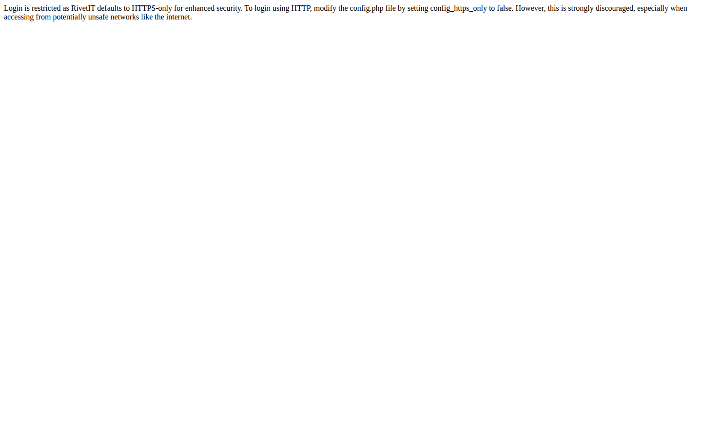

# First-time setup

This page walks through the browser installer that runs the first time you open a new RivetIT server. It is for the administrator who installs RivetIT. Everyone else can skip to [Getting started](01-getting-started.md).

| | |
|---|---|
| **Where to find it** | Your RivetIT address followed by `/setup/`. A brand-new install sends you there on its own. |
| **Who can use it** | Whoever can reach the server before it is set up. There is no sign-in yet, and none is needed. |
| **Turn it on** | Nothing to turn on. The installer switches itself off when you finish. |

## What it's for

The installer connects RivetIT to its database, creates the first administrator, records your company details and picks your language, currency and time zone. It takes about five minutes.

Before you start you need:

- A running RivetIT web server (Docker Compose or the `deploy/install.sh` script; see [Deployment](../DEPLOYMENT.md)).
- An **empty database** and a database user that can create tables in it. The installer does not create the database for you.
- The address you will use to open RivetIT, ideally a proper host name with HTTPS.

If you prefer the command line, `scripts/setup_cli.php` does the same job without a browser, and `deploy/full-restore-deploy.sh` installs the server, restores a backup and hardens it in one interactive run. Both are described in [Deployment](../DEPLOYMENT.md). The rest of this page is about the browser installer.

## A quick tour

*Figure 1 — The welcome page. The left menu lists the six steps. Click **Begin Setup** to start.*

The left menu shows where you are: **1 - Checks**, **2 - Database**, **3 - User**, **4 - Company**, **5 - Region and Language** and **6 - Privacy**. Under **Utilities**, **Restore Backup** is for moving an existing installation onto this server (see [Restore a backup instead](#restore-a-backup-instead)).

You can leave the installer and come back. A step saves its answers when you press its **Next** button. The database and first-user steps refuse to run a second time, so a finished install cannot be overwritten by mistake.

## Common tasks

### Install RivetIT step by step

**Step 1 - Check the server**

*Figure 2 — Step 1, Setup Checks. Green ticks are good. Red crosses are worth reading, but none of them stops you from continuing.*

1. Click **Begin Setup**. The **Setup Checks** table lists what the installer looked at:

| Group | What it checks | Why it matters |
|---|---|---|
| **PHP Extensions** | `mysqli`, `intl`, `curl`, `mbstring`, `gd` and `xml` are installed. | RivetIT needs them. A missing one usually causes errors later. |
| **PHP Configuration** | `shell_exec` is enabled; `upload_max_filesize` and `post_max_size` are at least 500M; PHP is 8.2.0 or newer. | Large uploads and backups need the 500M limits. The version is a hard requirement. |
| **Shell Commands** | `whois`, `dig` and `git` are available. | Domain look-ups use `whois` and `dig`. Software updates use `git`. |
| **SSL Checks** | You opened the installer over HTTPS and the certificate is valid. | Sign-in is HTTPS-only by default (see [If sign-in shows an HTTPS message](#if-sign-in-shows-an-https-message)). |
| **Domain Checks** | The address in your browser is a valid host name (for example `it.example.com`, not an IP address). | Links in emails and portals are built from this address. |
| **File Permissions** | The web server can write to the RivetIT folder. | The installer has to write `config.php` there. |

2. Fix anything you care about, reload the page to check again, then click **Next (Database)**.

**Step 2 - Connect the database**

*Figure 3 — Step 2, Connect your Database.*

3. Fill in **Database Name**, **Database Host** (usually `localhost`; with Docker Compose it is `db`), **Database User** and **Database Password**. The eye button shows the password as you type.
4. Click **Next (First User)**.

The installer tests the connection first. If it fails, you see the database's own error message and can go back and correct the details. If it works, the installer writes `config.php`, creates every table and generates this installation's encryption keys. That can take a few seconds.

> The database details live in `config.php` after this step. To change them later, edit that file. Running this step a second time does nothing and sends you on to the next step.

**Step 3 - Create the first administrator**

*Figure 4 — Step 3, Create your first user.*

5. Enter your **Name**, **Email** and **Password**. The password needs at least 8 characters. **Avatar** is an optional picture.
6. Click **Next (Company details)**.

This person becomes the administrator and signs in with this email address and password. Your password also protects your personal copy of the key that locks the credential vault, so choose one you can keep and store it safely. The installer only creates a first user when the database has none; if users already exist it skips ahead.

**Step 4 - Describe your company**

*Figure 5 — Step 4, Company Details.*

7. Enter the **Company Name** and **Country**; both are required. Add a **Logo**, address, **Phone**, **Email** and **Website** if you want them. **Tax ID** is optional.
8. Click **Next (Localization)**.

These details appear on the company record and in emails. You can change all of them later in Administration → Settings → **Company Details** (see [Administration: settings](13-administration-settings.md#update-company-details)).

**Step 5 - Choose region and language**

*Figure 6 — Step 5, Region and Language.*

9. Pick the **Language**, **Currency** and **Timezone**. The time zone decides what time RivetIT shows on tickets, reminders and reports, so set it to where most of your staff work.
10. Click **Next (Privacy)**.

**Step 6 - Privacy and finish**

*Figure 7 — Step 6, Privacy. The page confirms that nothing is sent anywhere, then lists the housekeeping still to do.*

11. Read the reminders, then click **Finish and Sign in**.

RivetIT collects and sends no telemetry. This step only reminds you what is left to do (see the next section) and turns the installer off. From now on `/setup/` sends anyone to the sign-in page.

### After the installer

1. **Sign in.** Go to the sign-in page and use the email and password from step 3. The page and its options are described in [Getting started](01-getting-started.md#signing-in).
2. **Check for database updates.** Open Administration → **Maintenance → Update** (see [Update RivetIT](13-administration-settings.md#update-rivetit)). If an **Update Database** button appears, take a backup, click it, and repeat until it disappears. A new install can start a few versions behind the code.
3. **Turn on the scheduler.** Installing does not switch on scheduled work. Both Docker Compose and `deploy/install.sh` run RivetIT's cron job every few minutes, but the job does nothing until you open Administration → Settings → **Notifications**, tick **Enable Cron Job** and save. Email reminders, expiry alerts, recurring tickets, ticket automation and automatic backups all wait for this switch. See [Keep scheduled jobs running](13-administration-settings.md#keep-scheduled-jobs-running).
4. **Set up backups.** Administration → **Maintenance → Backups** downloads, stores and schedules backups. Do this before you enter real data (see [Back up RivetIT](13-administration-settings.md#back-up-rivetit)).
5. **Turn on the modules you will use.** Ticketing, IT Documentation, Knowledge Base, Training, Live Chat and the Department Portal are switched on under Administration → Settings → **Modules**.
6. **Add your team.** Create agent accounts under Administration → Users (see [Administration: users and security](12-administration-users-and-security.md)), then your departments and people.

### If sign-in shows an HTTPS message

*Figure 8 — What you see when you open the sign-in page over plain `http://` on a default install.*

RivetIT refuses to sign anyone in over plain HTTP, because passwords would cross the network unprotected. The installer writes `$config_https_only = TRUE;` into `config.php`. There are two ways out:

- **Use HTTPS** (recommended). Put a certificate on the server (`deploy/install.sh` sets up Let's Encrypt for you) or put a reverse proxy that provides HTTPS in front of it, then open the site with `https://`.
- **Allow HTTP on a private test server only.** Edit `config.php` and set `$config_https_only = FALSE;`. RivetIT's own message says this is strongly discouraged on networks you do not control. Never do it for a server reachable from the internet.

### Restore a backup instead

If you are moving RivetIT to a new server, you can restore a backup instead of creating a fresh company.

1. Do steps 1 and 2 above so the installer knows the (empty) database.
2. On the welcome page (it now offers **Restore from Backup**) or in the left menu under **Utilities**, choose **Restore Backup**. Before step 2 is done, this page only tells you a database must be configured first.
3. Choose the `.zip` file made by Administration → **Maintenance → Backups** (**Download Backup** or **Save to Server**). If a **Backup encryption passphrase** was set when the backup was taken, type it into **Backup passphrase**; otherwise leave the box empty. Click **Restore Backup**.
4. Wait. Large backups take several minutes; do not close the page. When it finishes you land on the sign-in page. Sign in with an account from the old server.
5. Read the message shown after the restore. If it says the key could not be recovered, re-enter the stored mail, integration and webhook passwords (see the note below).

The restore **replaces everything**. It drops every table in the database and empties the `uploads` folder before loading the backup, so only use it on an empty or disposable database. The uploaded files are checked as they are unpacked: files that look like scripts or executables are rejected and the restore stops with a list of the ones it refused. A `.zip` from the app's own backup screen is what this form expects. The encrypted `backup-*.tar.gz.enc` files made by the server's disaster-recovery timer are restored with `deploy/restore.sh` on the command line instead (see [Deployment](../DEPLOYMENT.md#42-deploybackupsh-the-actual-dr-mechanism)). From the command line, `deploy/restore_admin_zip.sh` restores the app's own `.zip` backups.

> **Stored secrets.** Mail, integration and webhook passwords are encrypted with a key that lives in `config.php` on the old server, not in the database. Every backup carries a copy of that key in a small manifest, and the restore puts it into the new `config.php`, so those passwords keep working. If the manifest is encrypted and you leave **Backup passphrase** empty or type it wrongly, the restore still finishes but cannot recover the key; the page says so, and you must re-enter those passwords under Administration → Settings. Backups made before the manifest existed have no key to recover.

## Reference

| Step | Page | Required fields | Button |
|---|---|---|---|
| Welcome | `/setup/` | None | **Begin Setup** (or **Create First User** and **Restore from Backup** once a database is connected) |
| 1 - Checks | `/setup/?checks` | None | **Next (Database)** |
| 2 - Database | `/setup/?database` | Database Name, Host, User, Password | **Next (First User)** |
| 3 - User | `/setup/?user` | Name, Email, Password (8+ characters) | **Next (Company details)** |
| 4 - Company | `/setup/?company` | Company Name, Country | **Next (Localization)** |
| 5 - Region and Language | `/setup/?localization` | Language, Currency, Timezone | **Next (Privacy)** |
| 6 - Privacy | `/setup/?telemetry` | None | **Finish and Sign in** |
| Restore | `/setup/?restore` | A backup `.zip` | **Restore Backup** |

## Tips and good practice

- Open the installer using the final address people will use. RivetIT stores that host name as its base address, and links in emails are built from it.
- Use a strong, unique password for the first administrator, and add a second administrator soon so you are not locked out if one account has a problem.
- Keep `config.php` private and include it in your server backups. It holds the key that protects stored mail, integration and webhook passwords. The app's own `.zip` backup does not contain `config.php`; it carries only a copy of that key in its manifest, which is readable by anyone who holds the file unless you set a **Backup encryption passphrase** (see [Back up RivetIT](13-administration-settings.md#back-up-rivetit)).
- If the installer is reachable after you finish, it is not a security problem: it only redirects to the sign-in page once `config.php` says setup is complete.

## Related guides

- [Getting started](01-getting-started.md): sign in and learn the layout.
- [Administration: settings](13-administration-settings.md): change company details, turn on the scheduler, set up backups and mail.
- [Administration: users and security](12-administration-users-and-security.md): add agents and set roles.
- [Deployment](../DEPLOYMENT.md): install options, backups and restore from the command line.
