# Getting started

This page shows you how to sign in to RivetIT, find your way around, set up your own account, and use the list features that almost every page shares. Read it first: the other guides assume you know these basics.

| | |
|---|---|
| **Where to find it** | Sign-in page: your RivetIT address followed by `/login.php`. Your account: user menu (your name, top right) → **Account**. |
| **Who can use it** | Everyone who signs in. Which sidebar entries and buttons you see depends on your role (see [Roles and what you see](#roles-and-what-you-see)). |
| **Turn it on** | Nothing to turn on. Administrators control the start page, session length and login options under Administration → Settings. |

## Signing in

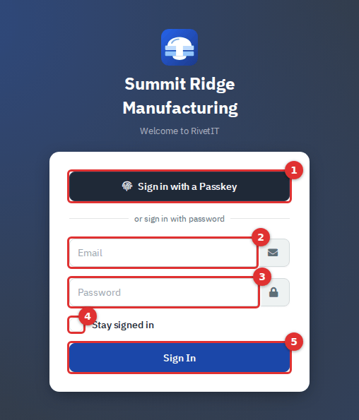

*Figure 1 — The sign-in page. Agents and employees use the same page.*

1. Open the sign-in address your administrator gave you.
2. Type your email address **(2)** and password **(3)**.
3. Tick **Stay signed in (4)** only on a computer you trust (see below).
4. Click **Sign In (5)**.

You land on the **start page**, which an administrator chooses (Administration → Settings → Defaults → **Start Page**: Dashboard, Department Management, Support Tickets or Invoices). If you opened a specific page while signed out, RivetIT returns you to that page after you sign in.

### Other things the sign-in page can ask

- **MFA code.** If you turned on multi-factor authentication, a second screen asks for the 6-digit code from your authenticator app (**Verify your 2FA code**), with a **Remember Me** box and a **Verify & Sign In** button. You have two minutes to finish; after that, the message "Your MFA session expired" tells you to start again.
- **Choosing a side.** If the same email address belongs to both an agent and an employee, you see two buttons: **Log in as Agent** and **Log in as Department**. "Department" here means the Department Portal, the employee self-service site.
- **Passkey.** **Sign in with a Passkey (1)** needs no email or password: your device asks for your fingerprint, face or PIN. It works only after you add a passkey to your account (see [Security](#security-password-mfa-and-passkeys)). If your device has no passkey for this site, an error appears; sign in with your password instead.
- **Login message.** An administrator can show a notice at the top of the sign-in card.
- **Employees.** Employees sign in on this same page and go straight to the Department Portal. See the [Department Portal guide](11-employee-portal.md).

Two buttons appear only when an administrator has set them up, so you may not see them: **Forgot password?** (needs outgoing email) and **Login with Microsoft Entra**. Both are for **Department Portal** accounts. They do not work for agents. If an agent forgets a password, an administrator sets a new one (Administration → Users → edit the user → **New Password**).

### Stay signed in, and when you are signed out

**Stay signed in** keeps you signed in on this browser for the number of days set in Administration → Settings → Security (**2FA Remember Me Expire**, 3 days by default). With MFA on, it also skips the code on that browser for the same period. Without it, RivetIT signs you out after a period of inactivity (**Session Lifetime**, 480 minutes, or 8 hours, by default). Open pages keep the session alive in the background.

If you use a shared computer, leave **Stay signed in** unticked and use user menu → **Logout** when you finish.

> If you type a wrong password several times, sign-in is blocked for your network address: 15 failed attempts in 10 minutes lock that address out until the window passes. Every failed attempt is logged.

## A first look at the app

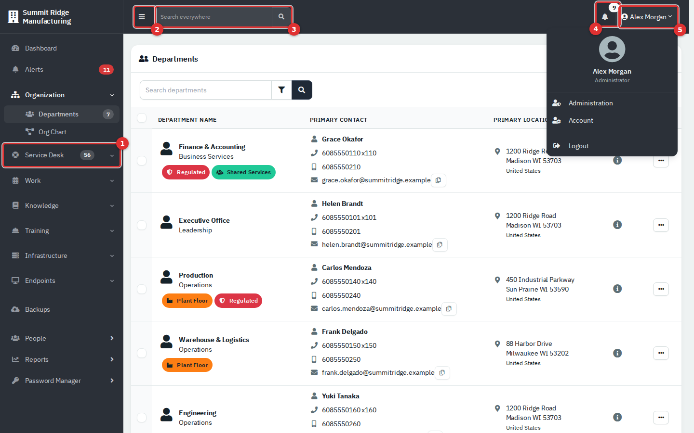

*Figure 2 — The main screen. The user menu is open so you can see its entries.*

| # | What it is | What it does |
|---|---|---|
| **(1)** | Sidebar group (here **Service Desk**) | Click a group name to open or close it. The group that holds the page you are on opens by itself. A number badge shows a live count, such as open tickets. |
| **(2)** | Fold button (☰) | Shrinks the sidebar to icons and back. Your choice is remembered in this browser. On a narrow window the sidebar is hidden until you press it; **Esc** or a click outside closes it. |
| **(3)** | **Search everywhere** | Type at least two characters and matching records appear, grouped by type, up to five per group. Click a result to open it, or choose **See all results** for the full page. |
| **(4)** | Bell | Your personal notifications. The number is how many you have not dismissed. |
| **(5)** | User menu | **Administration** (administrators only), **Account** and **Logout**. |

The company name at the top of the sidebar always takes you to the **Dashboard**. It is covered in the [Dashboard and Reports guide](10-dashboard-and-reports.md).

### Sidebar groups

Entries appear only when the feature is switched on (Administration → Settings → **Modules**) **and** your role may use it.

| Group | Entries | Shown when |
|---|---|---|
| **Dashboard** | Dashboard | Always, except for module-only logins. |
| **Alerts** | Alerts, with a red count of new alerts | Your role can see RMM alerts. This is monitoring alerts from connected tools, not your notifications. |
| **Organization** | Departments (count of active departments), Org Chart | Departments: Read or higher. |
| **Service Desk** | Tickets, Recurring Tickets, Request Something, CSAT Ratings, Requests, Problems, Changes | **Show Ticketing** is on and Tickets, assets & docs: Read or higher. CSAT Ratings needs CSAT turned on. |
| **Work** | Projects, Calendar | Tickets, assets & docs: Read or higher. Projects also needs Ticketing on. |
| **Knowledge** | Knowledge Base, Credentials, Printers, Network Drives | Knowledge Base: **Show Knowledge Base** on and Knowledge base: Read. The others: **Show IT Documentation** on and Tickets, assets & docs: Read. Credentials also needs Credentials: Read. |
| **Training** | Overview, Courses, Learning Paths, Assignments, Records & sessions, Reports, People, and more | **Show Training (LMS)** is on and Training: Read or higher. Some entries need Modify or Full. |
| **Infrastructure** | Assets, Locations, Vendors, Licenses, Domains, Certificates | **Show IT Documentation** on and Tickets, assets & docs: Read. A role with only the Assets permission sees just **Assets**. Company-wide vendors (not under a department) need the Financial permission to add or edit. |
| **Endpoints**, **Backups** | Monitoring and backup pages | Only when an endpoint integration is turned on. See the [Endpoints guide](09-endpoints-and-integrations.md). |
| **People** | Opens the list of employees | Departments: Read or higher. |
| **Reports** | Opens the reports | Reporting permission. |
| Custom links | Links your administrator added, such as an intranet page | Shown to everyone except module-only logins. They can also appear as icons in the top bar. |

The list of people is called **People** in the sidebar and **Contacts** on its page and inside a department. It is the same list.

## Three navigation scopes

The sidebar changes depending on how wide a view you are in.

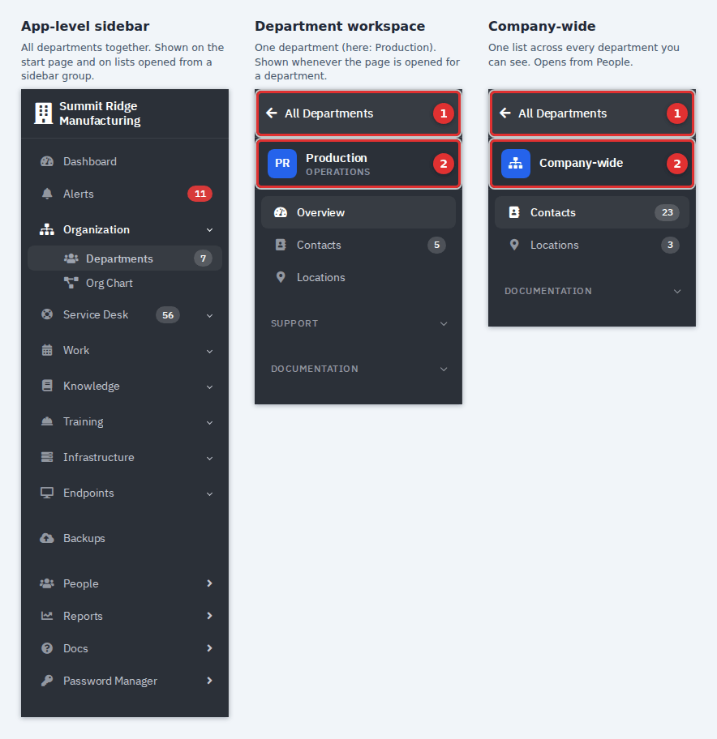

*Figure 3 — The same app in three scopes. Call-outs (1) and (2) mark the way back and the scope label.*

- **App-level sidebar.** All departments together. Use it for company-wide lists such as Tickets or Assets, and for the Dashboard.
- **Department workspace.** When a page is opened for one department (for example, you click a department in the Departments list, or open a ticket that belongs to it), the sidebar is replaced by that department's own rail. The top shows the department's name and type, then its **Contacts**, **Locations**, **SUPPORT** (Tickets, Recurring Tickets, Projects), **Vendors**, **Calendar**, **Knowledge Base** and **DOCUMENTATION** (Assets, Licenses, Credentials, Networks, Printers, Network Drives, Racks, Certificates, Domains, Services, Contracts, Files). Every list and count in it is limited to that department. A department's header strip shows its location, primary contact and ticket counts, and its **⋮** menu holds actions such as **New Ticket** and **Edit Department**.
- **Company-wide.** Choosing **People** in the sidebar opens the **Company-wide** rail. Its lists (Contacts, Locations, Assets, Licenses, Credentials, Networks, Certificates, Domains, Services) span every department you may see.

To get back, click **All Departments (1)** at the top of either rail. That returns you to the Departments list, and from there the sidebar is app-level again. If you cannot tell where you are, look at the top of the sidebar: it names the department or says **Company-wide**.

The Departments list starts with the department you opened most recently.

## Your account

Open user menu → **Account**. A small sidebar offers **Details**, **Security**, **Preferences**, **Activity** and **Integrations**. The arrow at the top (**Account**) returns you to your start page.

### Details: profile and email signature

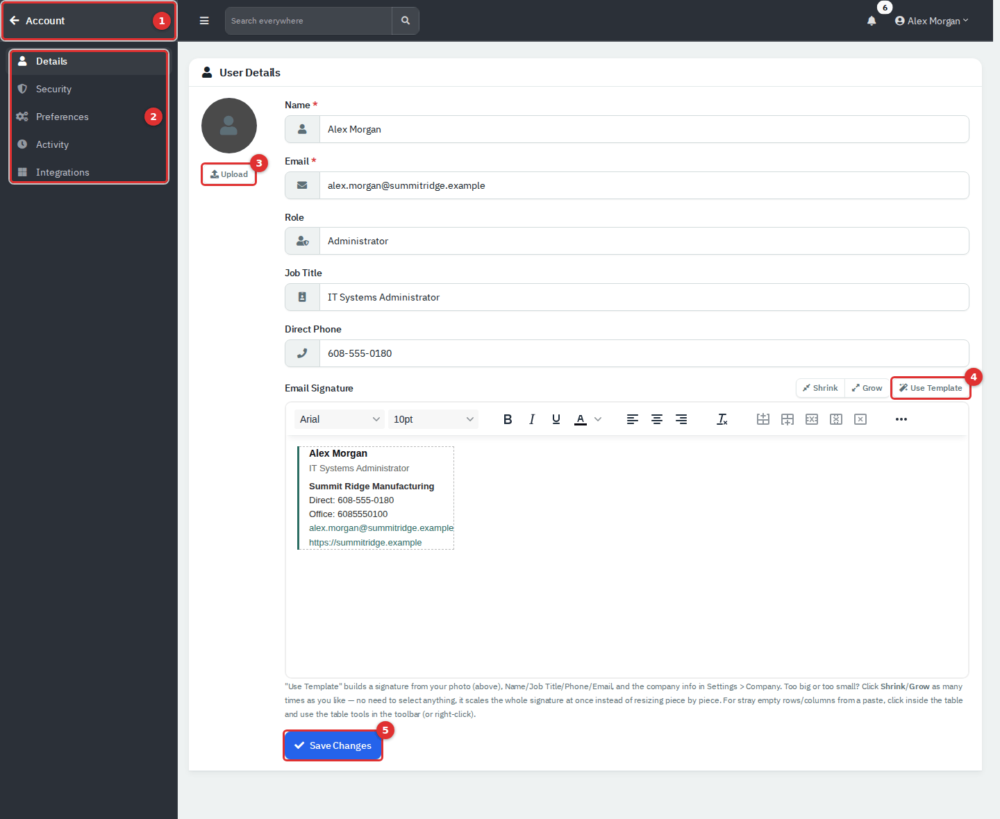

*Figure 4 — Account → Details. The signature shown here was made with **Use Template** and not saved.*

1. Open **Account → Details**.
2. Change your **Name**, **Email**, **Job Title** or **Direct Phone**. **Role** is read-only; an administrator changes it. Your email address is also your sign-in name.
3. To add a photo, click **Upload (3)**. **Remove** clears it.
4. In **Email Signature**, write your own or click **Use Template (4)**. The template builds a signature from your photo (or the company logo), name, job title, phone and email and the company details. **Shrink** and **Grow** resize the whole signature at once.
5. Click **Save Changes (5)**.

The signature is added to ticket replies and emails you send from RivetIT. **Use Template** replaces whatever is in the box. If you change your email address and outgoing email is set up, a notice goes to the old address.

### Security: password, MFA and passkeys

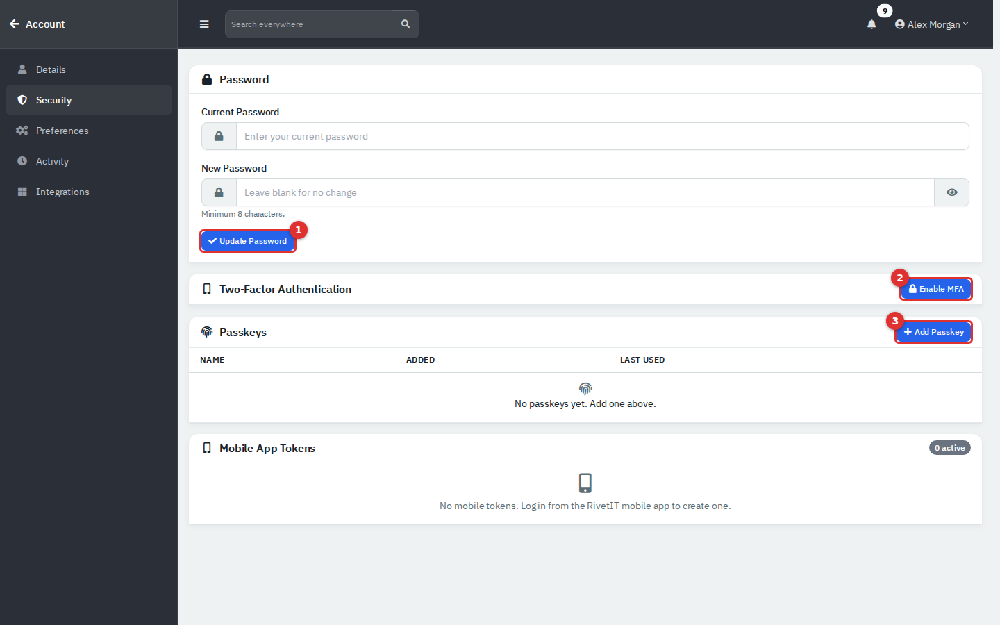

*Figure 5 — Account → Security.*

**Change your password**

1. Open **Account → Security**.
2. Enter your **Current Password** and a **New Password** (at least 8 characters).
3. Click **Update Password (1)**.

You are signed out straight away and must sign in with the new password. If outgoing email is set up, RivetIT emails a confirmation.

**Turn on MFA (authenticator app)**

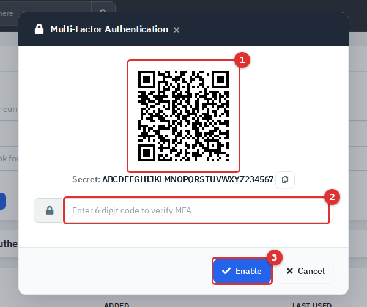

*Figure 6 — The MFA pop-up. The QR code and secret in this picture are examples.*

1. Click **Enable MFA (2)**.
2. Scan the QR code **(1)** with an authenticator app (or copy the secret shown under it).
3. Type the 6-digit code from the app into the box **(2)**.
4. Click **Enable (3)**.

The card then shows **Enabled**, and every sign-in asks for a code. Turning MFA on or off also ends every **Remember Me** trust on your other browsers, and **Revoke All Tokens** does the same on demand. **Disable** removes MFA, but an administrator can require it. If **Force MFA** is set on your account, you are taken to a **Multi-Factor Authentication Enforced** page after sign-in until you enrol, and you cannot disable it later.

**Add a passkey**

1. Click **Add Passkey (3)**.
2. Give it a name that tells you which device it is, for example "MacBook Touch ID".
3. Click **Register Passkey** and confirm on your device.

The list shows each passkey with when it was added and last used. The trash button removes one. Passkeys need a device that supports them and a secure (HTTPS) connection. If credentials show as locked after a passkey sign-in, sign in once with your password.

**Mobile App Tokens** lists phones signed in to the RivetIT mobile app. **Revoke** signs one out.

### Preferences

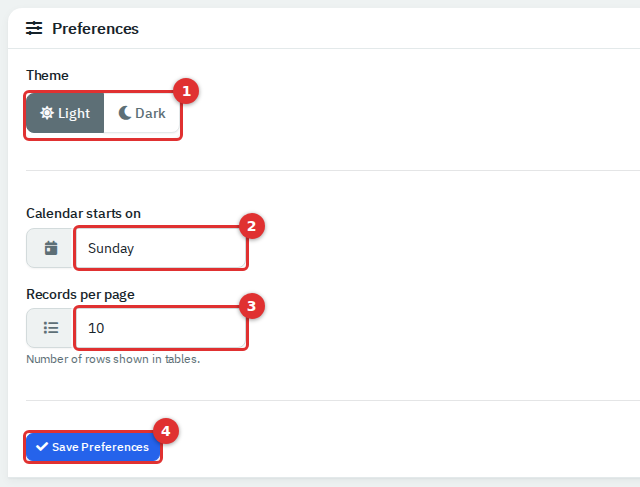

*Figure 7 — Account → Preferences.*

| Setting | What it does |
|---|---|
| **Theme (1)** | **Dark** switches you to dark mode. **Light** follows the company default, so if an administrator made dark the default (Administration → Settings → Appearance), choosing **Light** does not turn it off. |
| **Calendar starts on (2)** | **Sunday** or **Monday**, on the Calendar page only. |
| **Records per page (3)** | 10, 25, 50 or 100 rows in lists. |

Click **Save Preferences (4)** for changes to take effect.

Below that, **Push Notifications** lets you choose which categories are pushed to your phone. It works only when you are signed in to the mobile app and an administrator has allowed those categories. **Send Test Notification** appears once a phone is registered. Choose one of the four row counts above; the footer of long lists offers other values (see [Lists](#lists-search-filter-sort-and-page)).

**Activity** shows your last 10 successful sign-ins (when, device, browser, address) and your last 15 actions. Check it if you suspect someone else used your account. **Integrations** holds **My Calendar Color**, which colours you on the calendar, and **Outlook Calendar Sync**, which needs an administrator to finish the Microsoft setup first. It is not shown to module-only logins.

### Notifications

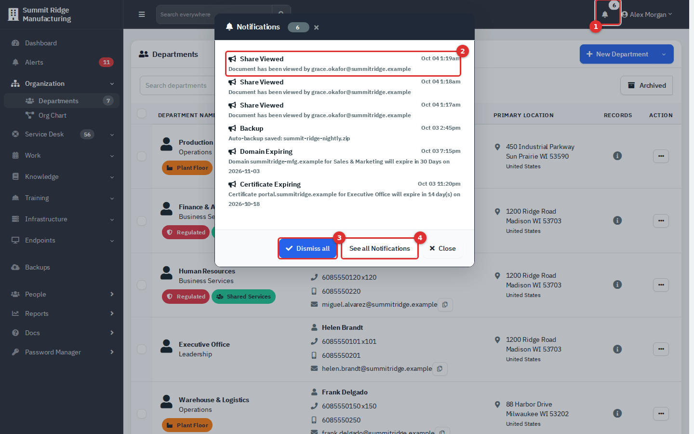

*Figure 8 — The bell. The pop-up lists undismissed notifications, eight to a page.*

Click the bell **(1)**. Each entry **(2)** shows its type, time and text; click it to go to the related page. **Dismiss all (3)** clears the list. **See all Notifications (4)** opens the full page, where you can search, filter by date, dismiss one at a time and view **Dismissed** ones. Notifications are yours alone: dismissing one does not remove it for anyone else.

### Search everywhere

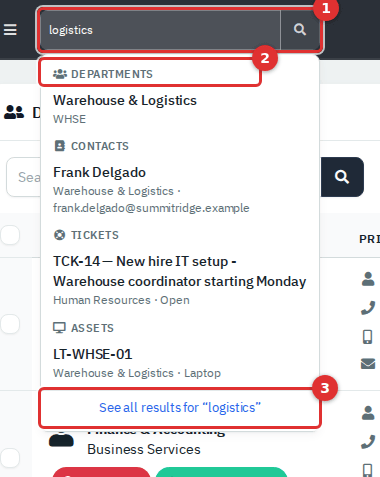

*Figure 9 — Search everywhere. Type two or more characters.*

Results are grouped by type (Departments, Contacts, Tickets, Assets, Knowledge Base and more) and show only what your role may see. Archived records are not included. **Esc** closes the list. Administrators also see matching Settings pages. Module-only logins have no search box.

## Roles and what you see

Every agent has one **role**. A role gives each area of the app a level: **None**, **Read** (view), **Modify** (add, edit and archive) or **Full** (also delete). Areas include Departments, Tickets, assets & docs, Assets, Credentials, Knowledge base, Reporting and Training. Administrators manage roles in Administration → Roles. See the [Administration guide](12-administration-users-and-security.md).

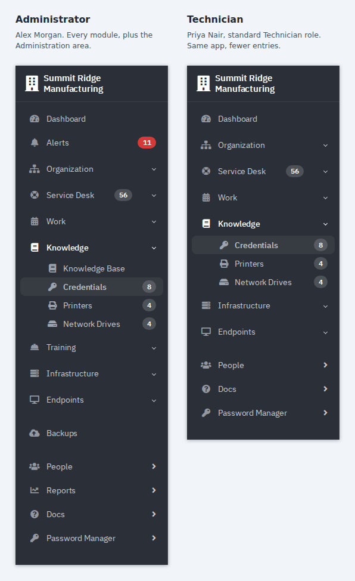

*Figure 10 — Same app, two roles. With the standard Technician role, Alerts, Training, Reports, Backups and the Knowledge Base entry are missing.*

Compared with an administrator, a standard Technician:

- has no **Administration** entry in the user menu; opening an Administration page shows "Administration is for administrators only";
- has no **Knowledge Base**, **Training**, **Reports** or **Alerts** entries until an administrator grants those permissions;
- can add and edit records, but cannot delete them, because deleting needs **Full**.

When you open something your role lacks, you see **You don't have access to this page** with a message such as "Your role needs view access to Reports. Ask an administrator if you need it." and a **Go to** button back to your home page. Your administrator may have changed the standard roles.

Two more limits apply:

- **Department access.** An administrator can restrict an agent to chosen departments (Administration → Users → edit → **Access** tab). You then see only those departments in lists and search, and opening another one shows "Access Denied - You do not have permission to access that department!".
- **Module-only (limited) logins.** A role that holds none of Departments, Tickets, assets & docs and Assets is treated as a module-only login, typical for a Training manager or a knowledge base editor. Such a login has no Dashboard, no Work group, no Search everywhere box, no custom links and no Integrations page. The sidebar shows only its own modules, and any other page answers "You don't have access to this page". After sign-in it lands on its first module, in this order: Training, Knowledge Base, Reports, RMM, Alerts, then its own account page.

## Lists: search, filter, sort and page

Most list pages, such as People, Departments, Assets and Credentials, work the same way. The examples use People.

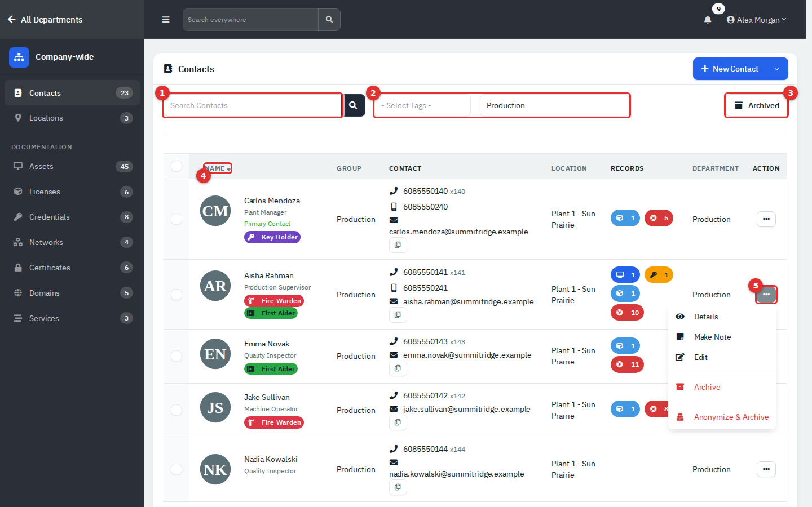

*Figure 11 — A typical list, filtered to one department, with a row menu open.*

| # | Control | How it works |
|---|---|---|
| **(1)** | Search box | Type and press **Enter** or click the magnifier. It matches several fields at once (name, email, phone and so on). |
| **(2)** | Filters | Drop-downs beside the search box, here **Select Tags** and a department. They apply as soon as you choose. |
| **(3)** | **Archived** | Switches between active and archived records. The button turns blue while you view archived ones. |
| **(4)** | Column heading | Click to sort by that column; click again to reverse. An arrow marks the sorted column. The first click sorts in the opposite direction to the current sort, so it may go Z to A first. |
| **(5)** | Row menu (**⋯**) | Actions for that row, for example **Details**, **Make Note**, **Edit** and **Archive**. What appears depends on the page and your role. |

Some pages hide the filters behind a funnel button instead.

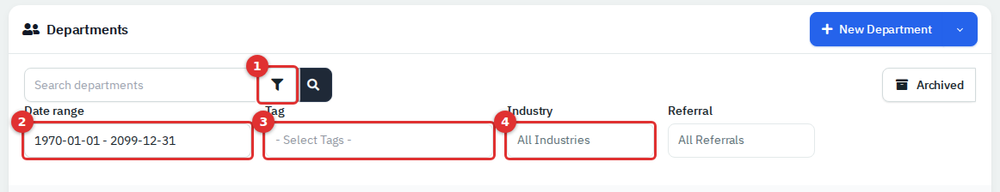

*Figure 12 — Click the funnel (1) to open the filter panel.*

Change a filter to apply it. The date range filters by the date the record was created; it starts as all time.

### Select several rows and act on them

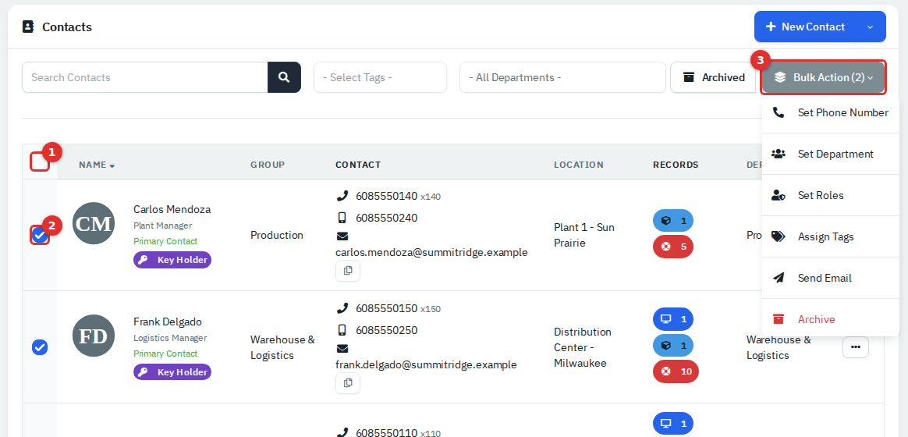

*Figure 13 — Tick rows, then open Bulk Action.*

1. Tick the box beside each row, or the box in the header **(1)** to tick every row on the current page only.
2. The **Bulk Action (n)** button **(3)** appears with the number selected. It is hidden until you tick something. (On Departments it is called **Action (n)**.)
3. Choose an action. Some open a pop-up to ask for a value, such as **Set Department**. **Archive** asks you to confirm.

### Paging

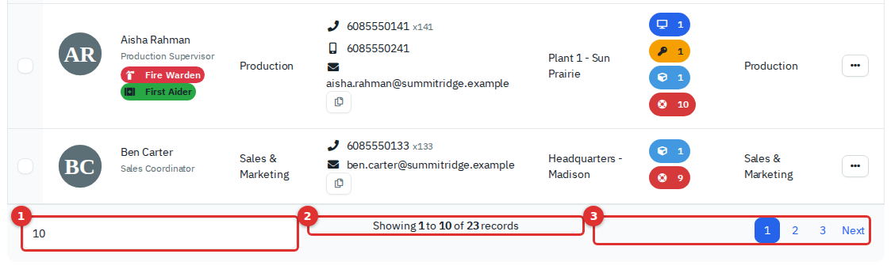

*Figure 14 — The footer appears when a list has more than five records.*

The selector **(1)** sets how many rows show per page (5, 10, 20, 50, 100 or 500) and is saved as your **Records per page**. **(2)** shows the range; **(3)** moves between pages.

### Pop-up forms

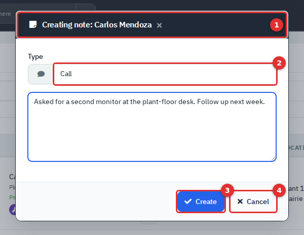

*Figure 15 — A pop-up form.*

Adding and editing usually happens in a pop-up over the list. The title **(1)** says what you are doing. Fields marked with a red **\*** are required. Add forms end with **Create (3)** and edit forms with **Save**; **Cancel (4)** closes the form without saving. Pressing **Esc** or clicking outside the pop-up also closes it, and anything you typed is lost.

Saving shows a short message at the top of the page for about five seconds. Green means success; red is used for errors and also for archive and delete messages.

## Archive, Restore and Delete

These three actions are different, and only one of them can be undone.

| Action | What really happens | Who can do it |
|---|---|---|
| **Archive** | The record is hidden from lists, drop-downs, counts and search, but kept with all its links. Nothing else is removed. | **Modify** on the area (a few lists limit the row-menu entry to administrators). |
| **Restore** | Brings an archived record back. Open the list, click **Archived**, then choose **Restore**. | **Modify**. |
| **Delete** | Removes the record permanently. It cannot be undone. | **Full**, so normally administrators. |

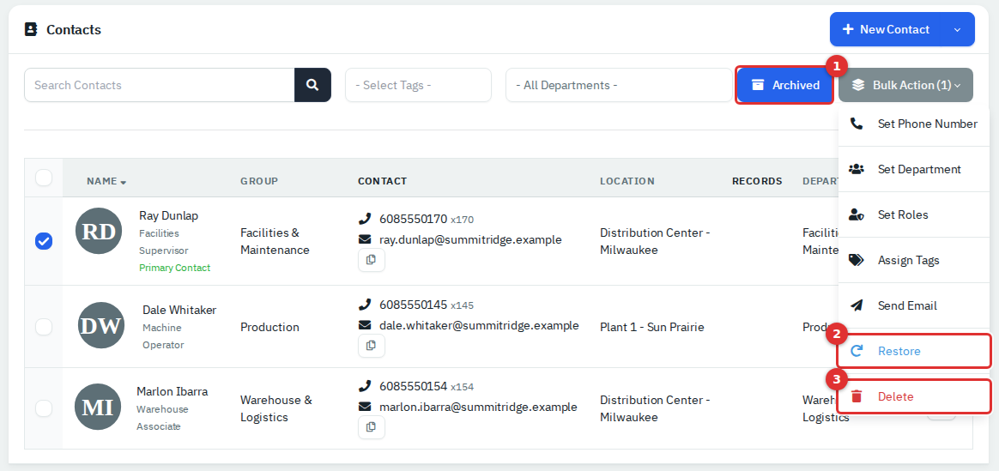

*Figure 16 — The Archived view. Restore and Delete appear only here.*

1. To remove something you no longer need, choose **Archive** and confirm the **Are you sure?** box.
2. To find it again, click **Archived (1)**.
3. To bring it back, tick it and choose **Restore (2)**.
4. Use **Delete (3)** only when the record must be gone for good.

Things to know:

- **Delete has no safety net.** In the Archived view, the bulk **Delete** entry on most lists does not show an "Are you sure?" box, unlike **Archive**. Check your ticks before you choose it. Deleting a department also removes everything filed under it, such as its people, assets, tickets and documents.
- **Archiving a person also switches off their Department Portal sign-in;** restoring them switches it back on. Archiving a department stops its employees signing in to the portal too.
- On **People**, **Anonymize & Archive** replaces the person's name with asterisks and erases their contact details and notes. It cannot be reversed.
- A person or department with **training records** cannot be deleted. Archive it instead.
- On some lists (People, Locations, Vendors, Licenses, Printers, Network Drives), the row-menu **Delete** is hidden unless an administrator has turned on **Allow permanent deletes of archived records** in **Administration → Settings → Security**. It is off by default.
- Archive, restore and delete are all written to the audit log.

## Glossary

| Term | Meaning in RivetIT |
|---|---|
| **Department** | A part of the company, such as Finance & Accounting. Its people, tickets, assets and documents are filed under it. Also called a workspace when you view one. |
| **People** (Contacts) | An employee record. It belongs to one department. Not the same as an agent. |
| **Agent** | Staff who sign in to the RivetIT app to work: technicians and administrators. |
| **Role** | The set of levels (None, Read, Modify, Full) that decides what an agent can do. |
| **Department Portal** | The self-service site where employees sign in with the same page. |
| **Ticket** | A request or problem logged with the service desk. |
| **Asset** | A device or piece of equipment, such as a laptop or switch, documented under a department. |
| **Credential** | A stored login (username, password, 2FA code) kept in the encrypted vault. |
| **Knowledge Base** | How-to articles for agents and employees. |
| **Training** | The learning module: courses, quizzes, assignments and records. |
| **Location** | A physical site. A department can use several. |
| **Module** | A feature area an administrator can switch on or off (Ticketing, IT Documentation, Knowledge Base, Training and others). |
| **Start page** | The page you land on after signing in. |
| **MFA / passkey** | Two ways to prove it is you: a code from an authenticator app, or your device's fingerprint, face or PIN. |

## Tips and good practice

- Archive instead of deleting. You can always restore an archive, never a deletion.
- Use **Search everywhere** to jump to a person, ticket or asset without clicking through menus.
- Turn on MFA or add a passkey. Both protect the credential vault behind your account.
- If a button or menu entry is missing, it is usually your role. Ask an administrator rather than looking for a workaround.
- RivetIT has no app-wide keyboard shortcuts. **Esc** closes pop-ups, the search list and the narrow-window sidebar.
- Sign out on shared computers.

## Related guides

- [Dashboard and Reports](10-dashboard-and-reports.md)
- [Department Portal](11-employee-portal.md)
- [Administration: Users, Roles and Security](12-administration-users-and-security.md)
- [Administration: System Settings, Mail, Integrations and Maintenance](13-administration-settings.md)
- [Endpoints and Integrations](09-endpoints-and-integrations.md)
