# Departments and people

Departments are the teams in your company; people are the employees who belong to them. This page shows how to keep both up to date, how to open a department's own workspace, and how to read the org chart.

| | |
|---|---|
| **Where to find it** | Sidebar → **Organization** → **Departments** and **Org Chart**. **People** is near the bottom of the sidebar (the page it opens is titled **Contacts**). Inside a department: **Contacts** in the department sidebar. |
| **Who can use it** | The **Departments** module (Administration → Roles). **Read** to view departments, people and the org chart. **Modify** to add, edit, archive and restore. **Full** to delete. The built-in Technician role has Modify; the Administrator role has Full. **Archive** and **Anonymize & Archive** in a person's row menu appear for the Administrator role only. |
| **Turn it on** | Nothing to turn on. The **Department Portal** fields on a person appear only when Settings → Modules → **Enable Department Portal** is on. |

## What it's for

RivetIT calls a team a **Department** and an employee a **person** (the screens also say **contact**). Every ticket, asset, credential and document belongs to a department, and every person belongs to exactly one department. Managers are recorded on each person, and the **Org Chart** draws those reporting lines.

## The three views

Many lists exist in more than one view. The records are the same; only the filter changes.

| View | How you get there | What you see |
|---|---|---|
| **App-level** | The main sidebar (Dashboard, Organization, Service Desk, ...). | Lists cover every department together. |
| **Department workspace** | Click a department's name in **Departments**, or find it with **Search everywhere**. | The sidebar switches to that department's own menu, a header strip shows its name, tags and summary, and every list shows only that department. |
| **Company-wide** | **People** in the main sidebar. | The sidebar is headed **Company-wide** and lists Contacts, Locations and the documentation lists across all departments. |

To leave a department workspace or the company-wide view, click **All Departments** at the top of the sidebar. To see the same list for everyone, use the main sidebar (or the **Department** filter on a company-wide list).

## A quick tour of Departments

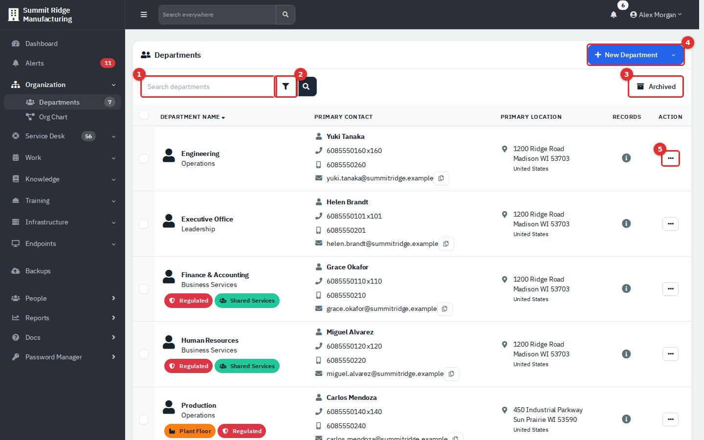

*Figure 1 — Sidebar → Organization → Departments.*

1. **Search departments (1).** Matches the name, short name, type, referral, tags, primary contact and location.
2. **Filter button (2).** Opens Date range, Tag, Industry and Referral filters.
3. **Archived (3).** Switches between active and archived departments.
4. **New Department (4).** The arrow next to it offers **Import** and **Export**.
5. **Action (5).** **Edit** and **Archive** (**Restore** in the archived view).

Under each department name you see its **type** (grey text) and its tags. **Primary Contact** shows the person marked as primary. **Primary Location** is the first location linked to the department. Click a column heading to sort; by default the most recently opened department comes first. With more than five rows, a footer lets you choose how many rows to show per page.

## Common tasks

### Find a department

1. Type in **Search departments** and press Enter, or open the filters with the funnel button.
2. Pick a **Tag**, **Industry** or **Referral**, or set a **Date range**. The date range filters on the day the department was created. Tag, Industry and Referral apply as soon as you pick a value.

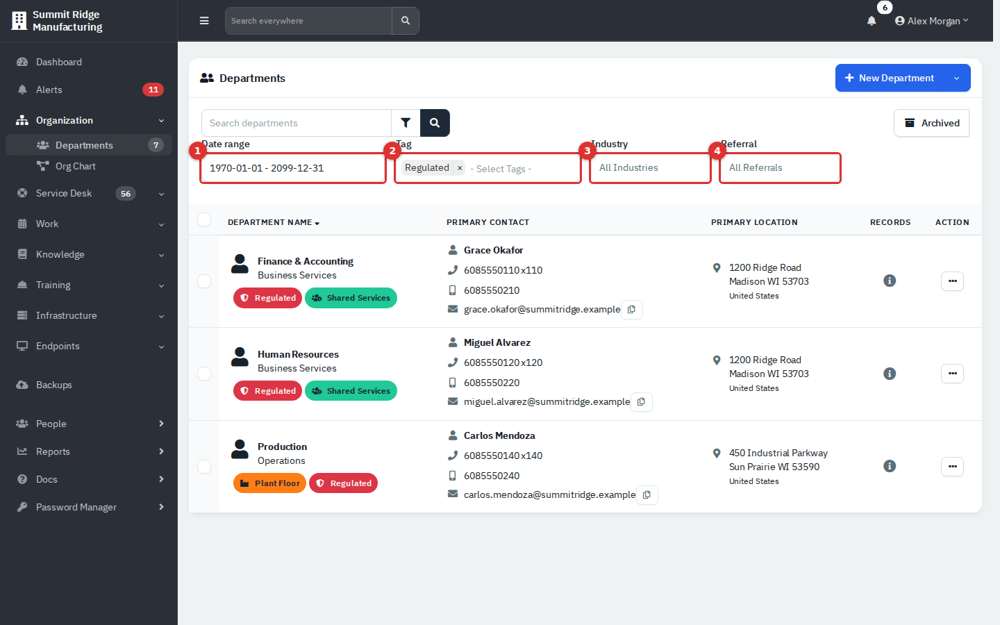

*Figure 2 — Date range (1), Tag (2), Industry (3) and Referral (4). Industry is the department's **type**. The date range starts as the full span, 1970-01-01 to 2099-12-31, which means no date limit.*

Hover over the **i** icon in the **Records** column to see how many contacts, assets, vendors, credentials, software items (licenses) and tickets the department has. A line appears only when the count is above zero, and each line links to that list for the department.

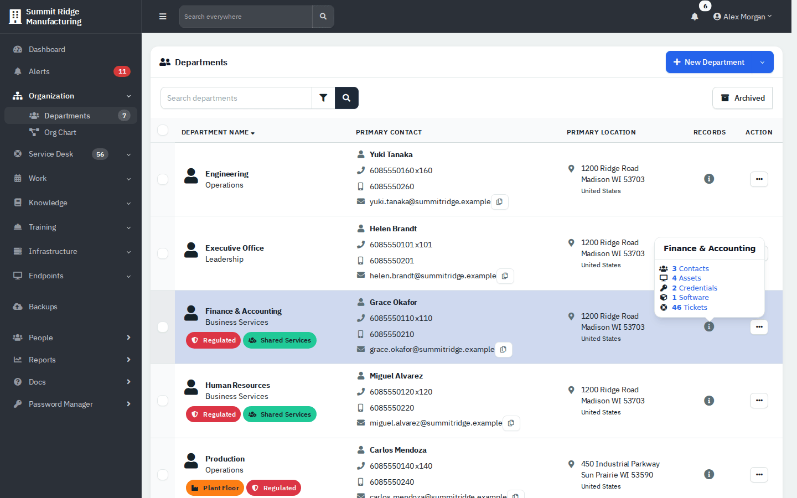

*Figure 3 — The Records pop-up.*

The **Search everywhere** box in the top bar also finds departments (by name or short name) and people. Type at least two characters.

### Create a department

1. On **Departments**, click **New Department**.
2. On **Details**, enter the **Name** (required). If the name looks like an existing department, a "Potential duplicate" note appears under the box.
3. Optionally fill in the other fields (see the [field reference](#department-fields)).
4. On **Locations**, tick the sites that apply. These are existing sites (Infrastructure → Locations); **New Location** adds one.
5. On **Contact**, enter the **Primary Contact** name (required). Title, phones and email are optional. If you forget, RivetIT jumps to this tab when you click **Create Department**.
6. Click **Create Department**.

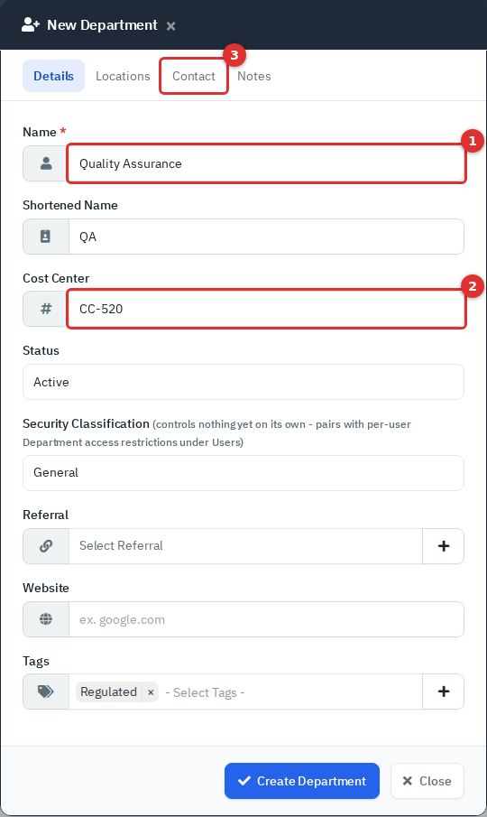

*Figure 4 — Details tab. Name (1) and Cost Center (2) are typed in; the Contact tab (3) is required.*

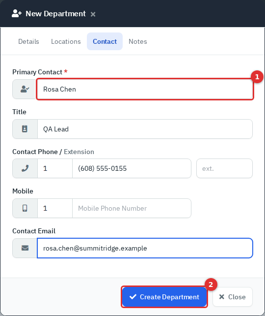

*Figure 5 — Contact tab. The person you enter here becomes the department's primary contact and is marked **Important**.*

A person created this way has no **Department / Group** text, so that column shows a dash until you edit them.

### Edit a department

1. In the list, click **Action** → **Edit**. In the workspace, click the **⋮** menu → **Edit Department**.
2. Change what you need on **Details**, **Locations** or **Notes**, then click **Save**.

Two things to know:

- The form has no field for the department **type**, and **saving it clears the type** (the grey text under the name and the Industry filter value). To set the type again, tick the department in the list and choose **Action** → **Set Industry**.
- **Website** creates a Domains and Certificates entry only when you create a department, not when you edit one.

### Tag or update several departments

Tick one or more rows. An **Action** button appears next to **Archived**.

- **Assign Tags** adds the tags you pick. Tick **Remove Existing Tags** to replace what is there.
- **Set Industry** and **Set Referral** set the same value on every selected department.
- **Send Email** queues a message to the contacts of the selected departments. Choose **Primary**, **Important**, **Billing** or **Technical** contacts. If you tick none, everyone in those departments is included, archived people too. Sending needs outgoing mail to be set up; see [Administration settings](13-administration-settings.md).
- **Open Tickets** creates one ticket for each selected department (see the [Service Desk guide](03-service-desk.md)).
- **Archive** (or **Restore** in the archived view).

The menu also lists two billing options; this guide does not cover them.

### Import and export departments

**New Department** arrow → **Export** downloads a CSV of every department, archived ones included. Location columns are empty for departments whose sites are linked on the **Locations** tab.

**Import** takes a CSV with exactly 22 columns in a fixed order; use **sample csv template** in the pop-up. Each row creates a department with one contact (who becomes primary) and one location. Rows whose name already exists are skipped. The imported location belongs to that department alone, so it does not appear as **Primary Location** in the list until you tick a shared site on the **Locations** tab.

### Archive and restore a department

1. Click **Action** → **Archive** on the row (or **⋮** → **Archive Department** in the workspace).
2. Confirm with **Yes**. RivetIT shows "Department ... archived".

An archived department leaves the department lists, dropdowns and the sidebar count, and its people leave the default People list. Nothing is deleted. To bring it back, click **Archived**, then **Action** → **Restore**.

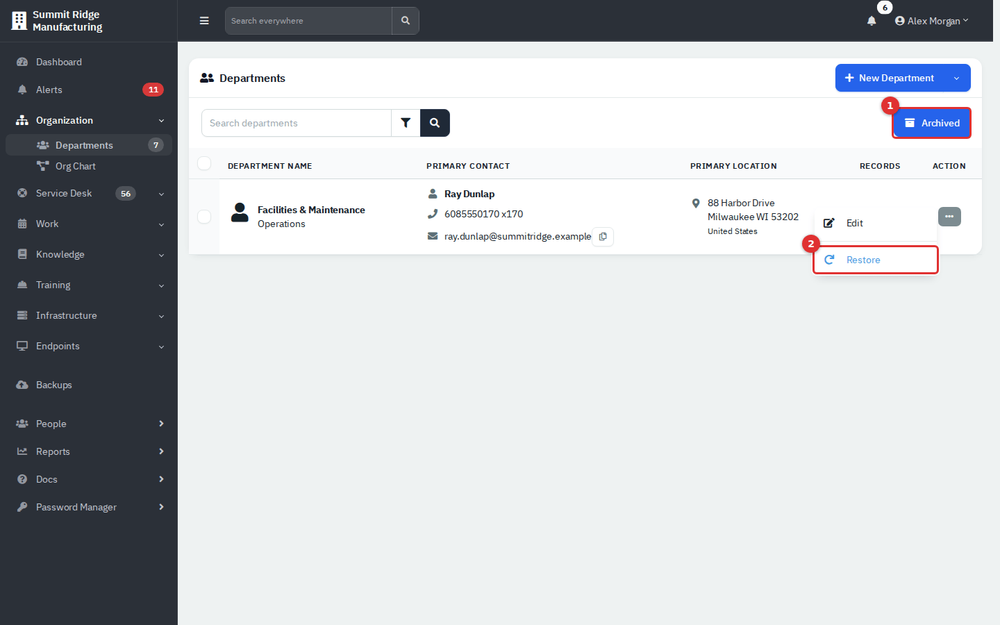

*Figure 6 — Click Archived (1), then Action → Restore (2).*

### Delete a department

Delete is permanent, so RivetIT makes you archive first.

1. Open the archived department (click its name in the **Archived** view).
2. Click **⋮** → **Delete Department**. This item appears only with **Full** access.
3. Type the department's name exactly, then click **Yes, Delete!**

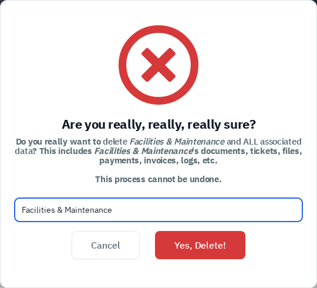

*Figure 7 — Deleting removes the department and all its tickets, documents, files, people and logs. It cannot be undone.*

A department that has training records cannot be deleted; RivetIT tells you to archive it instead.

## The department workspace

Click a department's name to open its workspace. The first page is the **Overview**.

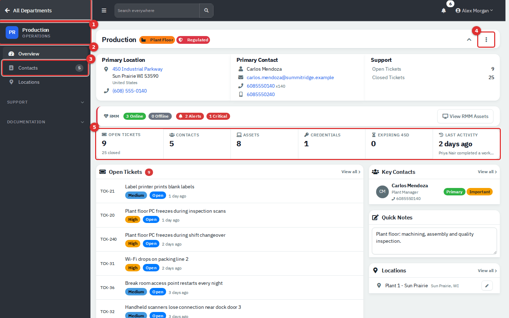

*Figure 8 — The Production workspace.*

1. **All Departments (1)** returns to the list.
2. The **department block (2)** (abbreviation, name and type) returns to the Overview.
3. The **sidebar (3)** is the department's own menu. Its lists show this department only. It has **Overview**, **Contacts**, **Locations**, then **Support** (Tickets, Recurring Tickets, Projects, Vendors, Calendar, Knowledge Base) and **Documentation** (Assets, Licenses, Credentials, Networks, Printers, Network Drives, Racks, Certificates, Domains, Services, Contracts, Files). Numbers on the right count that department's records. Items appear only for modules that are switched on and that your role can use.
4. The **⋮ menu (4)** holds the department actions.
5. The **summary tiles (5)** count open tickets, contacts, assets, credentials and items expiring within 45 days, and show the last change. Each tile links to its list.

Below the tiles: **Open Tickets**, **Recent Activity**, **Key Contacts** (people marked primary, important, technical or billing, up to five), **Quick Notes** (type and click away to save), **Locations**, favourite assets and credentials, and "needs attention" cards for stale tickets and expiring or expired items. The header strip above shows **Primary Location**, **Primary Contact** and **Support** (open and closed tickets); the chevron folds it away. When the department has assets linked to remote monitoring and you have access to it, an **RMM** strip with online, offline and alert counts and a **View RMM Assets** button sits between the header and the tiles. If a department has several sites, the strip names one and says how many are linked.

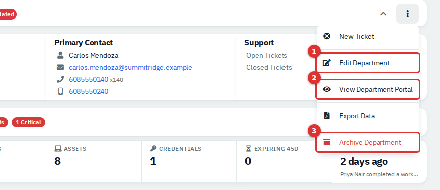

*Figure 9 — The ⋮ menu.*

| Menu item | What it does |
|---|---|
| **New Ticket** | Starts a ticket for this department. |
| **Edit Department** | Opens the same form as the list. |
| **View Department Portal** | Administrators only. Opens a read-only preview of what the department sees in the portal. See the [Department Portal guide](11-employee-portal.md). |
| **Export Data** | Full access. Builds a PDF of the department's records. |
| **Archive Department** / **Restore Department** | As above. |
| **Delete Department** | Archived departments only, with Full access. |

An archived department shows "(archived)" next to its name.

## The Org Chart

Sidebar → **Organization** → **Org Chart**. It draws who reports to whom, using the **Manager** set on each person. It shows people who are not archived, in departments that are not archived. The page opens as a **List**; the picture is one click away and loads only when you ask for it.

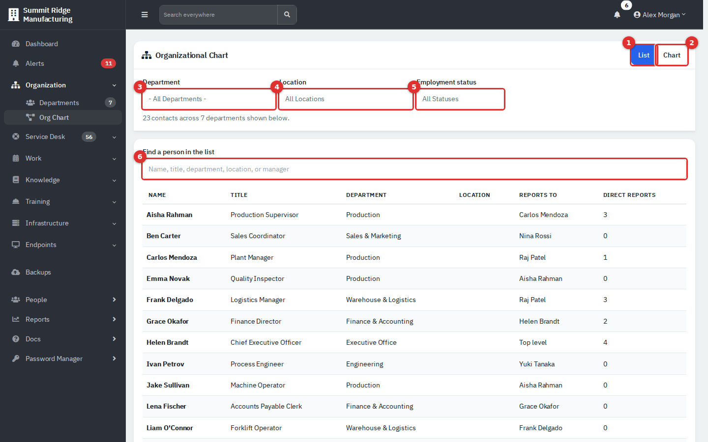

*Figure 10 — The List view. List (1) and Chart (2) switch views. Department (3), Location (4) and Employment status (5) narrow both views. The search box (6) filters the list.*

- **Department (3)** narrows the page to one department. It offers departments that have at least one active person. Anyone whose manager is in another department then appears at the top of the chart and carries a **Manager unavailable** note.
- **Location (4)** and **Employment status (5)** keep the people who match. Their managers stay on the page, marked **Context**, so you can still see the reporting line. The line under the filters counts the matching people and the context managers, and offers **Clear location and status filters**. The filters apply as soon as you pick a value.
- The list shows **Name**, **Title**, **Department**, **Location**, **Reports to** (**Top level** when there is no manager) and **Direct reports**. Click a name to open the person's page. **Find a person in the list (6)** matches any of those columns as you type.

Click **Chart (2)** to open the picture. The first time, RivetIT shows "Opening chart..." while it loads the chart library; if it cannot load, the page says so and the list stays available. Click **List** to go back.

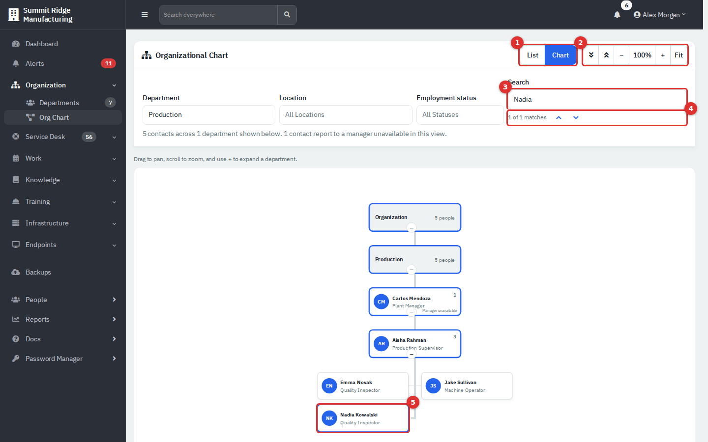

*Figure 11 — The Chart view, expanded and searched. View buttons (1), chart controls (2), search (3), match counter (4) and the highlighted person (5).*

- The top card is **Organization**. Below it, each reporting tree sits in a department card named after the department of the person at the top of that tree, with the number of people in it. A company with one top person therefore shows a single department card. Only the first levels are open at first; click the **+** or **−** button under a card to open or close its branch.
- **Controls (2).** The two arrow buttons are **Expand all branches** and **Collapse all branches**. **−**, **100%** and **+** zoom out, reset the zoom and zoom in, and **Fit** fits the whole chart in the frame. You can also drag the chart to move it and scroll to zoom.
- **Search (3)** appears only in the Chart view. It matches name, title, team (**Department / Group**), department, employment status and manager. The counter **(4)** shows how many people match. Press **Enter**, or use the arrows beside the counter, to step through the matches; **Shift+Enter** goes back. Each step centres the chart on that person and highlights the chain of managers from that person up to **Organization**. Typing a new search clears the highlight.
- A person card **(5)** shows a photo or initials, the name, and the title (or the team or department when there is no title). Click the name to open the person's page. A small number in the corner is the count of direct reports. The cards do not show the employment status; use the **Employment status** filter or the search to find, for example, pre-hire people.

If manager lines loop (A reports to B who reports to A), a red **Reporting Cycle Detected** card appears under the chart and a red line under the filters says how many people could not be placed. Each person in the loop is still drawn once. Fix the **Manager** on one of them. The card is part of the Chart view and does not show in the List.

## People

### Find people

**People** in the sidebar opens the company-wide list. Inside a department, use **Contacts** for that department only.

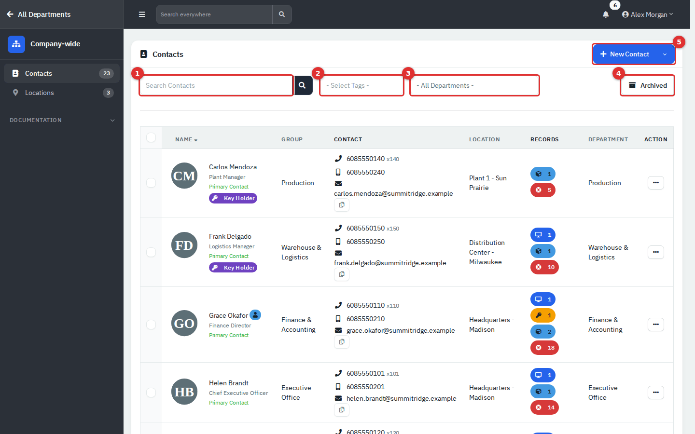

*Figure 12 — Company-wide list. Search (1), Tags (2), Department (3), Archived (4), New Contact (5).*

The list puts the primary contact first, then people marked **Important** (bold names), then everyone else by name. A small blue person icon beside a name means the person has a portal login. **Records** shows the number of assets, credentials, licenses and tickets linked to them. Click a name to open the person's page. **Action** offers **Details** (a quick view), **Make Note**, **Edit** and, for administrators, **Archive** and **Anonymize & Archive**.

The **New Contact** arrow offers **Export** (a CSV of active people) and, inside a department, **Import**. Department **Import** expects 8 columns: Name, Title, Department, Email, Phone, Extension, Mobile, Location. To load many people across departments, see [People import](02b-people-import-and-workflows.md).

### Add a person

1. Click **New Contact**. Inside a department the person is added to that department; on the company-wide list you choose the **Department**.
2. On **Details**, enter the **Name** (required). Optionally set **Title**, **Department / Group**, **Start Date**, phones and **Email**. When you leave the email box, RivetIT warns about a duplicate address or a mail domain it cannot find.
3. Use **Photo** to upload a picture (JPG, PNG, GIF or WebP), **Access** for the PIN, portal login and roles, and **Notes** for notes and tags.
4. Click **Create**.

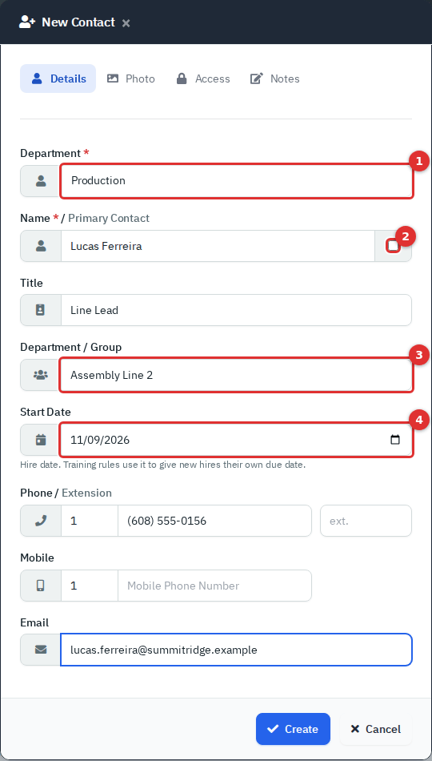

*Figure 13 — Details tab. Department (1), Primary Contact tick box (2), Department / Group (3), Start Date (4).*

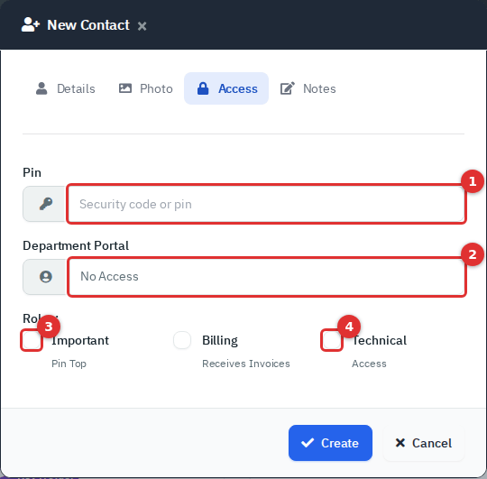

*Figure 14 — Access tab: PIN (1), Department Portal (2), Important (3) and Technical (4).*

**Department / Group** is free text. Use it for a team inside the department, such as "Assembly Line 2". It does not move the person to another department.

### Edit a person

Click **Action** → **Edit**, or the edit button on the person's page. The edit form has the same tabs plus employment fields.

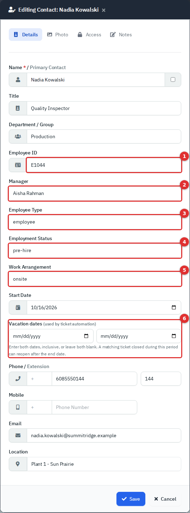

*Figure 15 — Employment fields: Employee ID (1), Manager (2), Employee Type (3), Employment Status (4), Work Arrangement (5), Vacation dates (6).*

- **Manager** lists the other active people in the same department.
- **Employment Status**, **Employee Type** and **Work Arrangement** are labels for your records; they do not archive anyone or switch access off (see the [reference](#person-fields)).
- **Vacation dates (6)** take a start and an end date, both or neither, and the end cannot be before the start. They appear on the person's **Employment** card as **Vacation** with the two dates. The ticket automation rule **Requester returns from vacation** uses them (see [Ticketing and automation](13b-administration-ticketing-and-automation.md)).
- There is no **Department** field, so you cannot move a person from this form. To move someone, use [People import](02b-people-import-and-workflows.md) with their email address and the new department.
- The **Location** list offers only locations that belong to the person's department. Shared sites linked on a department's **Locations** tab do not appear, so you may see only the current location.

### Make someone the primary contact

The **primary contact** is the person shown in the department list, the department header and **Key Contacts**, and the people you reach with the **Primary Contacts** option when you email departments. Each department has one. Tick the box beside the name in **Edit**. The previous primary contact stays on the record but loses the flag. You cannot untick the box on the current primary contact; tick it on someone else. A primary contact has no **Archive** in the row menu, and bulk archive skips them.

### The person page

Click a name to open the person.

- **Left column:** profile card (edit button, photo or initials, tags, location, email, phones, PIN, role flags and the date the person was added), **Employment** (employee ID, type, status, work arrangement, start date, vacation dates when set, and who the person reports to), **Direct Reports** (when there are any), **Workflows**, **Training** (when Training is on) and **Notes**, which saves when you click away.
- **Right column:** **New** (ticket, recurring ticket, asset, credential, document, file upload, note) and **Link** (attach an existing asset, license, credential, service, document or file). **History** lists changes made to the person. Cards for linked assets, credentials, licenses, tickets, services, documents, files and notes appear once there is something to show.

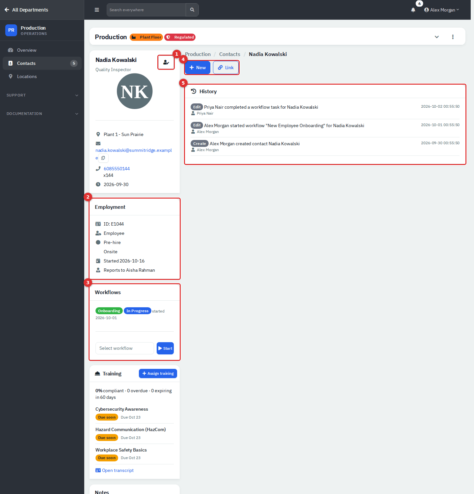

*Figure 16 — A person's page.*

The **Workflows** card is where onboarding and offboarding checklists are started; see [Onboarding, offboarding and people import](02b-people-import-and-workflows.md).

### Archive, restore and delete a person

- **Archive:** **Action** → **Archive** (administrators), or tick people and use **Bulk Action** → **Archive**. Archiving clears their Important, Billing and Technical flags and revokes portal access.
- **Anonymize & Archive:** administrators, non-primary people. It replaces the name with `*****`, clears contact details and notes, and removes the person's name, email and phone from log entries and from the tickets they raised. It cannot be undone.
- **Restore:** click **Archived**, then **Action** → **Restore**, or use **Bulk Action** → **Restore**. Portal access returns.
- **Delete:** permanent, needs **Full** access, and is offered in the archived view under **Bulk Action** → **Delete**. People with training records cannot be deleted; archive them.

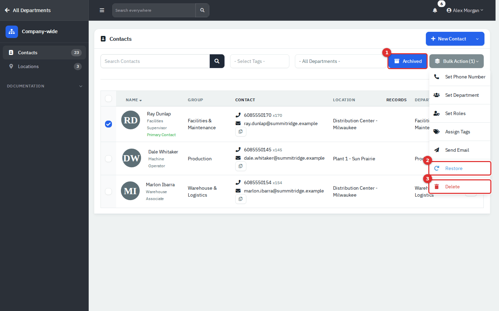

*Figure 17 — Archived (1) view; Restore (2) and Delete (3) in the Bulk Action menu.*

**Bulk Action** also offers **Set Phone Number**, **Set Department** (this sets the free-text Department / Group), **Set Roles**, **Assign Tags** and **Send Email**. Inside a department there is also **Assign Location**, which lists only the department's own locations.

## Reference

### Department fields

| Field | What it means |
|---|---|
| **Name** | Required. Up to 200 characters. |
| **Shortened Name** | Up to 6 characters. Shown in the sidebar badge, search results and pop-ups. If blank, RivetIT makes one from the name (Quality Assurance becomes QAS). |
| **Cost Center** | Free text, such as CC-410. Kept on the record only. |
| **Status** | Active, Inactive or On Hold. A label only; it does not hide the department. |
| **Security Classification** | General, Confidential or Restricted. A label only; the form says it controls nothing on its own. |
| **Referral** | Optional label for where the department came from. Use **+** to add an option. Most internal teams leave it empty. |
| **Website** | Optional. On create, a valid domain is also added to Domains, and to Certificates if it has an SSL certificate (needs internet access from the server). |
| **Tags** | Department tags. Use **+** to create one. Tags appear in the list and the filters. |
| **Locations** | Existing sites the department uses. A site can belong to several departments. |
| **Notes** | Free text; the same text as **Quick Notes** on the Overview. |
| **Type** (Industry) | Grey text under the name. Set only by **Set Industry** or import. |

### Person fields

| Field | What it means |
|---|---|
| **Primary Contact** tick box | Makes this the department's primary contact. |
| **Department / Group** | Free-text team name. Shown in the **Group** column and searchable. |
| **Start Date** | Hire date. Training rules use it to give new hires their own due date. |
| **Vacation dates** | Optional start and end of a planned absence (edit form only). Both or neither. Used by the ticket automation rule **Requester returns from vacation**. |
| **Employee ID** | Your HR number. Import matches existing people on it first. |
| **Employee Type** | employee, contractor, vendor, intern or service_account_owner. |
| **Employment Status** | pre-hire, active, leave, suspended, transfer_pending, termination_pending, terminated or archived. Shown on the person page and as a badge on the org chart. |
| **Work Arrangement** | remote, hybrid or onsite (or Not Set). |
| **PIN** | A security code kept on the record and shown on the person's page. Not a login. |
| **Department Portal** | **No Access**, **Using Set Password** or **Using Azure Credentials**. Creates a portal login for the person; it needs an email address. The login starts as a standard one (own records and training only). To make the person a **Supervisor** (sees the people who have them as **Manager**, at any depth) or a **Manager** (sees the whole department's training), or to give the login an agent role, edit it under Administration → Users → **Department logins**; see [Users, roles and security](12-administration-users-and-security.md). On edit, **Send user e-mail with login details?** queues a welcome message. See the [Department Portal guide](11-employee-portal.md). |
| **Important** | Pins the person near the top of lists and shows them in **Key Contacts**. |
| **Technical** | Marks a technical contact (the form's hint is "Access"); shown in **Key Contacts**. |
| **Billing** | Marks the invoice recipient. Leave it unticked for internal teams. |
| **Tags** | Person tags; **+** creates one. |

## Tips and good practice

- Keep **Manager** current; the org chart is only as good as those links.
- Use **Department / Group** for teams and tags for cross-cutting roles such as Fire Warden.
- Archive instead of deleting: history, tickets and reports keep their context.
- After editing a department, check its type and re-apply it with **Set Industry** if it vanished.
- Give every department a primary contact so tickets and emails have someone to reach.

## Related guides

- [Getting started](01-getting-started.md): navigation, lists and filters
- [Onboarding, offboarding and people import](02b-people-import-and-workflows.md)
- [Service Desk](03-service-desk.md): tickets for a department or person
- [Department Portal](11-employee-portal.md): employee login and portal access
- [Users, roles and security](12-administration-users-and-security.md): the Departments permission and per-user department access
