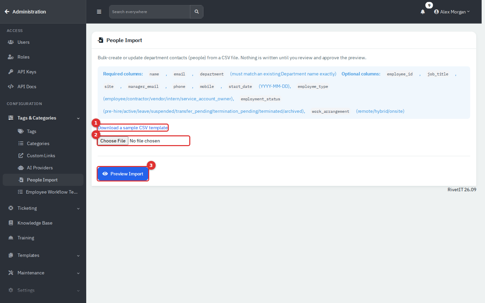
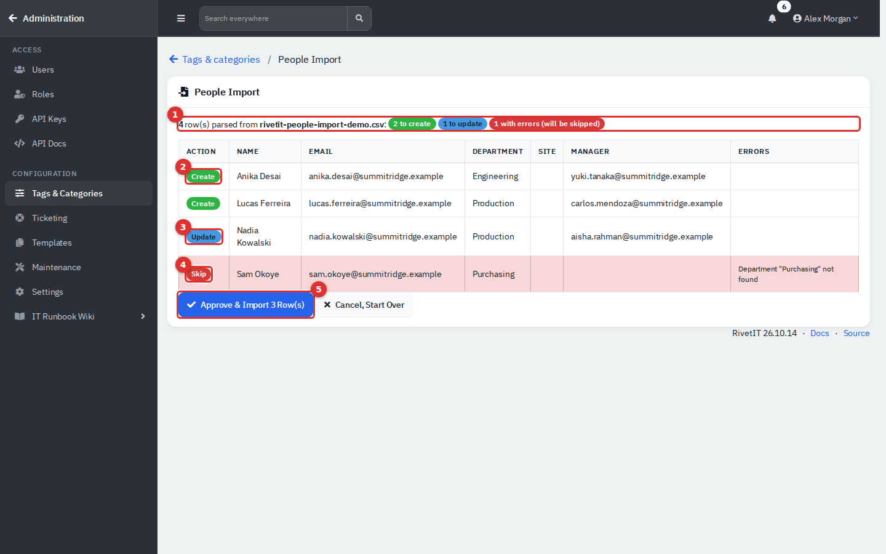
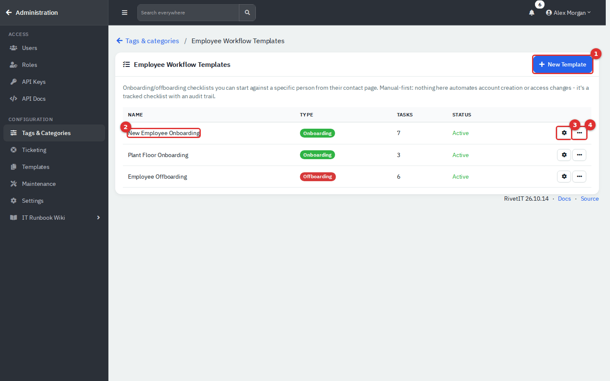
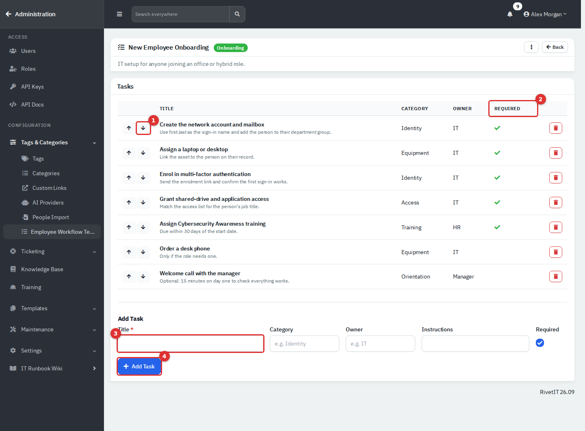
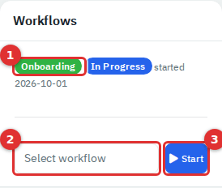
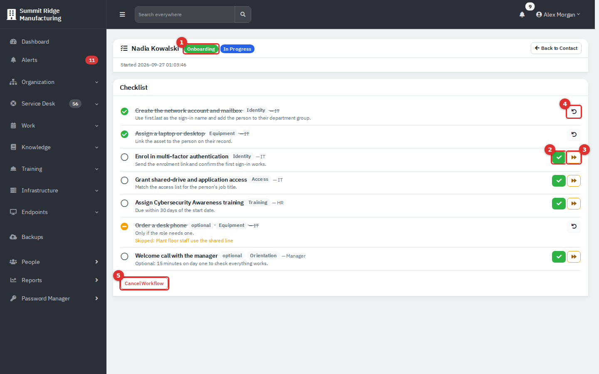
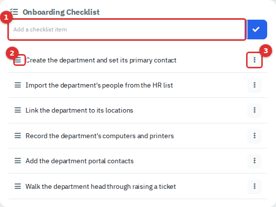

# Onboarding, offboarding and people import

This page covers the administrator side of people management: loading many people from a spreadsheet, building onboarding and offboarding checklists, and running a checklist for one person. It also explains **Onboarding Templates**, which set up a whole department rather than a person.

| | |
|---|---|
| **Where to find it** | Click your name (top right) → **Administration** → **CONFIGURATION** → **Tags & Categories** → **People Import** and **Employee Workflow Templates**. **Onboarding Templates** are under **Templates**. Checklists are started from a person's page (**Workflows** card). |
| **Who can use it** | Administration pages are for administrators. Starting and working a checklist needs **Modify** on the **Departments** module. |
| **Turn it on** | Nothing to turn on. **Templates** appears in the Administration sidebar only while IT Documentation is on (Settings → Modules). |

For the everyday people screens, see [Departments and people](02-departments-and-people.md).

## What it's for

- **People Import** creates or updates many people from one CSV file, with a preview you approve first.
- **Employee Workflow Templates** are reusable checklists such as "New Employee Onboarding" or "Employee Offboarding". You start one against a person and tick tasks off. It is a tracked checklist only: nothing in it creates accounts or changes access for you.
- **Onboarding Templates** are checklists for bringing a whole department onto IT support. You use them when you create a project.

## People import

1. Open **People Import** (path above).
2. Click **Download a sample CSV template** and fill it in.
3. Click **Choose File**, pick your CSV, then click **Preview Import**. Nothing is saved yet.
4. Read the preview. Fix your file and start again if needed.
5. Click **Approve & Import N Row(s)**, or **Cancel, Start Over**.

*Figure 1 — Download the template (1), choose the file (2), Preview Import (3).*

The first row of the file must be a header row. Column order does not matter; columns are matched by name.

| Column | Required | Notes |
|---|---|---|
| `name` | Yes | Full name. |
| `email` | Yes | Must be a valid address and unique within the file. |
| `department` | Yes | Must match an active department name exactly. |
| `employee_id`, `job_title`, `phone`, `mobile` | No | |
| `manager_email` | No | The manager must already exist when you preview. Import managers in an earlier file. |
| `start_date` | No | `YYYY-MM-DD`. |
| `employee_type` | No | employee, contractor, vendor, intern or service_account_owner. |
| `employment_status` | No | pre-hire, active, leave, suspended, transfer_pending, termination_pending, terminated or archived. Blank means active. |
| `work_arrangement` | No | remote, hybrid or onsite. |
| `site` | No | Leave it empty. RivetIT looks for the site among locations that belong to that one department, so a shared site gives the error "Site ... not found in that department". |

*Figure 2 — The preview: summary (1), Create (2), Update (3), Skip (4) and Approve (5).*

Each row gets an action:

- **Create** adds a new person.
- **Update** changes an existing person. RivetIT matches on **employee ID** first, then on **email**.
- **Skip** (red) is not imported. The **Errors** column says why, for example `Department "Purchasing" not found` or `Manager "..." not found`. Only Create and Update rows are written when you approve.

Warnings:

- **An update replaces every field the import handles**, not just the columns in your file. A missing or empty column blanks that field: title, phones, employee ID, manager, location and start date are cleared, and type and status go back to employee and active. Extension, tags, notes and roles are not touched. For people who already exist, fill in every column you want to keep.
- Imported people have no **Department / Group** text, are not primary contacts and get no portal login.
- Importing an existing person with a different `department` is the only way to move them to another department from the screens.
- Previewing and approving are both recorded in the audit log.

## Employee workflow templates

Open **Employee Workflow Templates**.

*Figure 3 — Name, Type (Onboarding or Offboarding), number of Tasks and Status.*

### Create a template

1. Click **New Template (1)**.
2. Enter a **Template Name**, choose the **Type** (**Onboarding** or **Offboarding**) and add an optional **Description**. Click **Create**.
3. RivetIT opens the template. Add its tasks (below).

Use the gear button **(3)** or the template name **(2)** to open a template, and the **...** menu **(4)** to **Edit** or **Archive** it. Archiving removes the template from the list and from the **Start** dropdown; checklists already started stay.

*Figure 4 — A template's tasks.*

### Add and arrange tasks

1. In **Add Task**, type a **Title (3)**. It is the only required box.
2. Optionally set **Category** (for example Identity), **Owner** (for example IT) and **Instructions**. Leave **Required** ticked for tasks that must be finished, or untick it for optional ones.
3. Click **Add Task (4)**.
4. Use the arrows **(1)** to move a task up or down, and the red bin to remove it.

The **Required (2)** column shows a tick for required tasks. Editing a template later does not change checklists already started, because each checklist keeps its own copy of the tasks.

## Start and work a checklist for a person

1. Open the person (for example from **People**).
2. In the **Workflows** card, choose a template in **Select workflow (2)**. Templates are labelled **[Onboarding]** or **[Offboarding]**.
3. Click **Start (3)**. RivetIT shows "Started ... for ..." but does not open the checklist.
4. Back on the person's page, click the **Onboarding** or **Offboarding** badge **(1)** in the **Workflows** card to open it.

*Figure 5 — The Workflows card lists each checklist with its type, status and start date.*

If the card says no templates exist, an administrator must create one first.

*Figure 6 — The checklist for a new hire.*

On the checklist page:

- The green tick **(2)** marks a task **completed**.
- The orange forward button **(3)** **skips** a task. RivetIT asks for a reason, which is shown under the task. You can skip required tasks too.
- The undo arrow **(4)** **reopens** a completed or skipped task.
- Each task shows its category, its owner after a dash, an **optional** tag if it is not required, and its instructions.
- **Cancel Workflow (5)** stops the checklist after a browser confirmation. It cannot be undone.
- **Back to Contact** returns to the person.

| Status | Meaning |
|---|---|
| **In Progress** | At least one required task is still pending. |
| **Completed** | Every required task is done and none were skipped. Optional tasks may still be pending. |
| **Completed With Exceptions** | Every required task is resolved, but at least one task was skipped. |
| **Cancelled** | Someone cancelled the checklist. |

Reopening a task moves a finished checklist back to **In Progress**. Starting, completing, skipping and cancelling are recorded in the person's **History**.

## Onboarding templates for a department

**Administration** → **Templates** → **Onboarding Templates** lists checklists for a team that is new to IT support. Each has a name, a count of **Checklist Items** and an optional default contract template.

*Figure 7 — Add an item (1), drag to reorder (2), edit or delete an item (3).*

1. Click **New Onboarding Template**, enter a name and description, and click **Create**.
2. On the template, type each step in **Add a checklist item** and click the tick. Drag the handle to reorder.
3. To use it, create a project for the department (see [Projects and calendar](04-projects-and-calendar.md)) and pick the template in **Template**. RivetIT creates a ticket for the department with your checklist as its tasks.

Deleting an onboarding template also deletes its checklist, and only the built-in Administrator role sees **Delete**. The template's companion ticket, named "... Checklist", also appears under **Ticket Templates**.

## Tips and good practice

- Keep one onboarding and one offboarding template per kind of job, and keep tasks short and specific.
- Put the owner in each task so the checklist shows who does what.
- For imports, test with two or three rows and read the preview before you approve a big file.
- Use **Skip** with a reason instead of leaving tasks pending; the reason stays on the record.

## Related guides

- [Departments and people](02-departments-and-people.md)
- [Projects and calendar](04-projects-and-calendar.md): creating a project from a template
- [Users, roles and security](12-administration-users-and-security.md): who can reach Administration and the Departments permission
- [Department Portal](11-employee-portal.md): portal logins for people
