# Service Desk: Tickets

A ticket is one request or fault from one person, with the whole conversation, the time spent and the outcome kept in one place. This page covers the ticket list, creating tickets and everything on a ticket's page. Recurring tickets and the request catalog (the sidebar item **Request service**) are in [Recurring Tickets and Request Something](03b-recurring-tickets-and-request-catalog.md). Problems, changes, emailed requests and satisfaction ratings are in [Problems, Changes, Requests and CSAT Ratings](03c-problems-changes-mail-requests-csat.md).

| | |
|---|---|
| **Where to find it** | Sidebar → **Service Desk** → **Tickets**. Inside a department workspace, **Support → Tickets** shows only that department's tickets. |
| **Who can use it** | Tickets, assets & docs: **Read** to see tickets and their notes, including internal ones. **Modify** to create tickets, reply, change, merge and use the list's quick controls. **Full** to delete tickets and to share saved views. |
| **Turn it on** | **Show Ticketing** in Settings → Modules in Administration. Anything that sends email also needs a mail server; see [Administration: System Settings, Mail, Integrations and Maintenance](13-administration-settings.md). |

## What it's for

- Log a request from a phone call, a walk-up, an email or the Department Portal, and give it an owner.
- Keep the customer-facing conversation and your private notes apart.
- Track priority, response and resolution targets, time worked, tasks and site visits.
- Close the ticket, collect a satisfaction rating and reopen it if the fix did not hold.

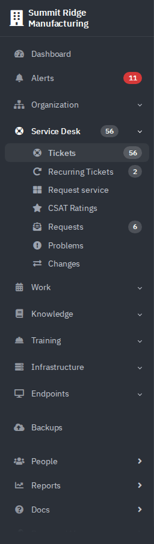

*Figure 1 — The Service Desk group. Each badge is a live count. **CSAT Ratings** appears only when ratings are switched on. The catalog entry is labelled **Request service** here; its page is headed **Request Something**.*

## A quick tour

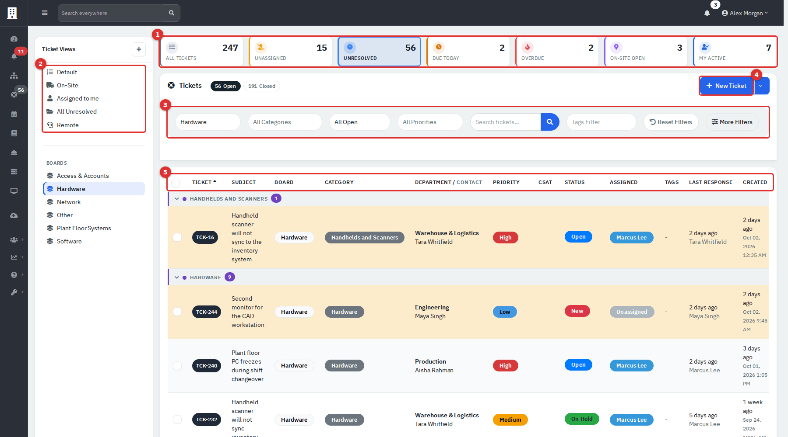

*Figure 2 — The ticket list, filtered to the Hardware board. Here the sidebar is folded to make room for every column.*

| # | What it is | What it does |
|---|---|---|
| **(1)** | Stat tiles | **All Tickets**, **Unassigned**, **Unresolved**, **Due Today**, **Overdue**, **On-Site Open** and **My Active**. Click one to filter the list. **Unresolved** counts every ticket that is not yet resolved or closed, whatever its status; it is a different thing from the **Unresolved** status (see [Statuses](#statuses)). **Due Today** and **Overdue** use the **Due** date on the ticket, not the SLA. |
| **(2)** | **Ticket Views** | Saved sets of filters: **Default**, **On-Site**, **Assigned to me**, **All Unresolved** and **Remote**, plus any you add. Below them, **Boards** lists the top-level categories. |
| **(3)** | Filter bar | Board, category, status, priority, search, tags, **Reset Filters** and **More Filters**. |
| **(4)** | **New Ticket** | Opens the new ticket form. The arrow beside it holds **Export**. |
| **(5)** | Column headings | Click to sort. Tickets sit under a header for each category. |

Each row shows the ticket number, the subject, the board and category, the department and person, priority, **CSAT** rating, status, the assigned agent, tags, the last response and the date created. A bold row has never been updated. A yellow row means the latest entry came from the person, or nobody has answered yet, so it is waiting for you. A thin bar under the subject counts finished tasks.

## Common tasks

### Find tickets

1. Click a stat tile, or the **Open** and **Closed** counters beside the title.
2. Use the filter bar. Search matches the ticket number, department, subject, status, priority, agent, person, asset, vendor and vendor ticket number. It does not search the text of replies.
3. Click **More Filters** for the **Date range** (when the ticket was created), **Assigned to** and **Project**.
4. Click a column heading to sort. Sorting applies inside each category group.
5. Click **Reset Filters** to start again.

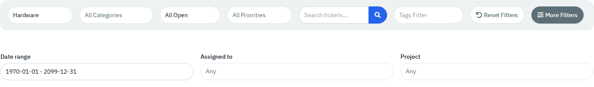

*Figure 3 — **More Filters** adds the date range, agent and project.*

> **Note**
> **Date range** can show `1970-01-01 - 2099-12-31` instead of "All Time" until you pick a range. That span means no date limit.

The list shows the number of rows set in your **Records per page** preference (see [Getting started](01-getting-started.md#paging)). A category can repeat on the next page because grouping happens before paging.

### Change a ticket from the list

With Modify, the category, priority, status and agent in each row are drop-downs. Click one and pick a value.

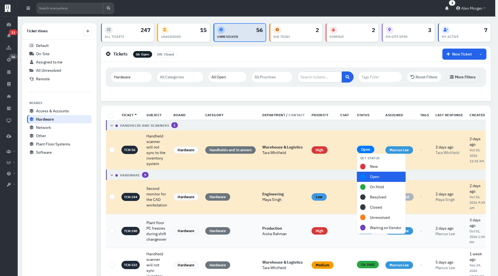

*Figure 4 — The status menu lists every active status. **Unresolved** and **Waiting on Vendor** come after the standard ones; an administrator can edit, add or switch them off.*

Assigning a **New** ticket makes it **Open**. Choosing **Resolved** closes the ticket at once; see [Statuses](#statuses). Changes made here send no email.

### Act on several tickets at once

1. Tick the boxes at the start of the rows. The box in the header ticks the current page only.
2. Open **Bulk Action (n)**.
3. Choose **Assign Agent**, **Set Category**, **Set Priority**, **Update/Reply**, **Set Project**, **Merge**, **Resolve** or **Delete**. Most open a pop-up for a value.

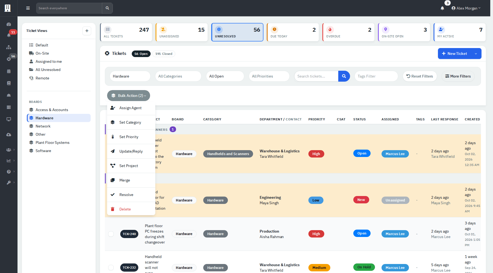

*Figure 5 — The **Bulk Action** menu. **Delete** shows only at Full.*

**Update/Reply** posts one reply or note, and can set a status, on every ticket you ticked. Bulk **Delete** cannot be undone.

### See tickets as a board

Drag cards between status columns to change status. There is one column for every active status except **Closed**: **New**, **Open**, **On Hold**, **Resolved**, **Unresolved** and **Waiting on Vendor** here, so scroll sideways to reach the later ones. Dropping a card on **Resolved** closes the ticket. A card shows priority, category, department and person, asset, subject and agent.

There is no button for the board. An administrator sets **Tickets Default View** to **Kanban** in Settings → Ticketing (the page is headed **Ticket Settings**), or you add `view=kanban` to the Tickets page address. **Kanban Settings** on the same page decide whether cards can be ordered within a column and whether columns can be moved.

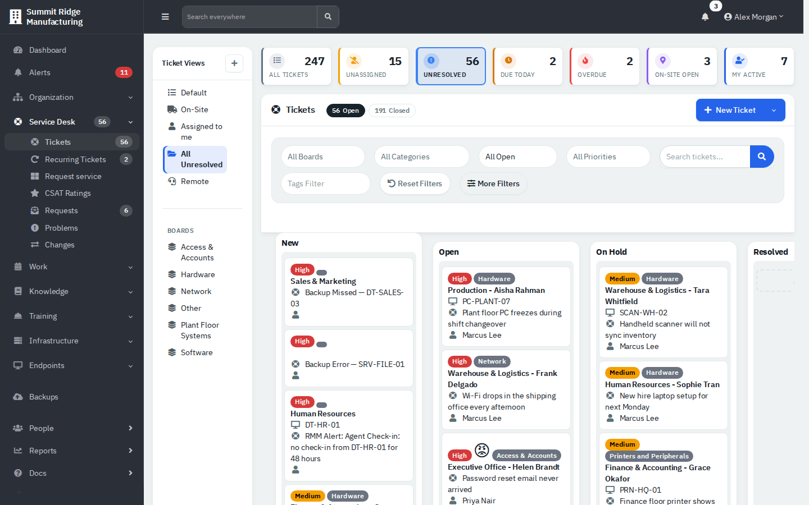

*Figure 6 — The board, scrolled to its first columns. **Closed** has no column.*

### Create a ticket

1. Click **New Ticket**. The form is titled **New Ticket (v2)**.
2. On **Details**, optionally choose a **Template** (it copies the template's tasks). Enter the **Subject**, the details, the **Priority** and a **Category**. Leave **Assign to** as **Unassigned** to let the team pick it up.
3. On **Contact**, choose the **Department**, then type at least two letters of a name in **Contact**. The search covers every department.
4. On **Assignment**, optionally choose an **Asset**, **Location**, **Vendor** and **Vendor Ticket Number**.
5. Click **Create**. The ticket opens.

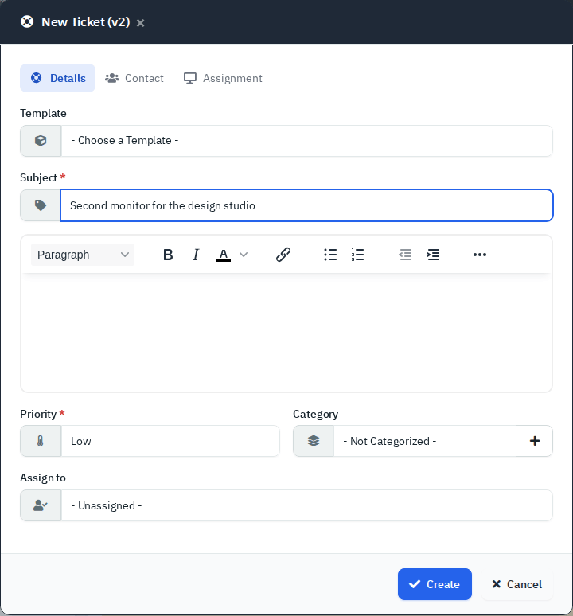

*Figure 7 — **Details**. **Subject** and **Priority** are required.*

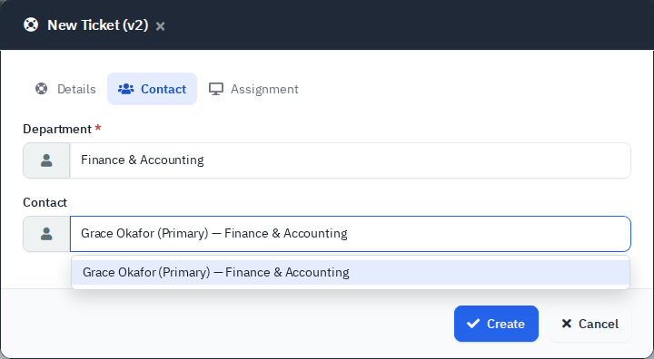

*Figure 8 — **Contact**. **Department** is required.*

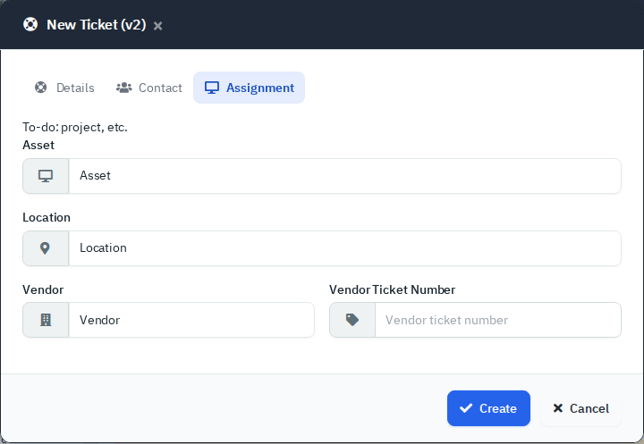

*Figure 9 — **Assignment**. The line "To-do: project, etc." at the top is unfinished text in the form.*

The number comes from the **Ticket Prefix** and **Next Number** in Settings → Ticketing. A ticket created here starts as **New**, even when you pick an agent, because the app has no "Assigned" status. If you pick someone else as agent, they get a bell notification. The person and any watchers get an email, "Ticket Created [number] - subject", only when a mail server is set up and **Department Portal Notifications** is on. Opening the form from a person's or an asset's page gives an older layout titled **New Ticket (v1)** with **Delivery Method**, **Due**, **Watchers** and **Additional Assets**.

### Work in one department

Open a department, then **Support → Tickets**. The list, the counters and **New Ticket** are limited to that department, and the **Department** box is filled in for you.

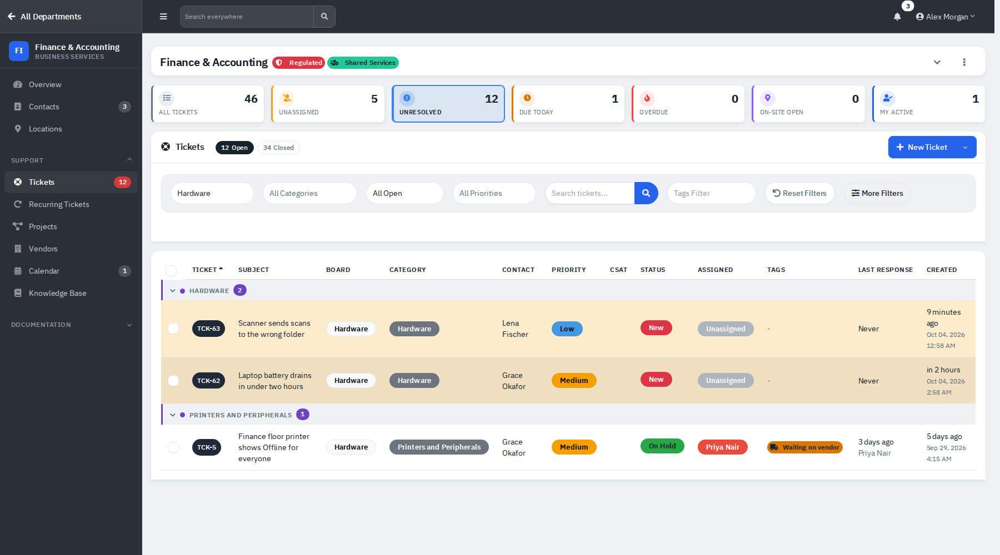

*Figure 10 — The same list inside a department workspace, filtered to Hardware.*

### Open a ticket

Click the number or subject. Ticket links carry the department, so the page can look different from the app-level view.

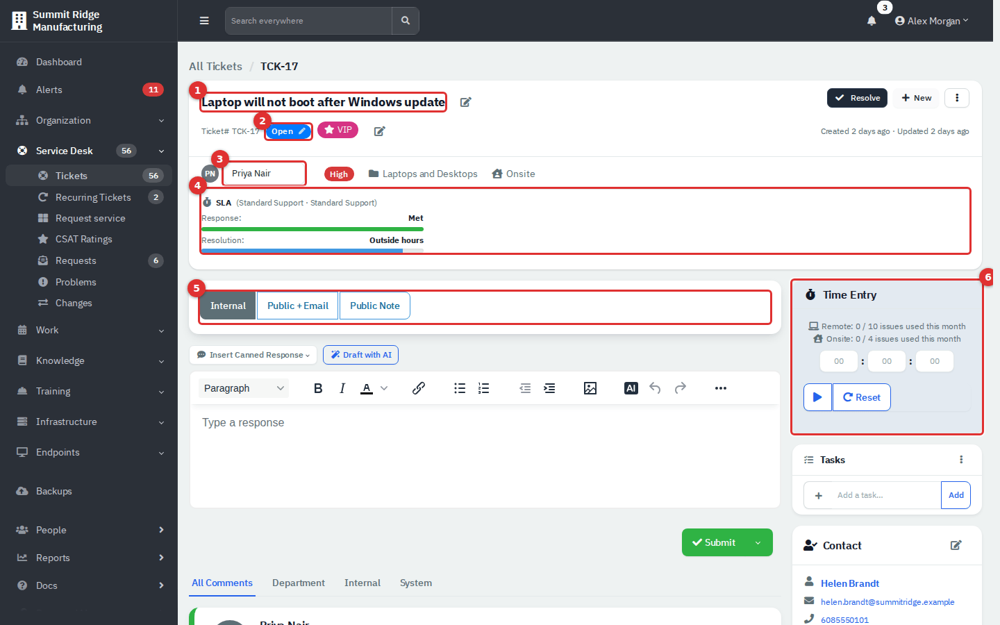

*Figure 11 — A ticket. (1) Subject, with a pencil to edit. (2) Status. The **Resolve**, **+ New** and kebab buttons sit at the top right. (3) Assigned agent. (4) SLA meters. (5) Reply type tabs. (6) **Time Entry**.*

| # | What it does |
|---|---|
| **(1)** | The pencil opens **Ticket: number - department** with **Details**, **Contact** and **Assignment** tabs. **Due** is set here. |
| **(2)** | Click the status to change it. Tags and priority have their own pencils, as does **Delivery Method** (Remote or Onsite), which chooses the monthly allowance the ticket counts against. |
| **(3)** | Choosing an agent assigns the ticket at once. Only one agent can be primary; add more under **Technicians**. |
| **(4)** | **Response** and **Resolution** show a countdown, **Met**, **Breached**, **Paused** or **Outside hours**. Policies are set in [Administration: Ticketing](13b-administration-ticketing-and-automation.md#set-up-sla-targets). |
| **(5)** | Chooses who sees what you write. |
| **(6)** | A timer and hours, minutes and seconds boxes. Under them, the card shows the month's remote and on-site allowance when the department has an active support contract. |

The **Resolve** button shows while every task is done. **+ New** opens a short menu with **Upload Attachment** and **Add Outtake Form**.

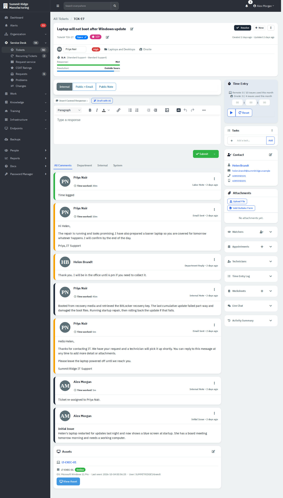

*Figure 12 — The thread, newest first. Tabs above it filter by **All Comments**, **Department**, **Internal** or **System**.*

Every entry is labelled by type; see [Entry types](#entry-types). Another agent viewing the ticket shows as "<Name> is viewing this ticket."

### Reply, or leave a note

1. Choose a tab: **Internal** (default, agents only), **Public + Email** (visible in the portal and emailed) or **Public Note** (visible in the portal, not emailed). **Public + Email** appears only when the person has an email address.
2. Optionally open **Insert Canned Response** and pick a saved reply. Edit it before sending. **Draft with AI** shows when AI is on and needs an AI provider, so it is not covered here.
3. Type your reply. Your draft is kept in this browser until you send it.
4. Click **Submit**, or the arrow beside it to send and set a status at the same time.

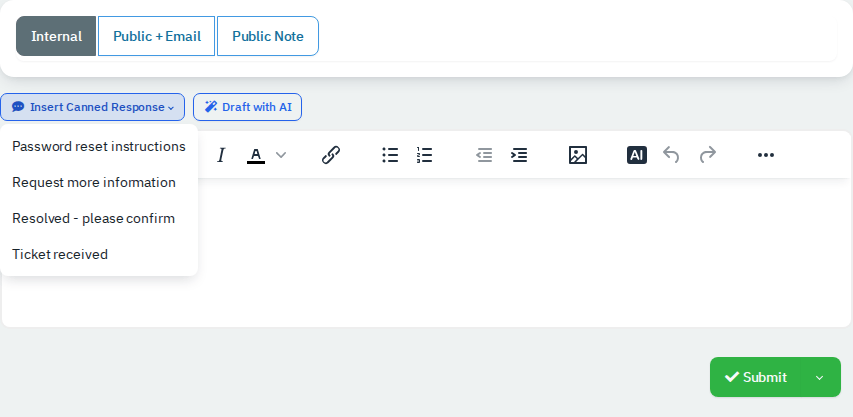

*Figure 13 — Canned responses come from Administration → Templates → Canned responses.*

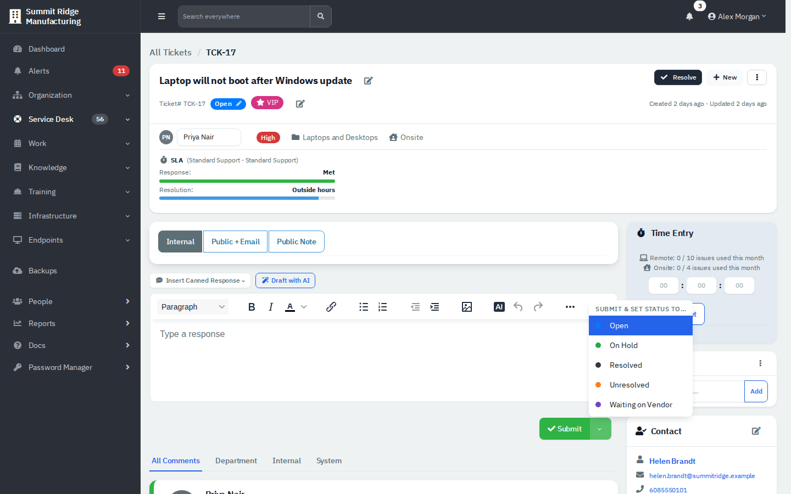

*Figure 14 — **Submit & set status to...** skips **New** and **Closed** and lists the other active statuses, **Unresolved** among them. **Resolved** is hidden while tasks are open.*

Time in the **Time Entry** boxes is saved with the reply. With no text, it becomes a **Labor Note** reading "Time logged". A **Public + Email** reply adds your signature, if you have one, and emails the person and every watcher. The email tells them to reply above a marked line, and their reply comes back into the ticket when email-to-ticket is set up.

### Change a ticket's details

Click the kebab menu (the three dots) at the top right.

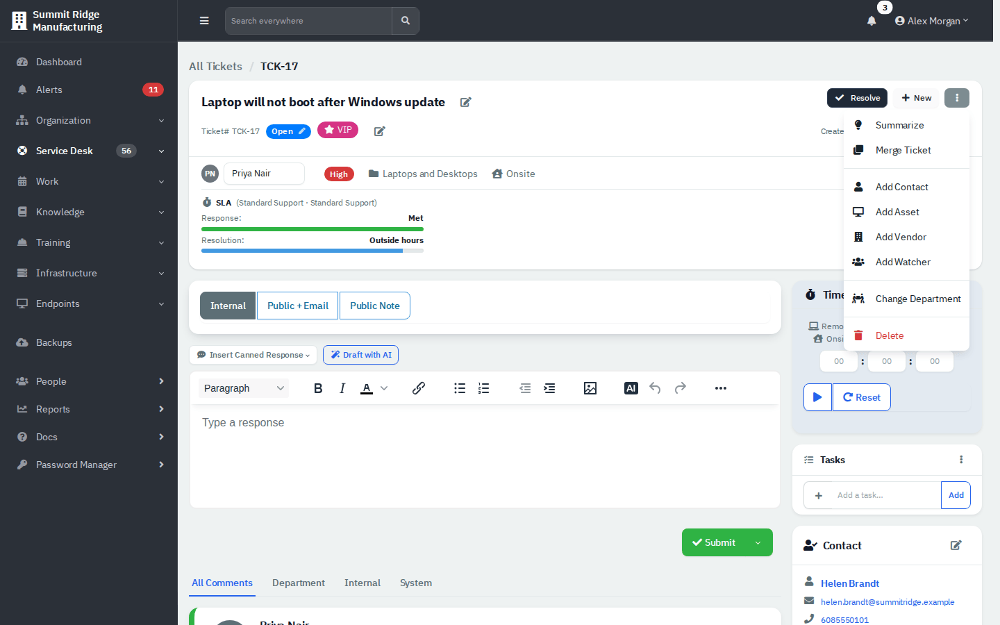

*Figure 15 — The ticket menu. **Summarize** needs AI. **Delete** shows to administrators.*

- **Add Contact**, **Add Asset**, **Add Vendor** and **Add Watcher** attach more to the ticket.
- **Change Department** moves the ticket and marks every existing reply **Internal**, so the new department cannot read them.
- **Delete** removes an unclosed ticket for good. Close it instead when in doubt.

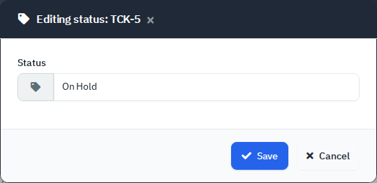

*Figure 16 — Clicking the status opens this pop-up. Its list holds every active status, including **Closed** and **Unresolved**.*

### Merge duplicate tickets

1. Open the duplicate and choose **Merge Ticket**.
2. Pick the ticket to keep in **Ticket number to merge this ticket into** and enter a **Reason for merge**.
3. Tick **Move notes & replies to the new parent ticket** to carry the conversation across.
4. Click **Merge**.

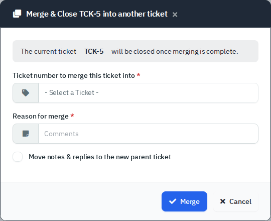

*Figure 17 — The duplicate is closed when you merge.*

The duplicate is closed and shows **Merged** in the list. Both tickets get a system note. To merge from the list, tick the tickets and use **Merge** in **Bulk Action**.

### Track time, tasks, files and watchers

The side cards hold the working details. Only the first four stay open; click a card's header to unfold the rest.

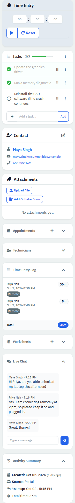

*Figure 18 — The side cards of a ticket. **Time Entry**, **Tasks**, **Contact** and **Attachments** are always open; the others are folded until you click their header (here three are opened).*

| Card | Use it to |
|---|---|
| **Time Entry** | Time the work. On a closed ticket it reads "Ticket closed". |
| **Time Entry Log** | Lists who spent what and totals it. |
| **Appointments**, **Technicians** | See [Schedule a visit or add a technician](#schedule-a-visit-or-add-a-technician). |
| **Tasks** | Keep a checklist. A template fills it in. **Resolve** appears only when every task is done. |
| **Contact** | See who asked. The pencil changes the person. |
| **Attachments** | **Upload File** or **Add Outtake Form** (a form the person signs). |
| **Watchers** | Shows on an unclosed ticket once it has watchers. Add email addresses that follow the ticket, inside or outside the company. |
| **Worksheets** | Fill in a checklist form. A required worksheet or an unsigned outtake form blocks **Resolve**. |
| **Live Chat** | Chat with the person while they have the ticket open in the portal. Shown when **Show Live Chat on Tickets** is on. |
| **Activity Summary** | Dates, source, first response, total time, who closed it and the rating. |

Each automatic note, such as a status change or "Ticket closed.", logs one minute of time. That counts toward the totals.

### Schedule a visit or add a technician

1. Open **Appointments** and click **+**. Choose the **Appointment Type**, **Start**, **Duration**, tick the technicians who go (each gets an entry) and add **Notes**.
2. Open **Technicians** to add helpers. The first is **Primary**.

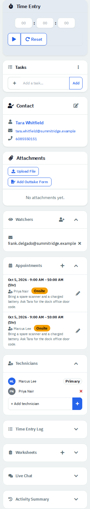

*Figure 19 — Two technicians booked for the same visit.*

Appointments appear in the calendar feed. Each has a **Remote** or **Onsite** type and internal notes. They do not change the ticket's **Delivery Method**.

### Resolve, close and reopen a ticket

1. Click **Resolve** and confirm. The ticket becomes **Closed**, a system note "Ticket closed." is added, and the person is emailed "Ticket resolved" with rating faces (mail server and **Department Portal Notifications** needed).
2. To send a closing message, reply with status **Resolved** instead.
3. To reopen, click **Reopen** on the closed ticket. The status returns to **Open**. **Reopen** also shows on a resolved ticket. **Schedule Reopen** picks a date instead; the button then reads **Reopen Scheduled**, and the scheduler reopens the ticket on that date with a system note.

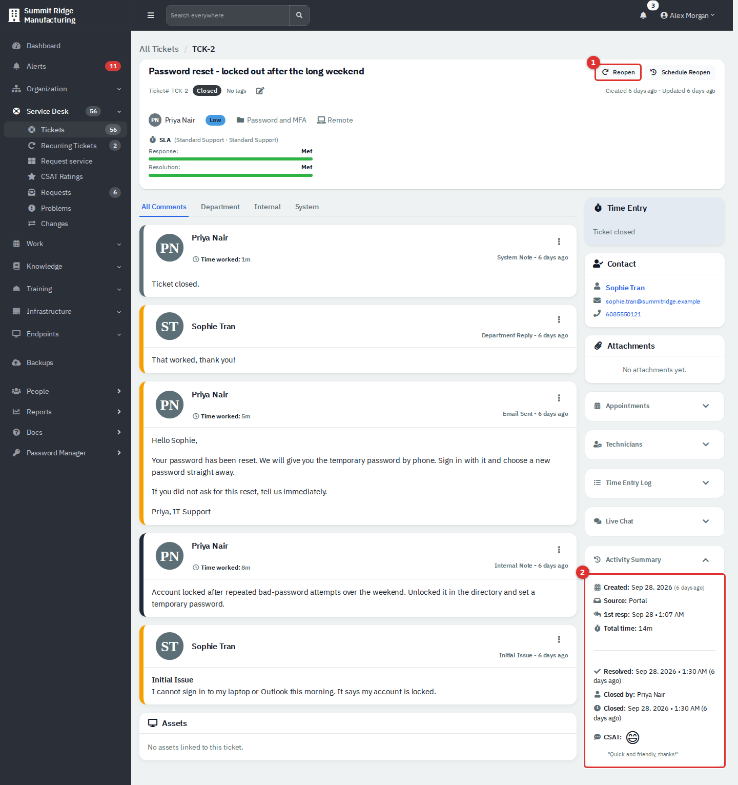

*Figure 20 — A closed ticket. (1) **Reopen** and **Schedule Reopen**. (2) **Activity Summary** with the person's rating.*

The person rates from the email or the portal (see [Department Portal](11-employee-portal.md#rate-a-closed-ticket)). A rating at or below the low-rating threshold reopens the ticket with an internal note. Ratings are reviewed in [CSAT Ratings](03c-problems-changes-mail-requests-csat.md#csat-ratings).

### Keep a filtered list as a view

1. Set the filters you want.
2. Click the **+** in **Ticket Views**.
3. Enter a **Name**, an optional **Icon** and click **Save View**.
4. Use the kebab menu on a view you own to **Move Up**, **Move Down**, **Rename** or **Delete**.

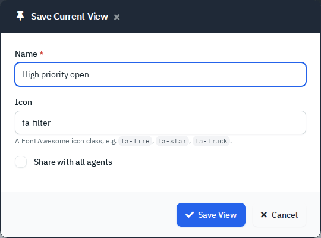

*Figure 21 — **Share with all agents** is honored only at Full; otherwise the view stays private.*

## Reference

### Statuses

| Status | Meaning | How a ticket gets there |
|---|---|---|
| **New** | Nobody has picked it up. | Creation, or **Default Status** in Settings → Ticketing. |
| **Open** | Being worked. | Assigning a New ticket; an answer from the person in the portal; **Reopen**, or a scheduled reopen; a low CSAT rating; an automation rule of the vacation-return kind (the person's recorded vacation has ended); choosing it. |
| **On Hold** | Waiting. | Choosing it. The SLA clock pauses only if the policy lists it. |
| **Resolved** | A trigger, not a resting state. | Choosing it closes the ticket, so it never stays **Resolved**. |
| **Unresolved** | An open-type status with no special behaviour: the ticket stays open, is paused by an SLA policy only if the policy lists it, and counts in the **Unresolved** tile. | Choosing it. Administrators can rename, reorder or switch it off under Ticketing → Ticket Statuses. |
| **Closed** | Finished. Resolved and closed dates are stamped. | **Resolve**, choosing Resolved or Closed, or merging. |
| Custom | Added under Ticketing → Ticket Statuses, such as **Waiting on Vendor** in the demo. | Choosing it. |

Only a closed ticket can be reopened. Reopening clears the resolved and closed dates. Every status except **Resolved** and **Closed** leaves the ticket open; **Resolved** never rests, because the app turns it into **Closed** the moment you choose it. A rule with the vacation-return trigger reopens a ticket that was closed while its person was away, once the vacation end date has passed, and adds a system note (see [Administration: Ticketing, Automation and Organising Data](13b-administration-ticketing-and-automation.md)). Rules can also be set to run once per ticket.

### Entry types

| Label | What it is |
|---|---|
| **Initial Issue** | The original request. |
| **Internal Note** | Agents only. |
| **Email Sent** | A public reply set to email. It also shows when no mail server is set up, so check the mail queue before trusting it. |
| **Public Note** | Visible to the person, not emailed. |
| **Department Reply** | From the person. |
| **System Note** | Written by the app. |
| **Automation Note**, **RMM Alert Note** | From rules and monitoring. |
| **Labor Note** | Time with no text. |

### Emails

| When | To | Needs |
|---|---|---|
| Ticket created on the form | Person and watchers | Mail server, **Department Portal Notifications** |
| **Public + Email** reply | Person and watchers | Mail server |
| **Resolve** button, or a Resolved reply set to email | Person | Mail server (button also needs **Department Portal Notifications**) |

Email is queued and sent by the scheduler, so nothing leaves without it. The demo has no mail server, so these were read from the code, not sent.

## Tips and good practice

- Prefer **Internal** when unsure; you can always follow with a public reply.
- Assign as soon as you take a ticket, so it moves from **New** to **Open** and out of **Unassigned**.
- Use a category with sub-categories; forms list only the sub-categories.
- Merge rather than delete duplicates, so history is kept.
- Use **Waiting on Vendor**-style statuses with an SLA pause policy for tickets you cannot move.
- Log time as you go; the totals feed the reports.

## Related guides

- [Recurring Tickets and Request Something](03b-recurring-tickets-and-request-catalog.md)
- [Problems, Changes, Requests and CSAT Ratings](03c-problems-changes-mail-requests-csat.md)
- [Administration: Ticketing, Automation and Organising Data](13b-administration-ticketing-and-automation.md)
- [Department Portal](11-employee-portal.md)
- [Dashboard and Reports](10-dashboard-and-reports.md)
