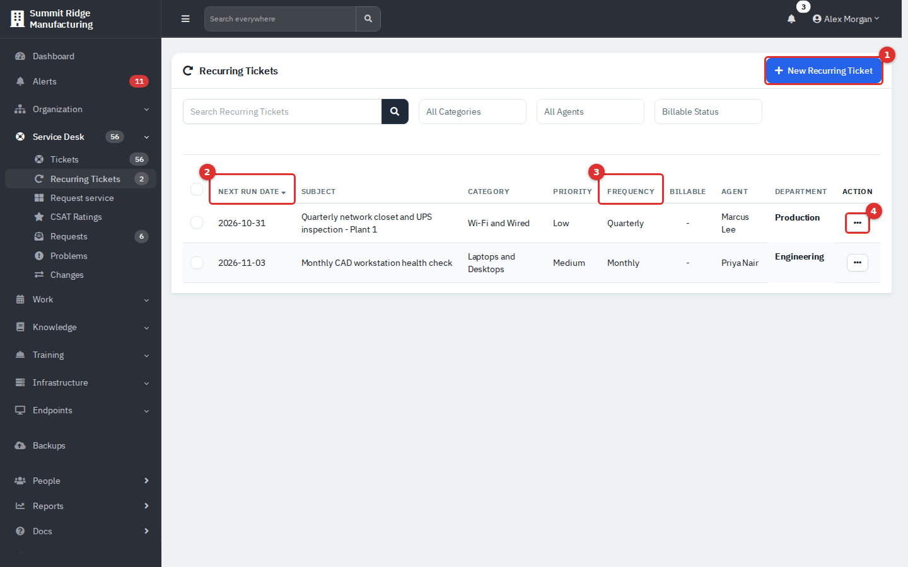
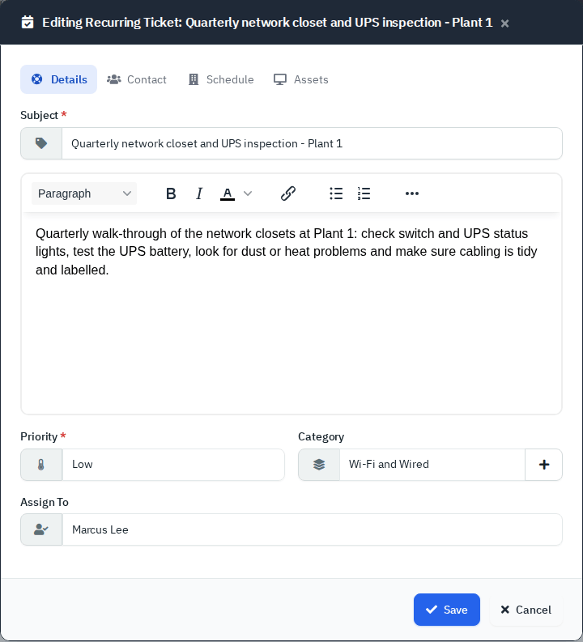
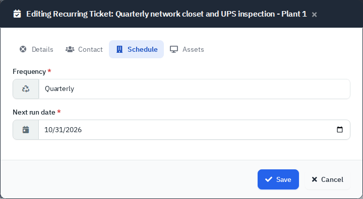
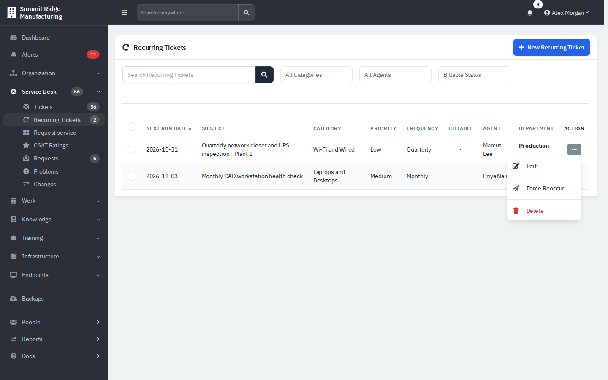
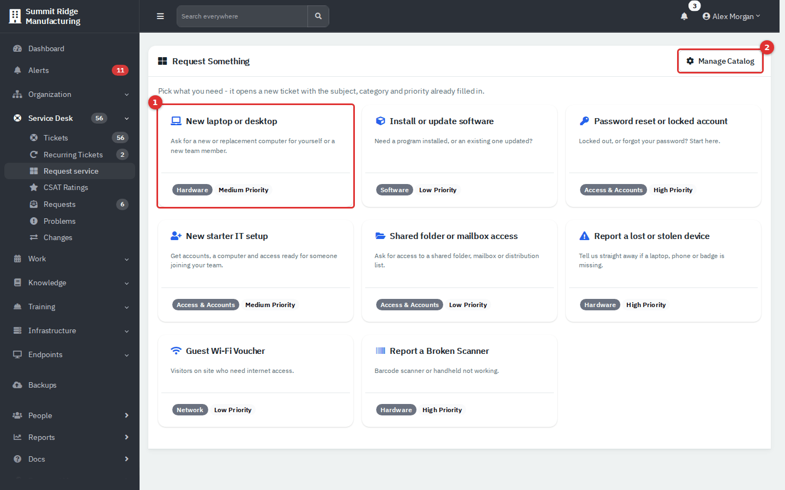
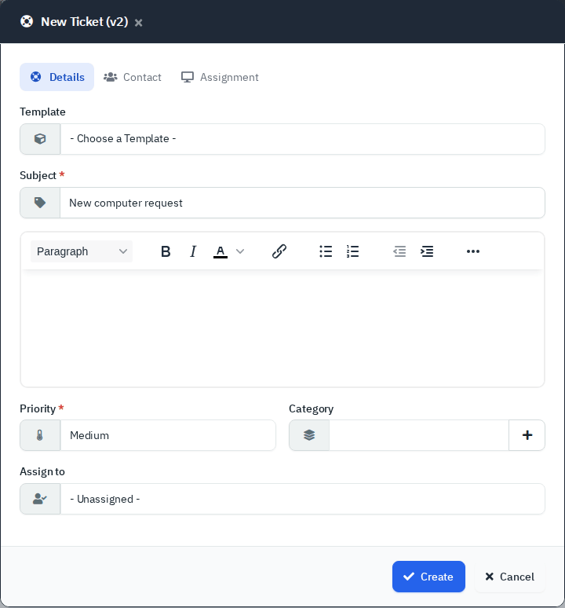

# Service Desk: Recurring Tickets and Request Something

Recurring tickets raise the same ticket on a schedule, for routine jobs such as a monthly health check. Request Something (the sidebar item is labelled **Request service**, the page is headed **Request Something**) is a page of one-click tiles that open the New Ticket form with the subject, category and priority already filled in. For the ticket itself, see [Service Desk: Tickets](03-service-desk.md).

| | |
|---|---|
| **Where to find it** | Sidebar → **Service Desk** → **Recurring Tickets** and **Request service**. |
| **Who can use it** | Tickets, assets & docs: **Read** to open both pages. **Modify** to add, edit, force and bulk-change recurring tickets and to create a ticket from a tile. **Full** to delete recurring tickets. |
| **Turn it on** | **Show Ticketing** (Settings → Modules in Administration). Recurring tickets are raised by the scheduler (`cron/cron.php`); see [Administration: System Settings, Mail, Integrations and Maintenance](13-administration-settings.md). |

## What it's for

- Recurring: patch checks, inspections, renewals and any job that comes round on a calendar.
- Request Something: give agents a short menu of common requests so tickets arrive consistently named and categorised.

## A quick tour

*Figure 1 — Recurring Tickets. (1) **New Recurring Ticket**. (2) **Next Run Date**. (3) **Frequency**. (4) Row menu.*

| # | What it does |
|---|---|
| **(1)** | Opens the new schedule form. |
| **(2)** | The day the next ticket is raised. The list is sorted by it. |
| **(3)** | How often: **Three Days**, **Weekly**, **Biweekly**, **Monthly**, **Quarterly**, **Biannually** or **Annually**. |
| **(4)** | **Edit**, **Force Reoccur** and **Delete**. |

The search box and the category and agent filters narrow the list. Tick rows for **Bulk Action**: **Force Reoccur**, **Assign Agent**, **Set Category**, **Set Priority**, **Set Next Run Date** and **Delete**.

## Common tasks

### Create a recurring ticket

1. Click **New Recurring Ticket**.
2. On **Details**, enter the **Subject**, the details, **Priority**, **Category** and **Assign to**.
3. On **Contact**, choose the **Department** and the person the ticket is for.
4. On **Schedule**, choose the **Frequency** and the **Starting date**. The first ticket is raised on that date.
5. On **Assets**, optionally pick an **Asset** and **Additional Assets**. These selectors have content only when you open the form from a department workspace.
6. Click **Create**.

Every ticket it raises has the source **Recurring**, starts as **New** (or the **Default Status**), and copies the subject, details, category, priority, person, assets and agent.

### Edit a schedule

Use the row menu → **Edit**. The form has the same tabs; **Schedule** shows **Frequency** and **Next run date**.

*Figure 2 — **Details**.*

*Figure 3 — **Schedule**. Changing **Next run date** moves the next ticket.*

### Raise one now

Row menu → **Force Reoccur** raises the ticket immediately and moves the next run on by one period from the scheduled date. Do not use it on **Three Days** or **Biweekly** schedules: the code has no next-date rule for them, so the ticket is created and then the page errors without moving the date.

*Figure 4 — The row menu. **Delete** shows only at Full.*

### Pause or stop a schedule

There is no pause. Move **Next run date** far into the future with **Edit** or **Set Next Run Date**, or **Delete** (Full), which cannot be undone.

### Use the request catalog

1. Open **Request service**; the page is headed **Request Something**.
2. Click a tile. The **New Ticket (v2)** form opens with the **Subject**, **Priority** and **Category** filled in.
3. Finish the form as in [Create a ticket](03-service-desk.md#create-a-ticket) and click **Create**.

*Figure 5 — Request Something. (1) A tile shows its name, description, category and priority. (2) **Manage Catalog** (administrators).*

*Figure 6 — The form after clicking a tile. Here the Category box is empty.*

A tile only fills in a form. It starts no approval and creates nothing until you click **Create**. If **Category** opens empty, the tile points at a top-level category that has sub-categories, and the form lists only sub-categories. Choose one, and ask an administrator to edit the tile.

Administrators add and change tiles with **Manage Catalog**; see [Build the Request Something catalog](13b-administration-ticketing-and-automation.md#build-the-request-something-catalog). Employees see their own version under **Request service** in the Department Portal, where a tile opens the portal's ticket form with the same pre-filled values and a banner naming the request: [Request something common](11-employee-portal.md#request-something-common).

## Reference

| Item | Behaviour |
|---|---|
| Run rule | The scheduler raises tickets whose next run date is today. After it runs it moves the date on from today. |
| Missed day | A date in the past is not raised. The scheduler only notifies that the date is in the past; edit it. |
| Emails | If a mail server and **Department Portal Notifications** are on, the person gets "Ticket created ... (scheduled)". The **New Ticket Alert Email** address also gets a note. |

## Tips and good practice

- Name schedules so the ticket reads well: "Monthly CAD workstation health check".
- Add the asset so the ticket links to the machine.
- Check the **Next Run Date** column after the scheduler was off; missed dates need editing.
- Keep the catalog short: a dozen tiles is easier to scan than forty.

## Related guides

- [Service Desk: Tickets](03-service-desk.md)
- [Problems, Changes, Requests and CSAT Ratings](03c-problems-changes-mail-requests-csat.md)
- [Administration: Ticketing, Automation and Organising Data](13b-administration-ticketing-and-automation.md)
