# Service Desk: Problems, Changes, Requests and CSAT Ratings

Four smaller pages sit beside the ticket list. **Problems** group tickets that share one root cause. **Changes** plan and track work that alters your systems. **Requests** hold emails from unknown senders until you decide what to do with them. **CSAT Ratings** collects how satisfied people were. Tickets themselves are in [Service Desk: Tickets](03-service-desk.md).

| | |
|---|---|
| **Where to find it** | Sidebar → **Service Desk** → **Problems**, **Changes**, **Requests** and **CSAT Ratings**. |
| **Who can use it** | Tickets, assets & docs: **Read** to look at all four pages. **Modify** to create and change problems and changes, convert or dismiss requests, and switch a rating's **Public** toggle. |
| **Turn it on** | **Show Ticketing**. **CSAT Ratings** also needs **Enable CSAT ratings** (Settings → Ticketing in Administration). **Requests** fills only when a mailbox has **Queue unknown senders as Requests** and email-to-ticket runs; see [Administration: System Settings, Mail, Integrations and Maintenance](13-administration-settings.md#how-incoming-email-becomes-a-ticket). |

## Problems

A problem is a record of an underlying cause behind several tickets, such as VPN drops that many people report separately. Fixing it once closes the pattern.

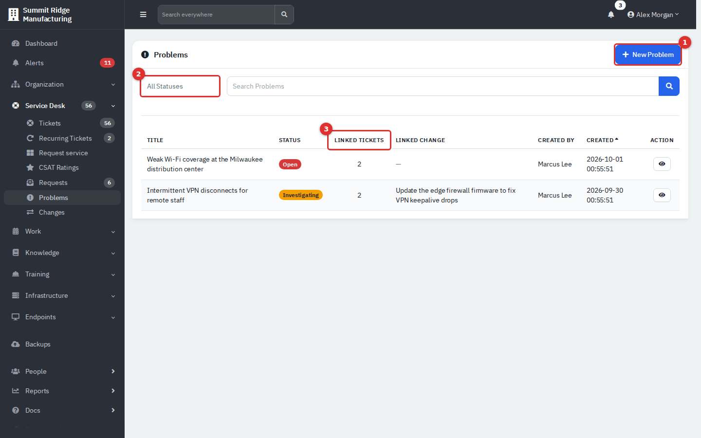

*Figure 1 — Problems. (1) **New Problem**. (2) Status filter. (3) **Linked Tickets** count.*

### Create and work a problem

1. Click **New Problem**, enter a **Title** and an optional **Description**, then **Create Problem**.
2. Open it with the eye button.
3. Under **Linked Tickets**, type a ticket number (with or without the prefix) in **Link an existing ticket** and click **Link Ticket**. The red button beside a ticket unlinks it.
4. Move the status with the buttons under the description.

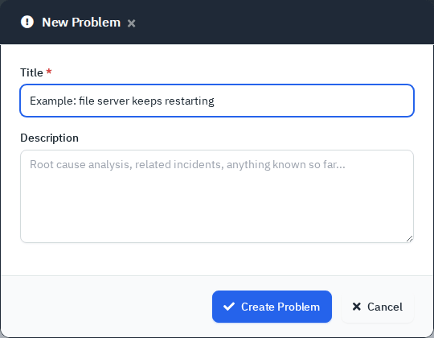

*Figure 2 — **New Problem**. Only the title is required.*

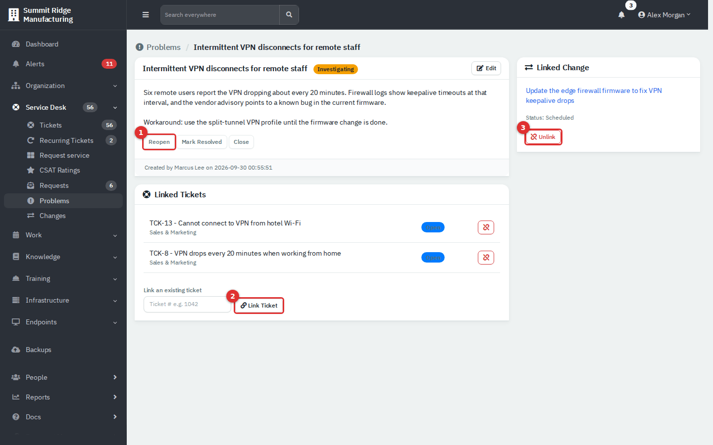

*Figure 3 — A problem. (1) Status buttons. (2) **Link Ticket**. (3) **Unlink** the change.*

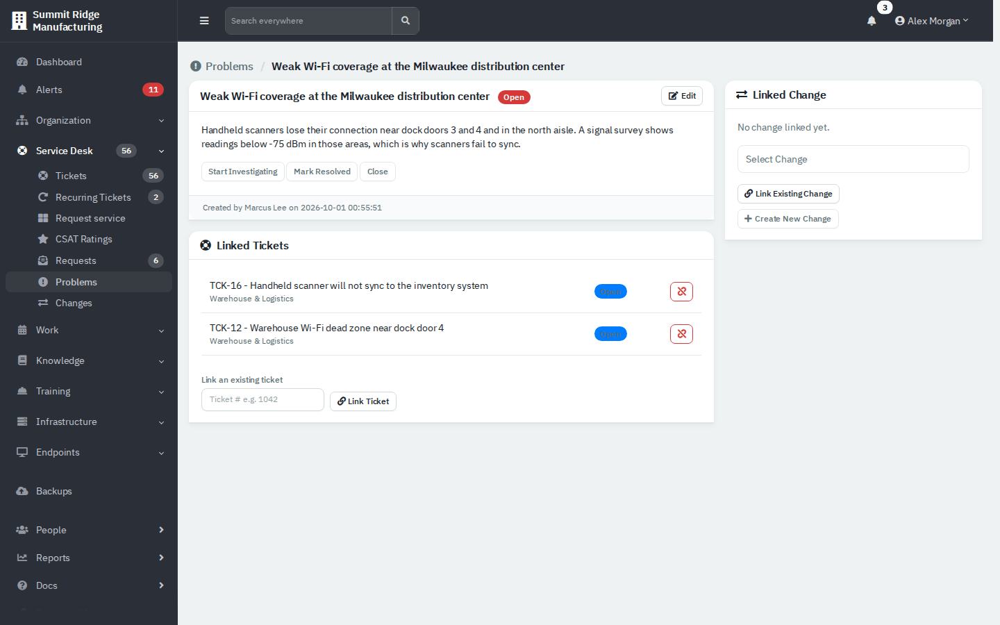

*Figure 4 — A problem with no change yet.*

| Status | Buttons it offers |
|---|---|
| **Open** | **Start Investigating**, **Mark Resolved**, **Close** |
| **Investigating** | **Reopen** (back to Open), **Mark Resolved**, **Close** |
| **Resolved** | **Back to Investigating**, **Reopen**, **Close** |
| **Closed** | **Reopen**, **Reopen (Investigating)** |

A problem can have one change, the planned fix: pick it in **Select Change** and click **Link Existing Change**, or click **Create New Change**. Problems cannot be deleted. Moves are written to the audit log; nobody is emailed.

## Changes

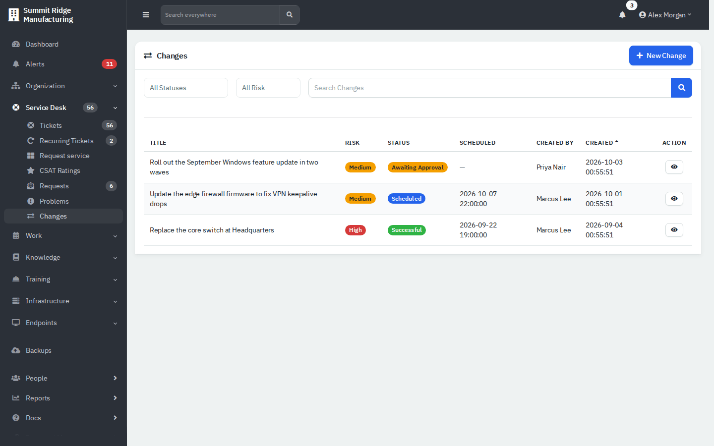

*Figure 5 — Changes, with risk, status and scheduled time.*

### Plan and run a change

1. Click **New Change**. Enter the **Title** and **Risk** (**Low**, **Medium** or **High**), and optionally the **Reason**, **Impact**, **Implementation Plan**, **Rollback Plan** and **Scheduled For**.
2. Open the change and use its buttons. A new change is a **Draft**.
3. **Submit for Approval**, then **Approve**. Any agent with Modify can approve, including the person who wrote it; the app has no separate approver.
4. **Schedule** (a date and time box appears beside it) or **Start Now**.
5. When done, **Mark Successful** or **Mark Failed**. A failed or successful change can be **Mark Rolled Back**.
6. **Reschedule** with the date box and **Update**.

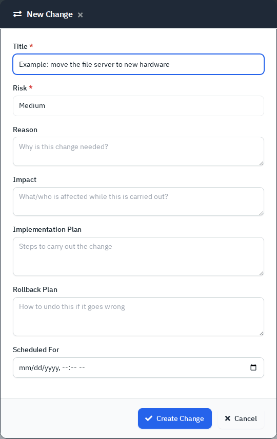

*Figure 6 — **New Change**.*

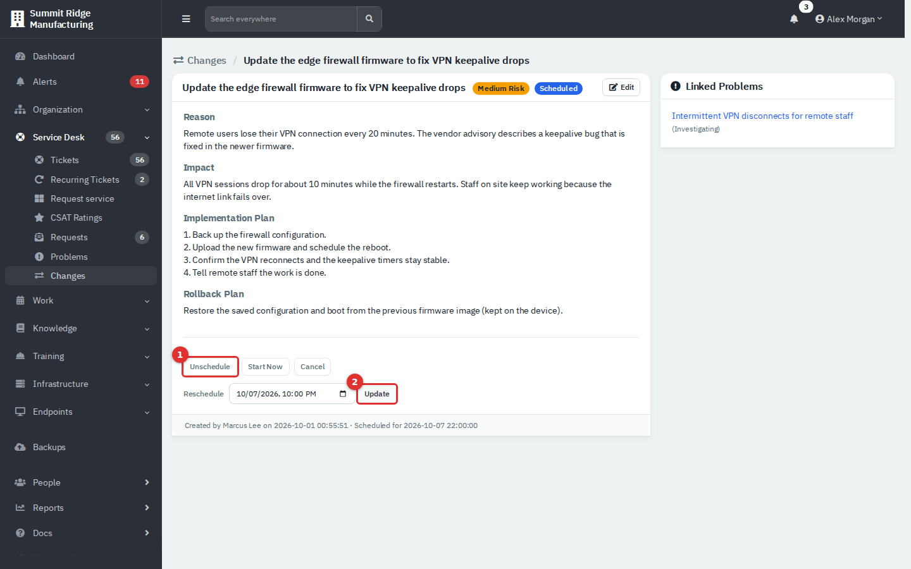

*Figure 7 — A scheduled change. (1) The status buttons. (2) **Reschedule**.*

| Status | Next steps |
|---|---|
| **Draft** | **Submit for Approval**, **Cancel** |
| **Awaiting Approval** | **Send Back to Draft**, **Approve**, **Cancel** |
| **Approved** | **Schedule**, **Start Now**, **Cancel** |
| **Scheduled** | **Unschedule**, **Start Now**, **Cancel** |
| **In Progress** | **Mark Successful**, **Mark Failed**, **Cancel** |
| **Failed** | **Mark Rolled Back**, **Cancel** |
| **Successful** | **Mark Rolled Back** |
| **Rolled Back**, **Cancelled** | None |

Changes cannot be deleted and send no email. The **Linked Problems** card lists problems that point at the change.

## Requests

Email from someone who is not a known person or on a registered domain lands here, so a stranger cannot open tickets unseen.

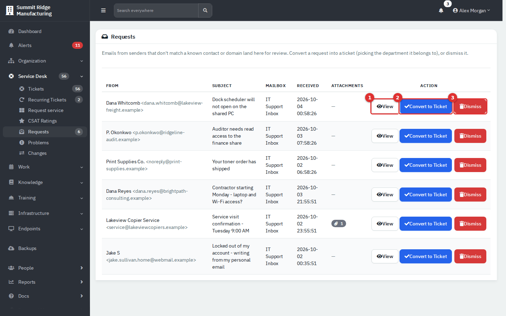

*Figure 8 — Requests. (1) **View**. (2) **Convert to Ticket**. (3) **Dismiss**.*

1. Click **View** to read the message and see the attachments.
2. Click **Convert to Ticket**, choose the **Department** and click **Create Ticket**. **None (Guest / unassigned)** makes an unassigned ticket with the sender as a watcher. With a department, the sender is added as a person if they are not there yet.
3. Or click **Dismiss** and confirm. This deletes the stored message and attachments and cannot be undone.

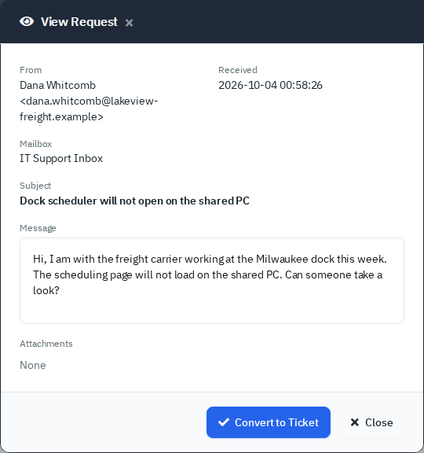

*Figure 9 — A request.*

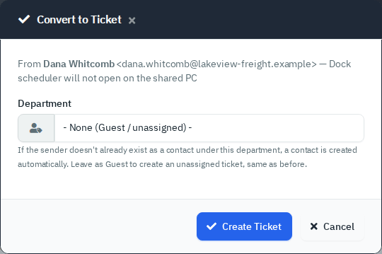

*Figure 10 — Choosing the department.*

The ticket source is **Email**. The demo has no mail server, so the requests shown were seeded and the intake itself was not run.

## CSAT Ratings

When a ticket closes, the person is asked to rate it on five faces: **Very unhappy**, **Unhappy**, **Neutral**, **Happy**, **Very happy**. They rate once, from the email or the portal.

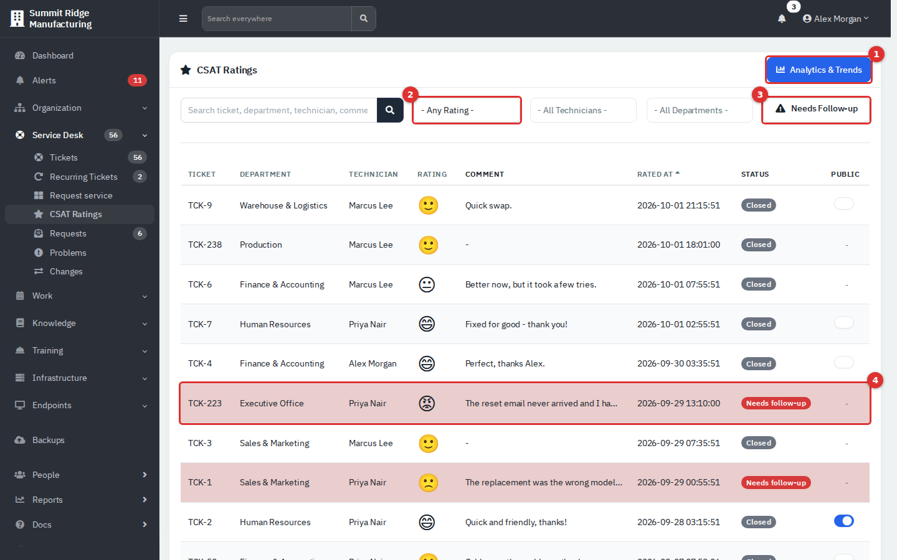

*Figure 11 — CSAT Ratings. (1) **Analytics & Trends**. (2) Rating filter. (3) **Needs Follow-up**. (4) A low rating.*

- Filter by search text, rating, technician and department.
- **Needs Follow-up** shows ratings at or below the low-rating threshold on tickets that are not closed. A low rating reopens the ticket with an internal note "Automatically reopened". Set the threshold under Settings → Ticketing in Administration (**Low-rating follow-up threshold**).
- **Public** can be switched on for ratings of **Happy** or better that have a comment; it allows the comment in the public rating widget.
- **Analytics & Trends** opens the report described in [Customer Satisfaction (CSAT)](10b-report-reference.md#customer-satisfaction-csat).

## Tips and good practice

- Link tickets to a problem as they arrive; the count shows how big it is.
- Write the rollback plan before you approve a change.
- Clear **Requests** daily; unknown senders are waiting.
- Read comments on low ratings before you close the ticket again.

## Related guides

- [Service Desk: Tickets](03-service-desk.md)
- [Recurring Tickets and Request Something](03b-recurring-tickets-and-request-catalog.md)
- [Department Portal](11-employee-portal.md#rate-a-closed-ticket)
- [Administration: Ticketing, Automation and Organising Data](13b-administration-ticketing-and-automation.md)
