# Projects and Calendar

Projects group the tickets and tasks for a piece of work that takes weeks, such as a Wi-Fi upgrade or a laptop refresh, so you can see how far along it is. The Calendar shows your team's events, maintenance windows and scheduled ticket visits in one place.

| | |
|---|---|
| **Where to find it** | Sidebar → **Work** → **Projects** and **Work** → **Calendar**. Inside a department workspace, use **Projects** and **Calendar** in that department's sidebar. |
| **Who can use it** | Permission module **Tickets, assets & docs**. **Read** to view projects, the Gantt and Kanban tabs and the calendar. **Modify** to create and edit projects, milestones, tasks, calendars and events, to link tickets, and to close, archive or restore a project. **Full** to delete a project, a task, a milestone or a calendar. The built-in Technician role has Modify; the Accountant role has Read. |
| **Turn it on** | **Work → Projects** appears when **Show Ticketing** is on under **Administration → Settings → General → Modules**. The calendar does not depend on that switch. Project templates, the project number prefix and calendar sync are set up by an administrator. |

## What it's for

- Keep the tickets, tasks and milestones of one job together and see one progress bar for the whole job.
- Give each task an owner and a due date, and watch tasks move across a Kanban board or a Gantt timeline.
- Start a repeatable job (laptop refresh, new department) from a **project template** that creates the tickets and their checklists for you.
- Plan meetings and maintenance windows on shared, colour-coded calendars, and see scheduled ticket visits next to them.

## A quick tour

### The project list

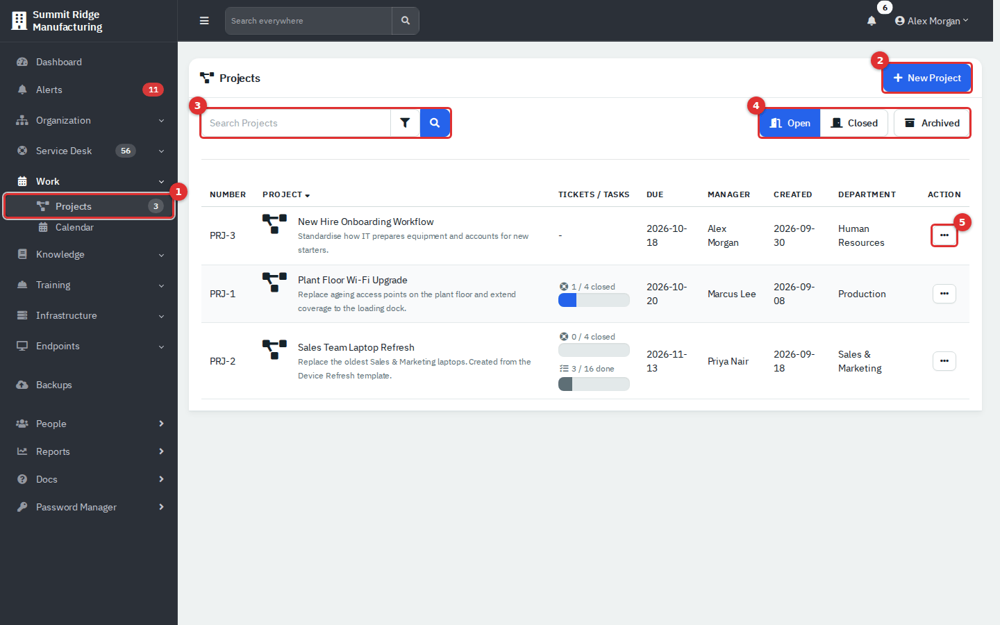

*Figure 1 — The project list. Numbers are explained below.*

1. **Work → Projects** in the sidebar. The badge is the number of open projects.
2. **New Project** (needs Modify).
3. Search box and filter button. Search matches the project number, name, description and manager. The filter button opens a **Date range** that filters on the date the project was created.
4. **Open**, **Closed** and **Archived** buttons.
5. The **Action** menu of a row (**Edit**, **Archive**, **Restore**, **Delete**, depending on the project's state).

Click a column heading to sort. The **Tickets / Tasks** column shows the share of linked tickets that are closed and the share of ticket tasks that are done.

> **Note.** The task bar in the list counts only tasks that belong to the project's tickets. Tasks you add directly to a project are counted on the project page, not in the list.

### A project page

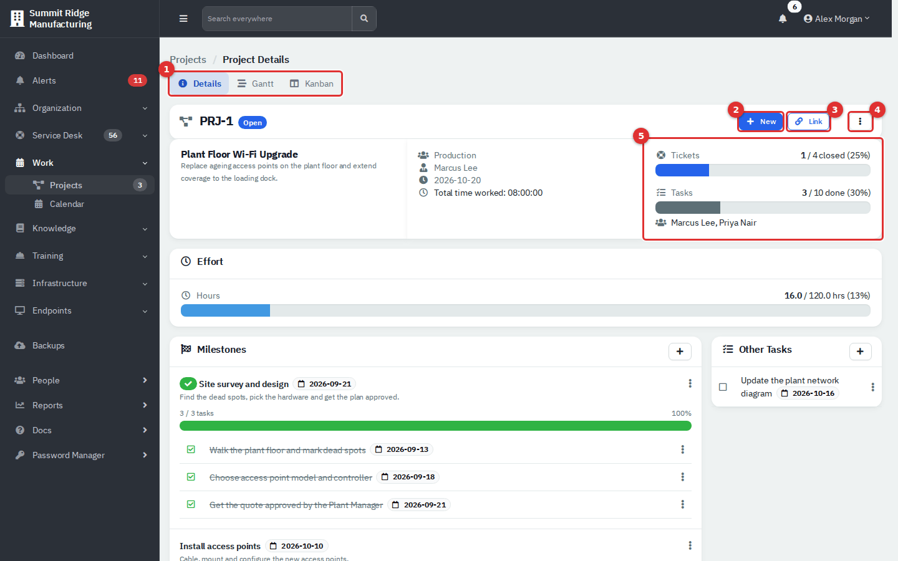

*Figure 2 — A project page with its header, progress and effort cards, milestones and tasks.*

1. Tabs: **Details**, **Gantt** and **Kanban** show the same tasks in three ways.
2. **New** adds a **Ticket**, **Milestone** or **Task**.
3. **Link** attaches an existing **Open Ticket** or **Closed Ticket**.
4. The **⋮** menu: **Edit** while the project is open, **Archive** once it is closed, **Delete** once it is archived.
5. Progress: tickets closed and tasks done, plus the agents who have worked on the project's tickets.

Below the header, **Effort** compares hours worked with the estimate (the bar turns red above 100%), **Milestones** lists each milestone with its tasks, **Project Tickets** lists the linked tickets and **Tasks** (or **Other Tasks**, when milestones exist) lists tasks that belong to no milestone. The project has no separate notes field; the **Description** holds the background.

### The calendar

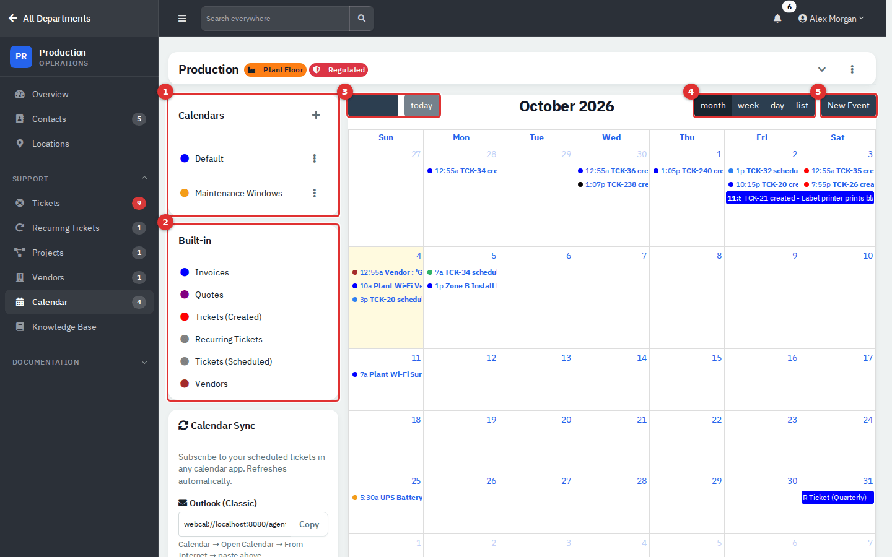

*Figure 3 — The calendar in month view, shown inside the Production workspace. At application level (**Work → Calendar**) it looks the same but lists every department's entries, which fills the month with ticket entries.*

1. **Calendars**: your own calendars, each with a colour. The **+** creates a calendar.
2. **Built-in**: the colour key for entries the app draws automatically (see [What appears on the calendar by itself](#what-appears-on-the-calendar-by-itself)).
3. Previous, next and **today**. In this version the two arrow buttons show no arrow symbol; they are the dark block left of **today** (hover shows **Previous month** and **Next month**).
4. **month**, **week**, **day** and **list** views.
5. **New Event**.

## Common tasks: projects

### Create a project

1. Go to **Work → Projects** and click **New Project**. (Inside a department workspace the project is created for that department and the **Department** field is hidden.)
2. Fill in the form (Figure 4). **Project Name** and **Date Due** are required.
3. Click **Create**. The project opens as **Open**, and a project number such as PRJ-12 is assigned.

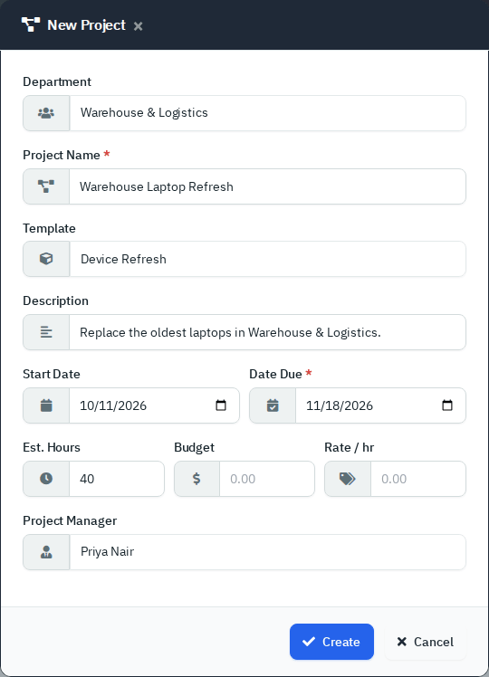

*Figure 4 — The New Project form.*

| Field | What it does |
|---|---|
| **Department** | The department that owns the project. **- No Department -** makes a company-wide project that appears only in the application-level list. |
| **Project Name** | Required. |
| **Template** | Optional. Creates tickets and tasks from a project template (see below). |
| **Description** | One line shown in the list and on the project page. |
| **Start Date**, **Date Due** | Due date is required. |
| **Est. Hours** | The estimate the **Effort** bar compares against. If blank, the page adds up the task time estimates instead. |
| **Budget**, **Rate / hr** | Money fields. This edition does not display them on the project page; leave them blank. |
| **Project Manager** | An active agent (users with the Accountant role are not listed). |

To change a project later, use **⋮ → Edit** (open projects only). It shows the same fields except **Template**.

In a department workspace the form also has an optional **Apply Contract** field. Leave it at **None** unless your organisation applies contract templates to new projects.

### Create a project from a template

1. Follow the steps above and choose a **Template**, for example **Device Refresh**.
2. Click **Create**.
3. Open the project. For each ticket template in the project template, the app has created one ticket in this project, with the template's subject and description, priority **Low**, and one task per task template.

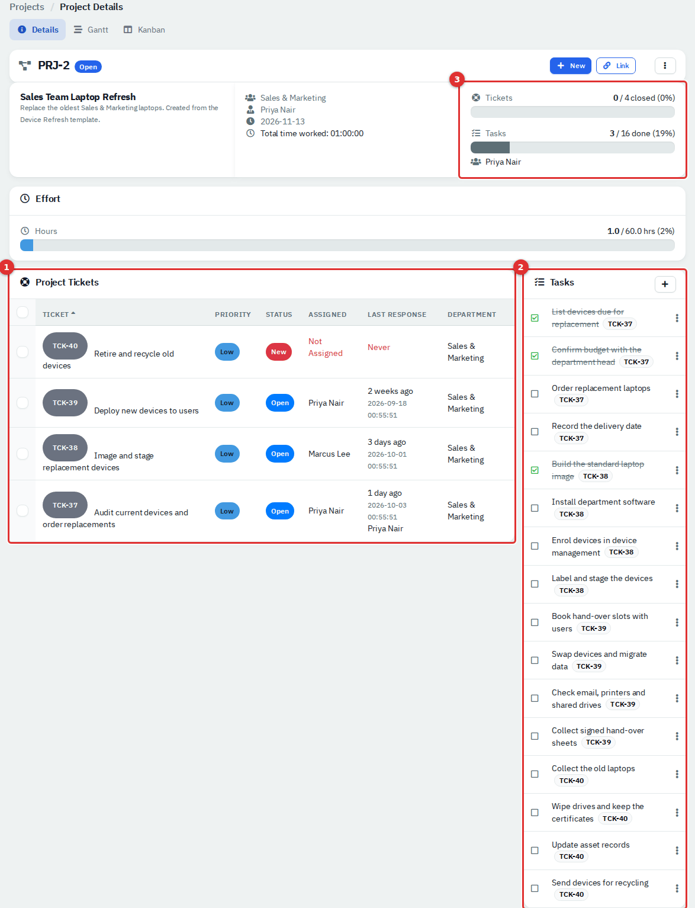

*Figure 5 — A project created from a template. (1) One ticket per ticket template. (2) One task per task template, each labelled with its ticket. (3) Progress.*

Things to know:

- The tickets start as **New** and unassigned, unless a default assignee is set under **Administration → Settings → Workflows → Ticketing** (**Default Ticket Assignee**). Assign them and set real priorities yourself.
- The task time estimates in the template are not copied to the new tasks.
- The template only supplies tickets and their tasks. Milestones, due dates and task owners are added by hand.

### Add milestones and tasks

Use a milestone to group tasks into a phase.

1. On the project page click **New → Milestone**. Enter a **Milestone Name**, optional **Description** and **Due Date**, and an **Order** (new milestones go to the end).
2. Click **New → Task**, or use **Add Task** in a milestone's **⋮** menu to pre-select that milestone.
3. Fill in the task form and click **Create**.

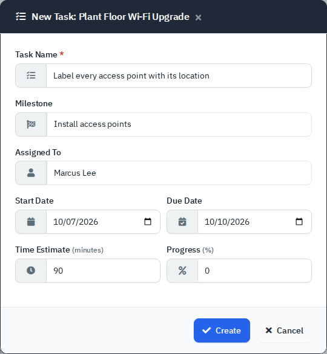

*Figure 6 — The New Task form.*

| Field | What it does |
|---|---|
| **Task Name** | Required. |
| **Milestone** | Puts the task under a milestone; otherwise it appears in **Tasks** or **Other Tasks**. |
| **Assigned To** | Any active user. The name shows on the Kanban board and in the task's edit form. |
| **Start Date**, **Due Date** | A task needs both to appear on the Gantt tab. |
| **Time Estimate (minutes)** | Counted as hours worked when the task is completed. |
| **Progress (%)** | 0 to 100. |

### Work through tasks

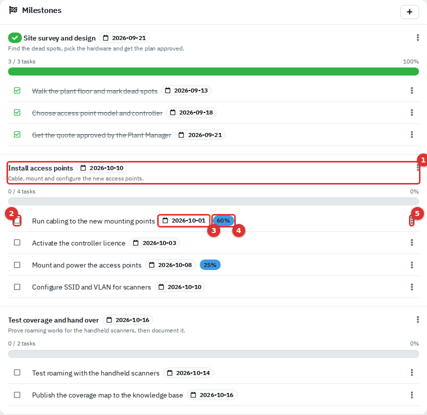

*Figure 7 — Milestones and tasks. (1) A milestone with its progress bar and **⋮** menu. (2) The tick box. (3) Due date. (4) Progress badge. (5) The task's **⋮** menu.*

- **Complete a task:** click its tick box. It is struck through and set to 100%. Click the ticked box to reopen it; progress returns to 0.
- **Edit a task:** **⋮ → Edit**. Change the owner, dates, estimate or progress here.
- **Turn a task into a ticket:** **⋮ → Create Ticket** opens the New Ticket form with the task name as subject. The task then shows a badge with the new ticket's number.
- **Complete a milestone:** **⋮ → Mark Complete** on the milestone (a confirmation asks **Are you sure?**). This does not tick its tasks. **Reopen** undoes it.
- **Delete:** **⋮ → Delete** on a task or milestone. Deleting a milestone keeps its tasks, which move to **Other Tasks**. Delete needs Full access; with Modify you are told your role needs full access.

The app does not colour overdue tasks. Compare the date badge with today's date.

Ticking a task that belongs to a ticket also adds a system note to that ticket and logs the task's time estimate as time worked; unticking it adds a one-minute note.

The page lists tasks in their saved order, then by the date they were created. Dragging cards on the Kanban board saves that order.

### Move work on the Kanban board

Open the **Kanban** tab.

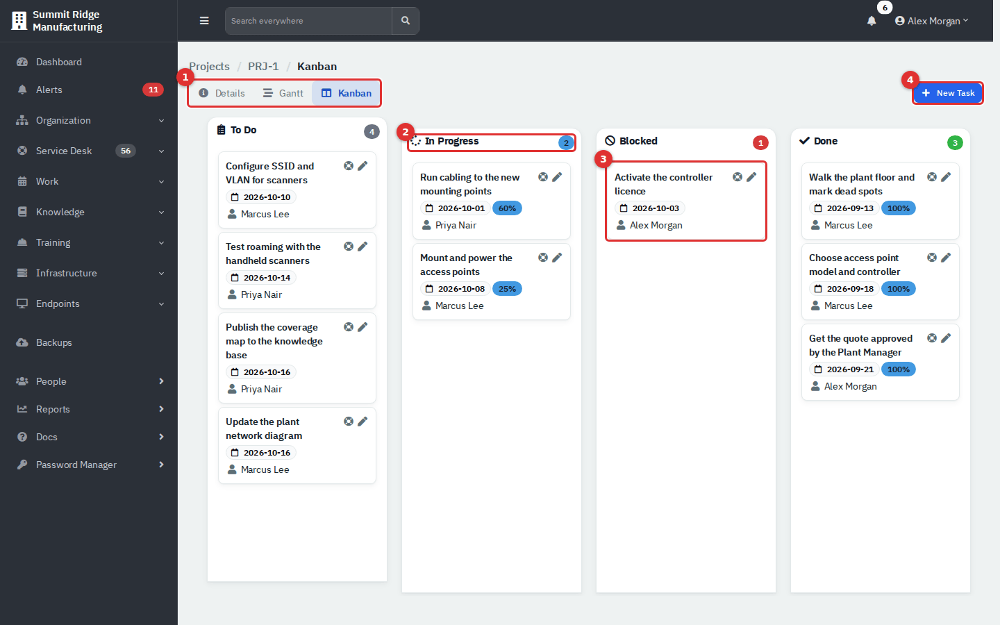

*Figure 8 — The Kanban board. (1) Tabs. (2) A lane and its count. (3) A task card. (4) **New Task**.*

1. Drag a card to another lane to change its status. The move saves at once (needs Modify).
2. Drag within a lane to reorder.
3. Use the pencil on a card to edit it, or the ticket icon to create a ticket from it.

| Lane | A task is here when |
|---|---|
| **To Do** | It has no status yet, or a status of To Do, and no progress. |
| **In Progress** | Its status is In Progress, or it has some progress. |
| **Blocked** | You dragged it to Blocked. |
| **Done** | It is completed, or you dragged it to Done. Dragging a card into **Done** completes the task; dragging it out reopens it. |

> **Note.** Unticking a task on the Details tab does not clear a status set by dragging. A card you dragged to **Done** stays in **Done** on the board after you untick it. Drag it to another lane instead.

### See the schedule on the Gantt tab

Open the **Gantt** tab and choose **Day**, **Week** or **Month**.

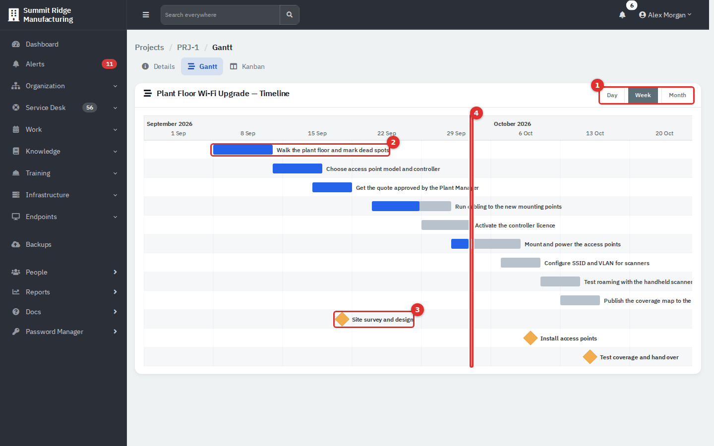

*Figure 9 — The Gantt tab. (1) Zoom. (2) A task bar; the dark part is progress. (3) A milestone diamond. (4) Today.*

Only tasks with both a start and a due date appear, along with milestones that have a due date. Drag a bar to move it, drag its ends to change the dates, or drag the progress handle. Changes save immediately and need Modify.

### Link tickets to a project

- **New → Ticket** creates a ticket already linked to the project.
- **Link → Open Ticket** lets you tick several open tickets that are not in any project yet. From the application-level page the list holds every department's tickets; from a department workspace it holds only that department's. Click **Link Ticket(s)**.
- **Link → Closed Ticket**: type the ticket number and click **Link Ticket**. The ticket must belong to the project's department. For a project with **No Department** the link is refused with "Cannot merge into that ticket."
- On a ticket, use **Edit** and its **Project** field, or the **Project** card, to change the project. Only open projects are offered.

### Close and archive a project

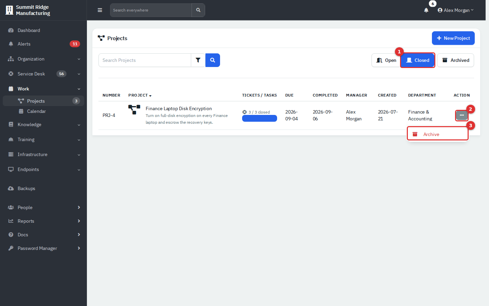

*Figure 10 — The Closed list with the **Action** menu open. (1) **Closed**. (2) **Action**. (3) **Archive**.*

1. **Close:** the **Close** button appears in the project header when every linked ticket is closed, or every linked ticket is resolved, or the project has no tickets. Tasks are not checked. Click **Close** and answer **Yes**. The project moves to **Closed**, shows its completion date, and can no longer be edited or added to.
2. **Archive:** in the **Closed** list open the **Action** menu and choose **Archive**, or use the **⋮** menu on the project page.
3. **Find archived projects:** click **Closed** and then **Archived**. **Archived** alone shows open archived projects, and there are none.
4. **Restore:** in the archived list choose **Restore**. The project returns to **Closed**.
5. **Delete:** in the archived list choose **Delete**. This removes the project for good. Its tickets are not deleted; they stay in the Service Desk. Delete needs Full access, and in this version the option is offered to administrators.

### Projects in a department workspace

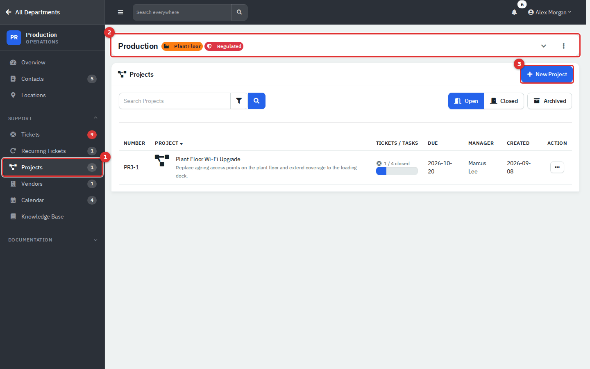

*Figure 11 — Projects in a department workspace. (1) **Projects** in the department sidebar, with its open count. (2) The department header. (3) **New Project**.*

The department's **Projects** page lists only that department's projects, without a **Department** column, and its **Gantt** and **Kanban** tabs stay inside the department. A project with **No Department** is not listed in any department; find it at **Work → Projects**.

## Common tasks: calendar

### Add a calendar

1. On **Work → Calendar** click **+** on the **Calendars** card.
2. Enter a **Name** and pick a **Color**, then click **Create**.
3. To rename or recolour it, open its **⋮** menu and choose **Rename**. **Delete** (Administrator role, Full access) also deletes every event in that calendar.

### Create an event

1. Click **New Event**, or open the calendar from a department workspace so the event belongs to that department.
2. On the **Event** tab choose the **Calendar**, enter a **Title**, and set **Start** and **End**. When you leave the start field the end moves to one hour later.
3. On **Details** add a **Location** and a **Description**.
4. On **Attendees** choose the **Department** the event is for. If outgoing mail is set up, **Email Event** also sends a notice to that department's primary contact.
5. Click **Create**.

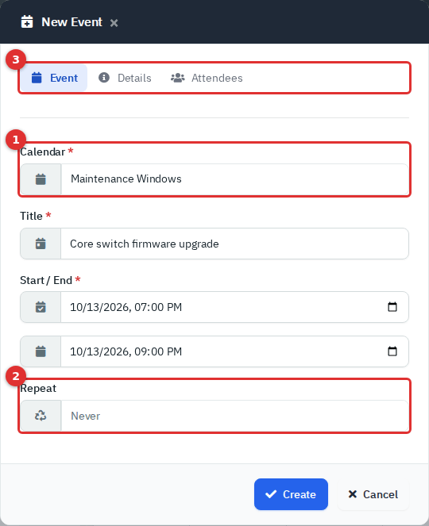

*Figure 12 — The New Event form. (1) **Calendar** decides the colour. (2) **Repeat** is disabled. (3) The **Event**, **Details** and **Attendees** tabs.*

The form has no all-day switch, reminders or attendee list. **Repeat** is greyed out and does not work in this version, so enter each occurrence of a weekly meeting as its own event. The calendar an administrator picks under **Administration → Settings → General → Defaults** (**Calendar**) is pre-selected.

### Change or delete an event

Clicking an event is meant to open **Editing: (title)** with **Save**, **Cancel** and **Delete**. In the version this guide was written against, clicking an event did not open the form, so events could not be edited or deleted from the calendar page. If it works in your installation, edit events from the department's own calendar: saving from the application-level calendar clears the event's department.

### Switch views and find things

- **month** shows up to three entries a day with a **+N more** link. **week** and **day** show a time grid, **list** shows the month as a list.
- Click a day number or a weekday name to jump to that day or week. Set the first day of the week under your **Preferences → Calendar starts on**.

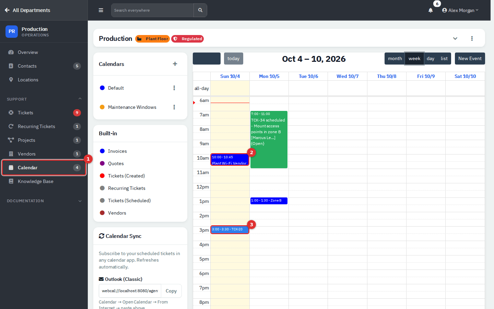

*Figure 13 — Week view in the Production workspace. (1) **Calendar** in the department sidebar; the count is that department's events. (2) An event you created. (3) A scheduled ticket visit in the technician's colour.*

The department calendar shows events linked to that department and that department's tickets. An event with no department appears only on the application-level calendar.

### What appears on the calendar by itself

| Entry | Meaning |
|---|---|
| Your events | In the colour of their calendar. |
| **Tickets (Created)** | One entry on each ticket's creation day, coloured by status: New red, Open blue, On Hold grey, any other status black. Click it to open the ticket. |
| **Tickets (Scheduled)** | Ticket appointments, drawn at their start and end times in the assigned technician's colour. Set your colour on your account page **Integrations → My Calendar Color**; without one the entry is red (past) or grey (future). |
| **Recurring Tickets** | The next run of each recurring ticket. |
| **Vendors**, **Departments** | The day each was added. **Departments** shows only at application level. |

The key also lists **Invoices** and **Quotes**. They belong to features that are not switched on in this edition and show nothing.

Project due dates, task due dates and milestones do not appear on the calendar. Use the Gantt tab for those. On a busy service desk the created-ticket entries crowd the month view; use the week view or a department calendar to see events clearly.

### Sync your schedule to another calendar app

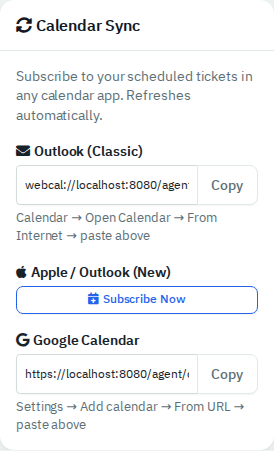

*Figure 14 — The **Calendar Sync** card on the calendar page.*

The **Calendar Sync** card gives you a personal subscription link. The calendar app reads it on its own schedule.

1. **Outlook (Classic):** click **Copy** under the first address, then in Outlook choose **Calendar → Open Calendar → From Internet** and paste it.
2. **Apple / Outlook (New):** click **Subscribe Now**.
3. **Google Calendar:** click **Copy** under the third address, then **Settings → Add calendar → From URL** and paste it.

The link carries only tickets assigned to you that have an appointment, from 30 days ago onward. Events you create on the calendar are not included. Anyone who has the link can read your schedule, and the page has no button to reset it, so keep it private. The address is built from the app's configured web address; a service such as Google can read it only if that address is reachable from the internet. These steps depend on your own Outlook, Apple or Google account and were not exercised in the demo.

**Outlook two-way sync setup (administrators).** A second option pushes ticket appointments into each technician's own Outlook calendar, and updates or cancels them when the schedule changes. It needs a Microsoft 365 or Azure account with admin rights and was not exercised in the demo.

1. Go to **Administration → Settings → Connections & data → Calendar sync**. Copy the **Redirect URI**.
2. In the Azure portal register an app (single tenant) with that redirect URI, and copy its **Application (client) ID** and **Directory (tenant) ID**.
3. Add the Microsoft Graph delegated permissions `Calendars.ReadWrite` and `offline_access`, then grant admin consent.
4. Create a client secret and copy its value.
5. Enter **Tenant ID**, **Application (Client) ID** and **Client Secret** in RivetIT and click **Save Credentials**. A **Sync appointments to Outlook** card then appears: choose a **Scope** (**Upcoming appointments only** or **All appointments (past & future)**) and click **Sync Now** to push existing appointments. Appointments without an assigned technician, or whose technician has not connected Outlook, are skipped.
6. Each technician opens their account pages, then **Integrations → Connect Outlook Calendar** and signs in to Microsoft once. **Disconnect Outlook Calendar** removes the link.

See [Administration: System Settings, Mail, Integrations and Maintenance](13-administration-settings.md) for the settings menu.

## Set up project templates (administrators)

A project template is an ordered list of ticket templates. Each ticket template carries its own task checklist.

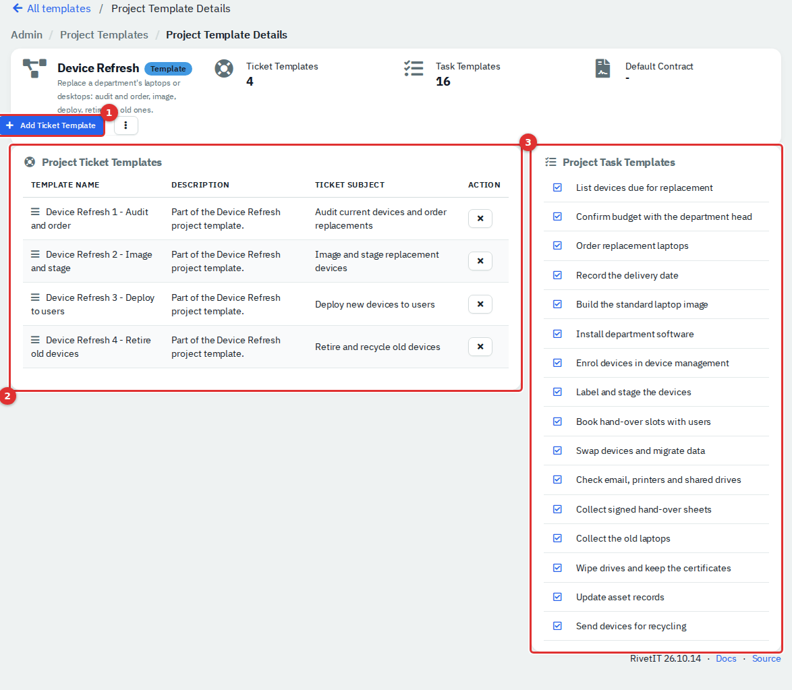

*Figure 15 — A project template. (1) **Add Ticket Template**. (2) Ticket templates in order. (3) All their tasks.*

1. Create the ticket templates and their tasks under **Administration → Templates → Ticket templates** (in the **Service desk** group; see [Administration: Ticketing, Automation and Organising Data](13b-administration-ticketing-and-automation.md)). Add tasks in the **Tasks** box on the ticket template's page.
2. Go to **Administration → Templates → Project templates** (in the **Documents & projects** group) and click **New Project Template**. Enter a name and description. **Default Contract Template** is optional.
3. Open the template and click **Add Ticket Template**. Pick a ticket template and an **Order** number. Repeat for each step. Drag the handle at the left of a row to reorder, or click **X** to remove one.
4. To change the project number, go to **Administration → Settings → Workflows → Projects** (the page is titled **Project Settings**) and edit **Project Prefix** and **Next Number**. Existing projects keep their numbers.

Changes to a template affect only projects created afterwards.

## Reference

| Project state | How it is set | Where it shows |
|---|---|---|
| Open | New projects | **Open** list, sidebar count |
| Closed | **Close** | **Closed** list (with a **Completed** date) |
| Archived | **Archive** on a closed project | **Closed** plus **Archived** |

| Task status | Set by |
|---|---|
| Done | Ticking the task, or dragging to **Done** |
| In progress / Blocked / To Do | Dragging on the Kanban board, or entering progress |

| Project header button | Shown when |
|---|---|
| **New**, **Link** | The project is open |
| **Close** | The project is open and all its tickets are closed or resolved, or it has none |
| **⋮ → Edit** | The project is open |
| **⋮ → Archive** | The project is closed and not archived |
| **⋮ → Delete** | The project is archived (administrators) |

## Tips and good practice

- Put every ticket for a job into the project as it is raised, so the progress bar means something.
- Give each task an owner and both dates. The Kanban card shows the owner, and the Gantt needs both dates.
- Use milestones for phases that end with a decision, such as "plan approved".
- Use a template for jobs you repeat, then add dates and owners on the first day.
- Log time on tickets. **Effort** and **Total time worked** are built from it.
- Close a project only when the work is done; you cannot edit it afterwards.
- Keep the Repeat limitation in mind: create maintenance windows for the whole month in one sitting.

## Related guides

- [Getting started](01-getting-started.md) for the app-level, department and company-wide views.
- [Service Desk](03-service-desk.md) for tickets, appointments and recurring tickets.
- [Administration: Ticketing, Automation and Organising Data](13b-administration-ticketing-and-automation.md) for ticket templates.
- [Administration: System Settings, Mail, Integrations and Maintenance](13-administration-settings.md) for modules and defaults.
- [Administration: Users, Roles and Security](12-administration-users-and-security.md) for who gets Modify or Full access.
