# Knowledge Base

The Knowledge Base is where IT keeps how-to articles, runbooks and quick fixes. Agents use it to solve the same problem the same way every time. Employees use the same articles, the ones you choose to share, through the Department Portal to help themselves before they open a ticket.

| | |
|---|---|
| **Where to find it** | Sidebar → **Knowledge** → **Knowledge Base**. Inside a department workspace it is **Knowledge Base** in that department's own sidebar. Administrators also have **Administration** → **Knowledge Base** for settings and the archive. |
| **Who can use it** | Role permission **Knowledge base**: **Read** to browse and read articles, attachments and version history. **Modify** to write, edit, import, manage categories, set review dates, upload attachments and restore old versions. **Full** to also delete articles, attachments and categories. The built-in Technician role has no Knowledge base access until an administrator grants it (see [Administration: users and security](12-administration-users-and-security.md)). |
| **Turn it on** | **Administration** → **Knowledge Base** → **Enable the Knowledge Base**. It is on in a new installation. Turning it off hides the Knowledge Base for agents and employees; existing articles are kept. |

## What it's for

- Write a fix once, and let every agent find it later.
- Share the safe articles (printing, passwords, VPN) with employees, so fewer tickets arrive.
- Keep internal runbooks, such as firewall changes or laptop imaging, visible to agents only.
- Bring in documents you already have by importing Word, PDF or HTML files.

There is no draft or published status. An article is live for everyone who may see it as soon as you save it. To keep it away from employees, set **Visible to Department Portal** to **No**. To take it out of use without losing it, archive it (see [Archive or delete an article](#archive-or-delete-an-article)).

## A quick tour

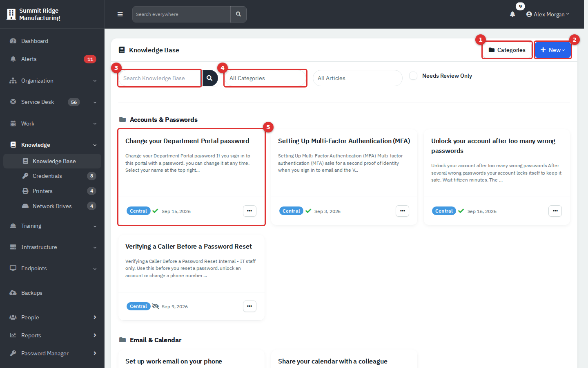

*Figure 1 — The Knowledge Base list. Articles are grouped under their category.*

1. **Categories** manages the category list (Modify or higher).
2. **New** opens a menu: **Article**, or **Import** from **Word Doc**, **PDF** or **HTML**.
3. **Search Knowledge Base** looks in article titles and in the article text.
4. The category filter narrows the list to one category, or to **Uncategorized**. At the app level a second filter, **All Articles**, limits the list to **Central (Company-wide)** articles or to one department.
5. Each article is a card: title, a short preview, the scope badge, a portal icon and the date it last changed. The **...** menu offers **View**, **Edit** and **Delete**.

On each card the badge shows the **scope**. **Central** means the article belongs to the whole company and appears in every department's list. A department name means only that department sees it. A green tick means employees can see it in the portal; a crossed-out eye means it is hidden from them and agents only. **Needs Review** appears when the review date has passed.

The list shows ten articles per page, ordered by category name and then title. Use **Needs Review Only** to list only the articles that are overdue for a check.

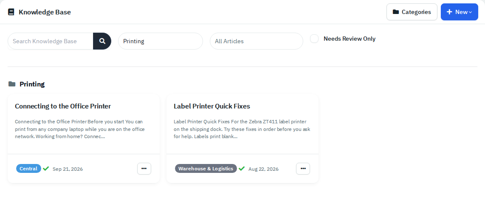

*Figure 2 — Filtered to one category. The first article is Central; the second belongs to Warehouse & Logistics only.*

## Common tasks

### Find an article

1. Type words from the title or the text into **Search Knowledge Base** and press Enter.
2. Or pick a category in the category filter.
3. Select the title of the card to open the article.

The **Search everywhere** box at the top of every page also finds articles, alongside tickets, people and credentials.

### Read an article

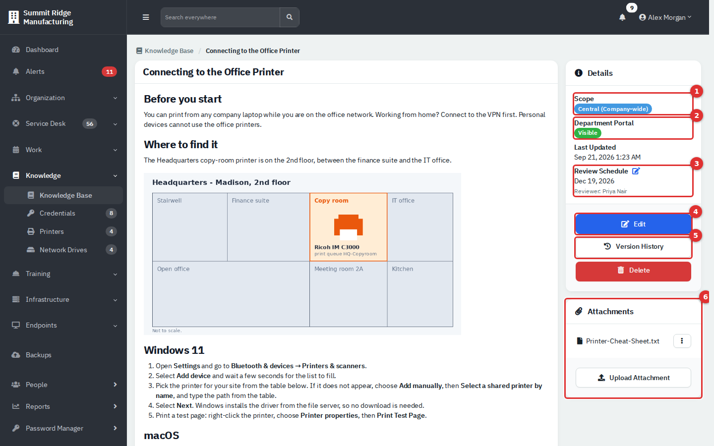

*Figure 3 — An article. The Details panel on the right controls who sees it and when it is next checked.*

The article text is on the left. In the **Details** panel:

1. **Scope** shows **Central (Company-wide)** or the department that owns the article.
2. **Department Portal** shows **Visible** or **Hidden**.
3. **Review Schedule** shows the date the article should next be checked and the reviewer. Select the pencil to change it.
4. **Edit** opens the editor.
5. **Version History** lists earlier versions.
6. **Attachments** lists files attached to the article. Each has **View**, **Download** and **Delete** in its menu.

### Create an article

1. Select **New** → **Article**. Inside a department workspace the department is already chosen.
2. Enter a **Title**.
3. Choose the **Department**: **Central (Company-wide)** for everyone, or one department.
4. Choose a **Category**, or leave **Uncategorized**.
5. Set **Visible to Department Portal** to **Yes** to share with employees, or **No** to keep it internal. New articles default to **Yes**, so check this every time.
6. Write the content, then select **Create Article**.

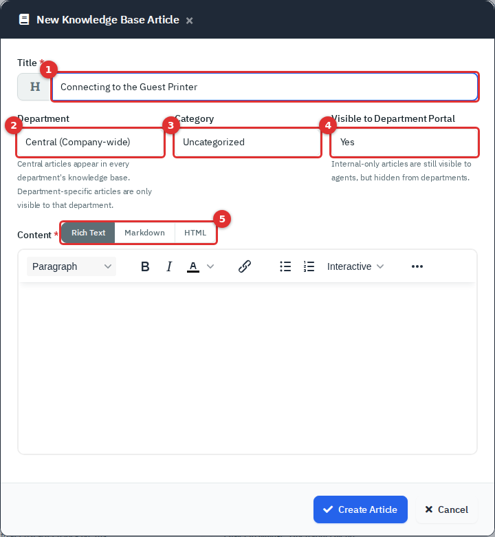

*Figure 4 — New article. (1) Title, (2) Department, (3) Category, (4) portal visibility, (5) editor mode.*

The editor has three tabs above it (5). **Rich Text** is the normal editor with headings, bold, italic, colour, links, lists, tables, code and full-screen. **Markdown** and **HTML** let you type or paste source; the app converts between them when you switch tabs. The **Markdown** tab is unavailable for an article that contains interactive blocks, because Markdown cannot hold them; use the **HTML** tab instead.

The toolbar also has a **Reword** button. It asks the AI provider set up by your administrator to rephrase the text. It only works when AI is configured; this guide could not test it.

**Adding pictures.** The picture button lets you type the address of an image that already exists. Its **Upload** tab does not work in this version: the spinner never finishes and the picture is not added. To get pictures into an article, import a Word, PDF or HTML file that contains them, or attach the image file to the article.

### Add interactive blocks

The **Interactive** button in the toolbar turns plain text into something readers can work through.

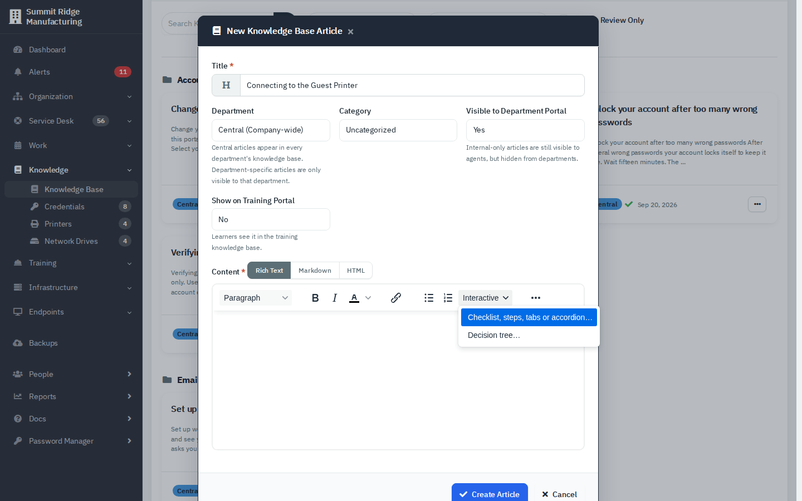

*Figure 5 — The Interactive menu.*

- **Checklist, steps, tabs or accordion** turns a list, or a new block, into tick boxes that remember each reader's ticks, guided steps with **Next** and **Back**, tabs, or collapsible sections.
- **Decision tree** builds a question-and-answer flow that ends in an answer.
- **Add a Copy button to this code block** puts a **Copy** button on a code block, handy for commands.

Ticks and step positions are saved per reader, for agents and for employees in the portal. The app also notices when a step's wording has changed since someone ticked it and marks that tick.

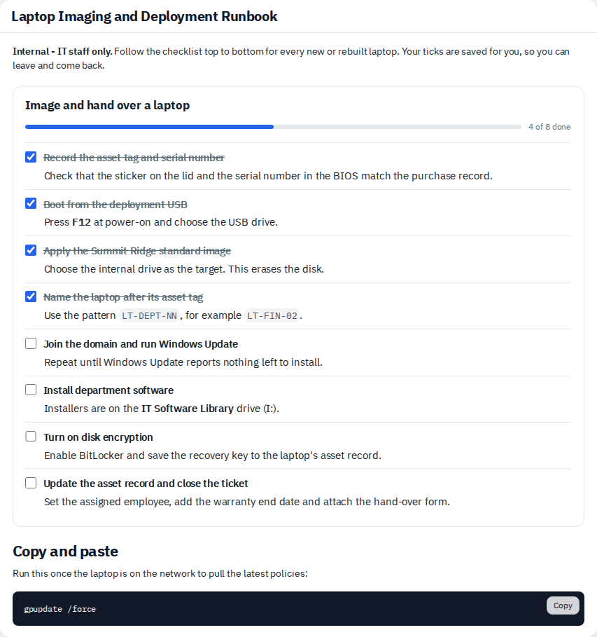

*Figure 6 — A checklist. The progress bar shows how many steps this reader has ticked. The Copy button sits on the code block.*

### Import a Word, PDF or HTML file

Select **New** and pick an option under **Import**.

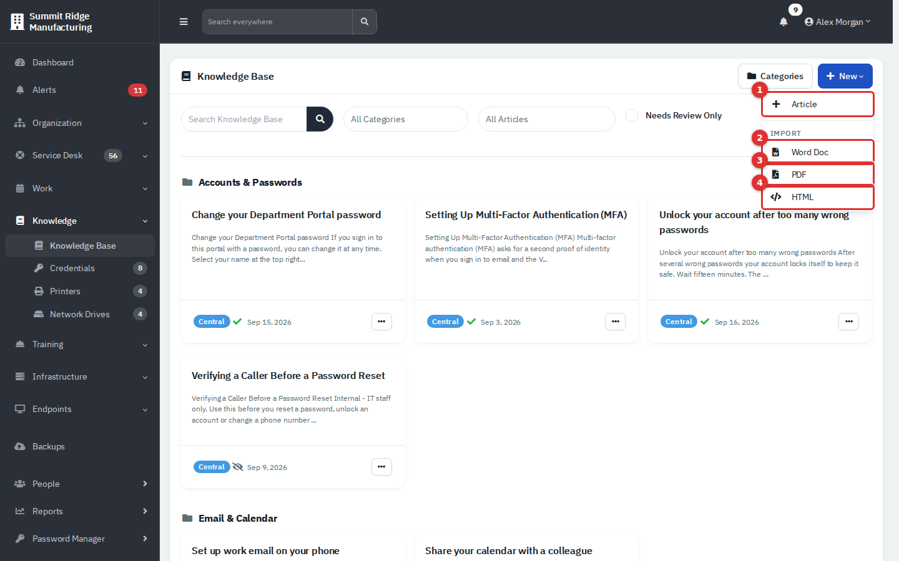

*Figure 7 — The New menu. (1) Article, (2) Word Doc, (3) PDF, (4) HTML.*

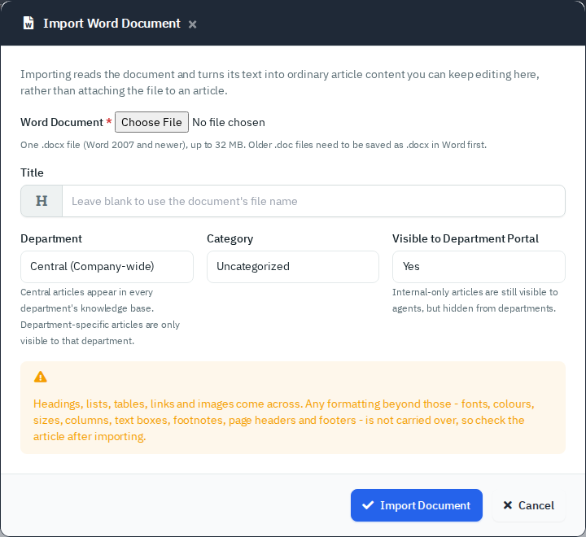

*Figure 8 — Import Word Document. Title, department, category and portal visibility work as they do for a new article.*

1. Choose the file. Leave **Title** blank to use the file name.
2. Set **Department**, **Category** and **Visible to Department Portal**.
3. Select **Import Document** (or **Import PDF**, **Import**), and open the new article to check it.

What to expect:

| Import | Limits | What comes across |
|---|---|---|
| **Word Doc** | One `.docx` file (not the old `.doc`), up to 32 MB or your server's upload limit if that is lower; up to 100 pictures | Headings, lists, tables, links and pictures. Fonts, colours, columns, text boxes, footnotes and page headers and footers are dropped. |
| **PDF** | Up to 32 MB and 200 pages; longer files are cut off at page 200 | Text, bold, italic, headings, lists and pictures. Tables and columns become plain paragraphs. A scanned PDF with no text cannot be imported (there is no OCR); attach it instead. Needs the `poppler-utils` package on the server, and the dialog says so when it is missing. |
| **HTML** | One `.html` or `.htm` file, up to 50 MB; only the page itself (pictures saved in a folder beside it do not come across) | **Convert** makes editable article text and turns collapsible sections, tabs and task lists into interactive blocks. **Keep the whole page, running, in a sandboxed frame** keeps a calculator or form intact; it needs a name and a one-line description so people can find it. Scripts are removed when converting. |

The file itself is not kept, only the converted article. Always read the result: warnings from the importer appear in the green or yellow message after the import. The PDF dialog's heading currently reads "Import Word Document" even though it is the PDF importer.

### Attach a file

1. Open the article and select **Upload Attachment** in the **Attachments** card.
2. Choose a file and select **Upload**.

Common types are accepted: images, PDF, text, Word, Excel, PowerPoint, OpenDocument, CSV, ZIP, audio and video, and `.ovpn`. The file is limited by your server's upload size. Employees see the attachments of a portal-visible article with **View** and **Download**. Deleting an attachment needs Full access.

### What readers need to know about pictures and attachments

Pictures inside an article and attachments are not public web addresses. They load through a protected address and the app checks, every time, that the reader is signed in, has Knowledge base access and may see the article's department. In practice:

- A picture or attachment link copied out of an article does not work for someone who is signed out or lacks access.
- Employees see pictures and attachments through the portal, and only for articles that are **Visible** to their department.
- Do not save a picture's address somewhere else and expect it to keep working.

### Link a credential from an article

Type `[[credential:` followed by the credential's number and `]]` where the button should appear, for example `[[credential:132]]`. Agents then see a **Reveal linked credential** button that opens the credential (see [Credentials, printers and network drives](05b-credentials-printers-network-drives.md)). The credential's own permissions still apply. The number is not shown on the Credentials page; administrators can read it from the API (**Administration** → **API Docs**).

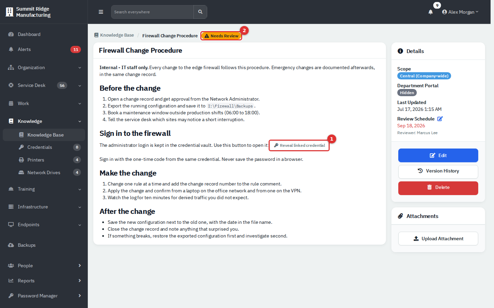

*Figure 9 — (1) The **Reveal linked credential** button. (2) The **Needs Review** badge.*

Only use this in internal articles. The employee portal does not turn the token into a button, so employees would see the raw `[[credential:...]]` text.

### Edit an article

1. Open the article and select **Edit**, or use **...** → **Edit** on the card.
2. Change the fields or the text, then select **Save Changes**.

Every save first stores the previous text as a version (see below).

### Set a review date

1. In the **Details** panel select the pencil next to **Review Schedule**.
2. Choose a **Review Due Date** and a **Reviewer**, then **Save**.

After that date the card and the article show **Needs Review**. Use **Needs Review Only** on the list to find them. The flag clears when you set a review date in the future, so set a new date after you check the article.

### Use version history

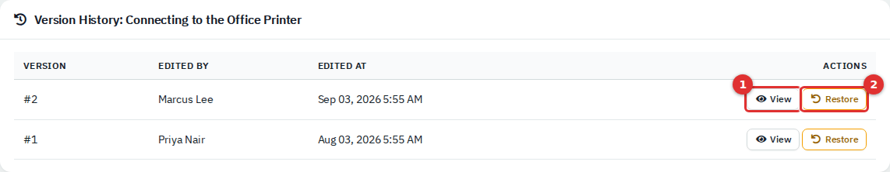

*Figure 10 — Version history. (1) View opens a read-only copy, (2) Restore brings it back.*

Each time someone saves an edit, the app stores the text the edit replaced as a numbered version. The list shows the version number, who saved the edit, and when. The current article is not in the list; it is always newer than version 1.

1. Select **Version History** on the article.
2. Select **View** to read an old version.
3. Select **Restore** and confirm to bring the text back.

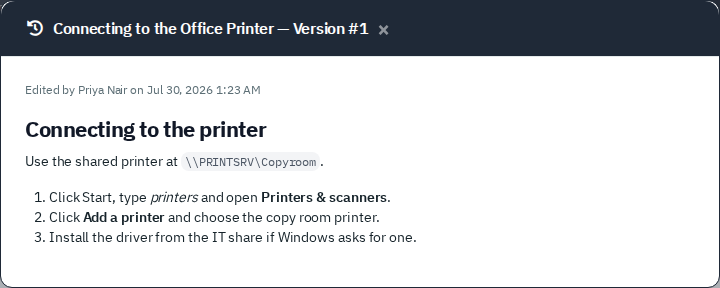

*Figure 11 — Viewing version 1.*

Restore only replaces the article text. The title, department, category and portal visibility stay as they are. The text you are replacing is saved as a new version first, so a restore can itself be undone.

### Manage categories

Select **Categories** on the list.

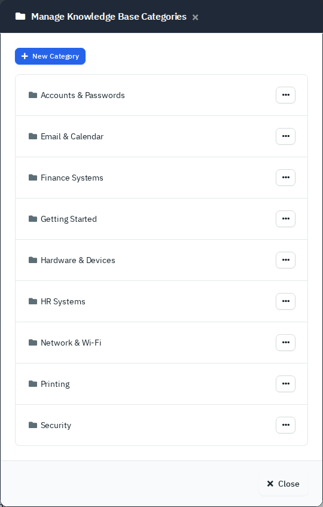

*Figure 12 — Categories. Each row has an **Edit** and a **Delete** action in its **...** menu.*

1. Select **New Category**.
2. Enter a **Name**. **Parent Category** and **Department** are optional; **Department** defaults to **Central (Company-wide)**.
3. Select **Create Category**.

The list still groups articles by the category they are in; the parent only organises the category dialog. Deleting a category needs Full access; its articles move to **Uncategorized**.

### Archive or delete an article

The **Delete** button on an article, and **Delete** in the card menu, do not erase anything. They archive the article: it disappears from the agent list, the portal, search and the API, and its text, attachments and versions stay on disk. Deleting needs Full access. The message says "deleted", but nothing is lost.

Administrators can bring an article back or remove it for good under **Administration** → **Knowledge Base**, where the **Archived** number opens the archive.

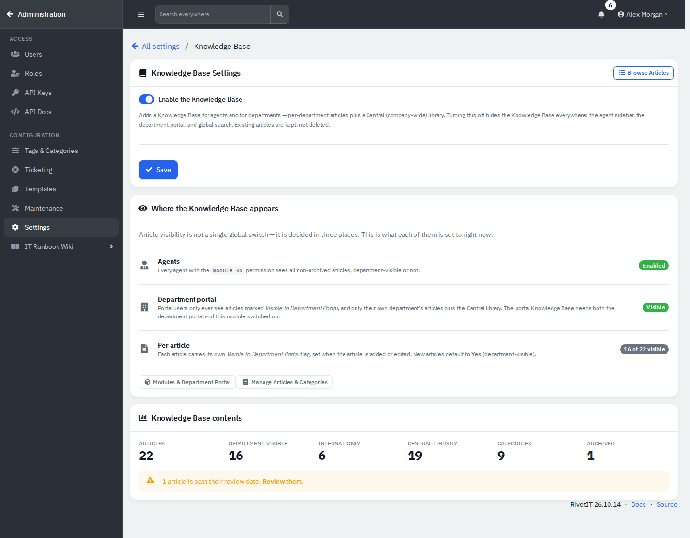

*Figure 13 — Administration → Knowledge Base. It shows the on/off switch, where articles appear and counts for articles, portal-visible, internal, Central, categories and archived.*

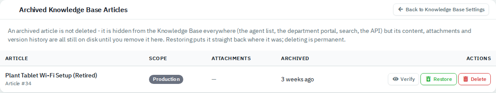

*Figure 14 — Archived articles. **Verify** previews the text, **Restore** puts the article back exactly where it was, **Delete** removes it permanently with its attachments and versions.*

Permanent deletion cannot be undone.

## How employees find articles

Employees open **Knowledge Base** in the Department Portal (see [Employee portal](11-employee-portal.md)). They see an article only if all of these are true: it is **Visible** to the portal, it is **Central** or belongs to their own department, and it is not archived. Internal articles do not appear, and opening their address sends the employee back to the list.

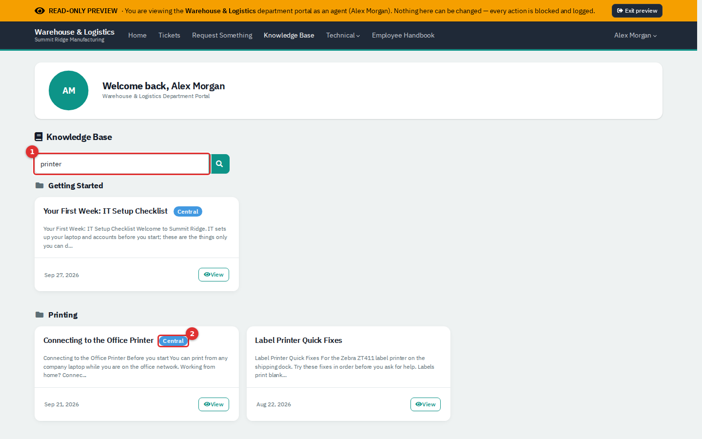

*Figure 15 — The portal, shown here through **Administration** → **Settings** → **Portal Preview**. (1) The search box. (2) The **Central** badge marks company-wide articles; the department's own article carries no badge.*

## Reference

| Field | Meaning |
|---|---|
| **Title** | Up to 255 characters. |
| **Department** | **Central (Company-wide)** or one department. Agents restricted to some departments cannot open articles of other departments. |
| **Category** | One category, or **Uncategorized**. |
| **Visible to Department Portal** | **Yes** shows the article to employees of the department (or every department if Central). **No** keeps it for agents. |
| **Review Due Date / Reviewer** | Optional. After the date the article is flagged **Needs Review**. |
| **Version** | Number and time of an earlier saved text. |
| **Archived** | Hidden from every list; restorable by an administrator. |

| Action | Permission level |
|---|---|
| Read articles, view versions, view or download attachments | Read |
| Create, edit, import, set review, categories (create or edit), upload attachment, restore version | Modify |
| Delete (archive) an article, delete an attachment, delete a category | Full |
| Archive page, Knowledge Base settings | Administrator |

## Tips and good practice

- Write for the reader. Start with what they want to do, then give numbered steps.
- Decide visibility when you create the article. A runbook with a firewall change plan belongs in **No**.
- Put a **Review Due Date** on anything that names a product, version or price, and follow up on **Needs Review**.
- Use **Central** unless only one department cares. Department articles keep other departments' lists short.
- Try an import on a copy first and read the result. Imports keep headings and lists reliably, other layout only sometimes.
- Prefer attaching large or scanned files over importing them.

## Related guides

- [Credentials, printers and network drives](05b-credentials-printers-network-drives.md)
- [Employee portal](11-employee-portal.md)
- [Administration: users and security](12-administration-users-and-security.md)
- [Administration: settings](13-administration-settings.md)
