# Credentials, Printers and Network Drives

These three lists are IT's shared reference for things people ask about every day. **Credentials** is an encrypted vault for logins, API keys and one-time-code secrets. **Printers** records each printer's address, model and location. **Network Drives** records which shared folder is mapped to which drive letter.

| | |
|---|---|
| **Where to find it** | Sidebar → **Knowledge** → **Credentials**, **Printers** or **Network Drives** (the company view). Inside a department workspace, the same three items are under **Documentation** in that department's sidebar. |
| **Who can use it** | **Credentials**: role permission **Credentials**. **Read** views and copies passwords and one-time codes, **Modify** adds, edits, moves and archives, **Full** deletes. The menu item also needs **Tickets, assets & docs** at Read or higher. **Printers** and **Network Drives**: role permission **Tickets, assets & docs**. **Read** views, **Modify** adds, edits and archives, **Full** deletes. |
| **Turn it on** | The **IT Documentation** module must be on (**Administration** → **Settings** → **Modules** → **Show IT Documentation**). It is on in a new installation. |

## What it's for

- Find a password, a device's management address or a printer's IP in seconds, without asking a colleague.
- Keep passwords out of spreadsheets and chat.
- Answer "which drive letter is the finance share?" from a list instead of from memory.

## A quick tour

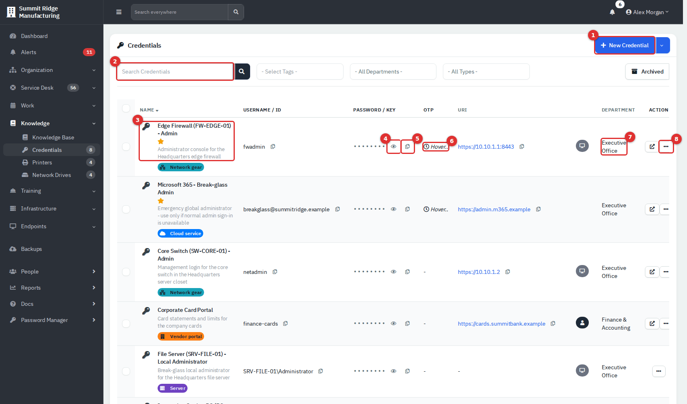

*Figure 1 — Credentials. The company view lists every department's credentials, with a Department column. Numbers 3 to 8 point at the first row.*

1. **New Credential** opens the form. The small arrow beside it holds **Export**. (The department workspace adds **New Folder** and **Import**.)
2. **Search Credentials** looks in the name, description, address, tag and department name. Beside it are filters for tags, department and type (**Login** or **API Key**).
3. The **Name** cell holds a key icon, the name, a star for a favourite, an **API Key** badge for that type, the description and the tags. Select the name to open the credential dialog.
4. The eye button opens a small pop-up with the password.
5. The copy button beside the eye copies the password without showing it.
6. **Hover..** in the OTP column shows the current six-digit code while the pointer rests on it.
7. The department name opens that department's own list.
8. The **...** menu holds **Edit**, **Move**, **Archive** and, in a department workspace, **Share**.

Starred credentials sort to the top. The username and the address each have their own copy button, and the arrow-out button in the **Action** column opens a menu with the address links, which open in a new tab. Select a tag under the name to filter the list by it. The small circle icons after the address link to the related contact or asset. Select the **Name** or **URI** heading to sort.

## The vault, in plain words

Every username, password and one-time-code secret is encrypted before it is saved. The whole vault is locked with **one master key**. Nobody types that key day to day. Instead:

- Each person has a **personal copy** of the master key, locked with a key made from their own password.
- When you sign in **with your password**, the app unlocks your copy and keeps it for your session. While it is unlocked you can view, copy and add credentials. The unlock lasts as long as your sign-in session (**Session Lifetime** in **Administration** → **Settings** → **Security**; at least 30 days, 43,200 minutes, and at most 90 days).
- If the unlock is missing, the page says **Credential vault is locked for this session - sign in with your password to view, copy, or add credentials.** and **New Credential** is disabled. Sign out and back in with your password.

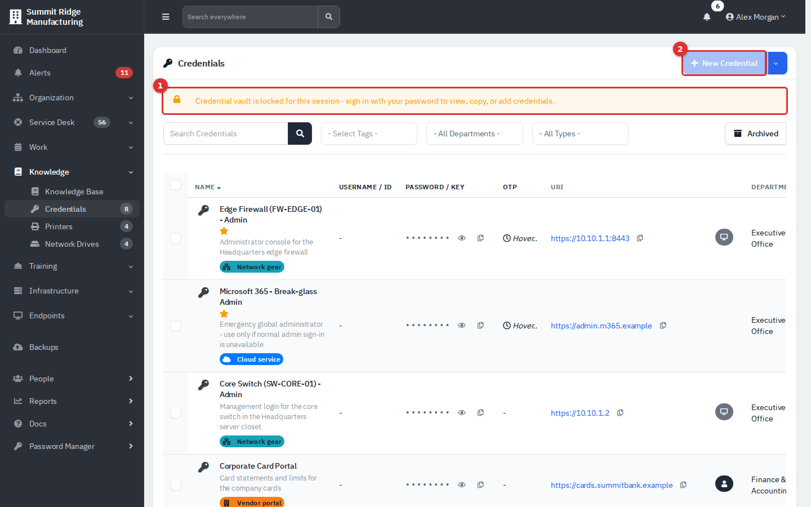

*Figure 2 — A locked vault. (1) The warning. (2) New Credential is greyed out.*

**Changing your password** is safe. When you change it from your profile, the app re-locks your personal copy with the new password, and then signs you out. Nothing is re-encrypted and no credential is lost. When an administrator resets someone else's password, the administrator's own vault must be unlocked, because it is the administrator's unlocked copy that is handed to the other person.

**No personal copy?** A person who has none (for example a new or restored user) gets one automatically at their next password sign-in, as long as the administrators have stored the company copy of the key described below. If you still see **Credential encryption is not set up for your account. Ask an administrator to reset your password under Admin > Users to enable this.**, ask an administrator to reset your password.

**Signing in with a passkey** cannot unlock the vault by itself, because a passkey has no password to unlock the copy with. It works when an administrator has established the company copy of the key, or when that browser still holds the unlock from an earlier password sign-in. Sign in with your password when in doubt.

### The master key and who can retrieve it

Administrators keep an encrypted company copy of the master key under **Administration** → **Settings** → **Security** → **Vault Encryption**. It is what lets the app give a returning user a fresh personal copy. **Re-establish from my session** replaces it with the key from your own unlocked session; you rarely need it.

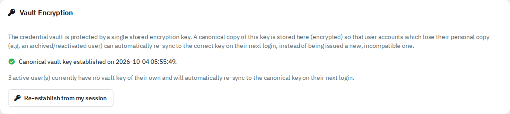

*Figure 3 — Vault Encryption. It says when the company copy was set and how many active users have no personal copy yet.*

Only an administrator can read the master key itself: **Administration** → **Maintenance** → **Backups**, card **Encryption Key Backup**. Enter **your own** account password and select **Reveal**. The key is shown once on screen, and the app records who revealed it and tells administrators.

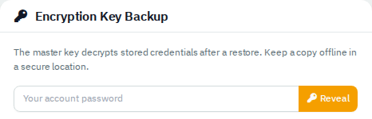

*Figure 4 — Encryption Key Backup.*

Copy the key and keep it offline in a safe place. You need it to read credentials from a backup after moving to a new server, and anyone who has the key plus a copy of the database can read every credential. If you lose a live credential, **Credential Restore** can bring it back from a backup:

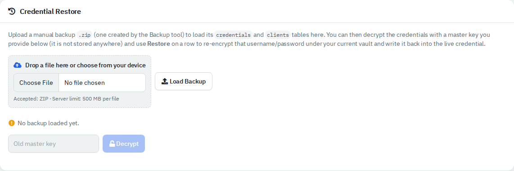

*Figure 5 — Credential Restore (**Administration** → **Maintenance** → **Credential restore**).*

1. Select **Choose File**, pick a manual backup `.zip` made by the Backup tool, and select **Load Backup**.
2. Enter the master key that was in use when the backup was made and select **Decrypt**.
3. Search the list and select **Restore** on the row you need. The username and password are re-encrypted under your current vault and written back to the live credential.

## Common tasks

### Add a credential

1. Select **New Credential**. In a department workspace the department is already set; in the company view choose a **Department**.
2. Choose the **Type**: **Login** or **API Key**.
3. Enter a **Name**. Select the star to mark it as a favourite.
4. Fill in the fields you have, then select **Create**.

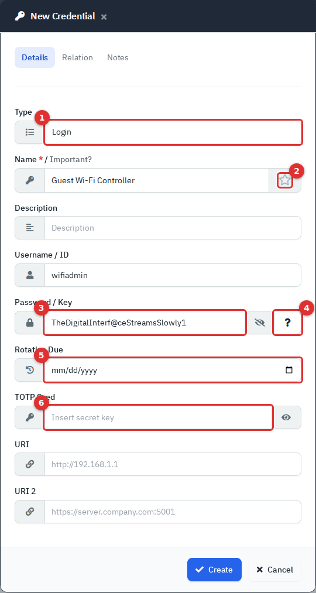

*Figure 6 — New Credential, Details tab. (1) Type. (2) Favourite star. (3) Password. (4) Generate. (5) Rotation Due. (6) TOTP Seed.*

| Field | What to enter |
|---|---|
| **Type** | **Login** for a user name and password. **API Key** for a key or token (see below). |
| **Name** (required) | What you would search for. Include the device or system. |
| **Description** | One line about what it is for. |
| **Username / ID** | The sign-in name. Stored encrypted. |
| **Password / Key** (required) | The secret. The eye shows or hides it. The **?** button (4) fills in a generated password: a readable phrase with a number and a swapped symbol. |
| **Rotation Due** | The date the password should be changed. Feeds the **Credential rotation due** report (see [Dashboard and reports](10-dashboard-and-reports.md)). |
| **TOTP Seed** | The secret key behind a two-factor code, only for **Login**. When the service shows a QR code, choose its "enter the key manually" option and paste that key here. Stored encrypted. |
| **URI** and **URI 2** | Web addresses or management URLs. They become links and copy buttons. |
| **Relation** tab | **Contact** and **Asset** links. Only offered in a department workspace, and only lists that department's people and assets. |
| **Notes** tab | Free-text notes and **Tags**. The **+** button beside **Tags** creates a credential tag. |

Choosing **API Key** relabels the form and hides the one-time-code field, because a key is not used with a code:

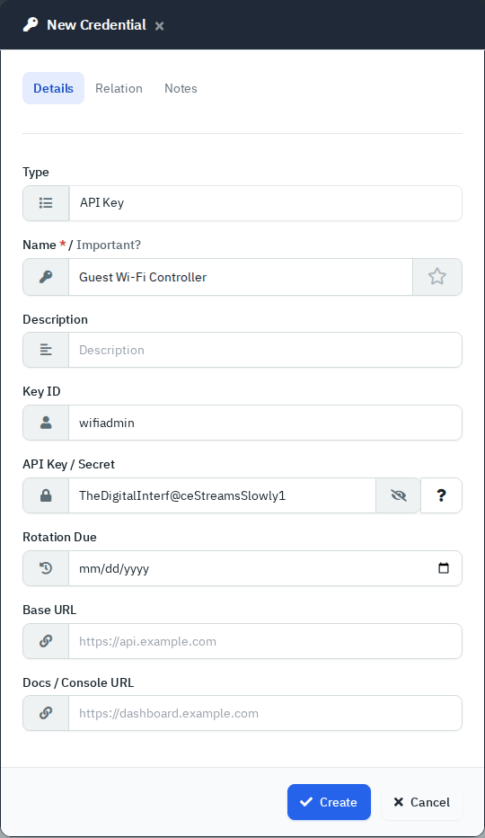

*Figure 7 — With **API Key** selected the fields become **Key ID**, **API Key / Secret**, **Base URL** and **Docs / Console URL**.*

An **API Key** credential shows an **API Key** badge beside its name in the list and in the credential dialog, and the type filter above the list picks them out.

Never put a real password into an example, ticket or screenshot. Everything in this guide is made up.

### Look up a password or a one-time code

1. Find the credential with the search box or a filter.
2. To copy the password without seeing it, select the copy button beside the dots.
3. To read it without opening anything, select the eye button beside the dots. A small pop-up shows the password above the button and closes when you click elsewhere.
4. To see everything about the credential, select its **name**. The dialog opens. Select the eye to show the password; each copy button copies that field.
5. For a one-time code, rest the pointer on **Hover..** in the OTP column of the list. The six-digit code replaces it and changes every 30 seconds.

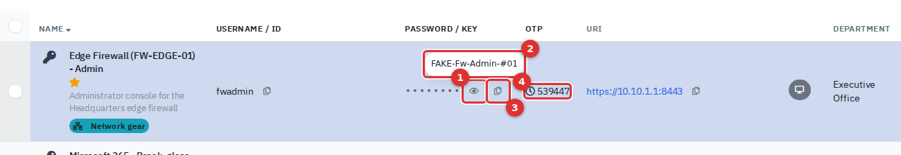

*Figure 8 — (1) The eye button. (2) The pop-up it opens with the password. (3) The copy button. (4) The code shown while hovering.*

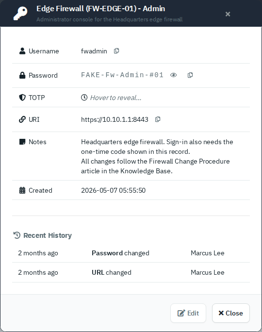

*Figure 9 — The credential dialog: username, password, TOTP, address, notes and recent history. Username, password and address each have a copy button.*

In the dialog, the TOTP row reads **Hover to reveal...** but the code appears in the list row behind the dialog, not in the dialog. Read the code from the list.

Opening a credential and showing a one-time code are both recorded, so administrators can see who looked at what. Look things up when you need them.

### Edit, move or archive a credential

1. Select **...** on the row, then **Edit**. The **Details**, **Relation** and **Notes** tabs match the add form. **History** lists who changed which field and when. It never shows old or new passwords, only that the password changed.
2. Select **Save**. Changing the password also updates the **password changed** date. The app keeps no screen to undo a wrong password, so copy the old one first if unsure.
3. **Move** puts the credential in another folder of the same department (workspace only).
4. **Archive** hides it from the list. Select the **Archived** button above the list to see archived credentials, then **Restore** to bring one back.
5. **Delete** appears only for archived credentials, needs Full access, and is permanent.

Tick several rows to get **Bulk Action** with **Favorite**, **Unfavorite**, **Assign Tags**, **Archive** and, in a department workspace, **Move**. In the **Archived** view the bulk actions are **Restore** and **Delete**.

### Work in a department workspace

Open a department (**Organization** → **Departments**) and select **Credentials** under **Documentation**.

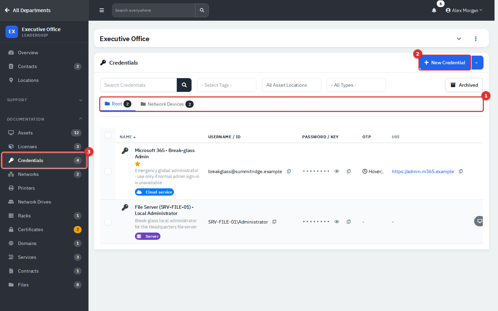

*Figure 10 — A department workspace. (1) Folder tabs. (2) New Credential. (3) The department's own sidebar.*

The workspace shows only that department's credentials. Compared with the company view it adds:

- **Folders.** The **Root** tab and one tab per folder, each with a count. Use **New Folder** in the **New Credential** menu, and the **...** at the right of the tab row to rename a folder. An administrator can delete an empty folder.
- **Relation** tab in the form, to tie a credential to a contact or an asset from that department.
- **All Asset Locations** filter.
- **Import** and **Export** of CSV, and **Share** in the row menu.

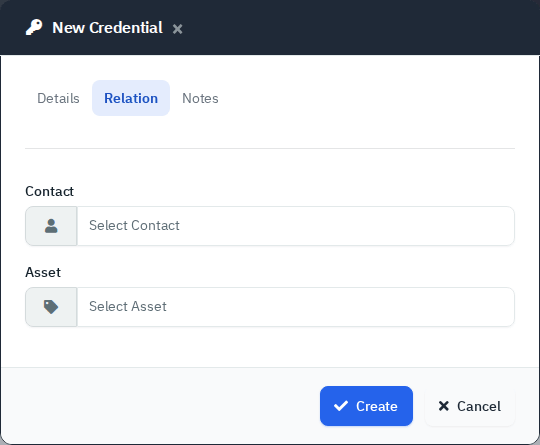

*Figure 11 — The Relation tab.*

Access limits apply everywhere. If an administrator has limited you to certain departments, you only see and open the credentials of those departments, in every view.

**Import** takes a CSV with the columns Name, Description, Username, Password, TOTP, URI (a sample file is linked in the dialog). A name that already exists in that department is skipped. **Export** downloads a CSV of the department's active credentials with the **usernames, passwords and one-time secrets in plain text**. Treat the file like a password and delete it after use.

**Share** creates a secure link, with an expiry of 1 hour, 1 day, 1 week or 1 month and an optional **Delete after view**. If you choose a person and mail is set up, the app emails them the link, so check the address first. Shared credentials show **Shared** in the list until the link expires.

### Link a credential from a Knowledge Base article

An internal article can show a **Reveal linked credential** button. See [Knowledge Base](05-knowledge-base.md).

## Printers

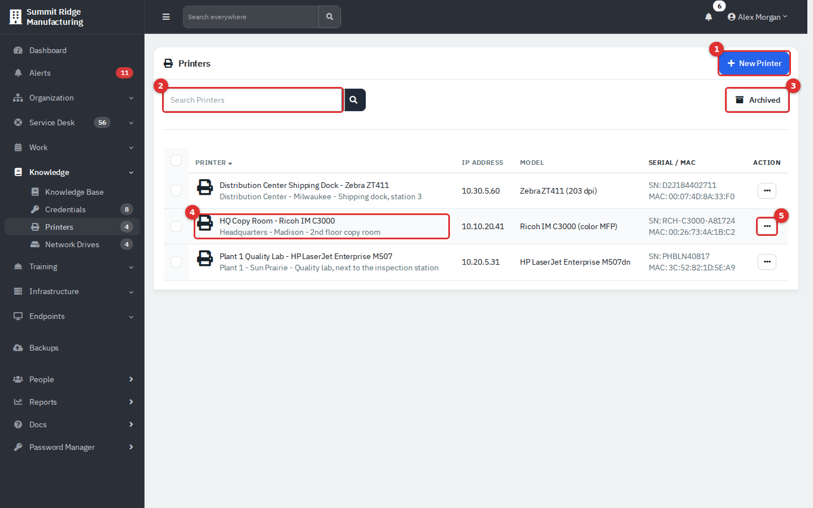

*Figure 12 — Printers. (1) New Printer. (2) Search. (3) Archived. (4) A printer name opens its details. (5) The row menu.*

The company view lists the **company-wide** printers, the ones not tied to a department. A department's own printers appear only in that department's workspace, under **Documentation** → **Printers**. A printer you add from the company view is company-wide; one you add in a workspace belongs to that department.

### Add a printer

1. Select **New Printer**.
2. Enter a **Printer Name** (required), then whatever you know: **IP Address**, **Location**, **Physical Location** (for example "2nd floor copy room"), **Model**, **Serial Number**, **MAC Address** and **Notes**.
3. Select **Create**.

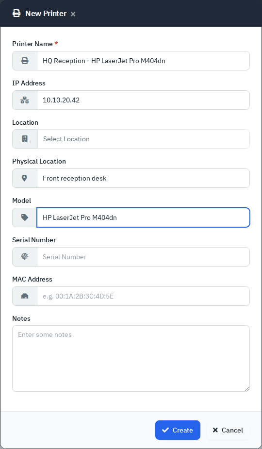

*Figure 13 — New Printer.*

**Location** is the company site. In the company view it lists your sites. In a department workspace it only lists locations created for that one department alone, which is often none; type the place in **Physical Location** instead, or add the printer from the company view.

Select a printer's name to see its details:

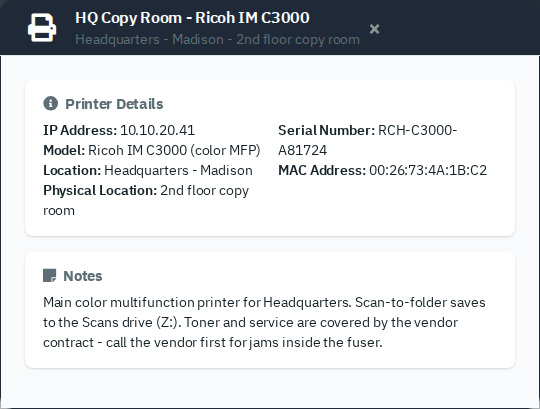

*Figure 14 — Printer details: IP address, model, location, serial number, MAC address and notes.*

Search covers the name, IP address, location, model and serial number. The **...** menu has **Edit**, and for administrators **Archive**, **Restore** and **Delete**. Archiving hides a printer from the list; the **Archived** button shows them again. Permanent delete is switched off in a standard installation, so you normally only archive.

## Network drives

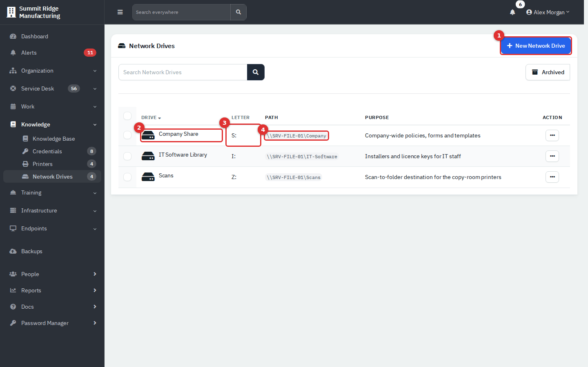

*Figure 15 — Network Drives. (1) New Network Drive. (2) The drive name opens its details. (3) The drive letter. (4) The path.*

The list works like Printers: the company view shows company-wide drives; a department's drives are in its workspace.

### Add a network drive

1. Select **New Network Drive**.
2. Enter a **Name** (required), a **Drive Letter** (A: to Z:; C: is greyed out as the system drive), the **Path** such as `\\SRV-FILE-01\Company`, a **Purpose** and **Notes**.
3. Select **Create**.

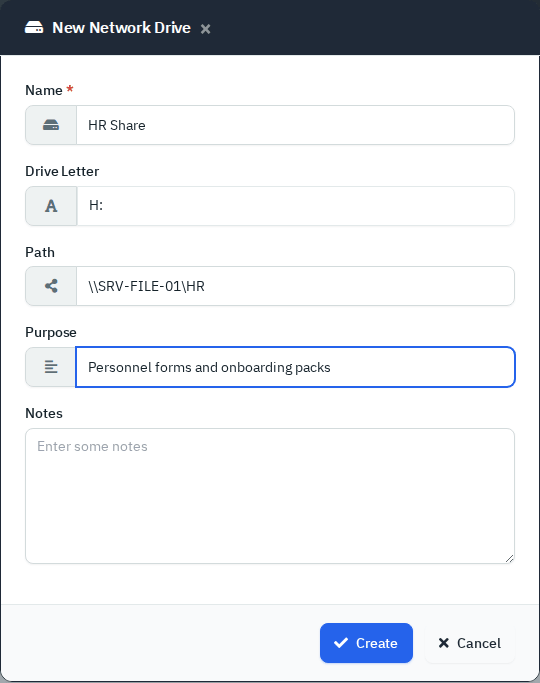

*Figure 16 — New Network Drive.*

This list is documentation only. It does not map drives on anyone's computer. Archive and restore work as they do for printers.

## Reference

| List | Columns | Search covers |
|---|---|---|
| Credentials | Name (with star, type badge, description and tags), Username / ID, Password / Key, OTP, URI, related contact or asset, Department (company view), Action | Name, description, URI, tag, department name |
| Printers | Printer (with location), IP Address, Model, Serial / MAC, Action | Name, IP, location, physical location, model, serial |
| Network Drives | Drive, Letter, Path, Purpose, Action | Name, letter, path, purpose |

| Action | Credentials | Printers and Network Drives |
|---|---|---|
| View, show in pop-up, copy, hover for OTP | Read | Read |
| Add, edit, move, archive, restore | Modify | Modify |
| Delete (permanent) | Full | Full, and only if the installation allows it |

## Tips and good practice

- Name credentials after the thing they open, with the device tag: "Edge Firewall (FW-EDGE-01) - Admin".
- Set **Rotation Due** on shared or high-risk logins and check the rotation report each month.
- Store the one-time secret with the login so on-call staff need no separate authenticator.
- Prefer **Share** with a short expiry over pasting a password into a ticket or chat.
- Keep a copy of the master key offline, separate from your backups.
- Keep printers and drives current: a wrong IP is worse than none. Record changes as you make them.

## Related guides

- [Knowledge Base](05-knowledge-base.md)
- [Dashboard and reports](10-dashboard-and-reports.md)
- [Administration: users and security](12-administration-users-and-security.md)
- [Administration: settings](13-administration-settings.md)
