# Assets

Assets are the devices your department owns: laptops, desktops, servers, switches, phones, printers and so on. Each asset records who has it, where it is, what state it is in, how it is connected to the network, and which licenses, documents, files and services belong to it.

| | |
|---|---|
| **Where to find it** | Sidebar → Infrastructure → **Assets** (all departments together). Inside a department workspace: Documentation → **Assets** (the workspace sidebar starts with **Overview**, **Contacts** and **Locations**, then the Support and Documentation groups). |
| **Who can use it** | Tickets, assets & docs (or Support): **Read** to view, **Modify** to add, edit and use the inline editors, **Full** to archive, restore and delete. Only administrators see the row Archive, Restore and Delete links. |
| **Turn it on** | Nothing to enable. The IT documentation module must be on, which it is by default. |

## What it's for

Use assets to answer four questions quickly: what do we own, who has it, is it healthy and supported, and what depends on it. Because an asset links to licenses, credentials, documents, tickets and services, the asset page becomes the single place to start when something breaks.

Assets belong to one department at a time. The app-level list shows every department together and has a **Department** column; a department workspace shows only that department's devices and has no such column.

## A quick tour

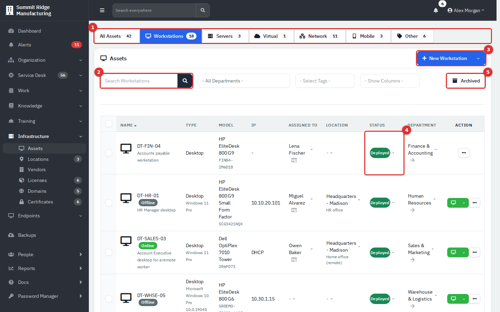

*Figure 1 — The Assets list, Workstations tab.*

1. **Tabs.** All Assets, Workstations (laptops and desktops), Servers, Virtual, Network (switches and access points), Mobile (phones and tablets) and Other. Each tab shows a count, and a tab appears only when it has at least one asset.
2. **Search.** Matches name, description, type, IP, IPv6, MAC, make, model, serial, operating system, assigned person, location, department and tag.
3. **New** button. Its menu also holds **Import** and **Export**.
4. **Click-to-change cells.** Status, Assigned To, Location and Department change in place. Assigned To is left out on the Servers, Network and Other tabs, and Department appears only in the app-level list.
5. **Archived** toggle. Switches between live and archived assets.

Firewall/Router assets do not appear in any tab. See "Find a firewall or router" below.

Next to the search box are three filters. The app-level list has **All Departments** (a department drop-down); a department workspace has **All Locations** instead. **Select Tags** filters by tag. **Show Columns** adds optional columns: MAC address, purchase date, install date and warranty expiry.

In the Name cell, a yellow star marks a favorite asset, an **Online** or **Offline** badge appears when the remote-management integration is linked to the asset, and the asset's tags show as coloured labels. For assets with a remote-management agent, a green **Connect** button also appears in the Action column.

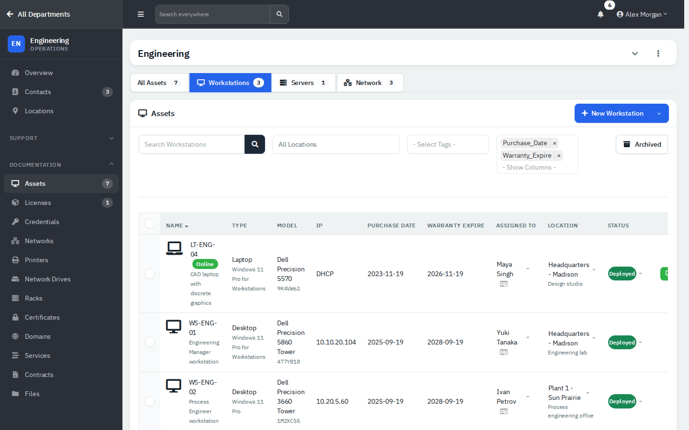

*Figure 2 — Optional columns in an Engineering workspace list.*

## Common tasks

### Change a status or assignee without opening the asset

1. Click the status pill (for example **Deployed**). A drop-down lists the statuses.
2. Pick one. The change saves immediately.

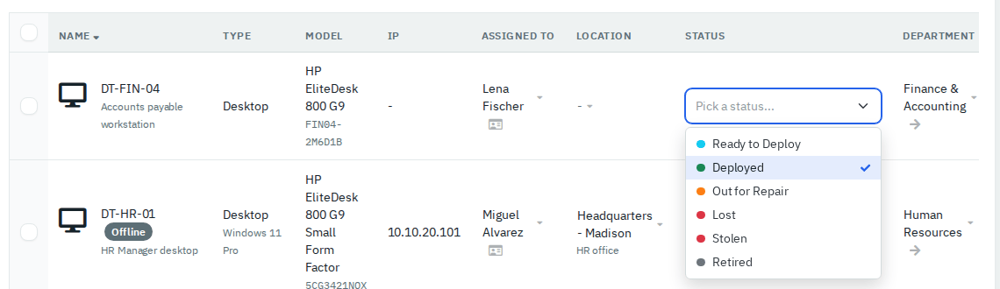

*Figure 3 — Changing status in place.*

For **Assigned To**, click the name and type a few letters. The search covers people in every department.

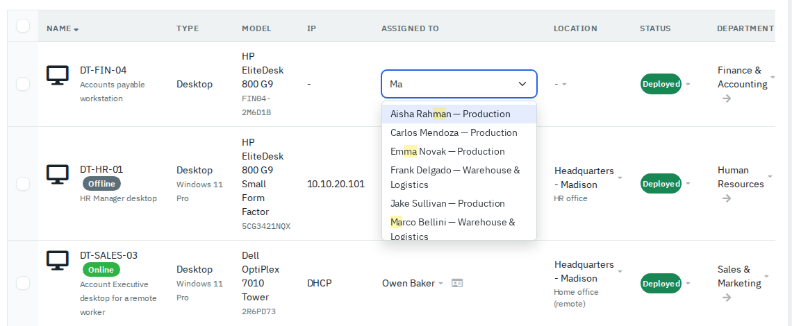

*Figure 4 — Choosing a person. Each result shows the person's department.*

Choosing someone from another department moves the asset into that department.

### Work on several assets at once

1. Tick the boxes at the start of the rows.
2. Click **Bulk Action**.
3. Choose an action.

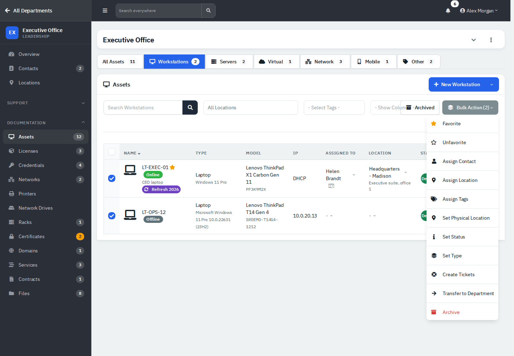

*Figure 5 — Bulk actions in a department workspace.*

| Action | What it does |
|---|---|
| **Favorite** / **Unfavorite** | Adds or removes the yellow star. Favorites are listed on the department overview. |
| **Assign Contact** | Assigns the selected assets to one person (department workspace only). |
| **Assign Location** | Sets the location (department workspace only). |
| **Assign Tags** | Adds tags. |
| **Set Physical Location** | Sets the free-text spot, such as "Server room, rack A". |
| **Set Status**, **Set Type** | Changes the status or type. |
| **Create Tickets** | Creates one ticket per asset, with the asset name at the start of the subject. |
| **Transfer to Department** | Copies each asset to another department and archives the original. The copy gets a new asset ID. |
| **Restore**, **Delete** | Shown in place of Archive on the **Archived** view. |
| **Archive** | Archives the selection. |

**Transfer to Department** is not a move. The copy keeps type, name, description, make, model, serial, operating system, status, dates, notes and the interface names and MAC addresses. It does not keep the assigned person, location, tags, IP addresses, linked licenses, credentials, documents, files or tickets, which stay with the archived original along with the history. To move a device and keep everything attached, use the **Department** cell instead.

### Add an asset

1. Click **New Asset** (or **New Workstation**, and so on, on a tab).
2. Fill in **Details**: **Type** and **Name** are required. Add asset tag, make, model, serial, PIN, operating system and description. The star beside **Name** marks the asset as a favorite. In the app-level list the tab also starts with an optional **Department** drop-down; leave it on **- No Department -** to create an unassigned asset.
3. Open **Assignment** to set location, physical location, **Assign To** and **Status**. Location and **Assign To** appear only in a department workspace.
4. Open **Network** for network, IPv4 (or tick DHCP), MAC, IPv6, NAT address, **URI**, **URI 2**, **Department URI** (shown in the department portal) and an **AnyDesk ID** (adds a **Connect** button to the asset page).
5. Open **Purchase** for vendor, purchase reference, purchase date, install date and warranty expiry.
6. Click **Create**.

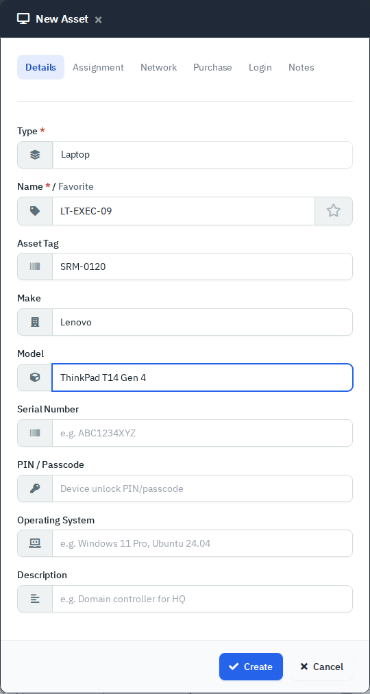

*Figure 6 — Details tab.*

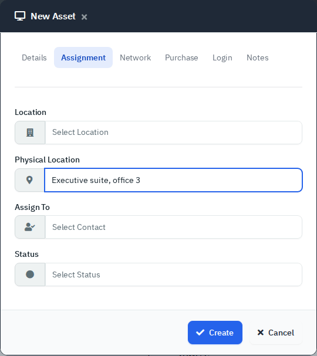

*Figure 7 — Assignment tab.*

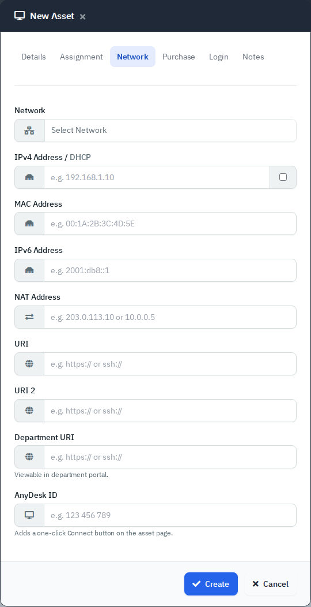

*Figure 8 — Network tab.*

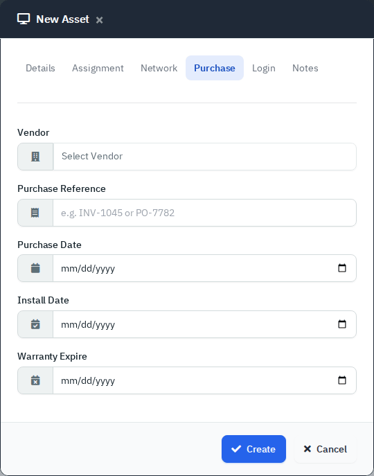

*Figure 9 — Purchase tab.*

Two more tabs exist. **Login** appears when you can edit credentials and creates a credential record from a username and password. **Notes** holds free text, a photo upload and the **Tags**. Creating an asset also creates a primary network interface and a history entry.

The **Location** list in this pop-up only offers locations created for that one department in the older style, so it is often empty. Create the asset, then pick the location from the **Location** cell in the list, which offers the company-wide sites plus any site that belongs to the asset's department.

### Import and export

1. Open the **New** menu's drop-down arrow and choose **Import**.
2. Download the sample CSV template and fill it in. Columns: Name, Description, Type, Make, Model, Serial, Asset Tag, PIN, OS, Purchase Date, Assigned To, Location, Physical Location, Notes.
3. Write dates as YYYY-MM-DD, because spreadsheet programs often reformat them.
4. Choose the file and click **Import**.

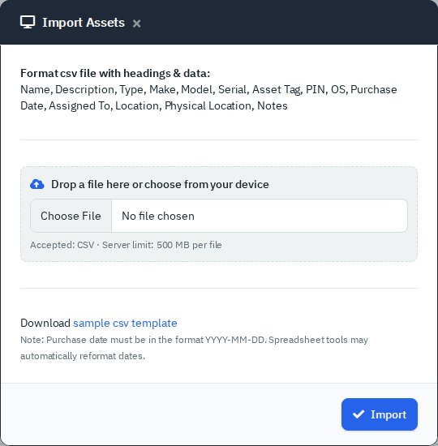

*Figure 10 — Import Assets.*

**Export** in the same menu downloads the current list as CSV.

### Read an asset page

Click an asset name to open its page.

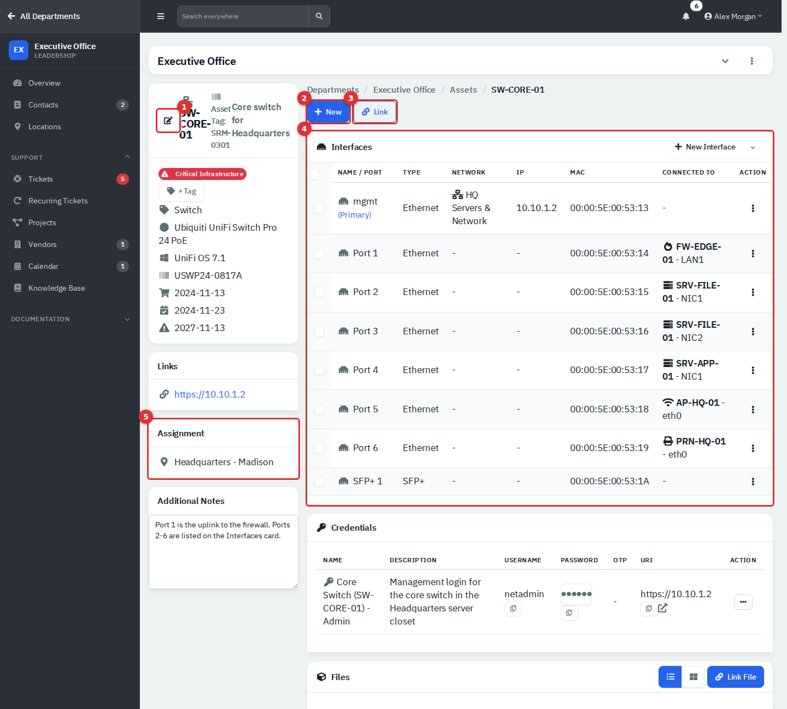

*Figure 11 — A switch's asset page.*

1. **Edit.** Opens the same tabs as New Asset (without **Login**), plus **History**. Tags are managed on its **Notes** tab; the **+ Tag** button beside the tags opens it.
2. **New.** Creates a ticket, recurring ticket, credential, document or uploaded files already linked to this asset.
3. **Link.** Links an existing item.
4. **Interfaces.** One row per port, with network, IP, MAC and **Connected To** cabling links.
5. **Assignment.** Location, person, and contact details.

The left column also holds a **Remote Access** card (a **Connect via AnyDesk** button, when an AnyDesk ID is set), a **Links** card for the asset's URIs, **Assignment History**, and **Additional Notes**, a text box that saves what you type. A yellow star after the name marks a favorite, and tags such as **Critical Infrastructure** show above the details.

Below, cards appear only when they have content: Credentials, Licenses, Documents, Files, Recurring Tickets, Tickets and Linked Services. Each has its own link button (for example **Link Software**, **Link Document**, **Link File**, **Link Service**) and an unlink button on every row. The Files card has a list and a grid view.

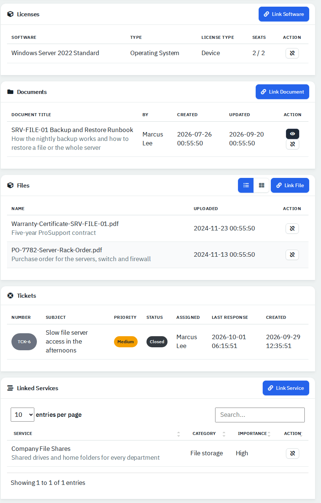

*Figure 12 — Linked items on a file server.*

If the asset is linked to a remote-management integration, a banner appears at the top of the page and tabs appear above the cards, with Online or Offline badges in lists. The banner shows the Online or Offline status, the number of open alerts, the operating system, the last-seen time, CPU, RAM and disk gauges, and flags such as **Reboot required**, **Maintenance** and **Updates pending**. With the right permissions it also has **Connect**, **Reboot** and **Run Command** buttons. An Intune-linked asset gets a similar banner with its compliance state. These come from the integrations, not from this page. See [Endpoints and integrations](09-endpoints-and-integrations.md).

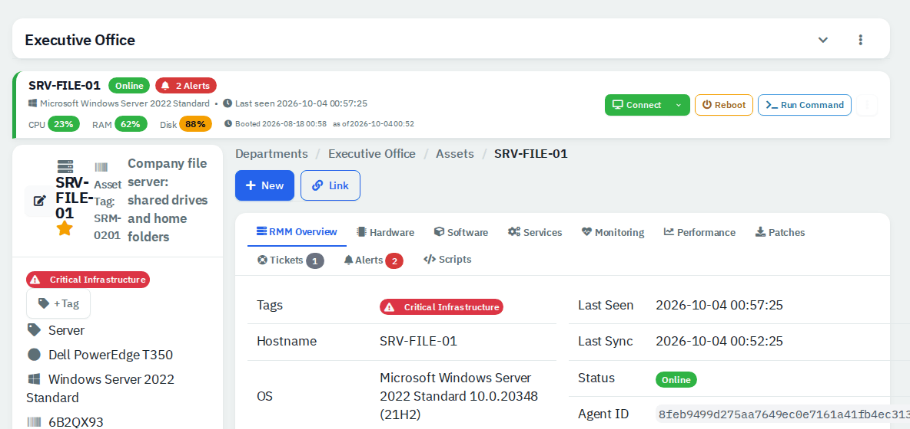

*Figure 13 — A linked server: banner, then tabs from RMM Overview to Scripts.*

The left card lists tags, type, make and model, operating system, serial, PIN (when set), then the purchase, install and warranty dates. The dates have an icon but no text label, in that order.

### Link an existing item

1. Click **Link** and choose License, Credential, Service, Document or File.
2. Pick the item and confirm.

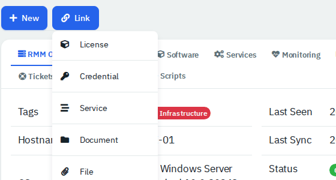

*Figure 14 — Link menu.*

**License** lists only Device-type licenses of the asset's department. **Credential** lists only that department's credentials that are not linked to another asset.

### See who had a device

The **Assignment History** card lists each person with the dates they held it, newest first.

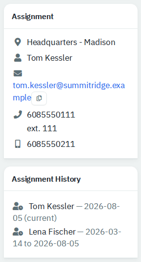

*Figure 15 — A laptop that changed hands.*

The **History** tab of the Edit pop-up lists every change made to the asset.

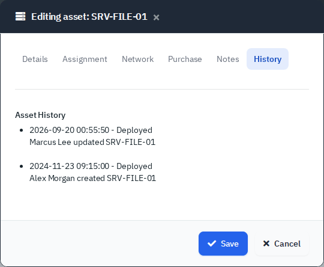

*Figure 16 — Asset history.*

### Archive, restore or delete

1. Click the **...** button on the row and choose **Archive**. Archive keeps everything and hides the asset from normal lists.
2. Click **Archived** to see archived assets. The row menu then offers **Edit**, **Copy**, **Restore** and **Delete**.

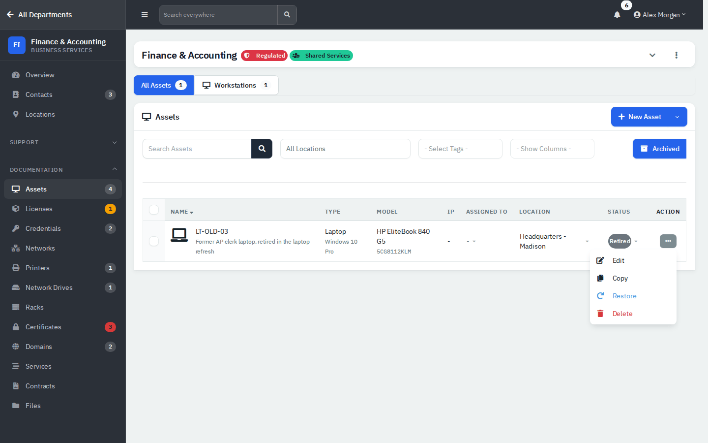

*Figure 17 — The archived view.*

**Delete** is permanent. Prefer **Archive**, for example when a device is **Retired**.

### Find a firewall or router

Assets of type Firewall/Router are left out of every Assets tab. Reach them from a rack, a service's Assets list, a switch's **Connected To** link, the search box at the top, or Endpoints → Network when the remote-management integration is on.

## Reference

**Types:** Laptop, Desktop, Server, Phone, Mobile Phone, Tablet, Firewall/Router, Switch, Access Point, Printer, Display, Camera, Virtual Machine, Other.

**Statuses** are set in Administration → Tags & Categories → Categories, on the **Asset Status** button. The demo uses Ready to Deploy, Deployed, Out for Repair, Lost, Stolen and Retired. See [Administration settings](13-administration-settings.md).

| Tab | Shows |
|---|---|
| All Assets | Everything except Firewall/Router |
| Workstations | Laptop, Desktop |
| Servers | Server |
| Virtual | Virtual Machine |
| Network | Switch, Access Point |
| Mobile | Phone, Mobile Phone, Tablet |
| Other | Printer, Display, Camera, Other and similar |

## Employee portal

People who are primary or technical contacts of a department see a **Technical** menu in the portal with Assets, Contracts & Docs, Domains and Certificates. Everyone sees "Your Assigned Assets" on the home page. This was read from the application code and was not exercised with a portal login. In the portal list, only a status named exactly **Active** is shown green, so **Deployed** assets appear grey. See [Employee portal](11-employee-portal.md).

## Tips and good practice

- Use one naming pattern, for example type-department-number (LT-FIN-02).
- Set **Assigned To** for every laptop so assignment history stays useful.
- Enter warranty dates, then add the **Warranty Expire** column and sort by it before renewals.
- Use tags such as "Refresh 2026" to plan replacements.
- Retire with **Archive**, not **Delete**.

## Related guides

- [Locations, vendors, licenses, domains and certificates](06b-locations-vendors-licenses-domains-certificates.md)
- [Networks, racks, services, contracts and files](06c-networks-racks-services-contracts-files.md)
- [Endpoints and integrations](09-endpoints-and-integrations.md)
- [Employee portal](11-employee-portal.md)
- [Getting started](01-getting-started.md)
