# Locations, vendors, licenses, domains and certificates

These five lists record the things around your devices: the sites you work from, the companies you buy from, the software you license, and the domain names and security certificates that expire if nobody is watching.

| | |
|---|---|
| **Where to find it** | Sidebar → Infrastructure → **Locations**, **Vendors**, **Licenses**, **Domains**, **Certificates**. In a department workspace: Locations near the top; Vendors under Support; Licenses, Domains and Certificates under Documentation. |
| **Who can use it** | Licenses, domains and certificates: Tickets, assets & docs (Support) **Read** to view, **Modify** to add and edit, **Full** to delete. Locations: Support **Read** to view, Departments **Modify** to add, edit and archive. Vendors: see below. |
| **Turn it on** | Nothing to enable. The Infrastructure group shows when the IT documentation module is on. A login that has only the Assets permission sees the group with **Assets** alone. |

*Figure 1 — The Infrastructure group. Counts show how many records each list holds.*

## What it's for

- **Locations** are your sites. Assets, networks and racks point at them.
- **Vendors** are suppliers and service providers, with account numbers and support contacts, so anyone can find who to call.
- **Licenses** track software, seats and renewal dates.
- **Domains** and **Certificates** track expiry so a website or mail domain does not lapse unnoticed.

In all five lists, rows can be archived instead of deleted, and the **Archived** button shows what you archived. The app-level lists have a search box and, for licenses, domains and certificates, an **All Departments** filter; the Locations list has **Select Tags** and **All Departments** filters.

## Locations

### A quick tour

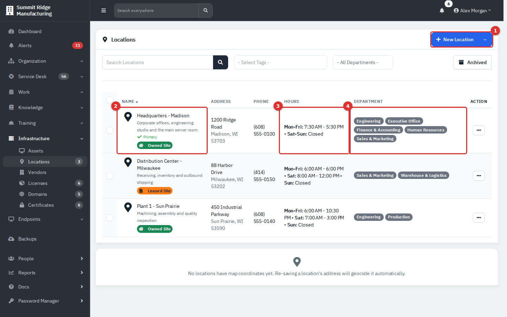

*Figure 2 — The Locations list.*

1. **New Location.**
2. **Name** with its address text, a **Primary** marker and a tag such as Owned Site or Leased Site.
3. **Hours**, grouped into ranges such as Mon-Fri.
4. **Department** tags: the departments that use the site.

A map card appears under the list. It needs coordinates, which the app looks up when you save an address, and map tiles from the internet. On a server without internet access it says no locations have map coordinates.

### Create a location

1. Click **New Location**.
2. On **Details**, enter the name, address and hours for each day.
3. On **Contact**, enter the phone number and email.
4. On **Departments**, tick the departments that use the site. This is optional.
5. Add **Notes** if you want, then click **Create**.

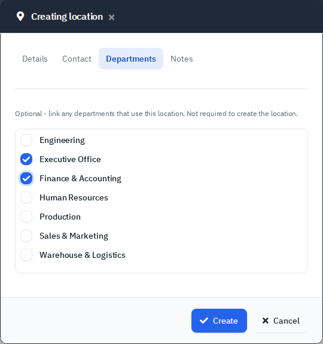

*Figure 3 — Linking departments to a site.*

A location is shared across departments. Its tags (Owned Site, Leased Site) come from Tags. The primary location cannot be archived or deleted.

## Vendors

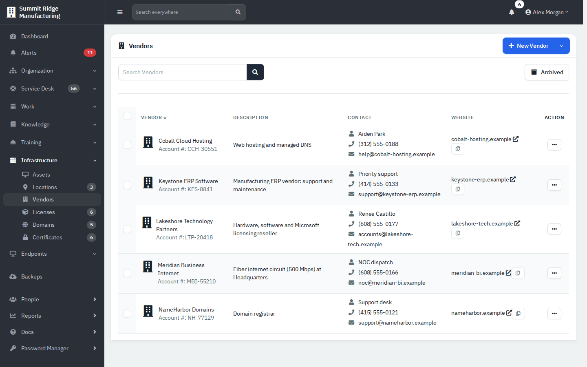

*Figure 4 — Company-wide vendors.*

The app-level **Vendors** list holds company-wide vendors. A department workspace has its own **Vendors** list for suppliers that only that department uses.

Click a vendor name to read its details: account number, code, hours, website, SLA, contact and notes.

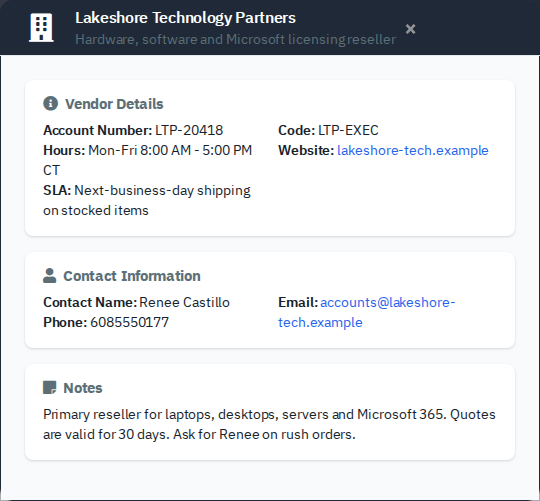

*Figure 5 — Vendor details.*

### Add a vendor

1. Click **New Vendor** (or use its drop-down for **Create from Template**, which uses the vendor templates under Administration → Templates).
2. On **Details**: **Vendor Name** (required), **Description**, **Account Number**, **Account Manager**.
3. On **Support**: support phone and extension, hours, email, website, pin or code, SLA.
4. On **Notes**: anything else, then click **Create**.

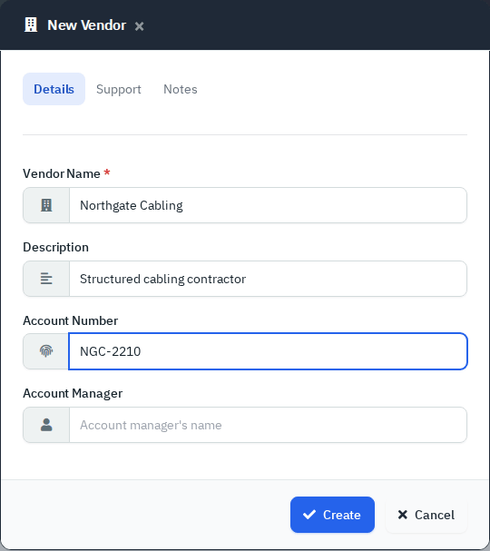

*Figure 6 — New Vendor.*

**Permissions differ by scope.** Department vendors need Departments **Modify** to add or edit and **Full** to delete. Company-wide vendors are tied to the Financial permission instead, so a technician without it may not be able to open or edit them. Check with your administrator if a vendor will not open.

## Licenses

Licenses track purchased software. Each license belongs to one department.

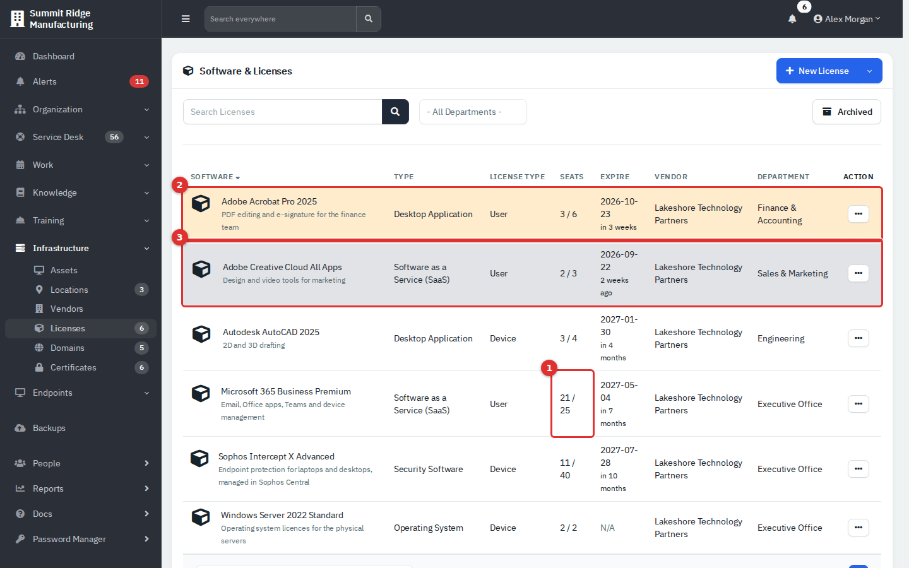

*Figure 7 — The Licenses list.*

1. **Seats** is shown as used / total. Used counts the assets and people linked to the license.
2. A **yellow** row expires within 45 days.
3. A **grey** row has already expired. A **red** row expires within 7 days.

### Add a license

1. Click **New License** (its drop-down offers **Create from Template**, using the software templates under Administration → Templates).
2. On **Details**, choose the **Department** and **Type**, then enter **Software Name**, **Version**, **Vendor** and **Description**.
3. On **Licensing**, set **License Type** (Device, User, Site, Concurrent, Trial, Perpetual or Usage-based), **Seats**, **License Key**, **Purchase Reference**, **Purchase Date** and **Expire**.
4. In a department workspace, the **Devices** and **Users** tabs let you tick which assets and people use a seat.
5. Click **Create**.

*Figure 8 — Licensing details.*

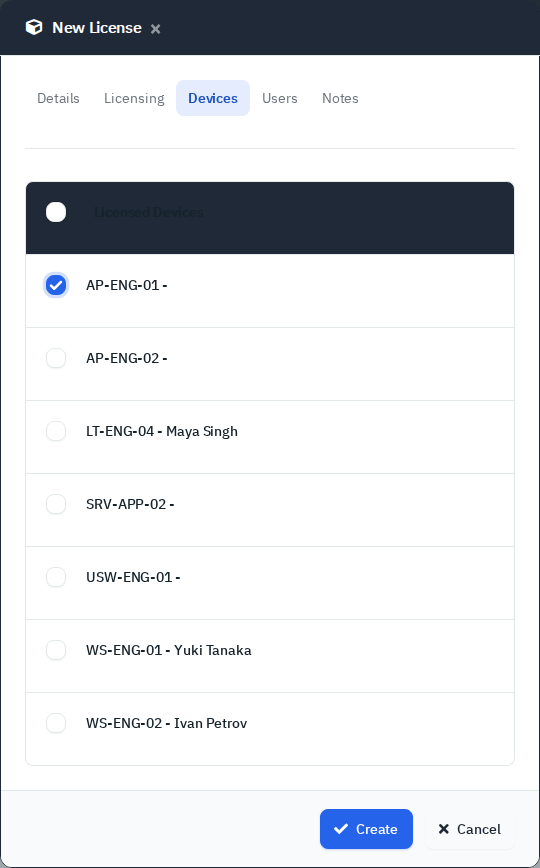

*Figure 9 — Choosing the devices that use a Device license.*

The pop-up only lists devices and people of the department. If you edit a license that was linked across departments, links outside the department are removed when you save. Archiving a license also removes its seat links. Never paste a real license key into a demo or shared screen.

## Domains

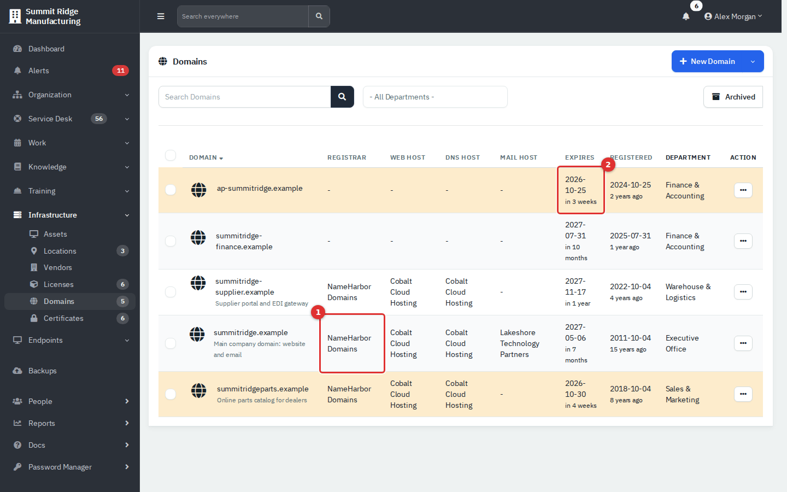

*Figure 10 — The Domains list.*

1. **Registrar**, web host, DNS host and mail host are vendors.
2. The **Expires** cell is coloured: yellow within 90 days, red within 14 days, grey once expired.

Click a domain for its page.

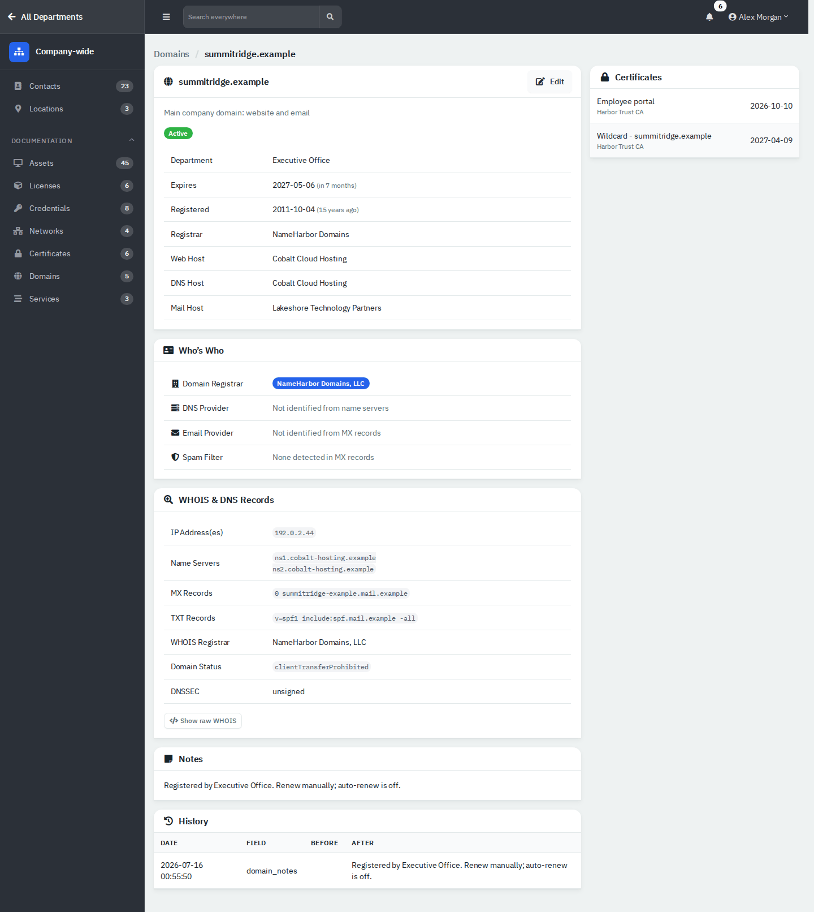

*Figure 11 — Domain details.*

The page shows an expiry badge (Active, Renew soon, Expiring soon or Expired), the department, expiry and registered dates and the vendors, an **Edit** button, **Who's Who** (registrar and DNS and email providers recognised from the records), **WHOIS & DNS Records**, **Notes**, **History**, and a **Certificates** card listing the certificates for the domain.

### Add a domain

1. Click **New Domain**.
2. Enter **Domain Name** and optionally **Description**, the vendors and an **Expire Date**.
3. Click **Create**.

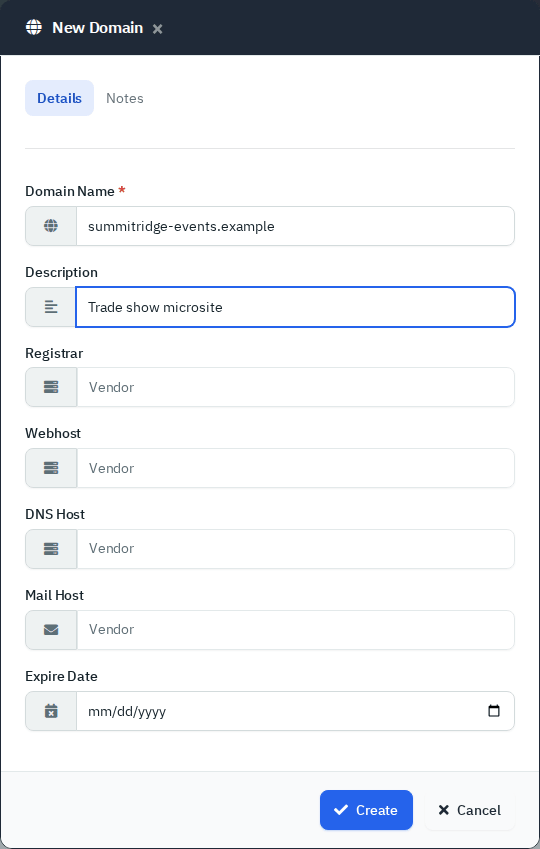

*Figure 12 — New Domain.*

When you add or edit a domain the app tries live WHOIS and DNS lookups, so the server needs internet access and the lookup tools. Without them the record fields stay blank. Editing also replaces an expiry date that is not in the future with the WHOIS answer, or clears it, so check the date after every edit.

## Certificates

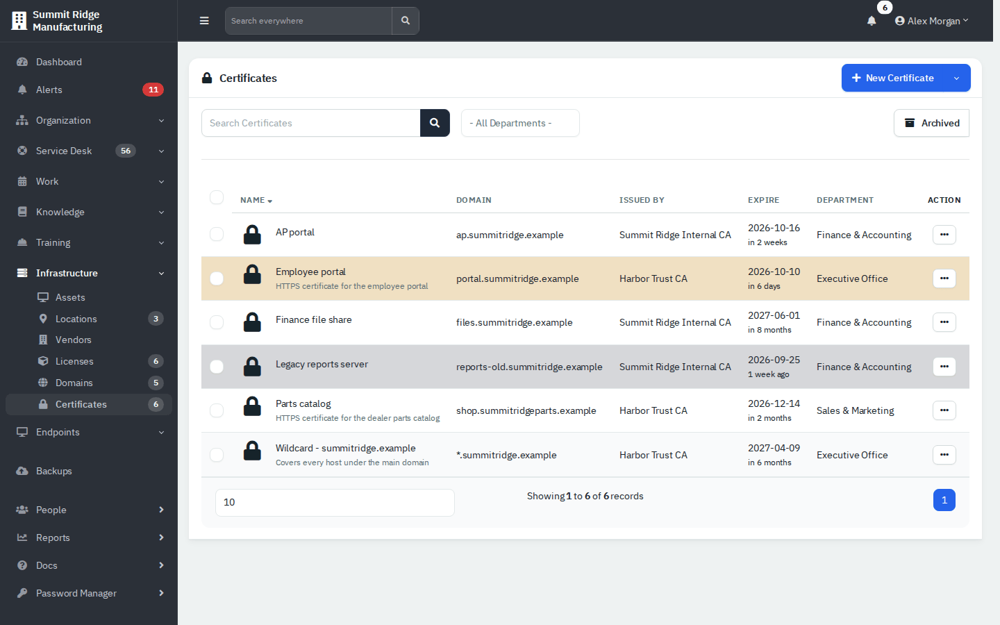

*Figure 13 — The Certificates list.*

Rows turn yellow within 7 days of expiry, red within 1 day, and grey once expired. A certificate is short-lived by nature, so the window is short. A certificate's page also has a **Same Domain** card that links to its domain and lists the other certificates for it.

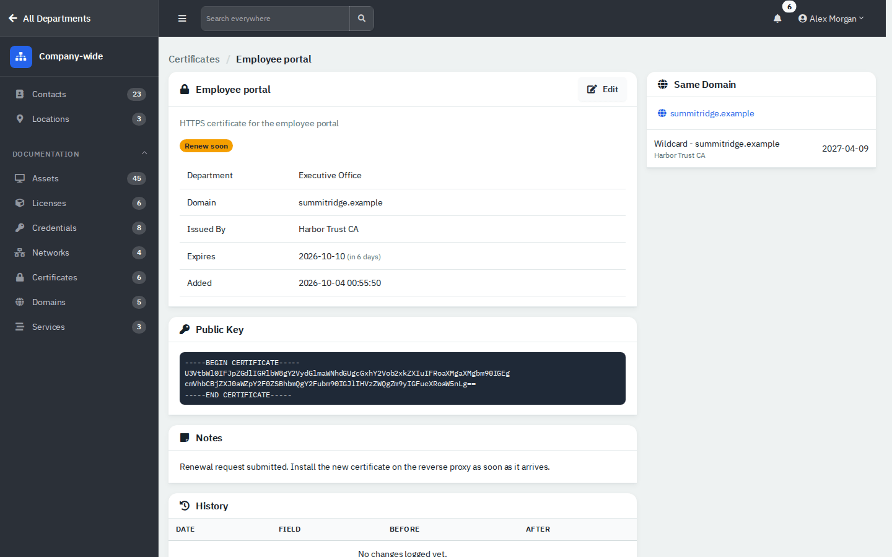

*Figure 14 — Certificate details, with the Renew soon badge.*

### Add a certificate

1. Click **New Certificate**.
2. On **Details**, enter the name and description. In a department workspace you can link a domain.
3. On **Certificate**, enter the **Domain**, **Issued By**, **Expire Date** and **Public Key**. The refresh button next to the domain tries to fetch the certificate from the live site.
4. Click **Create**.

*Figure 15 — Certificate details.*

## Reference

| List | Warning colours |
|---|---|
| Licenses | Yellow within 45 days, red within 7, grey expired |
| Domains | Yellow within 90 days, red within 14, grey expired |
| Certificates | Yellow within 7 days, red within 1, grey expired |

The dashboard counts domains and certificates expiring within 30 days. The department overview and the portal use 45 days. See [Dashboard and reports](10-dashboard-and-reports.md).

Primary and technical contacts see Domains and Certificates under **Technical** in the employee portal, with expiry alerts. This was read from code, not tried with a portal login. See [Employee portal](11-employee-portal.md).

## Tips and good practice

- Put the owner and renewal steps in **Notes** ("Renew manually; auto-renew is off").
- Add all three renewal lists to a monthly review.
- Create vendors first, so licenses and domains can pick them.
- Archive rather than delete; Delete is permanent and may be hidden on your server.

## Related guides

- [Assets](06-assets.md)
- [Networks, racks, services, contracts and files](06c-networks-racks-services-contracts-files.md)
- [Dashboard and reports](10-dashboard-and-reports.md)
- [Employee portal](11-employee-portal.md)
- [Administration settings](13-administration-settings.md)
