# Networks, racks, services, contracts and files

These records live in a department workspace. They describe how a department's network is laid out, where its equipment sits, which services depend on that equipment, what support agreements apply, and where its documents are kept.

| | |
|---|---|
| **Where to find it** | Open a department (Organization → Departments, or the department picker), then use the **Documentation** group in its sidebar (below **Overview**, **Contacts**, **Locations** and the Support group): **Networks**, **Racks**, **Services**, **Contracts**, **Files**. |
| **Who can use it** | Tickets, assets & docs (Support): **Read** to view, **Modify** to add and edit, **Full** to delete. You also need access to the department workspace (Departments **Read**). |
| **Turn it on** | Nothing to enable. |

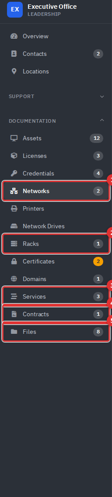

*Figure 1 — Networks (1), Racks (2), Services (3), Contracts (4) and Files (5) in the Executive Office workspace.*

Racks and Files only work inside a department. Networks and Services also have a company-wide view in the company rail. Company-wide contracts are not linked from any menu.

## What it's for

- **Networks** record subnets, VLANs, gateways and DNS, so an IP address in an asset record means something.
- **Racks** show what is mounted in which unit.
- **Services** group the assets, vendors, documents and credentials behind something people rely on, such as email or file shares.
- **Contracts** record support agreements, their dates and their response targets.
- **Files** keep uploaded files and documents in folders.

## Networks

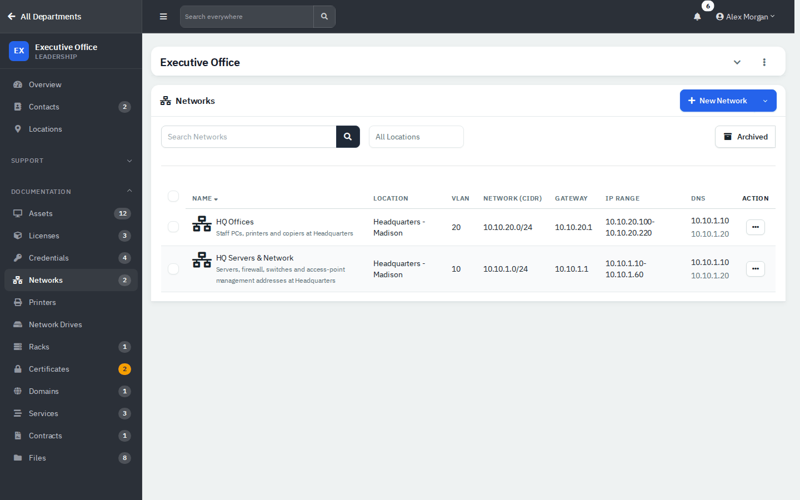

*Figure 2 — Networks for the Executive Office.*

The list shows name, location, VLAN, network in CIDR form, gateway, IP range and DNS servers. A search box and an **All Locations** filter sit above it.

### Add a network

1. Click **New Network**.
2. On **Details**, enter the name, description and location.
3. On **Network**, enter **VLAN**, **Network (CIDR)** (required), **Assignable IP Range** and **Gateway**.
4. On **DNS**, enter primary and secondary DNS. Add **Notes** if needed.
5. Click **Create**.

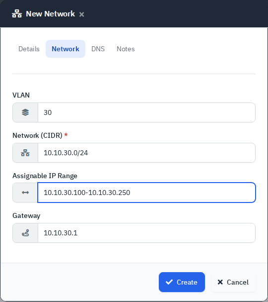

*Figure 3 — Network tab.*

An asset's **Network** drop-down on its **Network** tab lists the department's networks. Networks can be imported and exported as CSV from the New menu. The only bulk action is **Delete**, which needs the **Full** level and cannot be undone, so archive from the row menu instead.

## Racks

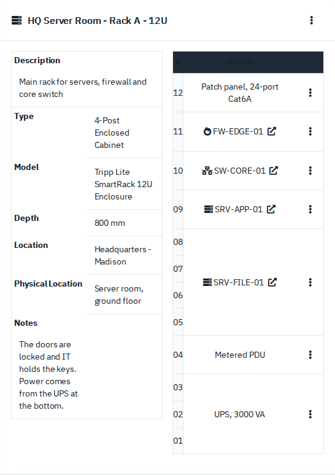

*Figure 4 — A 12U rack. Linked devices open their asset page.*

Each rack shows its description, type, model, depth, location, physical location and notes, and a unit-by-unit diagram.

### Create a rack and add devices

1. Click **New Rack** and fill in **Type**, **Name**, **Number of Units** (up to 70), **Depth**, **Location**, **Physical Location**, **Description** and optionally a photo.
2. On the rack's **...** menu, choose **Add Device**.
3. Type a **Custom Device** name (for a patch panel, PDU or UPS) or choose **Or Select a Device** to pick an asset.
4. Enter **Unit Number Start - End** and click **Add to Rack**. The app refuses overlapping units.

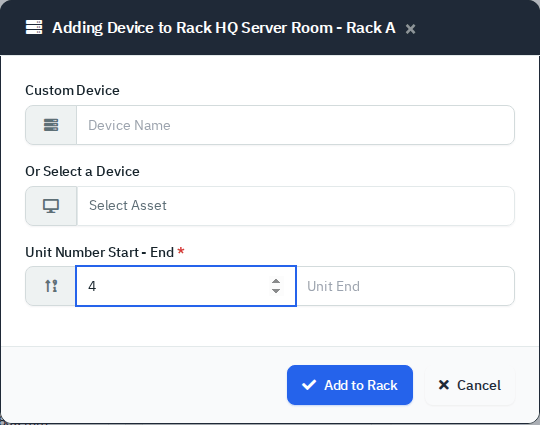

*Figure 5 — Adding a device to the rack.*

Known issues: the **Model** you type on a rack is not saved, and editing a rack blanks it. The **Location** drop-down only lists locations created for that one department, so it can be empty. Record the place in **Physical Location** instead.

## Services

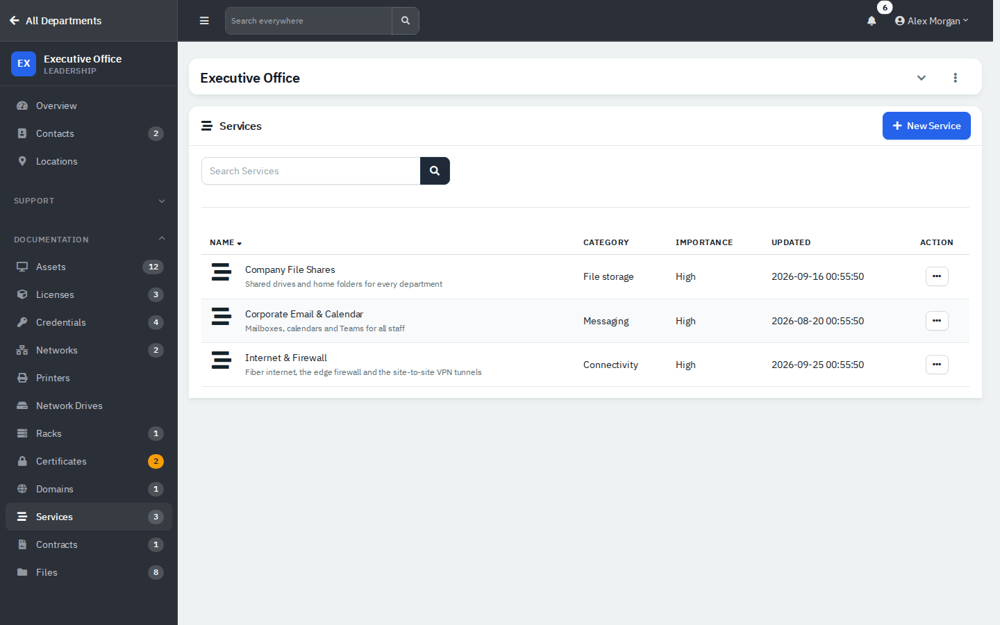

*Figure 6 — Services.*

Click a service name to see everything it depends on.

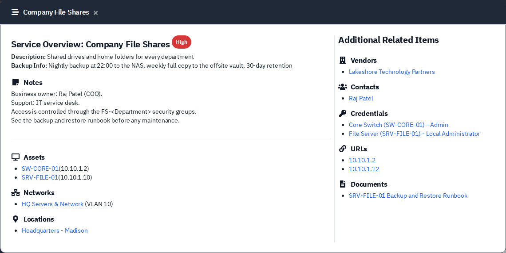

*Figure 7 — A service with its assets, networks, locations, vendors, contacts, credentials, URLs and documents.*

### Add a service

1. Click **New Service**.
2. Enter **Name**, **Description**, **Category** (free text, up to 20 characters), **Importance** (Low, Medium or High), **Backup** details and **Notes**.
3. Link the contacts, vendors, documents, assets, credentials, domains and certificates it relies on.
4. Click **Create**.

Services cannot be archived. **Delete** needs the **Full** level and is permanent. Linked services also show on each asset page, under **Linked Services**.

## Contracts

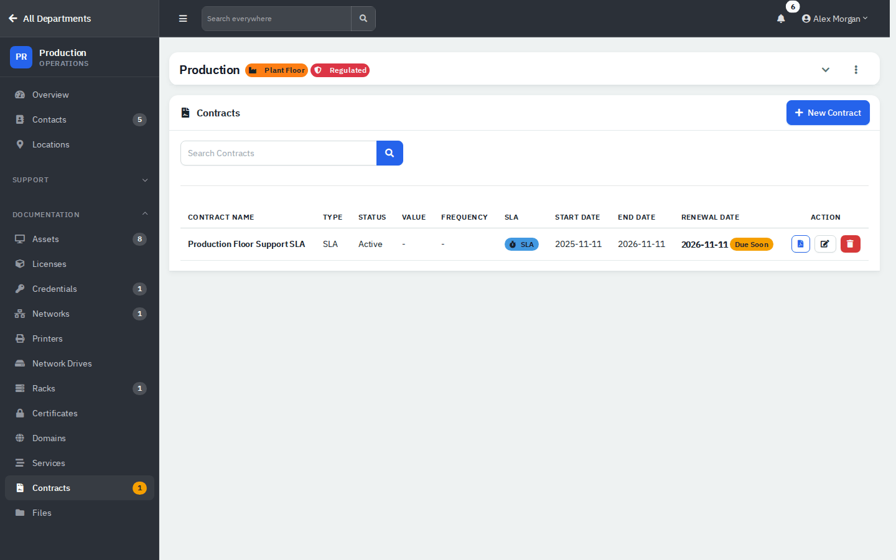

*Figure 8 — A contract due for renewal.*

The list shows type, status, value and frequency (billing columns, which this guide does not cover), SLA and Allowance badges, and the start, end and renewal dates. Each row has three buttons: documents, edit and the red button. **Due Soon** appears within 45 days of the renewal date, and **Expired** after it passes.

### Add a contract

1. Click **New Contract**.
2. Enter **Contract Name** and choose **Type** (Managed Services, Fully Managed, Partially Managed, Break/Fix, Block Hours, Project, SLA or Other) and **Status** (Active, Pending, Expired or Cancelled).
3. Set the start, end and renewal dates.
4. Under **SLA Response & Resolution Times**, enter hours for Low, Medium and High. Zero means no SLA.
5. Optionally enter **Included Support Hours** per month: remote hours and onsite hours.
6. Click **Create Contract**.

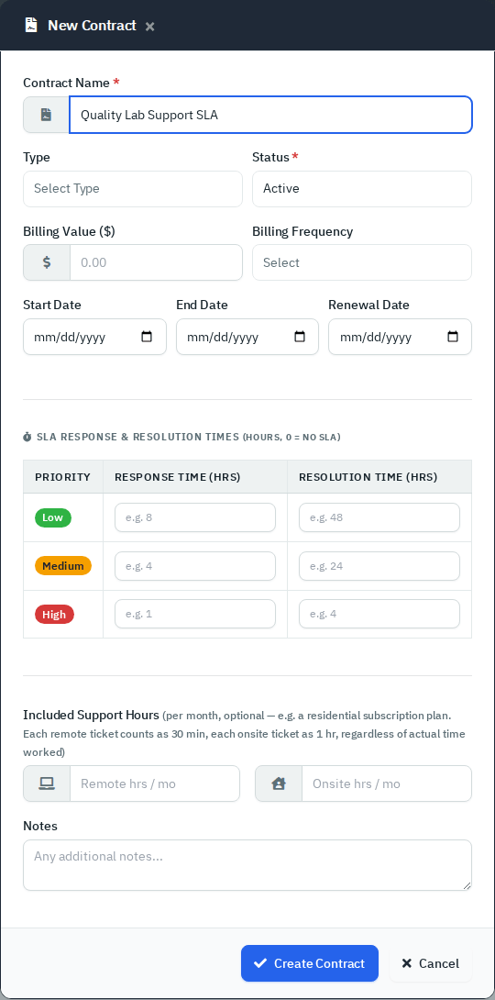

*Figure 9 — New Contract. Ignore the billing fields; this guide does not cover them.*

An Active contract can be picked on a new ticket, and its SLA hours set the ticket's due date.

The red button in the list is named for deleting but archives the contract. The edit pop-up and the documents button are tied to a permission that only administrators have, so technicians may be refused. This is from the code; check it with a technician login before you promise it.

## Files

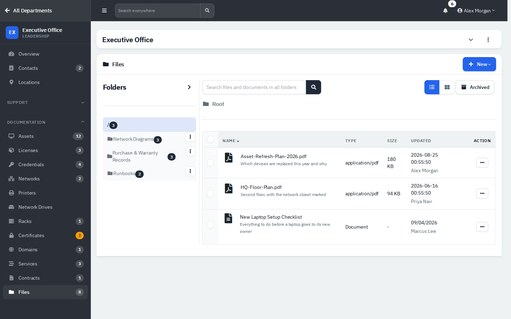

*Figure 10 — Folders on the left; files and documents together on the right.*

The folder tree is on the left, with a chevron beside **Folders** that expands or collapses every folder, and a count on each folder. The list shows uploaded files and documents together, with Name, Type, Size and Updated columns (Updated also shows who uploaded or wrote the item), a **Shared** column for items with an active share link, a List or Grid switch, a search box and an **Archived** toggle. The search covers all folders from the root and only the current folder inside one. Tick rows to move or archive them in bulk with **Bulk Action** (**Move Files** and **Archive Files**; on the archived view, **Restore Files** and **Delete Files**).

A file's row menu has **Download**, **Share**, **Rename**, **Move**, **Link Asset** and **Archive**. The Grid view shows image thumbnails of files only (documents are not listed there), and clicking a thumbnail opens a preview you can page through.

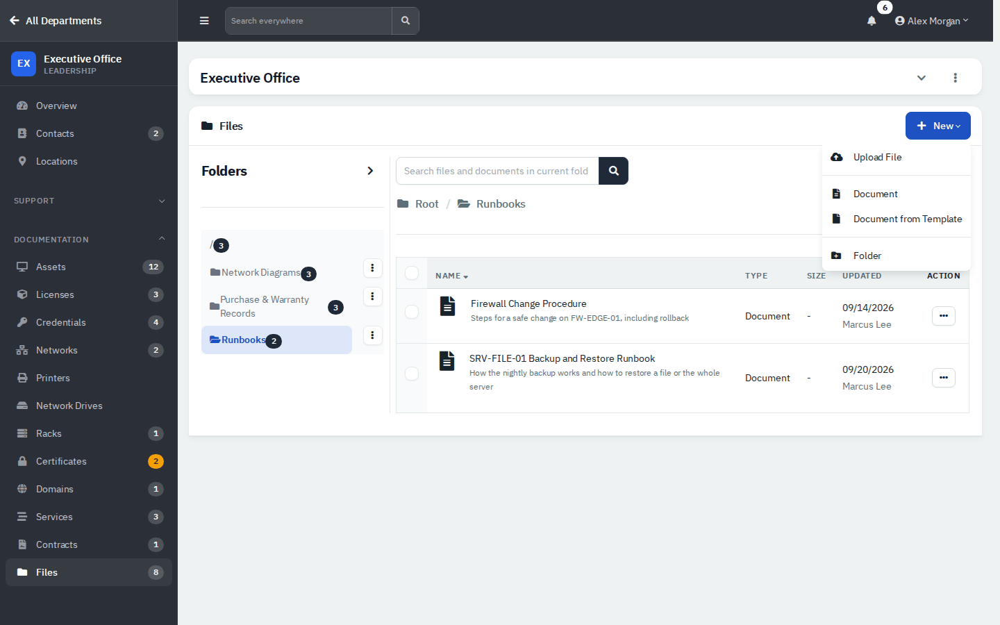

*Figure 11 — The New menu inside the Runbooks folder.*

1. Pick a folder first, so the new item lands in it.
2. Click **New**, then **Upload File**, **Document**, **Document from Template** or **Folder**.
3. To attach a file or document to an asset, open the asset and use **Link**.

Uploaded files keep their size and type. The demo files here have metadata only and no content on disk.

## Reference

- Networks and racks have an archive action in their row menus; deleting needs the **Full** level.
- Services cannot be archived; deleting needs **Full** and is permanent.
- Contracts: the red button archives.
- Files: use the row menu or the bulk menu to move or archive; the **Archived** toggle shows what was archived.

## Tips and good practice

- Name networks after the VLAN and place, such as "HQ Offices".
- Keep rack unit numbers current when you move gear. Link devices to assets rather than typing names.
- Mark critical services **High** importance and describe the backup in plain words.
- Put runbooks in a folder and link them to the services and assets they cover.

## Related guides

- [Assets](06-assets.md)
- [Locations, vendors, licenses, domains and certificates](06b-locations-vendors-licenses-domains-certificates.md)
- [Dashboard and reports](10-dashboard-and-reports.md)
- [Employee portal](11-employee-portal.md)
- [Administration: users and security](12-administration-users-and-security.md)
