# Training: Courses and Content

Training is RivetIT's learning management module (LMS). You build courses and required documents from articles, PDFs, videos, images, quizzes and signed acknowledgments, publish them as numbered versions, and then assign them to employees. This page covers the authoring side: creating, editing, previewing and publishing. Quizzes, the Question Library, learning paths, achievements and the Training settings are in [Training: Quizzes, Paths and Badges](07b-training-quizzes-paths-and-badges.md).

| | |
|---|---|
| **Where to find it** | Sidebar → **Training** → **Overview** and **Courses**. Training is an app-level menu; there is no separate Training menu inside a department workspace. |
| **Who can use it** | Permission **Training**. Level 1 (Read): view published courses, preview them, see the Overview. Level 2 (Modify): also create and edit courses, quizzes and question banks. Level 3 (Full): also publish, archive, restore, delete drafts and manage categories, for every department. Levels 1 and 2 only see people in the departments ticked on the user's Access tab. |
| **Turn it on** | An administrator switches on **Settings → Modules → Show Training (LMS)**. The switch appears only after the Training database update has been installed. Until then the Training menu is hidden and its pages say "Training is turned off". |

## What it's for

- **Training courses**: sections of lessons, with quizzes and an optional final exam. Employees take them on a kiosk tablet or PC.
- **Required documents**: a policy or procedure that people read and sign, such as an Acceptable Use Policy.
- **Versions**: every time you publish, the course becomes a new, permanent version, so you can always show what an employee was taught and when.

Your work is a private draft until a Training administrator publishes it. Employees never see a draft.

## A quick tour

### The Courses list

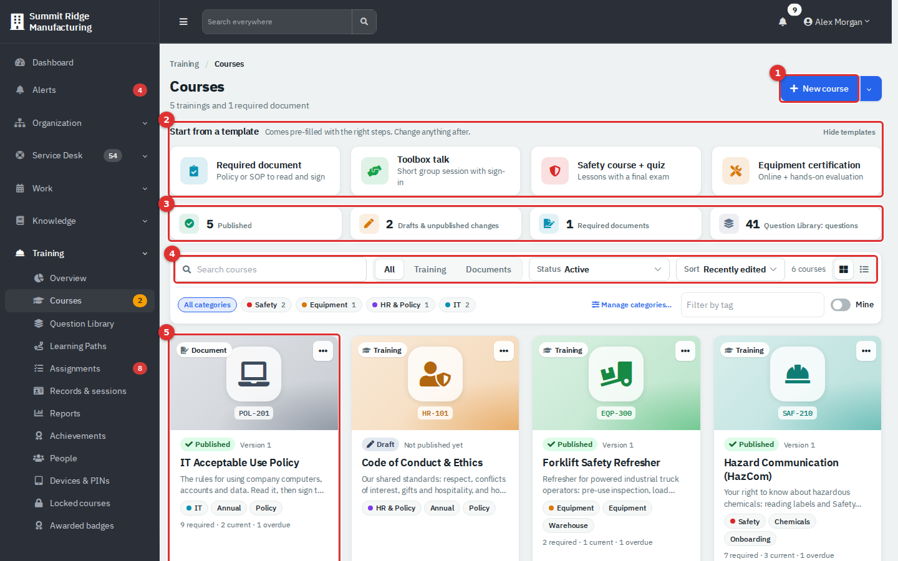

*Figure 1 — Training → Courses. Cards use the course colour and an icon when a course has no cover picture.*

1. **New course** creates a course. The arrow beside it offers **Training course**, **Required document** and **From template…**.
2. **Start from a template** shows four common templates. **Hide templates** collapses the strip.
3. Statistics: **Published**, **Drafts & unpublished changes**, **Required documents** and **Question Library: questions** (a link to the library). Level 1 users see fewer tiles.
4. Search and filters: **All / Training / Documents**, **Status**, **Sort**, category chips, **Filter by tag** and the **Mine** switch (courses where you are the Responsible person). Switch between grid and list view with the two icons at the right.
5. A course card. It shows the kind (**Training** or **Document**), the code, the status, the version, lesson count, estimated time and tags. Once training is assigned, it also shows how many people are required, current and overdue.

The **Status** filter has: **Active** (everything not archived), **Published**, **Never published**, **Unpublished changes**, **Archived** and **All**.

The amber number beside **Courses** in the sidebar counts courses that need attention: drafts that were never published plus published courses with newer unpublished edits. Only level 2 and 3 users see it.

### The Training overview

**Training → Overview** is the landing page. It is a compliance summary, so it fills in only after required training has been assigned to people (see the assignments guides). Until then it shows "No required training yet". Once it has data it shows five tiles (**Compliance**, **Overdue**, **Expiring in 30 days**, **Completions this month**, **Average score**), a monthly compliance trend against your target, overdue items by age, a department-by-course heat map (select a cell to see who is missing), **Expiring soon** (30, 60 or 90 days) and **Recent completions**. Filter by **Department**, **Course** and **Period**, or use **Export CSV** and **Print**.

## Common tasks

### Create a course

1. Go to **Training → Courses** and select **New course**.
2. Pick a starting point on the left: **Start from scratch**, **Templates** or **Safety starters**. The middle shows the outline you will get.
3. Type the **Name**, choose a **Category**, and turn on **Add Spanish** if you will translate it. **Change cover** opens the picture gallery.
4. Select **Create course**. The course builder opens with your draft.

Templates give you headings only. You write every word of the content. The safety starters (Hazard Communication, Lockout/Tagout, PPE, fire extinguishers, forklift operator, overhead crane) also suggest a regulation reference and how long the training stays valid. Confirm that these apply to your site.

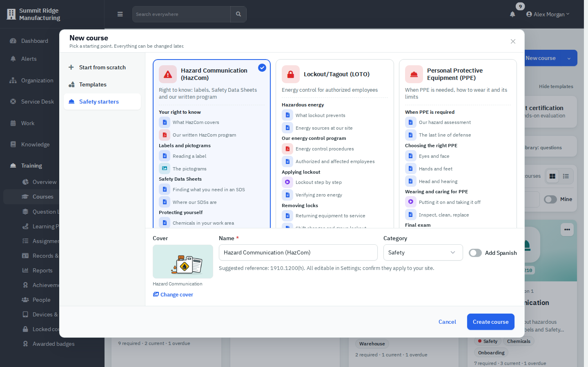

*Figure 2 — The New course window. Nothing is created until you select Create course.*

Categories group courses in the list. A Training administrator manages them from **Manage categories…** on the Courses page.

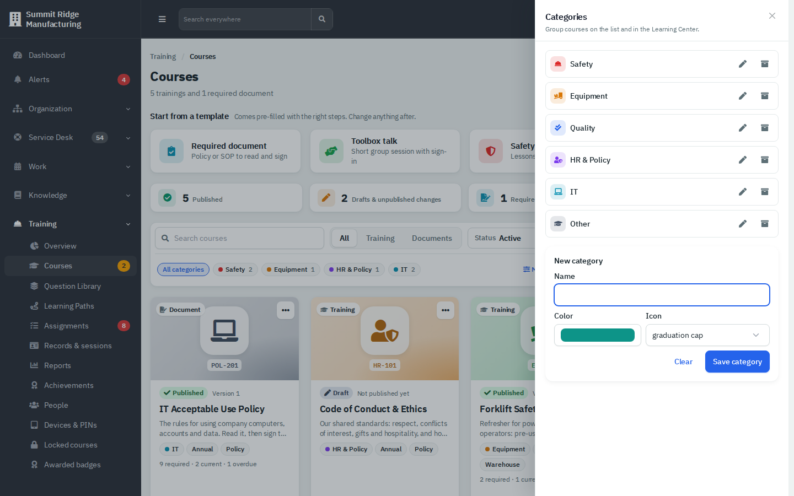

*Figure 3 — Manage categories… (level 3). Each category has a colour and an icon.*

### Build the content

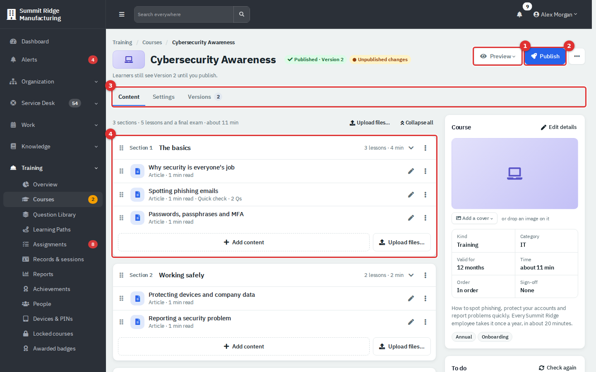

*Figure 4 — The course builder. The Content tab lists sections and lessons; the panel at the right holds the course card, To do, Languages, Versions and Quick add.*

1. **Preview** (1) opens what learners will see. **Publish** (2) is described below. The **...** menu has **Duplicate** and **Copy course UID**, plus **Archive…** and **Delete draft…** for level 3.
2. The three tabs (3) are **Content**, **Settings** and **Versions**.
3. Each **section** (4) groups lessons. Use **Add section** below the list to add another. The section's menu (**...**) offers **Add content**, **Upload files…**, **Rename**, **Move up**, **Move down** and **Delete**.
4. Select **Add content** inside a section, or a tile under **Quick add**, then choose a type.
5. Fill in the content window (next section) and select **Done**, or **Done & add another**.
6. Drag the grip beside a lesson or section to reorder it. A lesson's menu also has **Duplicate** and **Move to section**. **Delete** removes a lesson from the draft; an **Undo** appears for a few seconds.

Everything you type saves automatically ("Changes save automatically"). The **To do** card on the right lists what still blocks publishing, and **Check again** refreshes it.

#### The six content types

| Type | What you provide |
|---|---|
| **Article** | Text written in the editor (headings, lists, tables, images). You can also **Import from KB** (only when the Knowledge Base is on and you can read it; the import is a copy) or **Import Word (.docx)**. |
| **Document** | A PDF, shown to learners page by page. The size and page limits come from Admin → Training. For PowerPoint or Excel, save as PDF first. |
| **Video** | An uploaded MP4 or MOV, or a YouTube or Vimeo link (use **Check link**, then press play once to confirm it works). **Must watch** sets how much of the video counts (50-100%); skipping ahead does not count. Upload a caption file (.vtt or .srt) for uploaded videos. |
| **Image** | A photo or diagram (JPG, PNG, WebP or GIF) with a **Caption**. Learners can pinch to zoom. |
| **Quiz** | Graded questions. Turn on **Final exam (must pass to finish)** to make it the course's exam (one per course). See the quiz guide. |
| **Acknowledgment** | A short statement that people sign during the course. Options: **Require finger signature** and **Require PIN**. |

The content window has five tabs.

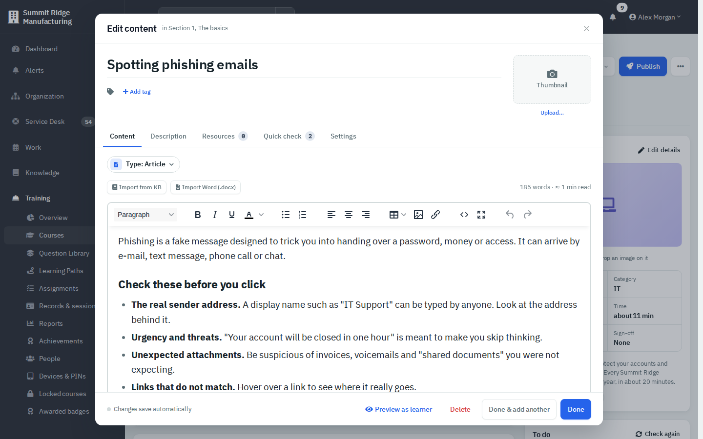

*Figure 5 — The content window for an Article lesson.*

- **Content**: the material itself, plus **Required**, **Allow download** and **Open without starting** in the side panel.
- **Description**: text shown above the lesson.
- **Resources**: checklists, SDS sheets, forms and links people can open from the lesson (**Upload file…**, **Add link**).
- **Quick check**: a few questions right after the lesson.
- **Settings**: **Responsible**, **Duration** (automatic unless you override it), **Required**, **Allow download**, **Open without starting the course**, **Minimum watch** (video) and **Section**.

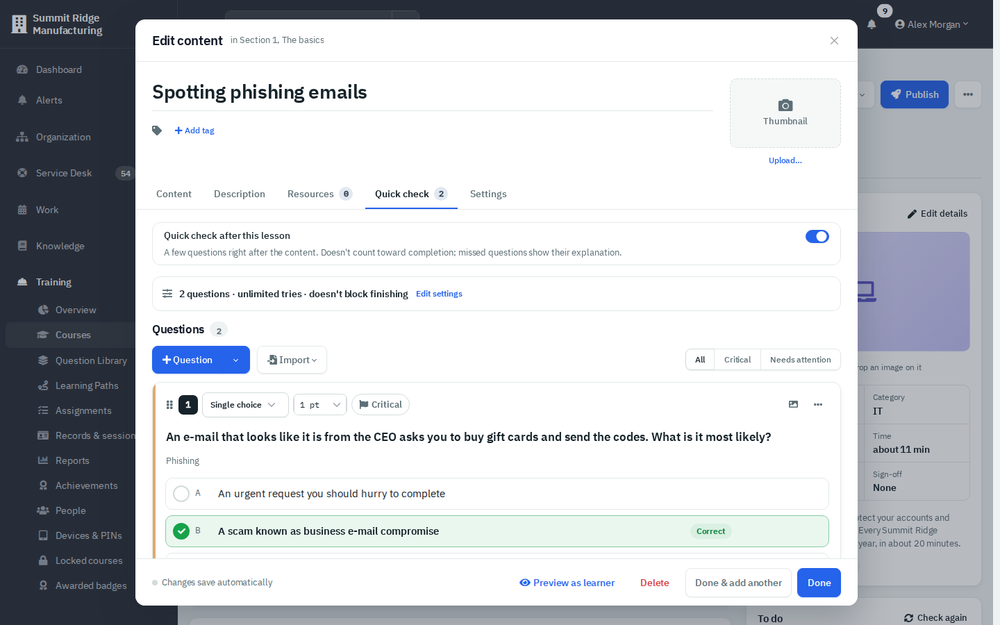

*Figure 6 — Quick check. It does not count toward completion; people see the explanation for anything they miss.*

A lesson marked **Required** must be finished to complete the course. **Open without starting** lets a learner open the lesson from the course page before starting, and it is never locked by **Take lessons in order**.

### Change course settings

Open the **Settings** tab. Every field saves on its own, and each card shows its own save indicator.

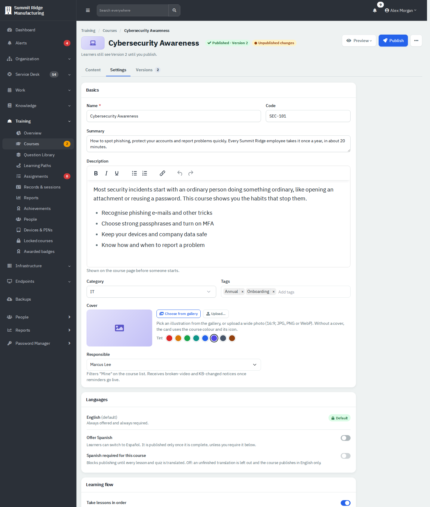

*Figure 7 — The Settings tab.*

| Card | Fields |
|---|---|
| **Basics** | **Name**, **Code** (must be unique), **Summary** (shown on the card), **Description**, **Category**, **Tags**, **Cover** (gallery, upload, tint colour), **Responsible** (the person the **Mine** filter uses). |
| **Languages** | Shown when an administrator has enabled more than one language. **Offer Spanish** and **Spanish required for this course**. If Spanish is required, publishing is blocked until every lesson and quiz is translated. If not, an unfinished translation is left out and the course publishes in English only. |
| **Learning flow** | **Take lessons in order** (each lesson opens when the one before is done) and **Estimated time** (automatic, or type your own). |
| **Prerequisites** | Courses people must complete first. Up to 10; a loop (A needs B, B needs A) is refused. |
| **Completion rules** | See below. |
| **Danger zone** | **Archive…** and, for a course that was never published, **Delete draft…** (level 3). |

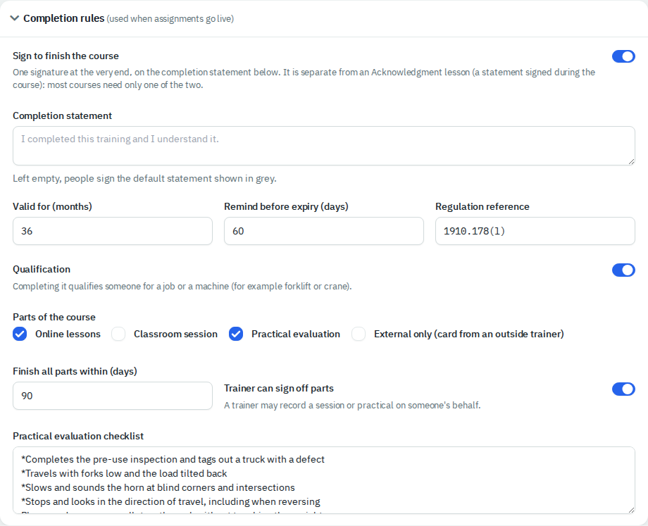

*Figure 8 — Completion rules for a qualification with a hands-on evaluation.*

Completion rules: **Sign to finish the course** with a **Completion statement** (left empty, people sign the default), **Valid for (months)** (empty means it never expires), **Remind before expiry (days)**, **Regulation reference**, **Qualification**, **Parts of the course** (**Online lessons**, **Classroom session**, **Practical evaluation**, **External only**), **Finish all parts within (days)**, **Trainer can sign off parts** and the **Practical evaluation checklist** (one item per line; start a line with `*` when missing it fails the evaluation). A course with a practical evaluation cannot be published without a checklist.

Pass marks, attempts and time limits are set on each quiz, not on the course. See the quiz guide.

### Create a required document

Use **New course ▾ → Required document**. A required document is always one document plus its acknowledgment, with an optional knowledge check.

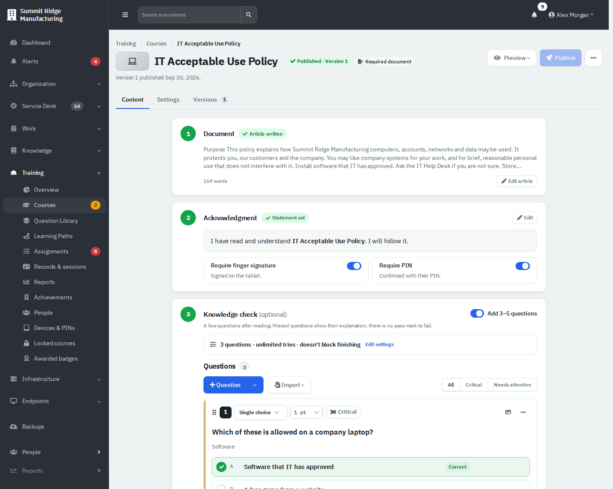

*Figure 9 — A required document in three steps.*

1. **Document**: upload a PDF, or write or import the text as an article.
2. **Acknowledgment**: edit the statement people sign and choose **Require finger signature** and **Require PIN**.
3. **Knowledge check (optional)**: switch on **Add 3-5 questions** for a short quiz with no pass mark to fail.

Need sections, videos or an exam? Open the course menu and choose **Duplicate as training course**.

### Preview a course

Select **Preview**. For a course that was never published it opens the draft. For a published course you choose **Preview the draft** or **Preview Version N**. The preview shows the learner screen in an iPad frame. Switch **Language** or **Device** (**iPad landscape**, **iPad portrait**, **Fit to window**), and use **Reset progress** to start again. Nothing is recorded. Quizzes are graded in the preview only at level 2 and above.

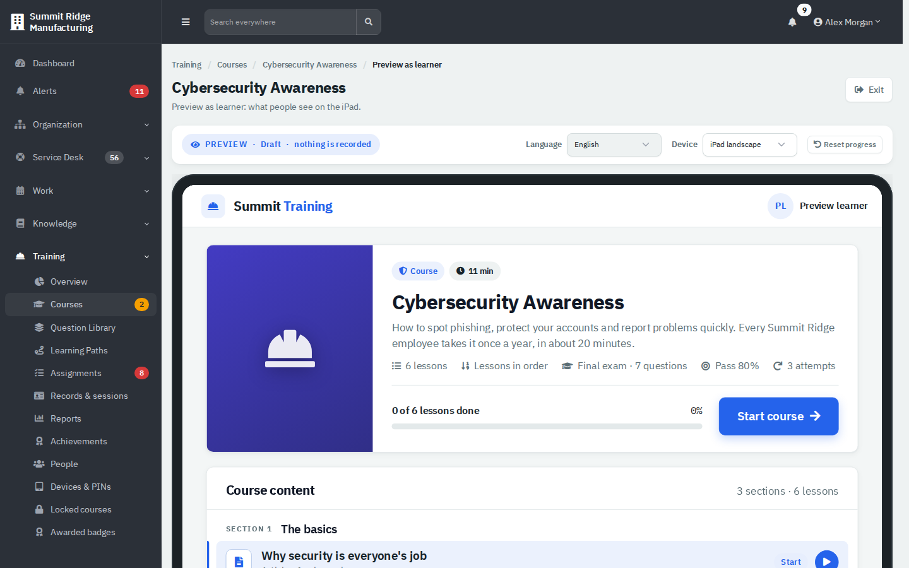

*Figure 10 — Preview as learner.*

### Publish a course

Only level 3 users can publish. For an author, **Publish** is greyed out and its tooltip names who can publish.

1. Open the course and select **Publish** (or **Review & publish** on the Versions tab).
2. Wait a moment while the course is checked. The window shows **1 Readiness**, **2 What's changing**, **3 Change note** and, for a course that already has a version, **4 Retrain**.
3. Fix anything shown in red. Errors block publishing (for example an article with no text or a quiz with no questions). Warnings (for example "final exam is not the last lesson") need you to confirm that you reviewed them.
4. Write a **Change note** of 5 to 1,000 characters. The first version is pre-filled with "First version".
5. Optionally turn on **People who finished an earlier version must take it again** and set **Due within** days.
6. Select **Publish Version N**.

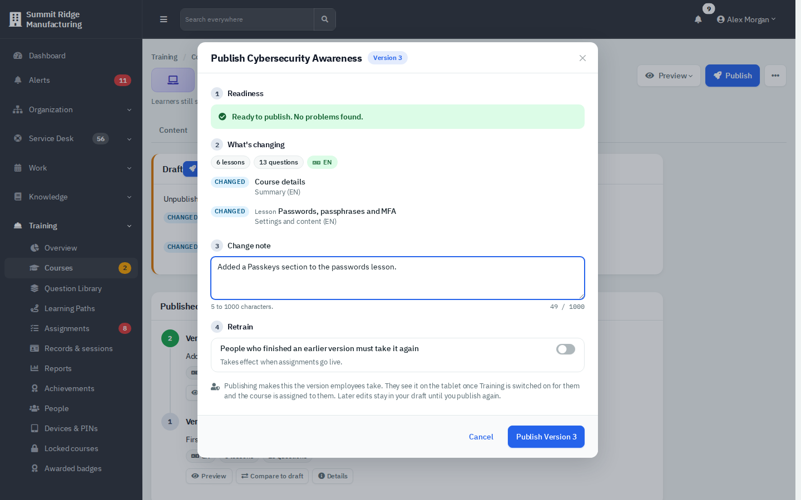

*Figure 11 — A course that is ready to publish as Version 3.*

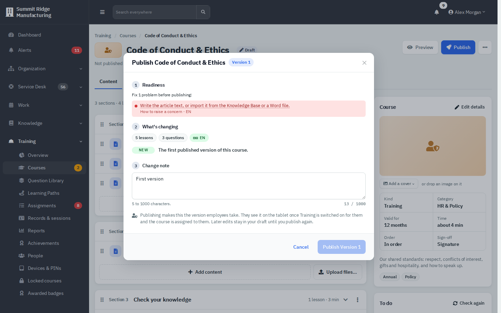

*Figure 12 — One problem blocks this draft: the lesson "How to raise a concern" has no text. Select the message to jump to the lesson.*

Publishing makes the new version the one employees take. It cannot be edited or deleted afterwards; later edits stay in your draft until you publish again. Each publish is also written to Training's tamper-evident ledger.

### Read the version history

The **Versions** tab shows the **Draft** card and the **Published versions** timeline.

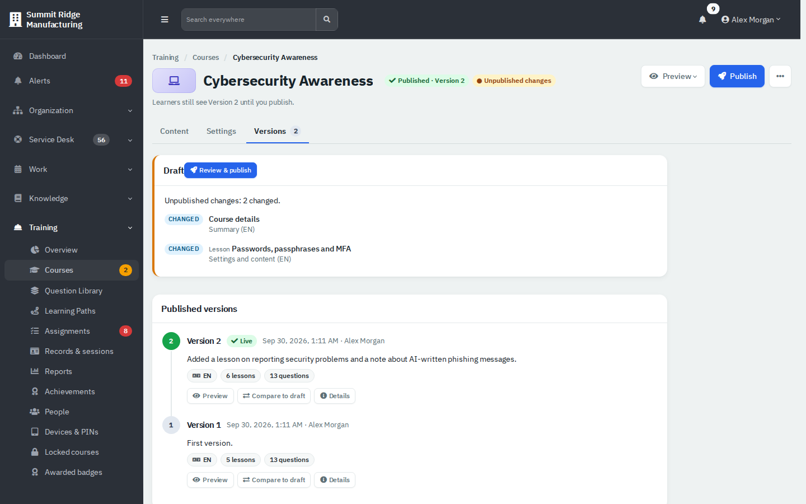

*Figure 13 — Versions: the draft shows what changed since the live version.*

- While you edit a published course, the header shows **Unpublished changes** and the line "Learners still see Version 2 until you publish."
- Each version lists its change note, languages, lesson count and question count. **Preview** opens that version, **Details** shows its fingerprint and integrity check, and **Compare to draft** lists what would change.

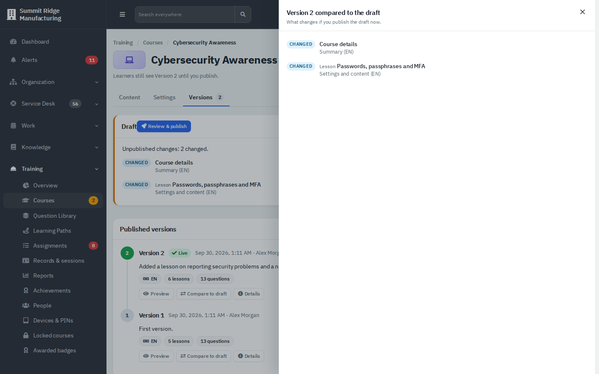

*Figure 14 — Compare to draft.*

People who finished an earlier version stay current when you publish. You decide, with the retrain switch, whether anyone has to retake the course.

### Duplicate, archive or delete

- **Duplicate** makes a private copy as a new draft (use it as a starting point for the next edition).
- **Archive…** (level 3) hides the course from the list and makes it read-only. Published versions, media and records are kept. Use the **Archived** status filter and **Restore** to bring it back.
- **Delete draft…** (level 3) is only for a course that was never published. It removes every section, lesson and question in it and cannot be undone. A published course can only be archived.

## Tips and good practice

- Keep lessons short. Five short articles are easier to finish than one long one.
- Put the final exam last. Otherwise publishing warns you.
- Write a specific change note. It is what you and an auditor will read later.
- Give every course a **Responsible** person; the **Mine** filter and future reminders use it.
- Editing a shared Question Library bank marks every course that draws from it as having unpublished changes (see the quiz guide).
- Test with **Preview the draft** before you publish, including the quiz.

## Related guides

- [Training: Quizzes, Paths and Badges](07b-training-quizzes-paths-and-badges.md)
