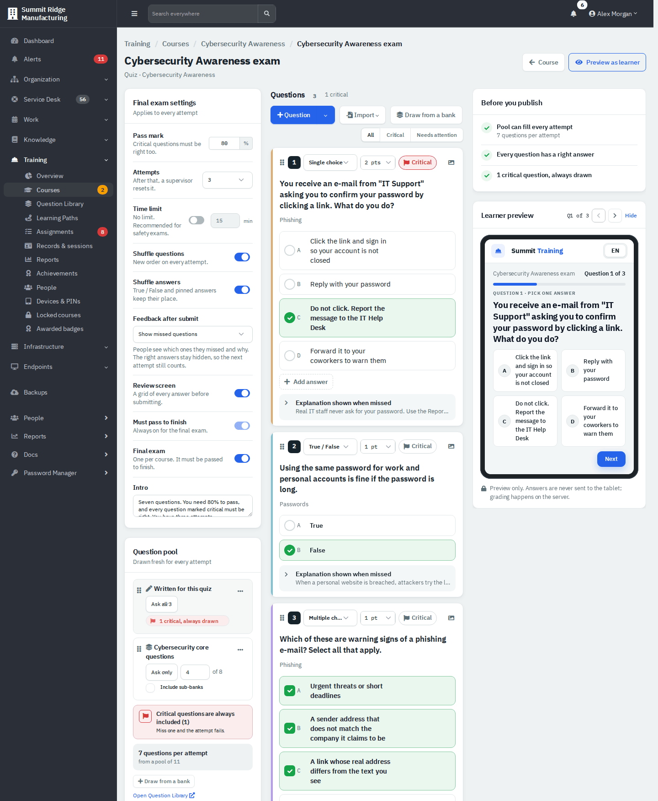
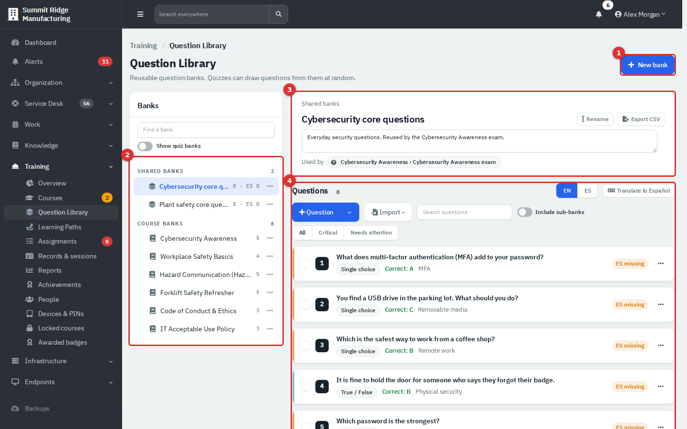
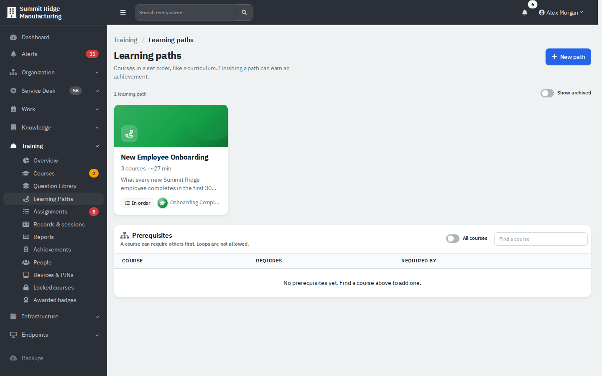
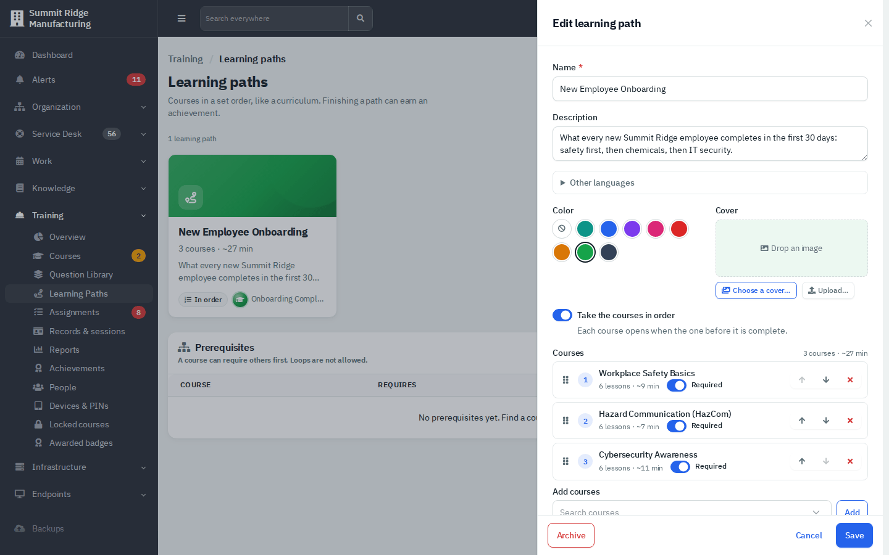
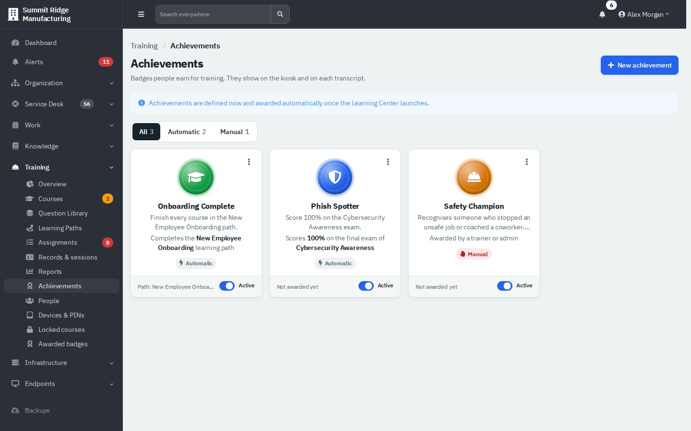
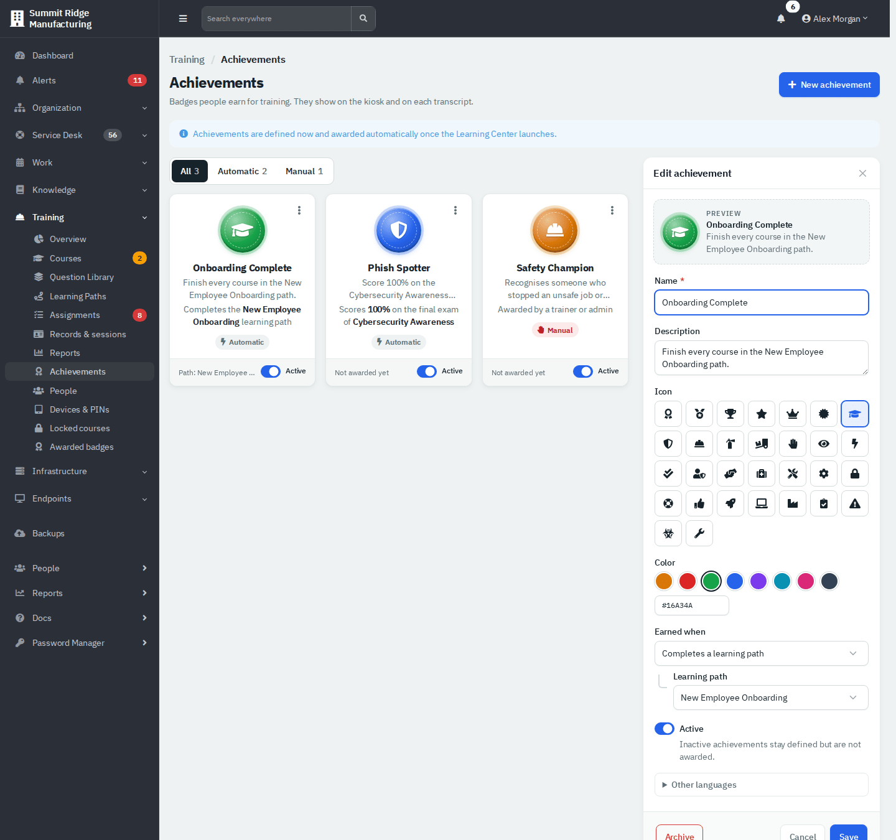
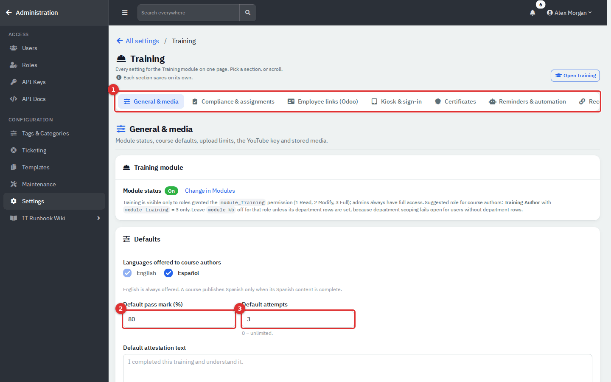

# Training: Quizzes, Paths and Badges

This page continues [Training: Courses and Content](07-training-courses-and-content.md). It covers quizzes and final exams, the Question Library (reusable question banks), learning paths, achievements (badges) and the Training settings.

| | |
|---|---|
| **Where to find it** | Sidebar → **Training** → **Question Library**, **Learning Paths** and **Achievements**. Quizzes are built inside a course (open a lesson, or select a quiz lesson in the course builder). Training settings are in **Administration → Settings → Training**. |
| **Who can use it** | Permission **Training**. Quizzes, **Question Library**, **Achievements** and **Awarded badges**: level 2 (Modify) or higher. **Learning Paths**: level 1 can view, level 2 can edit. Exporting a bank to CSV needs level 3, because the file contains the answer key. **Administration → Settings → Training** needs an administrator; a level 3 user who is not an administrator gets **Training → Training settings** with a shorter list. |
| **Turn it on** | The Training module must be on (**Administration → Settings → Modules → Show Training (LMS)**). |

## Quizzes and final exams

A quiz is a set of questions. It comes in two forms:

- A **Quiz lesson** in the course outline. It is either a normal quiz or the course's **Final exam** (only one per course; it must be passed to finish).
- A **quick check** attached to an Article, Document, Video or Image lesson. It does not count toward completion, allows unlimited tries and shows the explanation for missed questions.

### Build a quiz

1. In the course builder, add content of type **Quiz** and give it a title (or open a lesson and use its **Quick check** tab).
2. Add questions with **+ Question**: **Single choice**, **Multiple choice** or **True / False**. Type the question, add answers, and click the circle beside the correct one(s).
3. For each question set the points (1 to 10) and, if it is essential, turn on **Critical**. Add an optional topic and an **Explanation shown when missed**.
4. Set the quiz options on the left (see the table below).
5. Open **Preview as learner** at the top to try it. Fix anything under **Before you publish**, then publish the course.

In the content window, select **Open full quiz builder** to get the wide layout shown here.



*Figure 1 — The quiz builder. Settings are on the left, questions in the middle, the checklist and a live learner preview on the right.*

| Setting | What it does |
|---|---|
| **Pass mark** | 50 to 100%. A learner passes with at least this score and no critical question missed. |
| **Attempts** | How many tries a person gets (unlimited, or up to 10). After that, a supervisor resets it. |
| **Time limit** | Off by default. When on, 1 minute to 4 hours. Recommended for safety exams. |
| **Shuffle questions** / **Shuffle answers** | New order every attempt. True / False and pinned answers keep their place. |
| **Feedback after submit** | **Show missed questions** (which ones and why; correct answers stay hidden), **Show answers after a pass**, or **Score only**. |
| **Review screen** | A grid of every answer before submitting. |
| **Must pass to finish** | On for a final exam and for a quiz you require. |
| **Final exam** | Makes this quiz the course exam. The course then shows it as "Final exam". |
| **Intro** | Text shown before the first question. |

How scoring works: each question is all or nothing (a multiple-choice question is correct only when exactly the right answers are selected). A critical question is always included in every attempt, and missing one fails the attempt whatever the score.

### Choose where the questions come from

The **Question pool** card lists the quiz's sources:

- **Written for this quiz**: the questions you type in the quiz itself. **Ask all** uses every one.
- **A Question Library bank**: **Draw from a bank**, then choose the bank and **Ask only** a number (for example 4 of 8). Each attempt gets a fresh random draw. **Include sub-banks** adds the bank's child banks.

The card totals "N questions per attempt from a pool of M" and warns when a source is short. Two sources of one quiz cannot share the same questions. In the example, the Cybersecurity exam always asks its 3 own questions and 4 drawn from the "Cybersecurity core questions" bank.

### Add many questions at once

**Import** offers **Paste questions…** and **CSV file…** (with a **CSV template**). In **Paste questions…**, put one question in each block with a blank line between blocks:

```
Where must safety glasses be worn?
A) Only at machines
B) Everywhere on the plant floor
C) Only in the dock
ANSWER: B
```

You can mark a correct answer with `ANSWER:` or with a leading `*`. A preview lists errors row by row before anything is saved. Imports create questions in the language you are editing and never overwrite an existing answer key.

## The Question Library

**Training → Question Library** holds reusable banks. Any quiz can draw from a bank, and the bank shows which quizzes use it.



*Figure 2 — The Question Library.*

1. **New bank** creates a shared bank.
2. The tree lists **Shared banks** (usable by any course) and **Course banks** (each course's own questions). The counts show questions and translated questions per language. The **Show quiz banks** switch reveals the hidden "Quiz: …" banks that hold each quiz's own questions.
3. The header shows the bank's path, a description you can edit, **Rename**, **Export CSV** (level 3) and **Used by**, the quizzes that draw from it.
4. The question list has filters (**All**, **Critical**, **Needs attention**), a search box, **Include sub-banks**, **+ Question**, **Import** and, when a second language is on, **Translate to Español**. Select several questions to move, mark critical or delete them.

To organise a library, open a bank's menu for **Add sub-bank**, **Rename**, **Move** or **Archive**, or drag a bank onto another. Banks can be nested five levels deep. A bank cannot be archived while a quiz still draws from it.

Important: editing a shared bank (adding, changing or removing a question) counts as a change to every course that draws from it. Each of those courses shows **Unpublished changes** until someone publishes it again. Learners keep taking the published version until then.

## Learning paths

A learning path is an ordered curriculum of courses, such as a new-hire onboarding set. Paths are catalog settings, not course content, so there is nothing to publish: **Save** applies at once.



*Figure 3 — Training → Learning Paths.*

### Create or edit a path

1. Go to **Training → Learning Paths** and select **New path** (or select a path card to edit it).
2. Enter a **Name** and **Description**, pick a **Color**, and optionally a **Cover**.
3. Turn on **Take the courses in order** if each course should open only when the one before it is complete.
4. Under **Add courses**, click the box to open the list of courses (or type to search), select one or more, then **Add**. Drag them, or use the arrows, to set the order. Turn off **Required** on a course to make it optional. You can add up to 50 courses.
5. Choose a **Completion achievement** if finishing the path should earn a badge.
6. Select **Save**. If someone else changed the path meanwhile, **Load their version** shows theirs.



*Figure 4 — The path editor. The three courses are required and taken in order.*

**Archive** hides a path (turn on **Show archived** to see it and **Restore** it). People with level 1 only see the published courses in a path.

The **Prerequisites** table on the same page shows which courses require others first. Select a course to edit its list (up to 10, no loops). The same list is on each course's Settings tab.

## Achievements (badges)

Achievements are badges people earn. They show on the kiosk and on each person's transcript.



*Figure 5 — Training → Achievements. Filter by All, Automatic or Manual.*

### Create an achievement

1. Select **New achievement**.
2. Enter a **Name** and **Description**, choose an **Icon** and a **Color** (a swatch or a hex code). The preview updates as you type.
3. Choose **Earned when**, and fill in the extra field it asks for.
4. Leave **Active** on. An inactive badge stays defined but is not awarded.
5. Select **Save**.



*Figure 6 — Editing the Onboarding Complete badge.*

| Earned when | Kind |
|---|---|
| **Awarded by a trainer or admin** | Manual |
| **Completes a course** | Automatic |
| **Completes every course in a category** | Automatic |
| **Completes a learning path** | Automatic |
| **Scores 100% on a final exam** (any exam, or one course) | Automatic |
| **Passes a final exam on the first try** (any exam, or one course) | Automatic |
| **All required training on time for a number of months** | Automatic (checked nightly) |
| **Completes a number of courses** (optionally in one category) | Automatic |

Automatic badges are awarded by the app when a completion or an exam result is recorded, and a nightly check catches any that were missed. Each person earns each automatic badge once. 

> **Note**: A blue notice at the top of the page (and a hint in the path editor) still says badges are awarded "once the Learning Center launches". The wording is out of date; the award code runs now.

To give a manual badge, go to **Training → Awarded badges** (level 2) and select **Award manually**. Choose the badge, the person (only people in your departments), and write a reason of 5 to 500 characters. The reason appears on the person's transcript and cannot be edited later. The same badge can be given again. The list on that page shows every badge earned, newest first, and can be filtered by badge or person. **Archive** (in the panel or card menu) retires a badge.

## Training settings

Administrators open **Administration → Settings → Training** (the **Training** tile in the **Workflows** group). It is one page with a section menu; **each section saves on its own** and warns you before you leave with unsaved changes.



*Figure 7 — Administration → Settings → Training, General & media. (1) Section menu, (2) Default pass mark, (3) Default attempts.*

**General & media** is the part authors care about:

| Setting | Meaning |
|---|---|
| **Module status** | Shows On or Off. **Change in Modules** goes to the switch. |
| **Languages offered to course authors** | English is always on. Turn on **Español** to let authors translate. A course publishes Spanish only when its Spanish content is complete. |
| **Default pass mark (%)** | 50 to 100. Used for new quizzes and exams. Existing quizzes keep their own value. |
| **Default attempts** | 0 means unlimited, up to 10. Used for new quizzes and exams. New quick checks start with unlimited attempts. |
| **Default attestation text** | Pre-fills the completion statement of new courses. |
| **Media limits** | Maximum size for videos, PDFs, images and resource files (each at most 95 MB), the PDF page limit and the total **Media budget**. Uploads over the budget are refused. |
| **YouTube Data API key** | Optional. With it, the length and embeddable status of a YouTube video are read when you add the link. It is stored encrypted and never shown again; **Test key** checks it. |
| **Media storage** | Space used by kind, projected backup size and **Unreferenced media** older than 7 days, with **Review & purge…**. A purge deletes the file only, needs a reason and is written to the training ledger. |

The other sections are **Compliance & assignments** (due-soon window, compliance target, evidence upload size, **Recalculate assignments now**), **Employee links (Odoo)** (needs an Odoo server, which is outside this guide), **Kiosk & sign-in**, **Certificates**, **Reminders & automation** and **Records ledger** (**Verify now** checks the tamper-evident chain). Assignments, kiosks and certificates are covered in the delivery guides. The old addresses `settings_training_compliance.php` and `settings_training_kiosk.php` redirect to the matching section.

## Tips and good practice

- Put shared questions in the Question Library and draw a few per attempt, so people rarely see the same exam twice.
- Mark only truly essential questions as **Critical**: a single miss fails the attempt.
- Give safety exams a time limit and fewer attempts; use unlimited quick checks for learning.
- Write an explanation for every question. It is what learners read when they miss one.
- Finish edits to shared banks before you publish the courses that use them.
- Use a path with **Take the courses in order** for onboarding, and attach an achievement so completion is recognised.

## Related guides

- [Training: Courses and Content](07-training-courses-and-content.md)
