# Training: Assignments, Records and Reports

Once a course is published (see [Training: Courses and Content](07-training-courses-and-content.md)), this is where you decide who has to take it, by when, and where you check that they did. Assignments say who owes which course. Records are the permanent proof that someone finished. Reports roll both up by department.

| | |
|---|---|
| **Where to find it** | Sidebar → **Training** → **Overview**, **Assignments**, **Records & sessions**, **Reports** and **People**. Training is an app-level menu; there is no Training menu inside a department workspace. |
| **Who can use it** | Permission **Training**. Level 1 (Read): view assignments, records, reports and transcripts. Level 2 (Modify): also **Assign training**, **Extend**, **Waive**, **Reset progress**, **Recalculate now**, record external cards, paper records, practical evaluations and sessions. Level 3 (Full): also create and archive rules, void records, **Reset (take again)**, set hire dates, change who is on the roster and who is a trainer. Levels 1 and 2 only see people in the departments ticked on the user's **Access** tab (**Administration → Users**). With no ticks they see nobody. Level 3 and administrators see every department. |
| **Turn it on** | An administrator switches on **Administration → Settings → Modules → Show Training (LMS)**. Nothing here appears until at least one course is published. |

## What it's for

- **Assign** a course to named people (**Assign training**) or to a whole group with a standing **rule** ("everyone in Production completes HazCom within 30 days").
- **Track** who is overdue, who is due soon and who has not started.
- **Keep records** that cannot be edited afterwards: every completion has a record number, how it was proven, and a certificate for training courses.
- **Report** compliance by department and course, print or export it for an audit.

Employees do their courses on a training kiosk, or open the same training from the **Training** tab of the Department Portal with **Start training**. Both sides are covered in [Training: Kiosks, Learners and Certificates](08b-training-kiosks-learners-certificates.md).

## How the pieces fit together

1. A **rule** or an **Assign training** action creates an **assignment** for each matching person: one person, one course, one due date.
2. The employee finishes the course (on a kiosk, or from the Department Portal) or the office records it (external card, paper record, session, practical evaluation). That writes a **record**.
3. A record closes the open assignment as **Completed**. Courses that expire (for example "valid 12 months") get a new assignment on their own before the record runs out.
4. The **Overview** and **Reports** are calculated from assignments and records, so they are always current.

Everyone who belongs to a department is on the **training roster** automatically. People without a department, or people you exclude, are not (see [People and the roster](#people-and-the-roster)).

## A quick tour

### The Overview

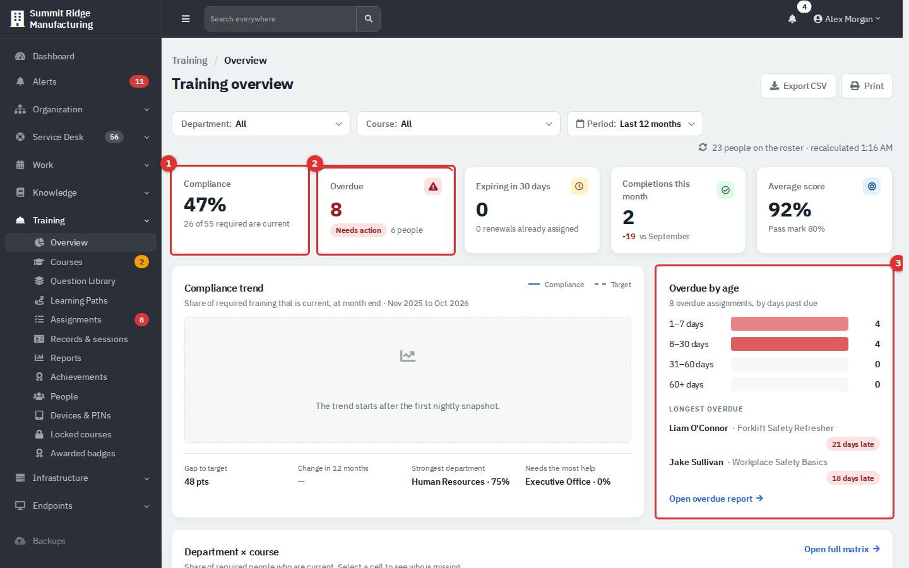

*Figure 1 — Training → Overview.*

1. **Compliance** is the share of required person-and-course pairs that are current ("26 of 55 required are current"). Waived pairs are left out. The target is set in **Administration → Settings → Training → Compliance & assignments** (default 95%).
2. **Overdue** counts overdue assignments and the people behind them. Click it to open the Overdue report.
3. **Overdue by age** groups overdue assignments into 1–7, 8–30, 31–60 and 60+ days and names the longest overdue ones. **Open overdue report** jumps to the report.

The other tiles are **Expiring in 30 days**, **Completions this month** and **Average score**. Below them you find the **Compliance trend** (one point per month from nightly snapshots; it fills in as snapshots accumulate), a **Department × course** matrix, **Expiring soon** and **Recent completions**. **Export CSV** and **Print** are at the top, and the filters narrow everything by department, course and period.

The red number beside **Assignments** in the sidebar is the number of overdue assignments in your scope. Clicking the menu item then opens the list already filtered to **Overdue**.

### The Assignments list

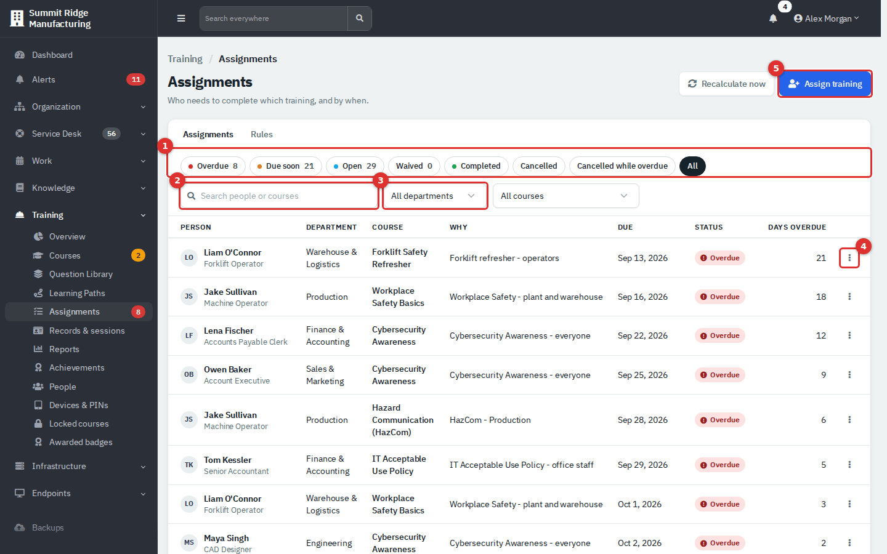

*Figure 2 — Training → Assignments.*

1. Status buttons, each with a count. See the table in the reference section.
2. **Search people or courses**.
3. **All departments** and **All courses** filters. The page remembers them in the address, so you can share the filtered view as a link.
4. The row menu (three dots): **Extend…**, **Waive…**, **Reset progress…** and **History**. Completed rows offer **Reset (take again)…** (level 3). Waived rows offer **Un-waive…**.
5. **Assign training** (level 2).

**Why** says what created the assignment: the rule's name, or "Assigned by hand". **Days overdue** counts from the due date.

## Common tasks

### Assign a course to specific people

1. Go to **Training → Assignments** and click **Assign training**.
2. Under **People**, type a name, title or department and pick each person. Only people on the roster in your departments are listed. You can add up to 200.
3. Choose the **Course or document**. Documents to sign are listed in their own group.
4. Set the **Due date** (it cannot be in the past), or use **In 7 days**, **In 14 days** or **In 30 days**. Add a **Note** if you want the reason to show on the assignment.
5. Click **Assign to N people**.

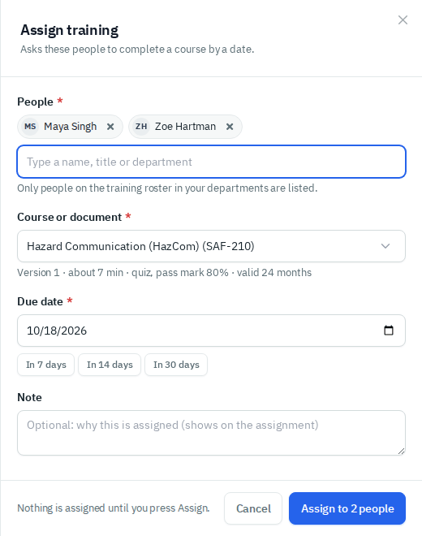

*Figure 3 — Assign training. Nothing is assigned until you press the button.*

People who already have this course open or who already hold a current record are skipped, and the result tells you who was assigned and who was not. Each use of **Assign training** is stored as a one-time rule; you can find it under **Assignments → Rules → Made by hand**.

You can also start from a person: **Training → People** → row menu → **Assign training…**, or the **Assign training** button on a transcript.

### Extend a due date

1. In **Assignments**, open the row menu and choose **Extend…**.
2. Pick the **New due date** and write a **Reason** (at least five characters).
3. Click **Move due date**.

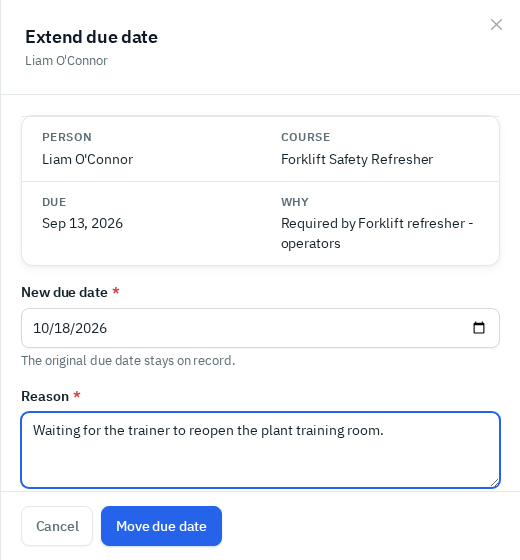

*Figure 4 — Extend due date. The original due date stays on record and shows as a tooltip on the list.*

### Waive an assignment

A waiver tells the system this person does not have to take this course for now. They are not asked to do it and they are left out of the compliance numbers.

1. Row menu → **Waive…**.
2. Set **Waive until**, and give a **Reason**.
3. Click **Waive**.

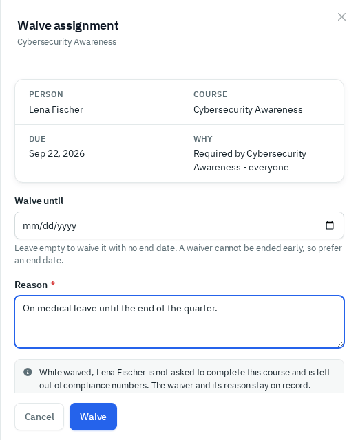

*Figure 5 — Waive assignment.*

Level 2 users must give an end date within one year. Only level 3 can leave the end open. A waiver cannot be ended early by editing it; a level 3 user ends one with **Un-waive…** on the waived row.

### See what happened to an assignment

Row menu → **History** shows the person, course, rule, due date, original due date and every event (assigned, extended, waived, completed, reset) with who did it and when.

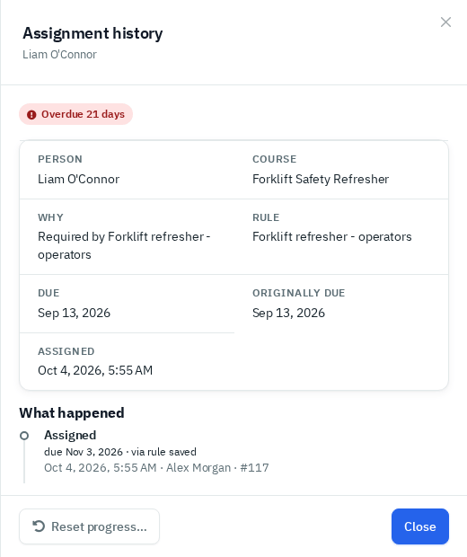

*Figure 6 — Assignment history. **Reset progress…** is also offered here.*

### Restart someone's progress, or let them take a course again

- **Reset progress…** (level 2, open assignment). The person's unfinished kiosk run is abandoned and their next sign-in starts at lesson 1 with a fresh set of tries. Their earlier answers stay on file as history. You can move the due date at the same time. Use it when someone is stuck or the content changed under them.
- **Reset (take again)…** (level 3, completed assignment). This **voids the record**, which revokes its certificate, and gives the person a new assignment. It only works while the record is still their latest one. Voiding cannot be undone.

The **Locked courses** page lists kiosk courses people cannot continue because they ran out of tries on a must-pass quiz (Training level 2). You can give another try or restart them on the current version, each with a reason.

### Create a rule that assigns automatically

Rules are for standing requirements. A rule looks at the roster, finds everyone who matches, assigns them, and keeps doing so for people who join or move later.

1. Go to **Training → Assignments → Rules** and click **New rule** (level 3).
2. Under **What**, pick the course or document.
3. Under **Who**, choose **Add condition** and pick department, job position, work location, job group or specific people. People must match **all** the condition types, and any of the values inside one type. Or choose everyone. Switch on **New hires only** to limit it to people hired after the rule is saved.
4. Under **When**, set the number of days current staff have, and the number of days after hire for new hires. **Required** counts the assignment toward compliance. **Assign once only** stops a renewal assignment when the record expires. Renewal timing itself belongs to the course.
5. Check the **Preview** on the right. It says how many people match, how many will be assigned, how many are already current, and lists them.
6. Click **Save rule**. Assignments are created straight away.

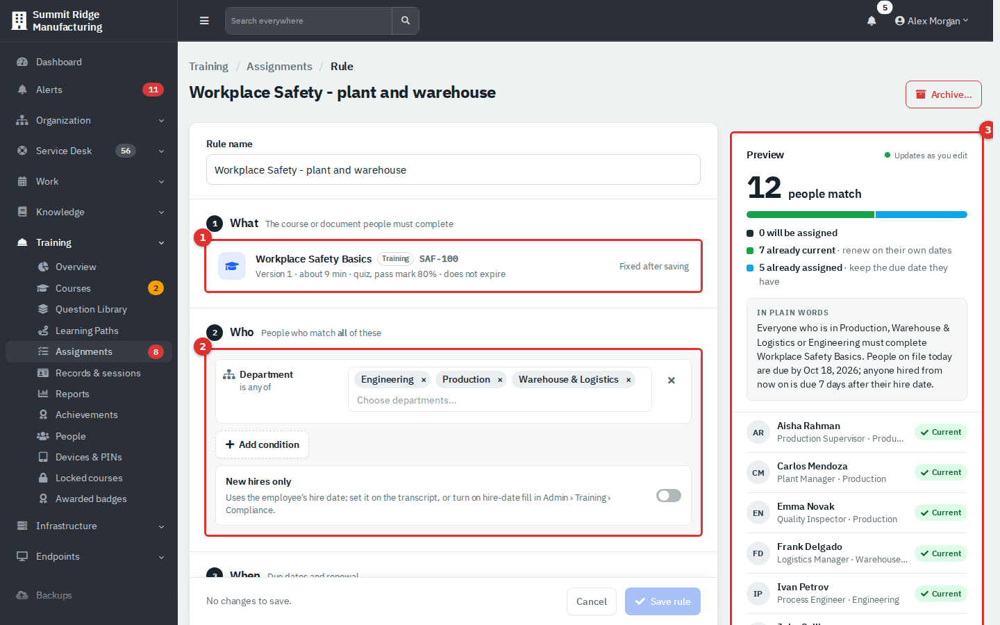

*Figure 7 — Rule editor, showing the Workplace Safety rule and its preview.*

The **Rules** tab lists each rule with how many people it matches and how many of those are open and overdue. Click the open or overdue number to see those assignments. A rule's course cannot be changed; archive the rule and make a new one.

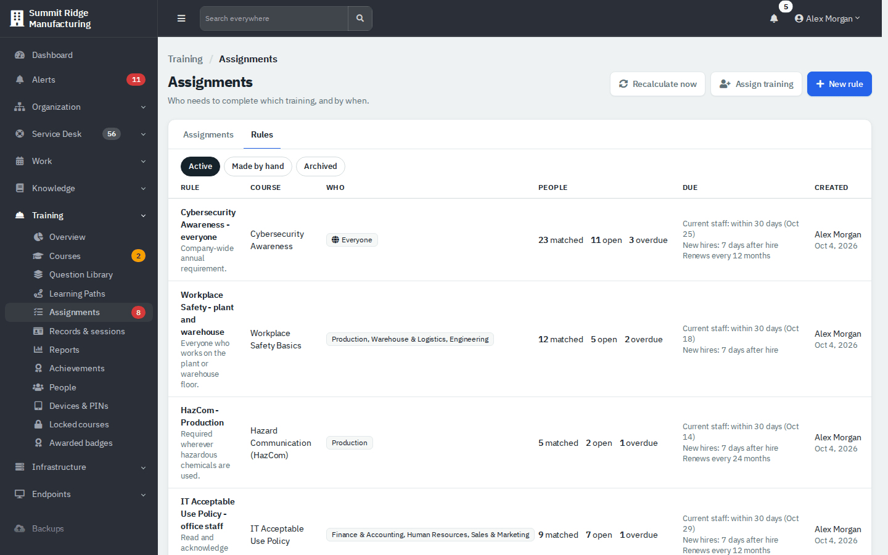

*Figure 8 — Assignments → Rules. The views are **Active**, **Made by hand** and **Archived**.*

**Archive…** (level 3) stops a rule assigning. Open assignments that no other rule requires are cancelled; completed records stay.

### Recalculate now

Assignments update automatically when a rule is saved, a person joins or changes department, or a record is written. **Recalculate now** (level 2) re-checks every rule against the current roster and records. Use it after a bulk change in Organization.

### Find a record

**Training → Records & sessions** lists every record on file.

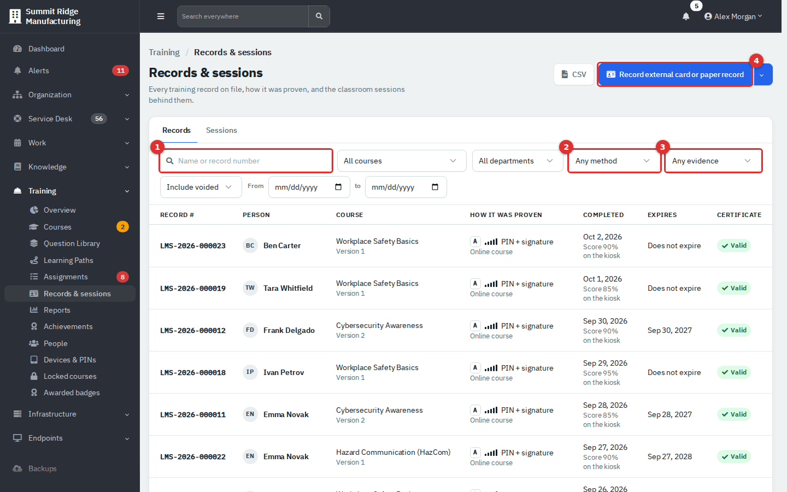

*Figure 9 — Training → Records & sessions → Records.*

1. Search by name or record number.
2. Filter by **method** (online course, instructor-led, blended, practical evaluation, external card, paper record).
3. Filter by **evidence** strength, A to E (see the reference).
4. **Record external card or paper record** (level 2). The arrow beside it adds **Record practical evaluation**.

Other filters: course, department, include or hide voided records, and a date range. **CSV** exports the filtered list. Voided rows are struck through but stay on file.

Click a record number to open the evidence page.

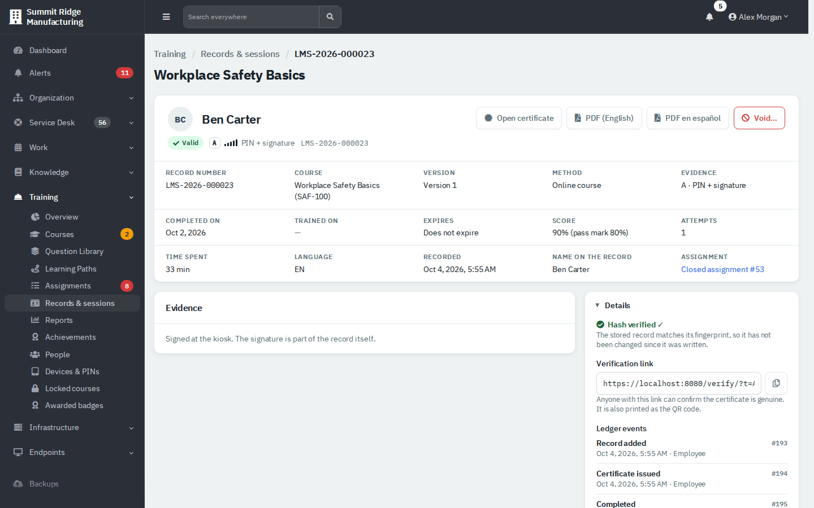

*Figure 10 — One record. **Details** shows **Hash verified**, the public verification link and the ledger events.*

A record that came from a kiosk or portal run has one more card below the summary, **Kiosk evidence (run #N)**. It shows when the run started and was signed off, the training device it ran on (a course started from the Department Portal shows **Portal:** and the person's name), and one row per lesson with the time the server credited against the time required. Each quiz or exam attempt opens to a table of **Question**, **Choices shown**, **Chosen** and **Result**, and it spells out the real question and answer wording, in the language the learner used. A question marked critical is flagged, and a quick check inside a lesson is labelled **Quick check**. The finger signatures follow. Records entered by the office, such as external cards, have no run and no such card.

The page has **Open certificate**, **PDF (English)**, **PDF en español** and **Void…** (level 3). A voided record shows who voided it, when and why. It stays visible, and its certificate stops verifying.

### Record something that happened outside the kiosk

Use **Record external card or paper record** for outside training cards, records from before the system, and paper acknowledgments of a document.

1. Choose the **Person** and **Course**.
2. Pick **External card** (an outside certificate; **Issued by** is required) or **Paper record**.
3. Fill the dates. **Issue date** is required. **Expires** is optional, otherwise the course's own validity applies.
4. Attach a **Scan of the card or record**, or tick **No scan available** and say why (at least ten characters).
5. Click **Save record**.

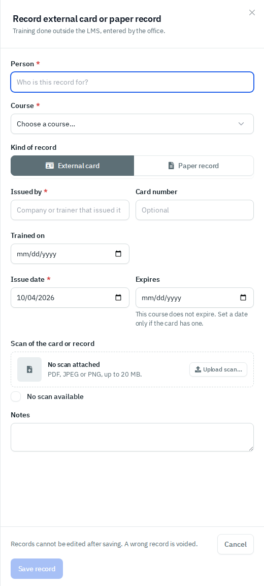

*Figure 11 — Record external card or paper record. Records cannot be edited after saving; a wrong one is voided.*

This does not email anyone. If the person had an open assignment for the course, it closes as **Completed**.

### Sessions

The **Sessions** tab records a classroom or hands-on class: date, trainer, attendees, whether each person signed the sheet, and for courses with a practical, who passed it. Finalizing a session issues records for the people who have completed every part. Anyone still missing the online part is shown as pending and gets the record when they finish on the kiosk. A session held on an earlier day needs the scanned sign-in sheet attached.

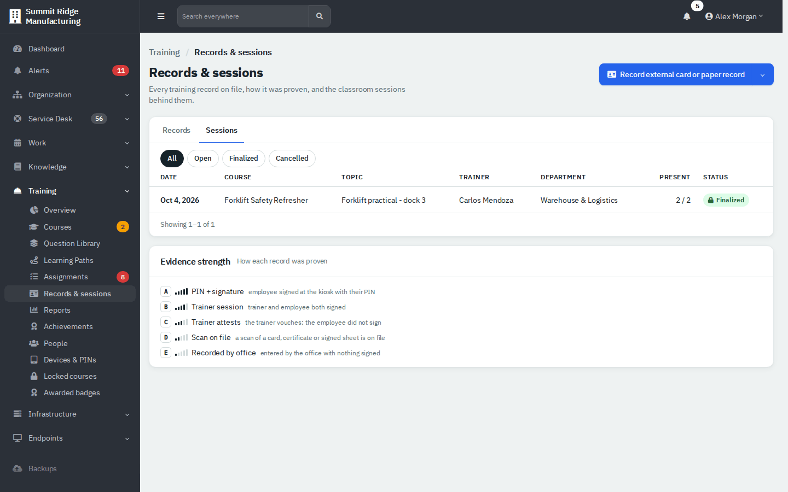

*Figure 12 — Records & sessions → Sessions, with the evidence-strength key underneath.*

### Look up one person

Open a person's **transcript** from a record, from **Training → People**, or from the row menu. It shows their qualifications, assignments, history and achievements, with **Print transcript** and **Download PDF**.

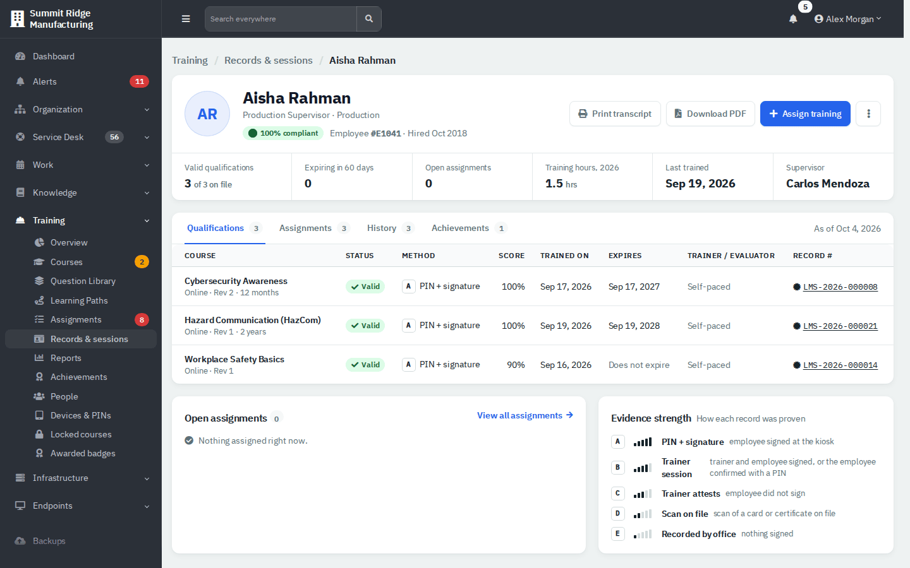

*Figure 13 — A transcript. **Assign training** is on the page.*

### Run a compliance report

**Training → Reports** has five tabs, all filterable by department and course, all with **Export CSV** and **Print**.

| Tab | What it shows |
|---|---|
| **Compliance matrix** | Department by course, with the percentage of required people who are current. Click a cell to see who is missing. |
| **Overdue** | Overdue assignments grouped by department, most overdue first. Printing puts each department on its own page. |
| **Expiring** | Records that expire within 30, 60 or 90 days. |
| **Course analytics** | Completions, scores and pass rates for one course. |
| **Document acknowledgments** | For each required document, who has signed the current version, an older version, or nothing. |

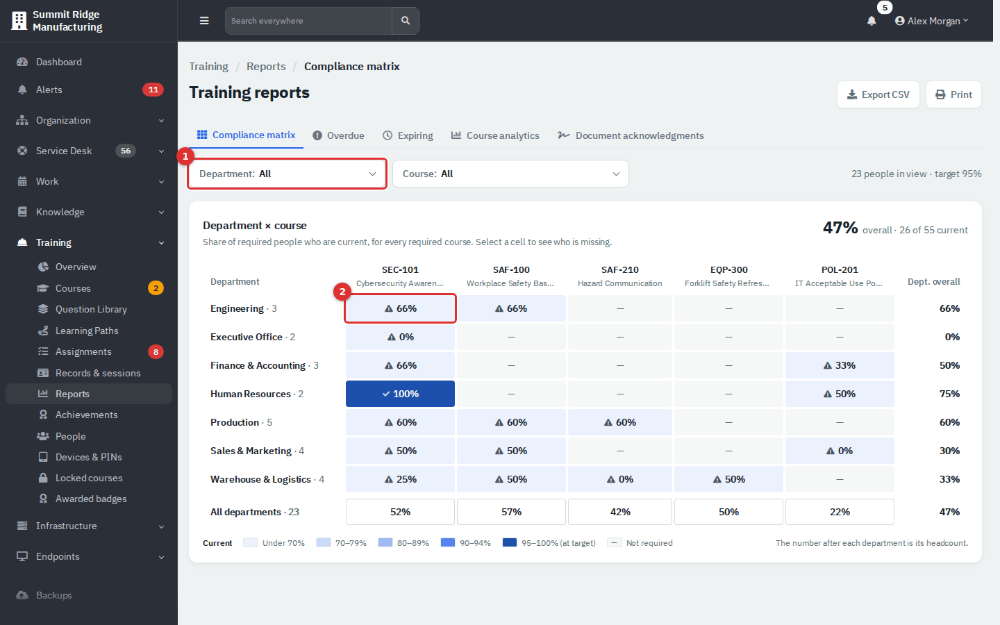

*Figure 14 — Reports → Compliance matrix.*

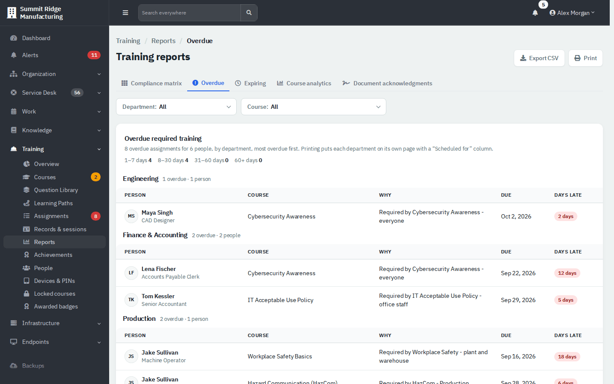

*Figure 15 — Reports → Overdue. Hand this to department heads.*

Reports only count people you may see, so two users can see different totals.

### People and the roster

**Training → People** has four tabs: **Roster**, **Job groups**, **Trainers** and **Odoo links**. On **Roster**, the row menu offers **Exclude from training…**, **Change hire date / Rehired…** and **Assign training…**. Excluding takes the person out of every rule and the compliance numbers, and needs a reason. Level 3 maintains the roster, job groups and trainers.

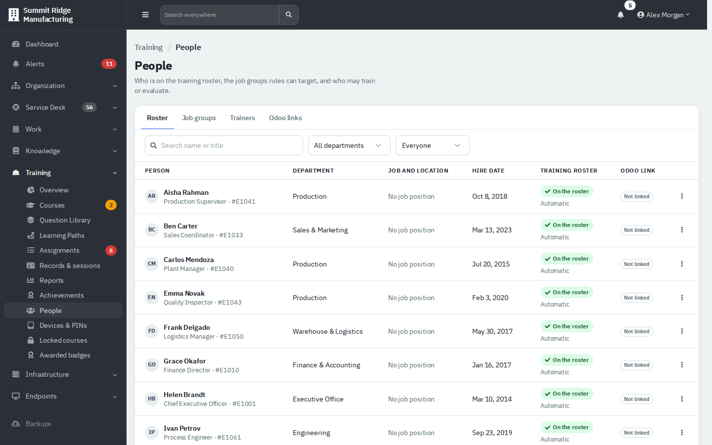

*Figure 16 — Training → People → Roster. Odoo links apply only if your company uses the Odoo integration.*

## Reference

### Assignment statuses (buttons on the Assignments list)

| Status | Meaning |
|---|---|
| **Overdue** | Open, and the due date has passed. |
| **Due soon** | Open and due within the "due soon" window (default 30 days; **Administration → Settings → Training → Compliance & assignments**). |
| **Open** | Not finished and not waived. Includes the overdue and due-soon ones. |
| **Waived** | Excused for now. Not counted in compliance. |
| **Completed** | A record closed it. |
| **Cancelled** | No longer required, for example the rule was archived or the person left the roster. |
| **Cancelled while overdue** | Cancelled after its due date had passed. Kept so late work is not hidden. |
| **Not qualified** | Shown when a renewal's earlier record has already expired. The button appears only when there are such rows. |
| **All** | Everything. |

### Evidence strength

| Letter | Meaning |
|---|---|
| **A** PIN + signature | The employee signed at the kiosk with their PIN. |
| **B** Trainer session | Trainer and employee both signed. |
| **C** Trainer attests | The trainer vouches; the employee did not sign. |
| **D** Scan on file | A scan of a card, certificate or signed sheet is attached. |
| **E** Recorded by office | Entered by the office with nothing signed. |

### Reminders

Employees are not emailed. They see their overdue and due-soon courses when they sign in at a kiosk, and on the **Training** tab of the Department Portal. Agents can get a daily in-app Training digest, and Training managers an escalation for people overdue more than a set number of days. Both are off by default; a person with Training at Full or an administrator turns them on in **Reminders & automation → Reminder digests** (**Administration → Settings → Training**, or **Training → Training settings** for Full users who are not administrators).

### Who can change the Training settings

Most Training settings belong to IT. Someone with Training at level 3 who is not an administrator opens **Training → Training settings** and can change the course defaults, the compliance defaults (due-soon window, target percentage, evidence scan size), **Recalculate assignments**, **Capture today's snapshot**, the certificate signatory and the reminder digests. Everything else is read-only there and says to ask an administrator: media limits and storage, the YouTube key, the Odoo links and sync, the kiosk session timeouts, PIN lockouts, device caps, setup code lifetimes, the records-ledger check and the public certificate check switch. Administrators change all of it under **Administration → Settings → Training**.

## Tips and good practice

- Prefer rules over repeated manual assignments. A rule keeps up with new hires and renewals.
- Use **Waive** with an end date, not an open-ended one. Ended waivers resurface the assignment.
- Write a real reason when extending. It shows in the history during an audit.
- Do not void a record to fix a typo. Voiding revokes the certificate and creates a new assignment.
- Check the **Overdue** report weekly and send each department its page.
- Give department supervisors Training level 2 and tick their departments on their Access tab.

## Related guides

- [Training: Courses and Content](07-training-courses-and-content.md)
- [Training: Quizzes, Paths and Badges](07b-training-quizzes-paths-and-badges.md)
- [Training: Kiosks, Learners and Certificates](08b-training-kiosks-learners-certificates.md)
