# Training: Kiosks, Learners and Certificates

Employees take their training in a simple learning app. At a shared training kiosk, an iPad or a PC that opens straight into the app, they find their name and enter a PIN. From the Department Portal, they open the same app already signed in with **Start training**. Either way they work through the lessons and quiz, and sign. The finished course becomes a record with a certificate, and anyone can check that certificate on a public page. This guide covers setting up the devices and PINs, what the learner sees, and certificates.

| | |
|---|---|
| **Where to find it** | Agent side: sidebar → **Training** → **Devices & PINs**. Learner side: the address `/kiosk/` on a set-up device, or **Start training** on the **Training** tab of the Department Portal (see [Employee portal](11-employee-portal.md)). Public certificate check: `/verify/`. |
| **Who can use it** | Permission **Training kiosk** for **Devices & PINs**. Level 1 (Read): see devices and PIN status. Level 2 (Modify): also unlock PINs, print setup slips and clear kiosk cooldowns. Level 3 (Full): also set up, re-issue and revoke devices. Picking a device from Assets also needs the Assets permission (Read); without it you can still set up a device as "not in Assets". Records and certificates need **Training** (see [Assignments, Records and Reports](08-training-assignments-and-records.md)). Employees need no RivetIT login at a kiosk, only a training PIN. From the portal they use their ordinary portal login, and still need the training PIN to sign. |
| **Turn it on** | **Administration → Settings → Modules → Show Training (LMS)**. The kiosk limits, PIN rules and setup code lifetimes are IT-only settings under **Administration → Settings → Training → Kiosk & sign-in**. The certificate signatory and the public check switch are under **Certificates** on the same page. |

## What it's for

- Give people on the shop floor, in the warehouse or at a front desk a way to do required training without a computer account.
- Prove who did the training: the person signs with a PIN, and the record keeps that evidence.
- Hand out certificates that anyone can check with a QR code.

## Two ways to reach training

| Way in | What the employee does |
|---|---|
| **Training kiosk** | Opens `/kiosk/` on a set-up iPad or PC, finds their name (or, on a personal device, goes straight to their PIN) and enters their training PIN. |
| **Department Portal** | Signs in to the portal, opens the **Training** tab and selects **Start training**, or the name of one of their required courses. The kiosk app opens already signed in: no device to set up, no name search, no PIN to open it. |

The portal **Training** tab itself (My training, the team view for contacts and managers, **Manage training** and **Report a training problem**) is described in [Employee portal](11-employee-portal.md). What matters here is what happens after **Start training**.

- The person is signed in as a learner for that visit. Their portal login is the identity; nobody can pick another name from that session.
- The training PIN is still asked wherever it counts, when they sign a course or acknowledge a document. The record carries the same PIN-and-signature evidence as one made at a kiosk. Someone who has no training PIN yet cannot sign from the portal until a supervisor gives them a setup slip (see [Give people a training PIN](#give-people-a-training-pin)).
- Only people on the training roster can start. Anyone else sees "Training is not set up for your login. Ask your supervisor."
- These portal sessions do not appear on **Devices & PINs**, and an administrator's portal preview cannot start training.
- If the browser later opens `/kiosk/` without a live session, it goes back to the portal **Training** tab instead of showing a name search.

## A quick tour

### Devices & PINs

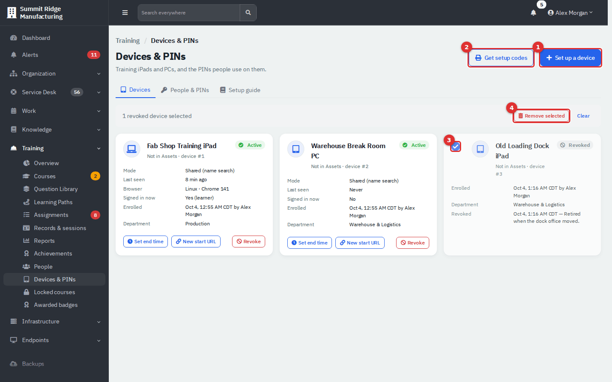

*Figure 1 — Training → Devices & PINs → Devices, with a revoked device ticked.*

1. **Set up a device** (Full). You do this on the iPad or PC itself.
2. **Get setup codes** (Full). Prints codes so you can set up several devices without signing in to RivetIT on each. See [Set up several devices with setup codes](#set-up-several-devices-with-setup-codes).
3. The tick box on a revoked device (Full).
4. **Remove selected** takes the ticked revoked devices off the list.

Each device card shows its name, whether it is in Assets, **Last seen**, browser, whether anyone is signed in, who enrolled it, and its default department. A personal device shows **Personal** and the owner's name. Any other device shows its **Mode**: **Shared (name search)**, or **Shared (set to ignore the asset's assignment)** when someone has chosen that. The buttons are **Set end time** (**Change end time** on a temporary device), **New start URL**, **Revoke**, and for a device that is in Assets **Make shared** or **Follow the asset instead**. A banner appears if sign-in has been paused system-wide.

The **People & PINs** tab shows each person's PIN status, and **Setup guide** has the iPad and Windows instructions.

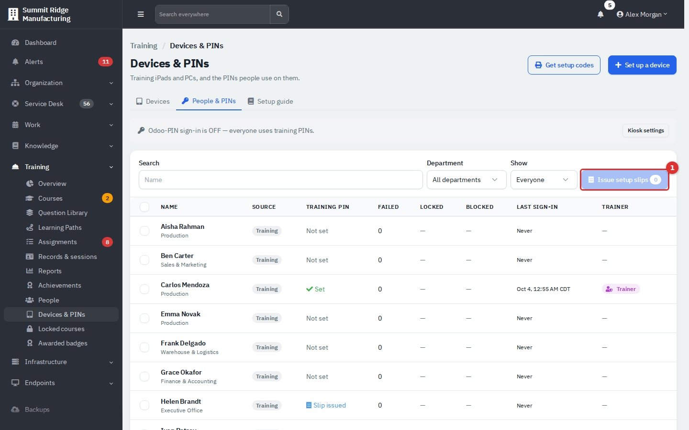

*Figure 2 — People & PINs. **Issue setup slips** is available once you tick people.*

1. **Issue setup slips** prints one slip per ticked person.

Columns: **Source** (**Training** PIN, or Odoo if that integration is on), **Training PIN** (**Set**, **Not set** or **Slip issued**), failed tries, **Locked**, **Blocked**, **Last sign-in** and **Trainer**. The **Show** filter narrows the list to people who need a setup slip, who are locked, or whose Odoo link is blocked. A person who is also a trainer is marked **Trainer**; this column is about their learner PIN, because a trainer PIN is a separate PIN (see [Trainers](#trainers)).

## Common tasks

### Set up a training device

Do this on the device, as an agent with Training kiosk level 3.

1. On the iPad or PC, open `/kiosk/`. A device that is not set up shows **This device is not set up for training**. Choose **Set up this device (admin)** and sign in to RivetIT. (Or go to Training → Devices & PINs → **Set up a device**.)
2. Under **1. Which device is this?** choose **It's in Assets** and pick the asset, or **This device isn't in Assets** and type a name for it. Only tablets, phones, laptops and desktops can be picked.
3. Name the device, choose its default department and how long it stays set up: **Keep until I remove it**, or **Temporary** (end of today, 4, 8 or 24 hours, or a date up to 30 days away).
4. Click **Use this device for training**.
5. Copy the **start URL** if this is a Windows kiosk-mode PC. It is shown only once. Then click **Open training on this device**. This signs you out of RivetIT and opens the name search.

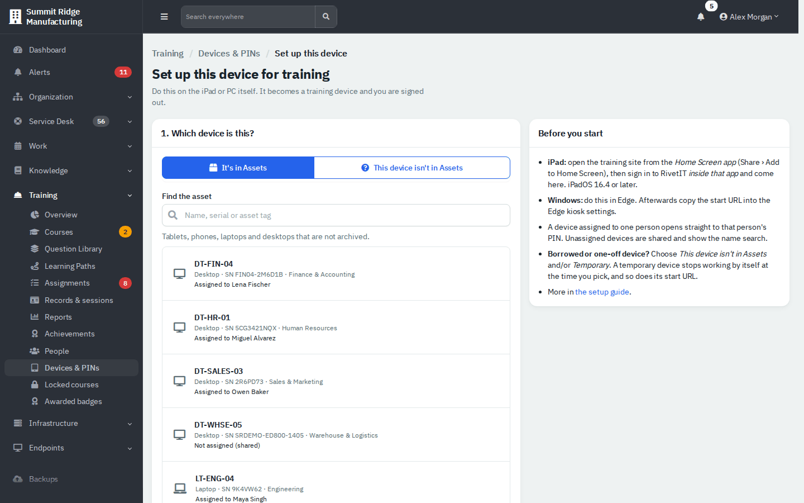

*Figure 3 — Set up this device for training.*

A device assigned to one person opens straight to that person's PIN. An unassigned asset, or a device not in Assets, is shared: people search for their name. Enroll inside the Home Screen app on an iPad, because Safari and the app keep separate cookies. The full iPad and Windows instructions are on the **Setup guide** tab. Keep the start URL private: anyone who has it can set up a copy of that device. If it leaks, use **New start URL** (the old one stops working at once) or **Revoke**.

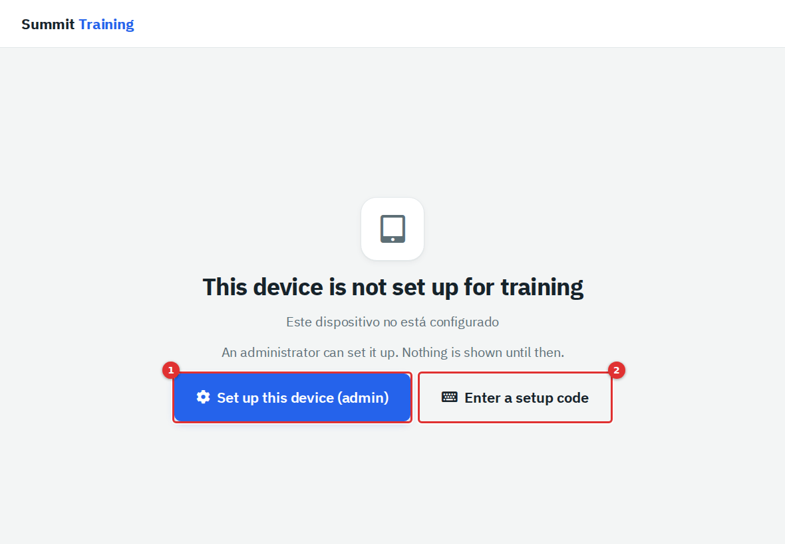

*Figure 4 — A browser that has not been set up. Nothing about people is shown until a device is enrolled. (1) **Set up this device (admin)** is for an agent signed in on the device. (2) **Enter a setup code** takes a code from a printed slip.*

### Remove revoked devices from the list

A revoked device stays on the Devices tab, dimmed, with the date and reason. When you no longer need to see it:

1. Tick the box at the left of each revoked device (Full). Only revoked devices have a box.
2. A bar shows how many are selected. Click **Remove selected** and confirm **Remove**.

This only hides the cards. It does not delete the devices' history, and it does not touch any training record. A device whose temporary time has run out shows **Remove now** instead.

### Change a device between Personal and Shared

A device that is in Assets starts out following the asset's assignment: an asset assigned to one person is **Personal** and opens at that person's PIN, and an unassigned asset is shared. On a device card (Full):

- **Make shared** switches the device to name search for everyone, whoever the asset is assigned to. The mode then reads **Shared (set to ignore the asset's assignment)**, and a later re-assignment of the asset no longer stops the device.
- **Follow the asset instead** puts it back to following the asset. It may become personal again, or stay shared if nobody eligible is assigned to the asset right now.

Each button asks you to confirm. A device that is not in Assets is always shared, so it has neither button.

### Set up several devices with setup codes

**Get setup codes** (Full) is for a fleet: you issue the codes from your desk, and nobody has to sign in to RivetIT on the devices.

1. Go to **Training → Devices & PINs** and click **Get setup codes**.
2. Under **Pick devices already in Assets**, search and tick tablets, phones, laptops and desktops. This list needs the Assets permission (Read).
3. Under **Add devices that aren't in Assets**, type one name per line (1). For a fleet, type a prefix such as `iPad` and a **Count** under **Quick-fill**, then click **Add "Name 1..N"** to fill in `iPad 1` to `iPad 12`. A batch holds up to 40 devices.
4. Choose the **Default department** (2) and **How long**: **Keep until I remove it**, or **Temporary** (end of today, 4, 8 or 24 hours, or a date and time). The choice applies to the whole batch.
5. Click **Get setup codes** (3). If a ticked asset already has a device, a **Replace already-enrolled assets** box appears; tick it to replace them.
6. The next page prints one slip per device with a 10-character code (for example `K7M2P-9TQ4X`) and a use-by date. Print, then click **Done - clear these slips**. Unprinted slips expire after ten minutes.

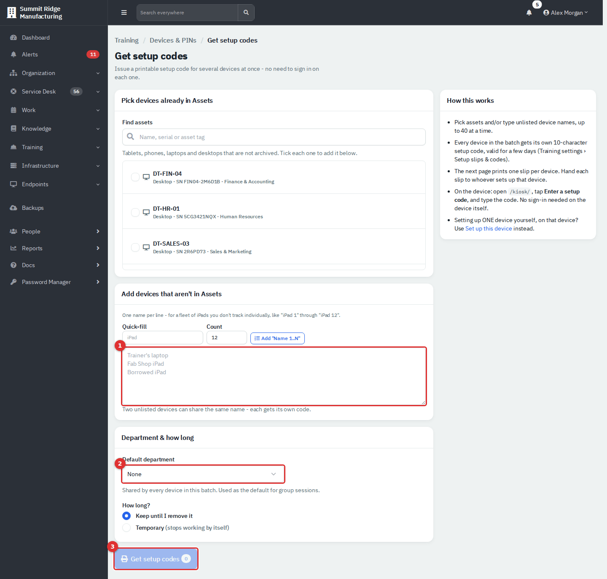

*Figure 5 — Get setup codes. Nothing is issued until you click the button.*

On each device, open `/kiosk/`, tap **Enter a setup code**, and type the code from its slip. The device is set up at once: it becomes shared, or personal when its asset is assigned to one person. A code works once, and is valid for the number of days set under **Setup slips & codes** (3 by default). Handle the slips like keys: anyone holding a live code can set up that device.

### Give people a training PIN

1. **Training → Devices & PINs → People & PINs.**
2. Tick the people, then click **Issue setup slips** (Modify). Pick the department filter to find a whole crew.
3. Print the slips. Each shows the person's name, an 8-digit one-time setup code and a use-by date.
4. Click **Done - clear these slips** when printed. Unprinted slips expire after ten minutes in any case.
5. On the kiosk the person taps their name, chooses **I have a setup code**, types the code, then picks a 6-digit PIN twice. Obvious PINs such as 123456, repeated digits and previous PINs are refused.

Slips show codes that let anyone become that person, so print them only for the person who will hand them out, and keep them private.

### Unlock a PIN or clear a cooldown

- Five wrong PINs lock that PIN for 15 minutes (it doubles on repeats). Ten lock it until an agent unlocks it: row → **Unlock**, with a reason (Modify).
- Too many wrong PINs on one device pauses that device. **Clear cooldown** and **Clear pause** (Modify) lift it, again with a reason.
- Unlocking someone who is also an active trainer needs Training level 3 or an administrator. That unlocks their learner PIN. A trainer PIN is separate, and a locked trainer PIN is cleared by setting a new one (see [Trainers](#trainers)).

### Set an end time, replace the start URL or revoke a device

- **Set end time** makes a device temporary, and **Change end time** moves it. When time is up it stops working by itself and shows "This device's training time is over". **End now** stops a temporary device at once.
- **New start URL** replaces the secret in the URL. Use it if the URL leaked or you set the device up elsewhere.
- **Revoke** stops the device at once, with a reason. Anyone signed in is signed out.

## The learner's view

### Sign in

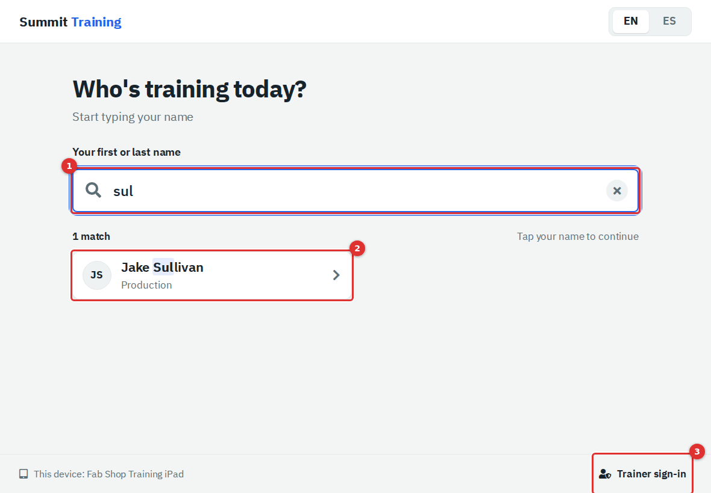

*Figure 6 — **Who's training today?** Names show only after two letters, so the crew list stays private. (3) **Trainer sign-in** is for trainers.*

1. Type the first or last name (1) and tap your name (2).
2. Enter your 6-digit training PIN and press **OK**. The link **I have a setup code** on the PIN screen is for a first PIN.

Employees who came from the portal skip this screen.

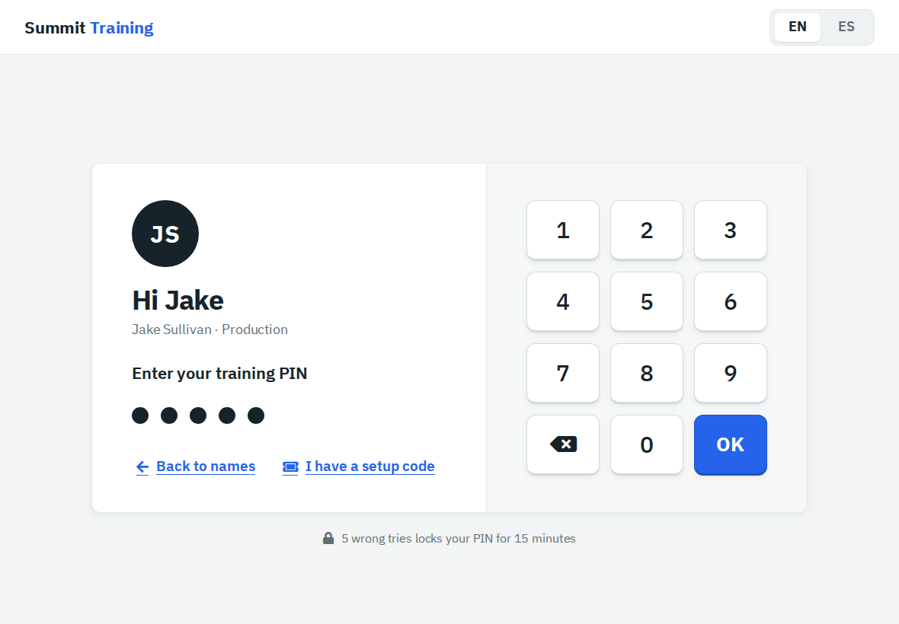

*Figure 7 — The PIN keypad. **Back to names** and **I have a setup code** are on the left.*

The **EN** and **ES** buttons switch the whole kiosk between English and Spanish. A kiosk signs the person out after a few minutes of inactivity (three by default) and shows a **Still there?** warning 30 seconds before. The progress made so far is saved.

### My training

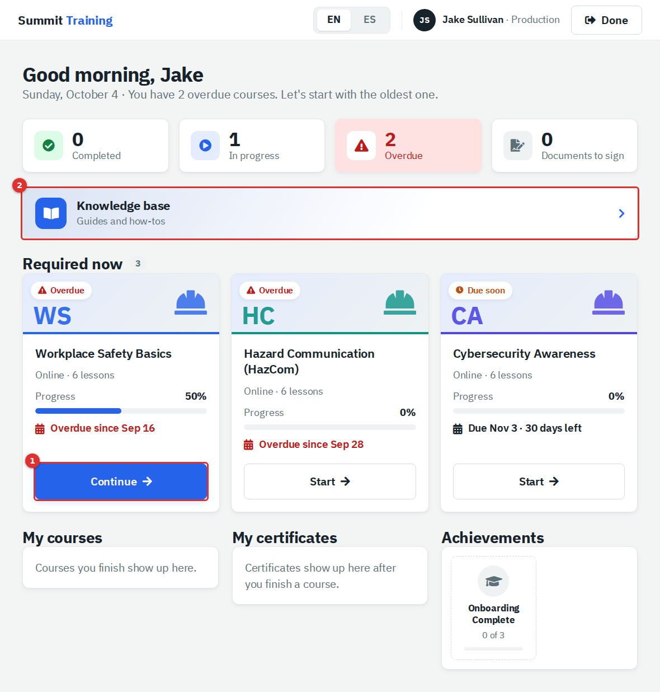

*Figure 8 — My training. (1) **Continue** on the course in progress. (2) The **Knowledge base** tile.*

The top tiles count **Completed**, **In progress**, **Overdue** and **Documents to sign**. The **Knowledge base** tile opens the training knowledge base (see below). **Required now** lists assigned courses, oldest overdue first, with progress and due date, and **Start** or **Continue**. Below are **My courses** (finished), **My certificates**, **Achievements** (badges) and, if there are any, **Available courses** that nobody has required.

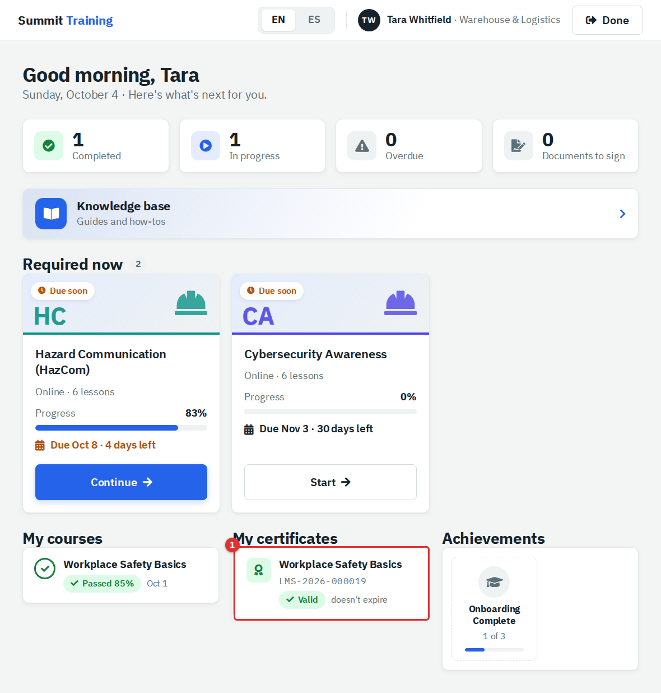

*Figure 9 — A finished course appears under **My courses** with the score, and under **My certificates** with its number and **Valid** status. (1) Tap a certificate to open it.*

### Browse the knowledge base

The **Knowledge base** tile on My training lists guides and how-tos, grouped by category, with a search box that looks in titles and text. A learner sees only articles that are switched on for the training kiosk and that belong to the company-wide set or to the learner's own department. Archived articles never show. The tile appears only when the Knowledge Base module is on and the learner belongs to a department.

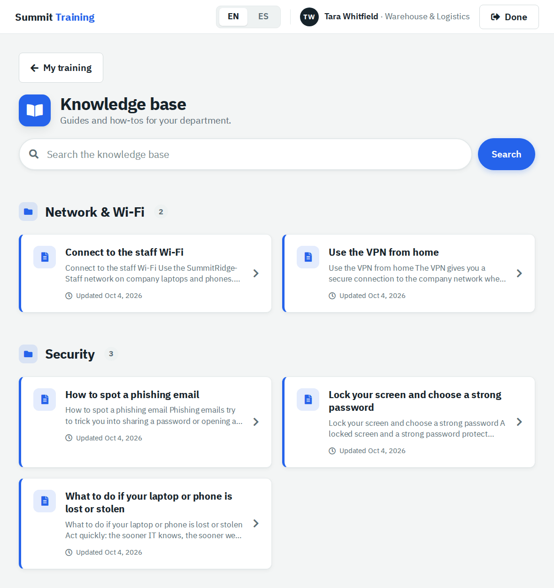

*Figure 10 — The learner's Knowledge base. The articles are the ones switched on for the training kiosk.*

An article is hidden here until someone opens it in **Knowledge → Knowledge Base** and sets **Show on Training Portal** to **Yes** (**Edit**; the field is offered when the Training module is on). The default is **No**, and it is separate from **Visible to Department Portal** on the same article. The article page shows a **Training Portal** badge, **Shown** or **Hidden**. See [Knowledge Base](05-knowledge-base.md).

### Take a course

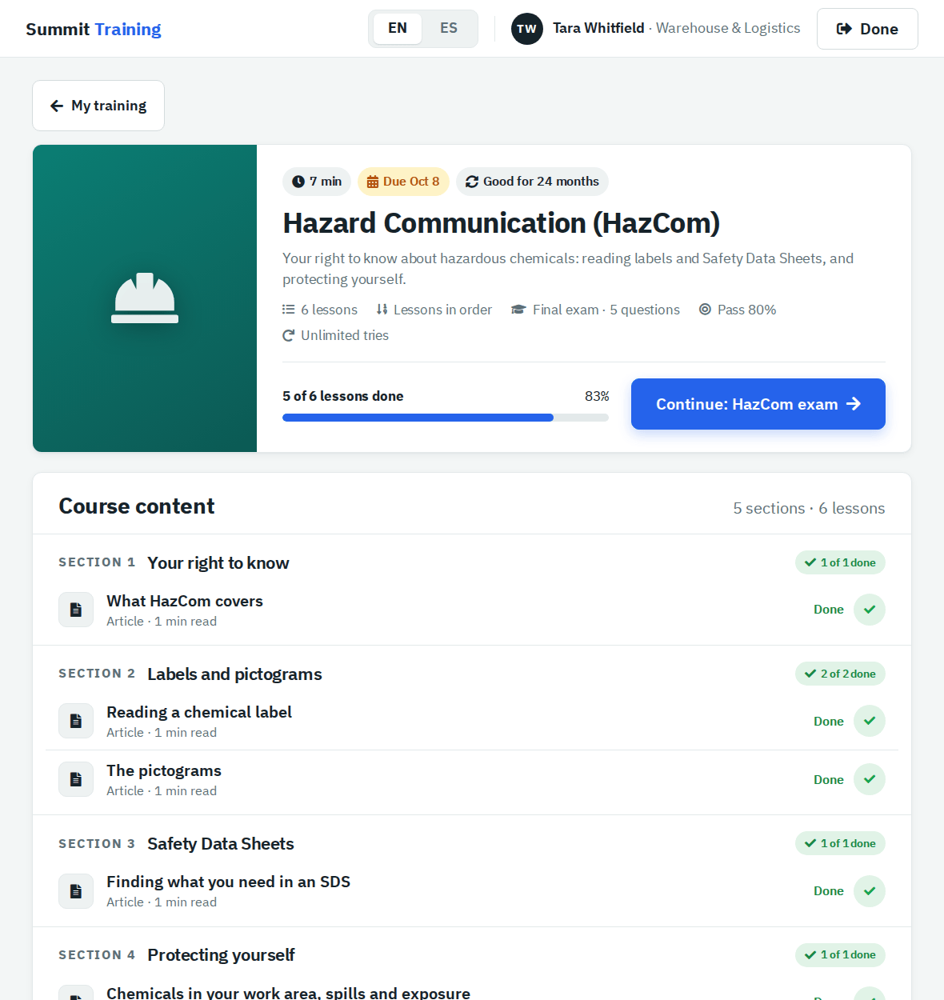

*Figure 11 — The course page: time needed, due date, how long the certificate is good for, pass mark, tries, and every lesson with **Done** marks.*

Courses marked **Lessons in order** unlock one lesson at a time, except a lesson whose **Needs the lessons above finished** switch is off (a course author can turn it off for a document lesson); people can open that lesson at any time. The learner reads each lesson and taps **Next lesson**. The server counts reading time, so a lesson cannot be finished in two seconds: a short article needs at least 15 seconds, a video needs the minimum share of its length, and a PDF needs time per page. Progress stays on the course until finished, even if the person signs out.

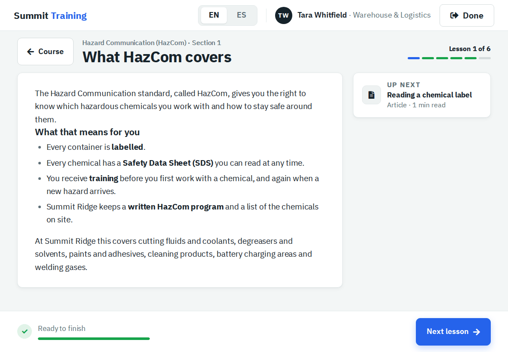

*Figure 12 — A lesson. The dots at the top right show lesson progress.*

### Quizzes and the exam

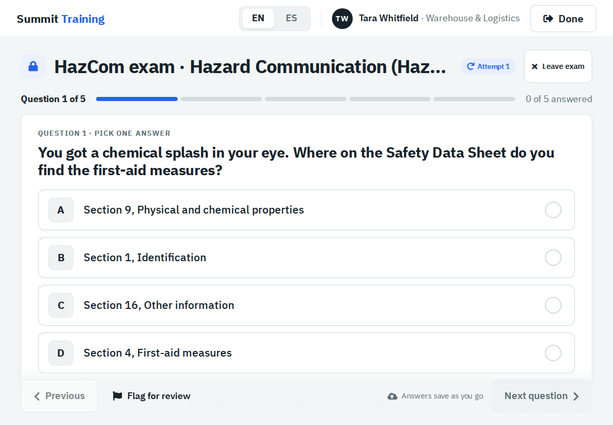

*Figure 13 — The exam: one question at a time, answers saved as you go, **Flag for review**, **Leave exam**.*

The final exam starts with a card that shows the number of questions, the pass mark and how many tries are allowed. Leaving an exam half way keeps the answers, and the same attempt resumes next time. A must-pass quiz that runs out of tries locks the course; an agent unlocks it on **Training → Locked courses** (Training level 2).

### Sign to finish

When every lesson and the exam are done, the course asks the learner to sign: the attestation text, a finger signature if the course needs one, and the PIN again. The kiosk then shows a receipt. The record, and for training courses the certificate, exist from that moment, and the assignment closes. A course that also needs a class or a practical shows **See your trainer** until the trainer records that part. A document shows **Read & sign** instead.

### Trainers

**Trainer sign-in** (bottom right of the name search) lists only active trainers. A trainer enters a **trainer PIN**, which is separate from the learner PIN: changing one never changes the other, and a trainer still signs in to their own training with the learner PIN. After sign-in the trainer gets tiles for groups: running a class, checking people in, a practical evaluation, and setting PINs, depending on which flags the trainer has (**Training → People → Trainers**). Group sessions end up in **Records & sessions → Sessions**.

A trainer has no trainer PIN until one is set, and the kiosk says so ("You haven't set up a trainer PIN yet"). There are two ways:

- The trainer opens **Account → Security** in RivetIT, where a **Trainer PIN** card appears for active trainers, and sets it. Becoming a trainer never forces this straight away.
- An administrator opens **Training → People → Trainers**, edits the trainer, and uses **Set PIN…** (**Reset PIN…** when one exists) under **Trainer PIN**. The panel shows whether a PIN is set and who set it, and whether it is locked. Setting a new PIN clears a lock. This panel is for administrators only.

The trainer PIN is asked again to finish a session, to hand an evaluation back and to leave check-in mode.

## Certificates

Every finished training course gets a **record number** such as `LMS-2026-000024`, numbered per year, and a certificate. Documents that people sign get an acknowledgment record with no number and no QR code.

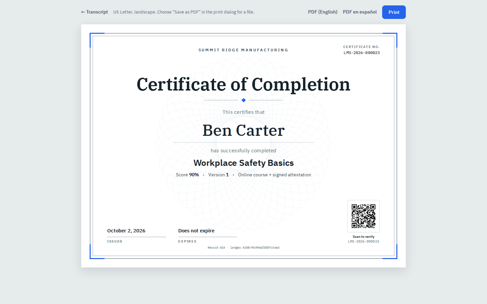

*Figure 14 — Open certificate: a US Letter landscape sheet. Use **Print**, or **PDF (English)** and **PDF en español**.*

The certificate shows the name, course, score, version, issue date, expiry and a **Scan to verify** QR code. Its status can be **Valid**, **Expiring soon**, **Expired**, replaced by a newer version of the course (**superseded**) or **VOID** if the record was voided. External cards print as a "Training record" marked **External card recorded**; they never say "certifies". The signatory name, title and signature image are set in **Certificates** under **Administration → Settings → Training**, or in **Training → Training settings** for someone with Training at Full who is not an administrator (**Download sample certificate** previews them).

Employees open their own certificates themselves: on **My training**, tap a certificate under **My certificates**. The sheet opens in the same tab (never a new one, so nothing is left behind on a shared device) with a **Print** button and a **← My learning** link back. A learner can open only their own records; any other number answers "This record does not exist, or you do not have access to it." The learner's sheet has no PDF buttons, but the print dialog can **Save as PDF**. Agents open a certificate from the record page, a transcript, or the **Open certificate** button after saving an external record.

### The public certificate check

The QR code opens `/verify/?t=<code>`. No login is needed.

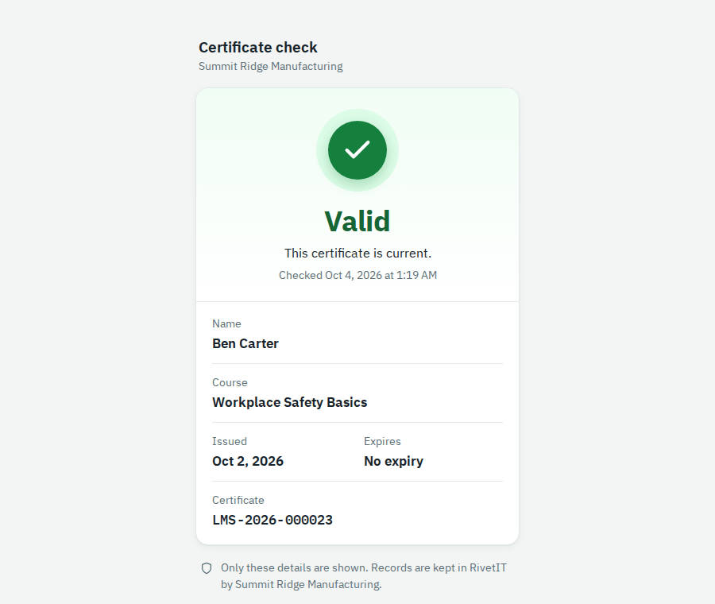

*Figure 15 — A valid certificate. Only the name, course, issue and expiry dates and certificate number are shown.*

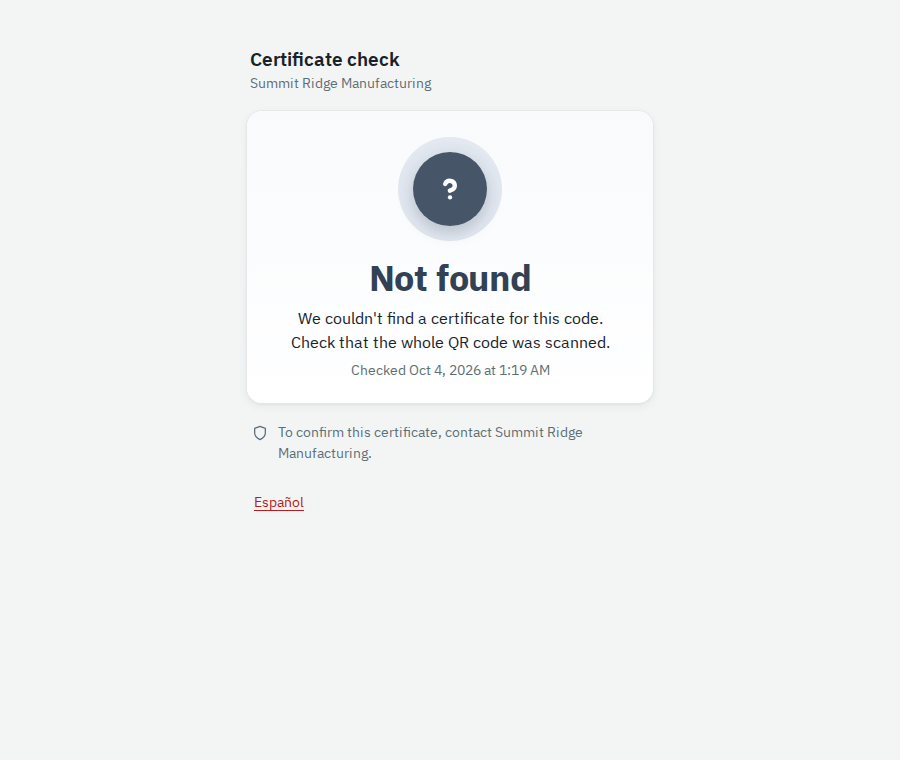

*Figure 16 — An unknown or incomplete code answers **Not found**.*

The page answers **Valid**, **Expiring soon**, **Expired**, **Revoked** (a voided record), **Not found**, or "turned off". It has an **Español** link. Checks are limited to 240 a minute overall and 20 a minute per visitor. An administrator can switch the check off in **Administration → Settings → Training → Certificates**; every printed QR code then shows "Not available". The code is derived from the server's settings key, so that key must never be changed casually: old QR codes would stop verifying.

## Badges

Achievements appear on the learner's **My training** page. **Training → Awarded badges** (Training level 2) lists every badge that has been earned, who earned it and how (**Automatic** or manual), and **Award manually** gives a manual badge. Badges are defined in [Training: Quizzes, Paths and Badges](07b-training-quizzes-paths-and-badges.md).

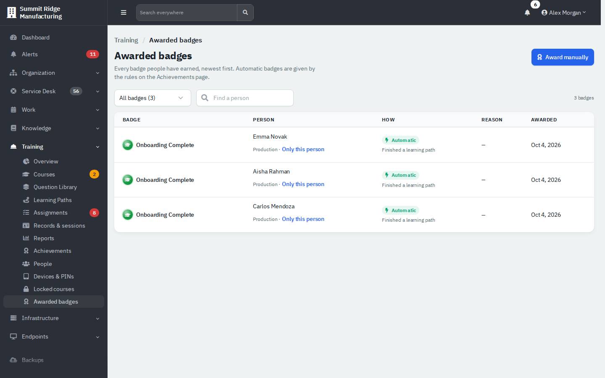

*Figure 17 — Training → Awarded badges.*

## Reference

These are IT-only settings. An administrator changes them under **Administration → Settings → Training → Kiosk & sign-in**. Training at Full can see them on **Training → Training settings** but not change them.

| Setting | Default | Group |
|---|---|---|
| Learner idle sign-out | 180 seconds (3 minutes) | Sessions |
| Trainer idle sign-out | 300 seconds (5 minutes) | Sessions |
| Learner session limit | 60 minutes | Sessions |
| Wrong PINs before a soft lock / hard lock | 5 / 10 | PIN lockouts |
| First soft lock | 15 minutes | PIN lockouts |
| A PIN setup code works for | 7 days | Setup slips & codes |
| A device setup code works for | 3 days | Setup slips & codes |
| Odoo (time clock) PIN sign-in | Off | Odoo PIN sign-in |

## Tips and good practice

- Put one device where people already wait: the break room, the dock office. Name it by place.
- Use temporary devices for borrowed iPads so they cannot be forgotten.
- Hand slips out in person, and tell people they can ask a supervisor for a new one.
- Revoke a lost device at once. Its start URL then stops working. Remove it from the list later, once it is no longer needed.
- For many iPads, use **Get setup codes** and hand out slips instead of signing in to RivetIT on each one.
- Do not share PINs. The signature at the end of a course is the evidence, so a shared PIN weakens every record.

## Related guides

- [Training: Assignments, Records and Reports](08-training-assignments-and-records.md)
- [Training: Courses and Content](07-training-courses-and-content.md)
- [Training: Quizzes, Paths and Badges](07b-training-quizzes-paths-and-badges.md)
- [Employee portal](11-employee-portal.md)
- [Knowledge Base](05-knowledge-base.md)
