# Endpoints and Integrations

RivetIT can pull device, alert and backup information from the tools your team already uses: a remote monitoring and management (RMM) system, Microsoft Intune, UniFi network gear, Sophos Central firewalls and a Comet backup server. This page explains the screens that show that information, what you can do from them, and how an administrator connects each service.

These modules are different from the rest of the guide in one way: **the data comes from an outside service.** RivetIT only shows what the service reports, and only after an administrator has connected it with a URL and credentials. The screenshots on this page use sample data from a demo company, not a live RMM or backup server.

| | |
|---|---|
| **Where to find it** | Sidebar → **Alerts**; sidebar → **Endpoints** (Intune Devices, RMM Dashboard, Assets, RMM Alerts, Scripts, Check Policies, Network); sidebar → **Backups**. Set-up pages: user menu → **Administration** → **Settings** → **Integrations** (under **Connections & data**). |
| **Who can use it** | Each part has its own permission, listed under [Permissions](#permissions). The default Technician role has none of the RMM permissions, so an administrator must grant them first. |
| **Turn it on** | Administration → **Settings** → **Integrations**. Each service has an on/off switch on its own tab (**RMM**, **Backups**, **Firewalls**, **UniFi**, **Device Sync**). The **Endpoints** and **Backups** menu items only appear once the matching switch is on. The Integrations page also has **Directory Sync** (Microsoft 365 and Google Workspace) and **Odoo** tabs; the Microsoft 365 connection on **Directory Sync** is shared with Intune, and the **Odoo** tab is covered in [Administration: Settings](13-administration-settings.md), not here. |

## How the pieces fit together

| Module | What it shows | Needs |
|---|---|---|
| **Alerts** | One queue of RMM alerts and backup alerts | RMM and/or Comet connected |
| **RMM** (Endpoints menu) | Managed computers, servers and firewalls: online status, health, alerts, scripts, check policies | An RMM account: Tactical RMM (full features), Level.io or Action1 (fewer), Sophos Central (firewalls) |
| **Intune Devices** | Compliance state of devices managed in Microsoft Intune | A Microsoft 365 app registration (tenant ID, client ID, secret) |
| **Network** | Firewalls, switches and access points | Nothing extra: it lists any asset of those types. Sophos Central and UniFi fill it automatically. |
| **UniFi** | Nothing of its own: it creates and updates assets, Wi-Fi credentials and networks | A UniFi controller or a UniFi Site Manager account with an API key |
| **Backups** | Backup status of every device, per department | A Comet Backup server and an admin login for it |

An RMM device is not a separate kind of record. Each device is linked to a normal **asset**. The asset page gains an RMM card and extra tabs, and the asset list gains an Online/Offline badge. See [How an RMM device relates to an asset](#how-an-rmm-device-relates-to-an-asset).

## The sidebar

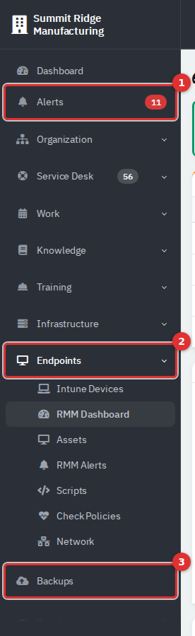

*Figure 1 — Alerts (1) is always near the top and carries a red count of new alerts. The Endpoints group (2) and Backups (3) appear once their integration switch is on.*

- **Alerts (1)** shows for anyone with the RMM alerts permission. The red number counts alerts with status **new**, RMM and backup together.
- **Endpoints (2)** contains **Intune Devices** (needs Intune switched on and Departments access) and the RMM pages (needs RMM switched on and RMM devices access).
- **Backups (3)** needs Comet switched on and RMM devices access.

## Alerts

The **Alerts** page is the one place to work through problems reported by your integrations. It merges two feeds:

- **RMM alerts**: disk nearly full, service stopped, high CPU, device offline and similar, as reported by the RMM. They arrive when the RMM is synced.
- **Backup alerts**: a failed or missed Comet backup. RivetIT creates these itself, together with a High-priority ticket, when Comet reports a failed job or a device has had no backup for 48 hours.

The page header has **RMM Dashboard** and **Backup Dashboard** buttons that jump to those screens.

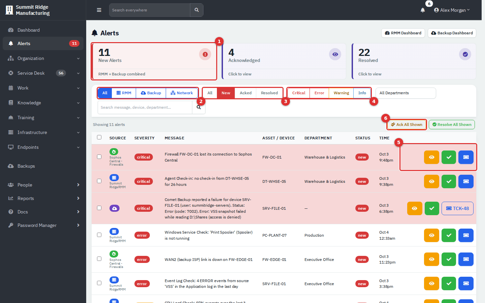

*Figure 2 — The Alerts page. (1) counters, (2) source filter, (3) status filter, (4) severity filter, (5) row actions, (6) bulk buttons.*

**(1)** The three cards count **New Alerts**, **Acknowledged** and **Resolved**. Click a card to filter by that status. **(2)** **All**, **RMM**, **Backup** and **Network** choose the source. Network shows RMM alerts for firewalls, switches and access points only. **(3)** Status: **All**, **New**, **Acked**, **Resolved**. The page opens on **New**. **(4)** Severity: **Critical**, **Error**, **Warning**, **Info**. Click a severity again to clear it. There is also a department drop-down and a search box (message, device, department). Alerts are sorted by severity, then newest first, and each source shows at most 300 rows.

### What the columns and badges mean

| Column | Meaning |
|---|---|
| **Source** | Green or blue icon plus the integration name for RMM and Sophos alerts. A purple cloud icon is a backup alert. |
| **Severity** | critical, error, warning or info. Critical rows are shaded red. |
| **Asset / Device** | The asset the alert belongs to. RMM alerts link to the asset page. Backup alerts show the Comet device name. |
| **Department** | The asset's department. For backup alerts, the department mapped to the Comet user. A dash means no department. |
| **Status** | **new** (nobody has looked yet), **acknowledged** (someone has taken it; the person's name is shown), **resolved** (closed). |

### Work through alerts

1. Open **Alerts**. Read the message and open the asset link if you need more detail.
2. Click the eye button (**Acknowledge**) to say you are on it. Click the check button (**Resolve**) when the problem is fixed. The row fades; reload to see the new counts.
3. To act on several at once, tick the boxes on the left (or the box in the header to select every row), then click **Ack All Shown** or **Resolve All Shown** and confirm. Despite the names, these buttons act on the ticked rows only. If nothing is ticked, you get "No alerts selected."

Acknowledge and resolve also update the alert in the RMM where the RMM allows it. Tactical RMM does. Level.io, Sophos Central and Action1 do not, so only RivetIT's copy changes; the RMM copy stays as it is. RivetIT still completes your action.

### Create a ticket from an alert

You need Modify access to Tickets, assets & docs.

1. Click the ticket button at the end of an RMM alert row and confirm **Create a ticket from this alert?**.
2. RivetIT opens the new ticket. Its subject is **RMM Alert:** followed by the alert message. Priority follows severity: critical and error are **High**, warning is **Medium**, info is **Low**. The details list the severity, message, asset, hostname, operating system, logged-in user and last-seen time.
3. The alert becomes **acknowledged** and shows the ticket number instead of the button. If the alert is already linked to a ticket that is still open, you are taken to that ticket instead of getting a duplicate.

Backup alerts have no ticket button because their ticket already exists: the ticket number appears in the row. When a later backup of the same device succeeds, RivetIT resolves the alert and closes the ticket with an internal note. Acknowledging or resolving a backup alert by hand changes the alert only, not the ticket.

An administrator can also let RivetIT create tickets for new RMM alerts by itself; see [Automatic ticket creation](#connect-an-rmm).

## RMM

### How an RMM device relates to an asset

- Every RMM device is linked to one asset (the link is what puts the RMM card on the asset page).
- When RivetIT syncs with the RMM, it looks for an existing asset in this order: the same RMM agent already linked, the same serial number, the same MAC address, then the same name as the device's hostname (only if exactly one non-archived asset has that name). No match means RivetIT creates a new asset. It guesses the type from the operating system: Server, Desktop or Firewall/Router. Check the type of new assets and change it if it is wrong.
- The RMM's own client or group name is matched to a RivetIT **department** by exact name (upper or lower case does not matter). If the RMM names a client that has no matching department, that device is skipped and counted as "skipped" in the sync log. Name the RMM clients the same as your departments.
- On the **RMM Assets** list, a device with no department gets an **Assign department...** drop-down (needs RMM sync access).
- Status, CPU, memory, disk, reboot, maintenance and update figures are saved at each sync, so they are as recent as the last sync. Hardware, software, services, monitoring and patch detail on the asset page is fetched live from the RMM when you open the tab.

### A quick tour: RMM Dashboard

Endpoints → **RMM Dashboard**.

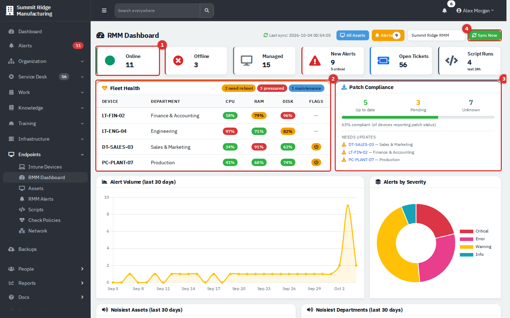

*Figure 3 — The top of the dashboard. (1) counters, (2) Fleet Health, (3) Patch Compliance, (4) Sync Now.*

- **(1)** Counters: **Online**, **Offline**, **Managed**, **New Alerts** (with the number of critical and error alerts), **Open Tickets** and **Script Runs** in the last 24 hours. Open Tickets counts every open ticket in RivetIT, not only tickets made from alerts. Click a card to open the matching list.
- **(2)** **Fleet Health** lists devices that need attention: a reboot is pending, or CPU, RAM or disk is at 90% or more (red at 90%, amber at 75%). The badges count devices that **need reboot**, are **pressured** and are in **maintenance**.
- **(3)** **Patch Compliance** shows how many devices are up to date, have updates pending, or have not reported, with the names of devices that need updates.
- **(4)** **Sync Now** pulls devices and alerts from the RMM straight away (needs RMM sync access). The top bar also shows the time of the last successful sync, the **All Assets** and **Alerts** buttons (the latter with the number of new alerts) and, when there is more than one integration, a selector next to the button.

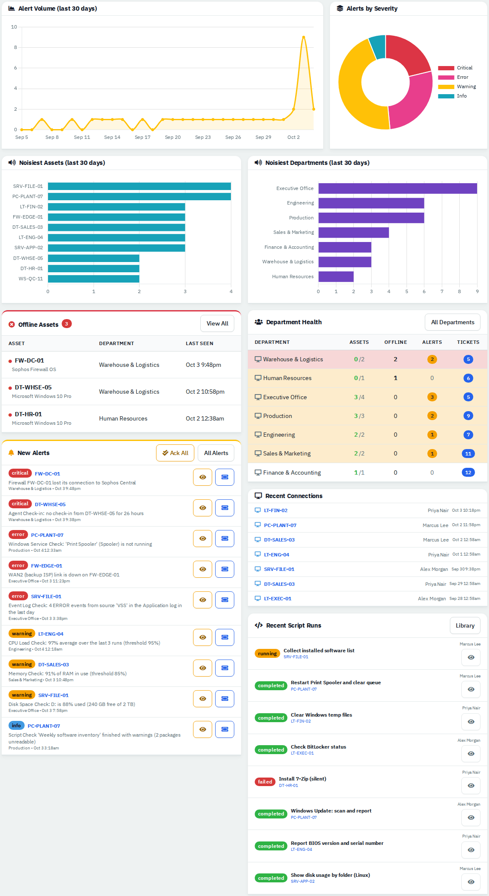

*Figure 4 — Alert Volume and Alerts by Severity (last 30 days), the noisiest assets and departments, Offline Assets, New Alerts, Department Health, Recent Connections and Recent Script Runs.*

The **New Alerts** card has an eye button (acknowledge) and a ticket button per alert, and **Ack All**, which acknowledges the alerts listed there (up to 15). **Recent Connections** logs remote sessions, reboots, commands and patch actions that people started from RivetIT.

### RMM Assets

Endpoints → **Assets** lists every linked device.

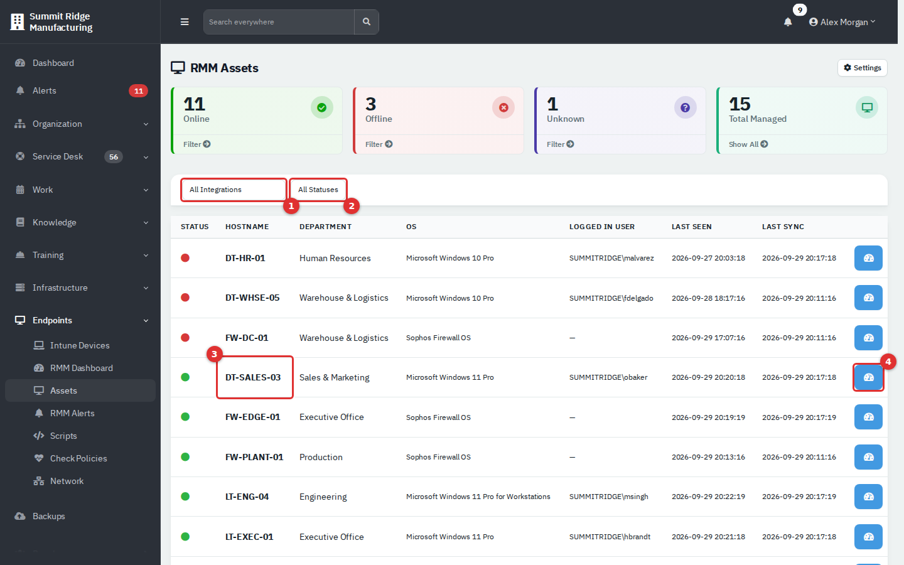

*Figure 5 — RMM Assets. (1) integration filter, (2) status filter, (3) hostname, (4) open the asset.*

1. Use **(1)** to show one integration and **(2)** to show **Online**, **Offline** or **Unknown** devices. The counters above the list filter too. **Unknown** means the RMM has not reported a status yet.
2. Choose one integration in **(1)** and a **Sync from ...** button appears at the top. It syncs only that integration.
3. Click a hostname **(3)** or the blue button **(4)** to open the asset page.

Endpoints → **RMM Alerts** is the same alert list as the Alerts page, limited to RMM alerts. The **Settings** button at the top right of RMM Assets (and of Network and Intune Devices) opens Administration → Integrations.

Links on these pages open the asset in the company-wide view. Opened from a department's own Assets list, the same page shows inside that department's workspace.

### A device on its asset page

Open the asset from RMM Assets, or from Infrastructure → Assets. A device linked to an RMM shows a card at the top and an extra set of tabs.

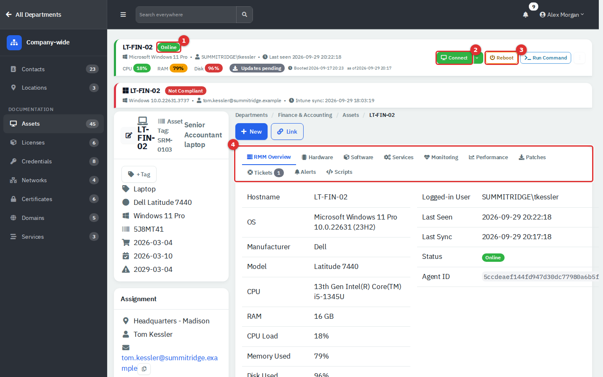

*Figure 6 — The RMM card. (1) status, (2) Connect, (3) Reboot, (4) tabs.*

- **(1)** Online, Offline or Unknown, the number of new alerts, operating system, logged-in user, last seen, and CPU, RAM and disk gauges. Badges appear for **Reboot required**, **Maintenance** and **Updates pending**.
- **(2) Connect** opens a remote session in a new browser tab. Where the device also has MeshCentral, the small arrow beside the button offers **MeshCentral Remote Desktop**. With Level.io it opens the device in the Level web app. RivetIT builds the link on the server and logs the session, so the RMM key never reaches your browser. Needs RMM remote connect access.
- **(3) Reboot** asks for confirmation, then restarts the device. **Run Command** runs a single command in **cmd** or **powershell** with a timeout of 5 to 300 seconds (30 by default) and shows the output. Both are available for Tactical RMM devices only and need RMM remote connect access. Both are recorded under Recent Connections.
- The small button at the far right of the card opens a menu with **Remove from RMM**. It deletes the link (the asset stays) and needs RMM sync access. The next sync will link the device again if the agent still exists in the RMM.
- If the device is also enrolled in Intune, a second card shows its compliance state.

**(4)** The tabs:

| Tab | Shows |
|---|---|
| **RMM Overview** | Hardware and operating system summary saved at the last sync, agent ID, last seen, last sync |
| **Hardware**, **Software**, **Services** | Fetched from the RMM when you open the tab. Software and Services have a search box and paging. |
| **Monitoring** | The checks the RMM runs on this device, with passing or failing status |
| **Performance** | Charts of CPU, memory, disk and network history, if metrics are being collected (see [Endpoint metrics collector](#endpoint-metrics-collector)). It shows an explanation instead of charts when nothing has been collected. |
| **Patches** | Windows updates the device knows about. Tactical RMM only. **Scan** and **Install Pending** need Modify access to RMM devices. Installing can restart the device. |
| **Tickets**, **Alerts** | Tickets for this asset, and every alert for this device with **Ack**, **Resolve** and create-ticket buttons |
| **Scripts** | Run a script on this device and see its recent runs |

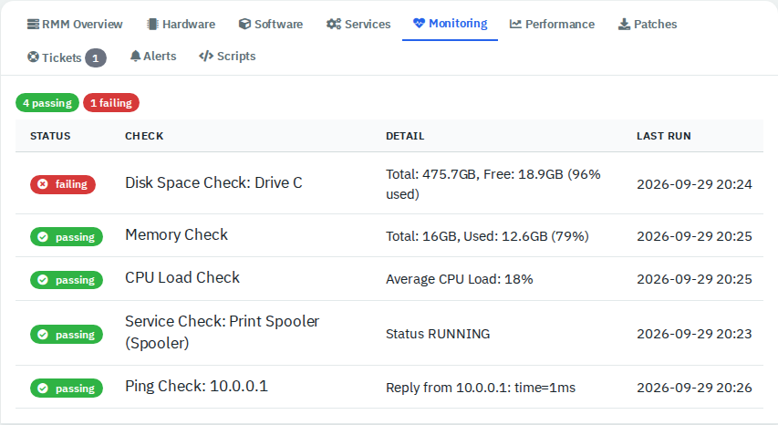

*Figure 7 — The Monitoring tab shows each check with its result. Here the disk check is failing.*

The RMM also shows up elsewhere. A ticket linked to an RMM asset shows the device status in its Assets card and a collapsed **Linked RMM Alerts** card with **Acknowledge** and **Resolve**. The asset list shows an Online/Offline badge and a green Connect button. A department's overview shows an **RMM** strip with online and offline counts, alert counts and **View RMM Assets**.

### Scripts

Endpoints → **Scripts** opens the **Script Library**: PowerShell, CMD, Python and Bash scripts that can be run on managed devices. Scripts run through **Tactical RMM** only.

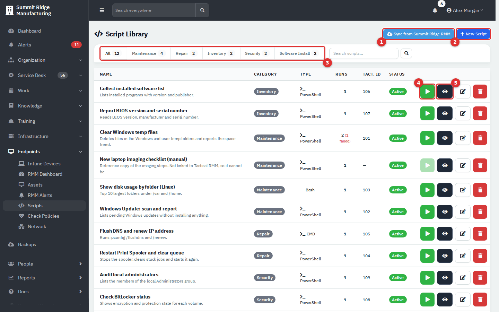

*Figure 8 — The Script Library. (1) sync from the RMM, (2) new script, (3) category filter, (4) run, (5) view the code.*

- **(1) Sync from ...** imports the script list from the default RMM integration. Each script gets the RMM's script number, shown in **Tact. ID**. Scripts you type in yourself have no number until you enter one in the edit form.
- The play button **(4)** is greyed out for a script without a **Tact. ID**. The eye **(5)** shows the stored code. The pencil edits and the red bin deletes.
- **(3)** The category tabs show a count each: **All**, Maintenance, Repair, Inventory, Security and Software Install. Synced scripts in another category only show under **All**. The search box beside the tabs finds a script by name.
- The **Runs** column shows how many times a script ran and how many failed. **Recent Script Runs** lists the latest 25 runs below the library.

#### Run a script on a device

1. In the Script Library, click the play button on the script. A **Run Script on Asset** pop-up opens.
2. Choose a device under **Select Online Asset**. Only online devices with an RMM agent are listed.
3. Click **Run Now**.
4. RivetIT records the run as pending, sends it to Tactical RMM and opens the **Script Run** page.

Alternatively, open the asset, choose the **Scripts** tab, pick a script and click **Run Script**.

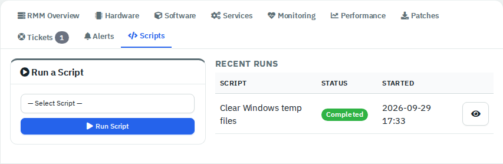

*Figure 9 — On an asset's Scripts tab, pick a script and click Run Script. Recent runs for this device are listed beside it.*

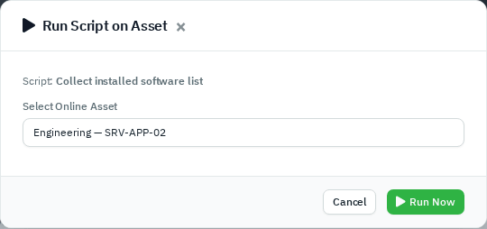

*Figure 10 — The Run Script on Asset pop-up.*

Running a script needs Modify access to RMM scripts. Adding or editing a script needs the same. Deleting needs the highest level. The run happens on the device, so treat it like sitting at that computer as an administrator.

#### Read the result

The **Script Run** page shows who ran what, where, the status and the output.

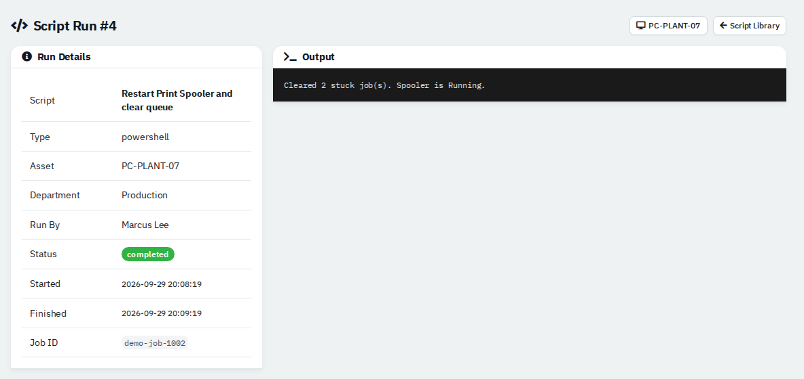

*Figure 11 — A completed run and its output.*

| Status | Meaning |
|---|---|
| **pending** | Recorded but not sent. For example, the script has no Tact. ID. |
| **running** | Sent to the RMM. The page checks for the result every 5 seconds; **Refresh** checks now. |
| **completed** | The RMM returned output (exit code 0). |
| **failed** | The RMM refused the run, or returned an error or a non-zero exit code. The error text is shown. |

### Check policies

Endpoints → **Check Policies** is a library of monitoring rules that can be pushed to many devices at once, for example "disk C: warns at 80% and goes critical at 90%".

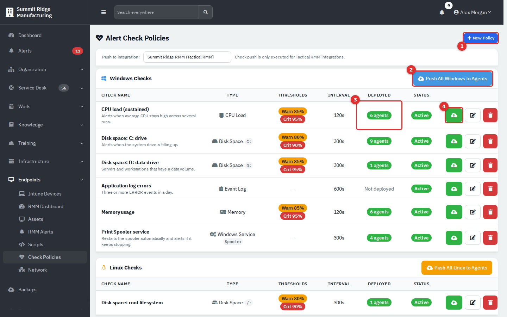

*Figure 12 — Check policies grouped by platform. (1) new policy, (2) push all for a platform, (3) how many agents have it, (4) push one policy.*

- Policies are grouped as Windows, Linux, macOS and All Platforms. Each row shows the check type, warning and critical thresholds, how often it runs, the number of agents it has been **Deployed** to, and whether it is **Active** or **Disabled**.
- Check types: Disk Space, CPU Load, Memory, Ping, Windows Service and Event Log. Extra settings are typed as JSON, for example `{"disk":"C"}`; a hint under the field shows the format for each type.
- Click the cloud button **(4)** to push one policy, or **(2)** to push every policy of that platform. RivetIT creates the check on every matching Tactical RMM agent that does not have it yet and tells you how many were pushed and skipped. Pushing needs Modify access to RMM devices, and only works for Tactical RMM integrations.
- A policy only reaches agents of its platform, chosen by operating system name.
- Failures then arrive as normal RMM alerts on the next sync.
- **Deleting a policy removes it and its deployment records from RivetIT only.** Checks already pushed stay on the agents until someone removes them in Tactical RMM.

### Network

Endpoints → **Network** lists every asset of type **Firewall/Router**, **Switch** or **Access Point**, whatever its source.

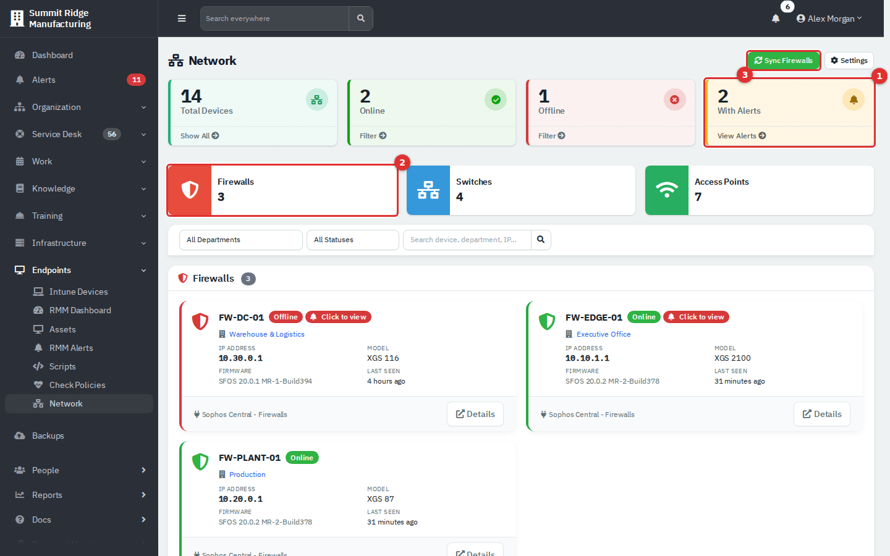

*Figure 13 — The Network page. (1) devices with open alerts, (2) device-type tiles that filter the page, (3) Sync Firewalls.*

- Firewalls are shown as cards, switches and access points as tables. Each device shows department, IP address (its primary interface), model, firmware, **Source** and last seen.
- **Source** is the RMM integration name (for example Sophos Central), **UniFi** for Ubiquiti devices that UniFi created, or **Manual** for anything typed in.
- Status comes from the RMM link when there is one. Otherwise an asset whose status contains Deployed, Active or Connected counts as online and every other status counts as offline.
- A red **Click to view** badge means the device has new alerts. It opens the linked ticket if there is one, or the Alerts page filtered to Network.
- **(3) Sync Firewalls** only appears when a Sophos Central integration is enabled and you have RMM sync access.
- The old address `firewalls.php` redirects to this page.

### Connect an RMM

This is an administrator task. Go to user menu → **Administration** → **Settings** → **Integrations** → **RMM** tab.

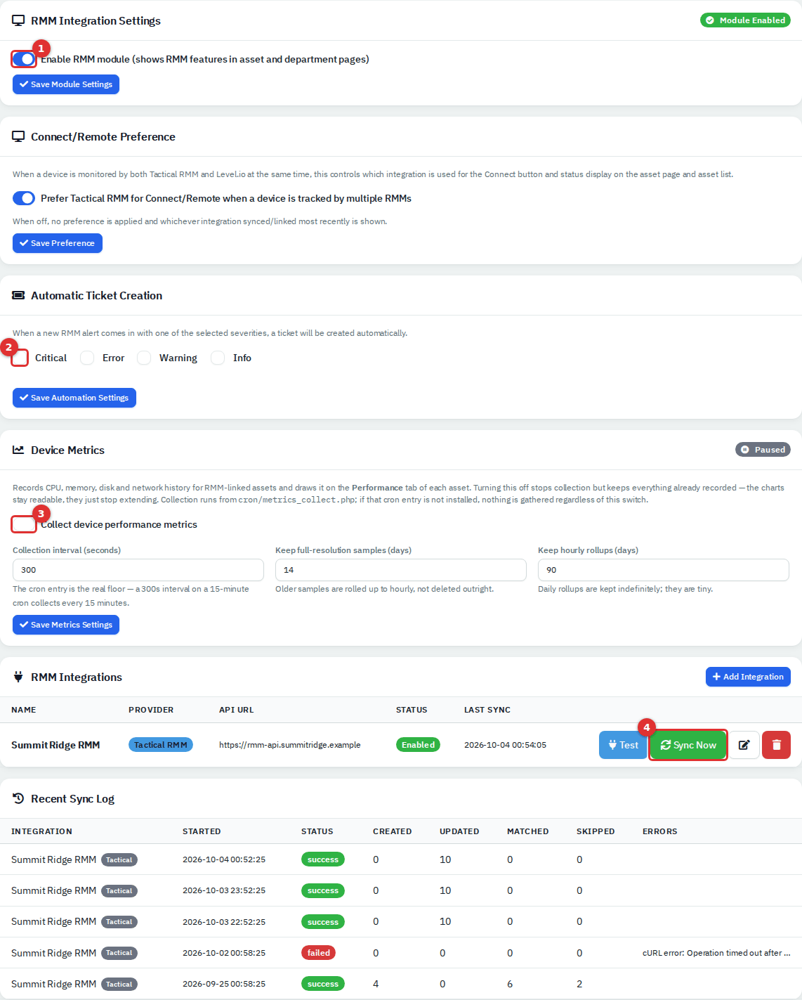

*Figure 14 — The RMM tab. (1) module switch, (2) automatic tickets, (3) device metrics, (4) the integration's Test and Sync Now buttons.*

1. Switch on **Enable RMM module (1)** and click **Save Module Settings**. The Endpoints menu, the RMM card on assets and the RMM health strip appear.
2. In the **RMM Integrations** card, click **Add Integration**.
3. Choose the **Provider Type**: **Tactical RMM**, **Level.io** or **Action1**. Enter a name, the **API URL**, the **Dashboard URL** (used for the Connect button) and the credential. The API URL must start with `https://`. For Tactical RMM the credential is an API key created in Tactical under Settings → Global Settings → API Keys. Action1 asks for a client ID and secret instead. Secrets are stored encrypted and are never shown again.
4. Click **Save Integration**, then **Test** on the new row. Then click **Sync Now**. The first integration you add becomes the default one used by Sync Now buttons and the Script Library.
5. Check **Recent Sync Log** at the bottom of the tab. **Created**, **Updated**, **Matched** and **Skipped** count devices. A failed sync shows the error.

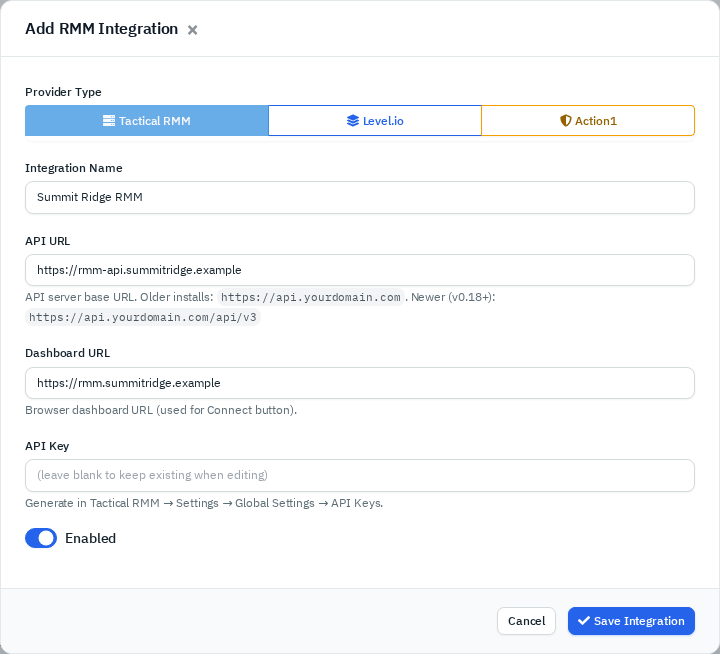

*Figure 15 — The Add RMM Integration pop-up.*

Other settings on the tab:

| Setting | What it does |
|---|---|
| **Connect/Remote Preference** | When one device is in both Tactical RMM and Level.io, decides which one the Connect button and status use. |
| **Automatic Ticket Creation** | Tick the severities (Critical, Error, Warning, Info) that should get a ticket made for them automatically. Nothing is ticked at first. Tickets are made by the scheduled job described below and have the source **RMM Automation**. |
| **Device Metrics** | Switch (with an **Active** or **Paused** badge), sample interval and retention settings for the Performance tab. |

Sophos Central firewalls use the **Firewalls** tab instead (click **Add Connection**, then enter a name, API entry point, Client ID and Client Secret). It asks for a Client ID and Client Secret from Sophos Central → Global Settings → API Credentials (single-tenant only) and a **Default Department** for new firewalls. A mapping table lets you assign each synced firewall to a department.

**What each provider can do**

| | Tactical RMM | Level.io | Action1 | Sophos Central |
|---|---|---|---|---|
| Devices and status | yes | yes | yes | firewalls |
| Alerts imported | yes | yes | no | yes |
| Acknowledge or resolve in the RMM | yes | no | no | no |
| Run scripts | yes | run only, output not returned | no | no |
| Check policies, reboot, run command, patches | yes | no | no | no |
| Connect | yes | opens the Level web app | see note | see note |

Note: in this version, **Connect** on an Action1 or Sophos Central device fails with an error instead of opening a session.

**Scheduled work.** Keeping RMM data fresh, creating automatic tickets, polling Comet and syncing Intune are done by RivetIT's scheduled job (`cron/cron.php`), which also needs **Enable Cron Job** switched on under Administration → **Settings** → **Notifications**. If nobody has scheduled it, data only changes when someone clicks **Sync Now**. An administrator can see whether it ran, and change its schedule, under Administration → **Maintenance** → **Scheduled jobs** (see [Administration: Settings](13-administration-settings.md)). When the RMM clears an alert, RivetIT resolves it and closes its ticket, unless someone has already replied to that ticket, in which case the ticket stays open with a note.

## Intune Devices

Endpoints → **Intune Devices** lists devices managed in Microsoft Intune that RivetIT has matched to assets. Use it to see which devices are compliant. The data comes from Microsoft; RivetIT cannot change it.

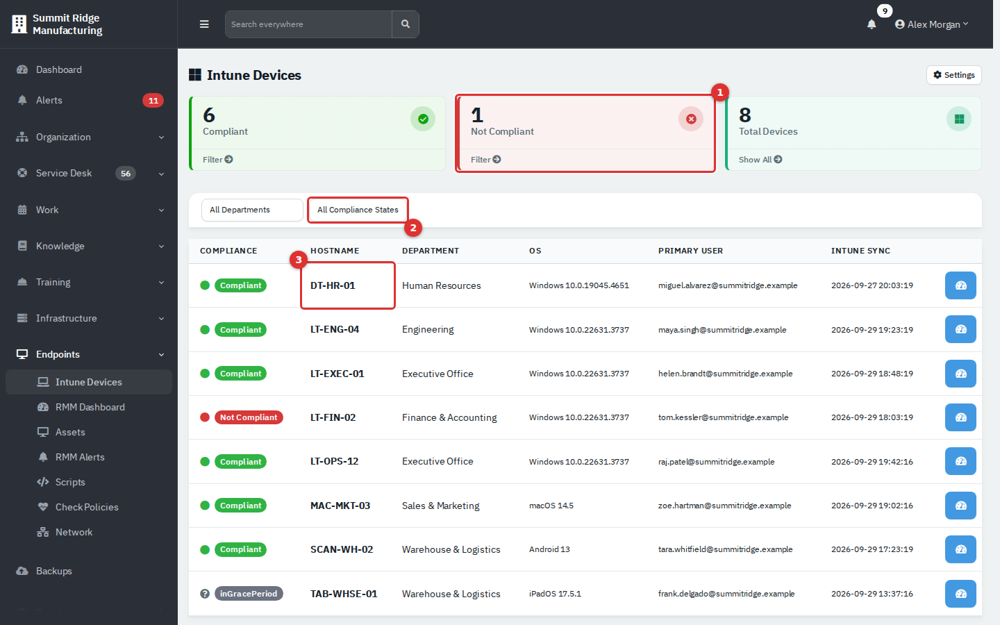

*Figure 16 — Intune Devices. (1) the Not Compliant counter filters the list, (2) compliance filter, (3) hostname opens the asset.*

- Counters show **Compliant**, **Not Compliant** and **Total Devices**. Filter by department or compliance state.
- Compliance shows as **Compliant**, **Not Compliant** or the raw Intune state (for example inGracePeriod) or **Unknown**.
- The columns show OS, the primary user's sign-in name and the time of the last Intune sync. The blue button opens the asset. An asset also gets an Intune card at the top of its page.
- Devices are matched to assets by Intune device ID, then serial number, then a unique hostname. A device that matches nothing becomes a new asset with **no department**, so assign one afterwards.

**Set it up** (administrator):

1. Register an app in Microsoft Entra ID and grant it the Microsoft Graph application permission `DeviceManagementManagedDevices.Read.All` with admin consent. RivetIT cannot do this for you.
2. In Administration → **Settings** → **Integrations** → **Directory Sync**, in the **Microsoft 365 / Entra ID** card, enter the **Tenant ID**, **Application (Client) ID** and **Client Secret**, switch **Enabled** on and click **Save**. (**Test Connection** checks the credentials.) The same connection is used for Entra ID user sync; the Google Workspace card on that tab is unrelated to Intune.
3. On the **Device Sync** tab, switch on **Enable Intune Devices module** and **Save Module Settings** to show the menu item. Then switch on **Sync devices from Intune**, click **Save**, and click **Sync Now**.

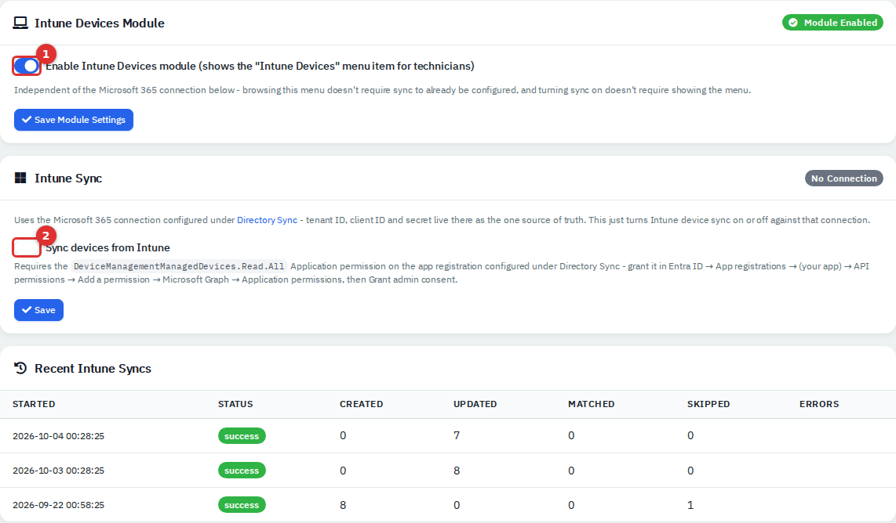

*Figure 17 — The Device Sync tab. (1) menu switch, (2) sync switch. The badge says No Connection until step 2 is done.*

The Intune menu item needs only Departments access, so it also shows for technicians.

## UniFi

UniFi has no page in the agent menu. It fills other areas: **Assets** and **Network** (access points, switches and gateways), **Credentials** (Wi-Fi networks that have a password, named "Wi-Fi: " and the network name) and **Networks** (VLANs and subnets).

**Set it up** (administrator): Administration → **Settings** → **Integrations** → **UniFi**.

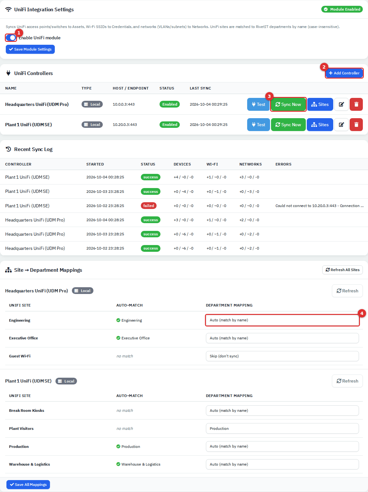

*Figure 18 — The UniFi tab. (1) module switch, (2) Add Controller, (3) Sync Now, (4) site to department mapping.*

1. Switch on **Enable UniFi module** **(1)** and save.
2. Click **Add Controller (2)**. Choose **Local Controller** (a UDM, Cloud Key or similar: enter its host or IP and port, and tick **Verify SSL certificate** only if it has a trusted certificate) or **Cloud Site Manager** (`api.ui.com`, covers every site in your Ubiquiti account). Paste the API key from UniFi OS → Settings → Control Plane → Integrations → API Key.
3. Click **Test**, then **Sync Now (3)**. The **Recent Sync Log** shows devices, Wi-Fi networks and networks as +created / ~updated / -skipped.
4. Under **Site → Department Mappings (4)**, each UniFi site is matched to the department with the same name. **no match** means the site is not synced. Pick a department in the drop-down to override, or **Skip (don't sync)** to leave a site out, then click **Save All Mappings**. **Refresh** and **Refresh All Sites** reload the site lists from the controllers, and the **Sites** button on a controller row does the same for that controller.

## Backups (Comet)

Sidebar → **Backups** opens the **Backup Dashboard**: the last backup of every device known to your Comet Backup server. The list is fetched from Comet each time you open the page, so if Comet is down you see "Could not reach Comet server" and should tell an administrator.

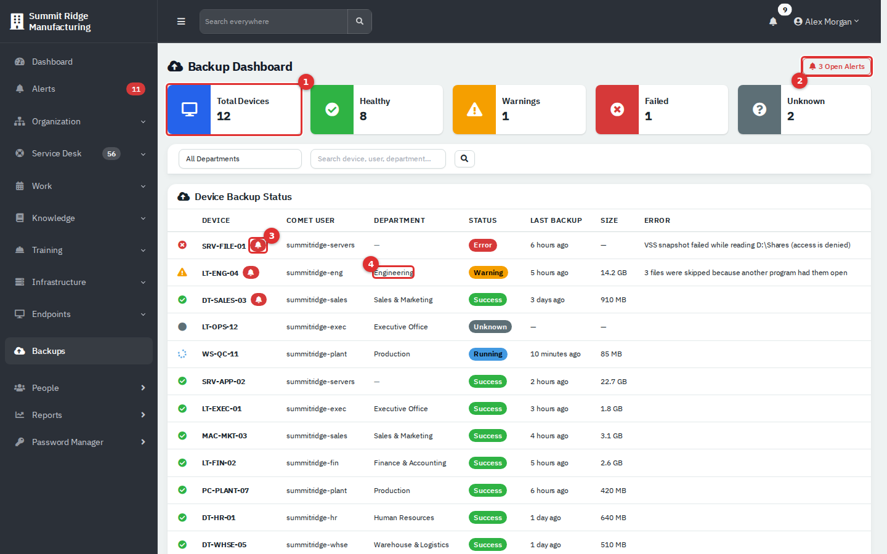

*Figure 19 — The Backup Dashboard. (1) counters, (2) open backup alerts, (3) bell badge, (4) department.*

- **(1)** **Total Devices**, **Healthy**, **Warnings**, **Failed** and **Unknown**. Running backups and devices that have never backed up count as Unknown.
- Each row shows the device, its Comet user, department, a status (**Success**, **Warning**, **Error**, **Timeout**, **Running**, **Unknown** and so on), when the last backup started, its size and any error text. Devices with an open alert come first, then failures, warnings, unknowns and healthy devices.
- **(2)** opens the Alerts page filtered to backup alerts. **(3)** the bell on a device opens the ticket RivetIT created for it.
- **(4)** The department comes from the Comet user's mapping. A dash means that user is not mapped to a department.
- Filter by department or search by device, user or department.

When RivetIT hears about a failed backup it creates one alert and one ticket per device (priority High). It hears in two ways: Comet calls RivetIT's webhook after each job, and the scheduled job polls Comet as a fallback. Separately, a device with no backup activity for 48 hours gets a **missed** alert. When a later backup succeeds, the alert and ticket resolve by themselves. In this version RivetIT creates these tickets whether or not the **Auto-create tickets on backup failure** box in settings is ticked.

**Set it up** (administrator): Administration → **Settings** → **Integrations** → **Backups**.

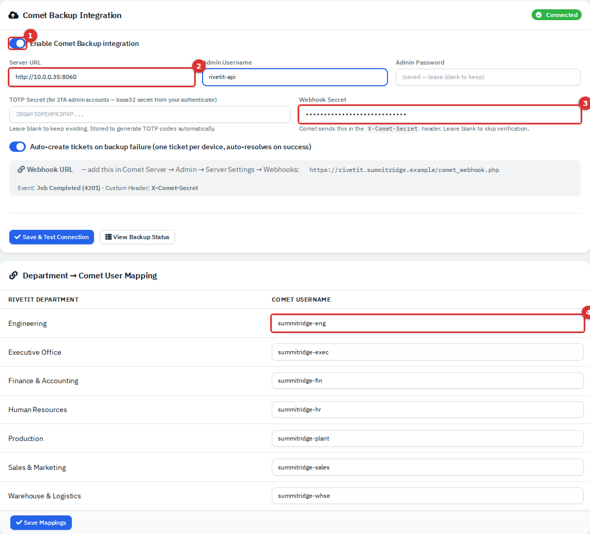

*Figure 20 — The Backups tab. (1) enable switch, (2) server URL, (3) webhook secret, (4) department mapping.*

1. Switch on **Enable Comet Backup integration (1)**.
2. Enter the **Server URL (2)** of your Comet server, for example `http://10.0.0.35:8060`, and the **Admin Username** and **Admin Password** of a Comet admin account. If that account uses two-factor sign-in, enter its **TOTP Secret** (the base32 code from the authenticator app) so RivetIT can sign in on its own. **View Backup Status** next to the save button opens the same device backup status in the administration area.
3. Enter a **Webhook Secret (3)**: any random string. In Comet Server → Admin → Server Settings → Webhooks, add the webhook URL shown on the page (`https://your-rivetit-address/comet_webhook.php`), the event **Job Completed (4201)**, and the custom header **X-Comet-Secret** with the same secret.
4. Click **Save & Test Connection**. The badge at the top of the card turns to **Connected** or **Cannot reach server**, with the reason under it.
5. Once connected, the **Department → Comet User Mapping (4)** card lists your departments. Pick the Comet user that belongs to each and click **Save Mappings**. Without mapping, backups still show but have no department.

## Endpoint metrics collector

RivetIT can chart device performance on the asset's **Performance** tab. Basic figures (CPU, memory, disk, uptime, pending reboot) come from the RMM itself. Finer detail (per-core CPU, disk speed, network traffic, battery) needs a small PowerShell script, `scripts/collector/itflow_metrics_collector.ps1`, which runs on each Windows device as a Tactical RMM script check every five minutes and sends its readings to RivetIT.

- The switch is **Collect device performance metrics** on the RMM tab (Device Metrics card), with the sample interval and how long to keep raw and hourly data. Turning it off keeps existing history.
- Collection needs a scheduled job, `cron/metrics_collect.php`, which is separate from the main scheduled job and is not the one **Maintenance → Scheduled jobs** lists unless an administrator has installed it. Without it nothing is gathered, whatever the switch says.
- Setting up the script means uploading it to Tactical RMM, creating a script check and creating an enrollment token. The steps are in `scripts/collector/README.md`.
- **Availability.** In this version the receiving address for the script (`/api/v1/metrics-ingest`) is not connected to RivetIT's API router, and there is no screen for creating enrollment tokens. Treat the collector as unfinished until your administrator or vendor confirms otherwise. The RMM-supplied figures are not affected.

## Permissions

Permissions are set per role under Administration → **Roles**. The RMM entries only show in the role editor while RMM is switched on.

| To do this | You need |
|---|---|
| Open Alerts and see the sidebar item | RMM alerts: on |
| Acknowledge or resolve alerts, bulk buttons | Acknowledge RMM alerts: on |
| Create a ticket from an alert | Tickets, assets & docs: Modify |
| Open the RMM Dashboard, Assets, Check Policies, Network, Backups | RMM devices: Read |
| Push check policies, patch scan and install | RMM devices: Modify |
| Create, edit or delete a check policy | RMM devices: Read (the screen does not enforce more) |
| Open the Script Run page and see the script buttons | RMM scripts: Read |
| Run, add or edit a script | RMM scripts: Modify |
| Delete a script | RMM scripts: highest level |
| Sync Now, Sync Firewalls, assign department, Remove from RMM | RMM sync: on |
| Connect, Reboot, Run Command | RMM remote connect: on |
| Intune Devices | Departments: Read |
| Anything under Settings → Integrations | Administrator |

People limited to certain departments only see alerts, devices and backups of those departments. Without RMM devices access, a technician who opens one of these pages sees "Your role needs view access to RMM."

## Tips and good practice

- Grant RMM permissions to the technicians who need them. Keep **RMM remote connect** and **RMM scripts: Modify** for people you trust to act on a user's computer.
- Name RMM clients exactly like your departments before the first sync, or devices are skipped.
- After each first sync, look through the new assets and fix wrong types and missing departments.
- Acknowledge an alert as soon as you start on it so colleagues do not duplicate the work; resolve it when it is fixed.
- If figures on RMM pages look old, check **Recent Sync Log** for a failed sync and check that the scheduled job runs.
- Do not put real credentials in screenshots or tickets. The forms never show saved secrets again; leave a secret field blank when editing to keep the stored one.

## Related guides

- [Service Desk](03-service-desk.md): the tickets created from alerts and backup failures.
- Assets and IT documentation: the asset record that an RMM device attaches to.
- Reports → **RMM Health**: alert volume, severity and noisiest devices over time.
- [Administration: Settings](13-administration-settings.md): the Integrations page (including the **Odoo** tab), Notifications and **Maintenance → Scheduled jobs**.
- Administration → **Roles**: permissions.
