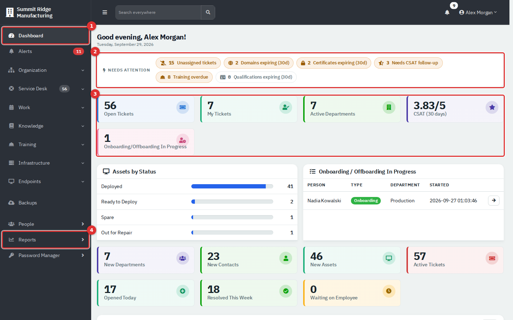
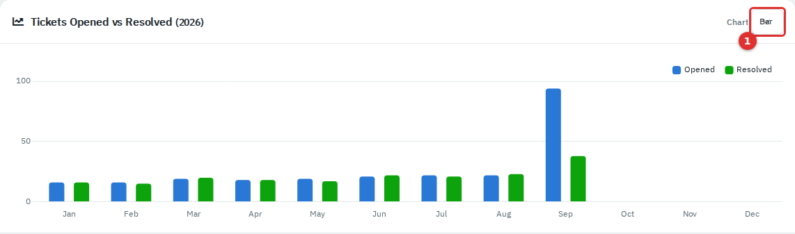
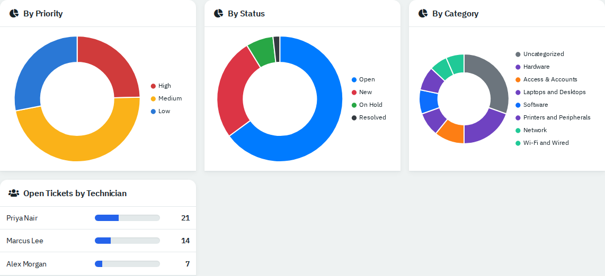
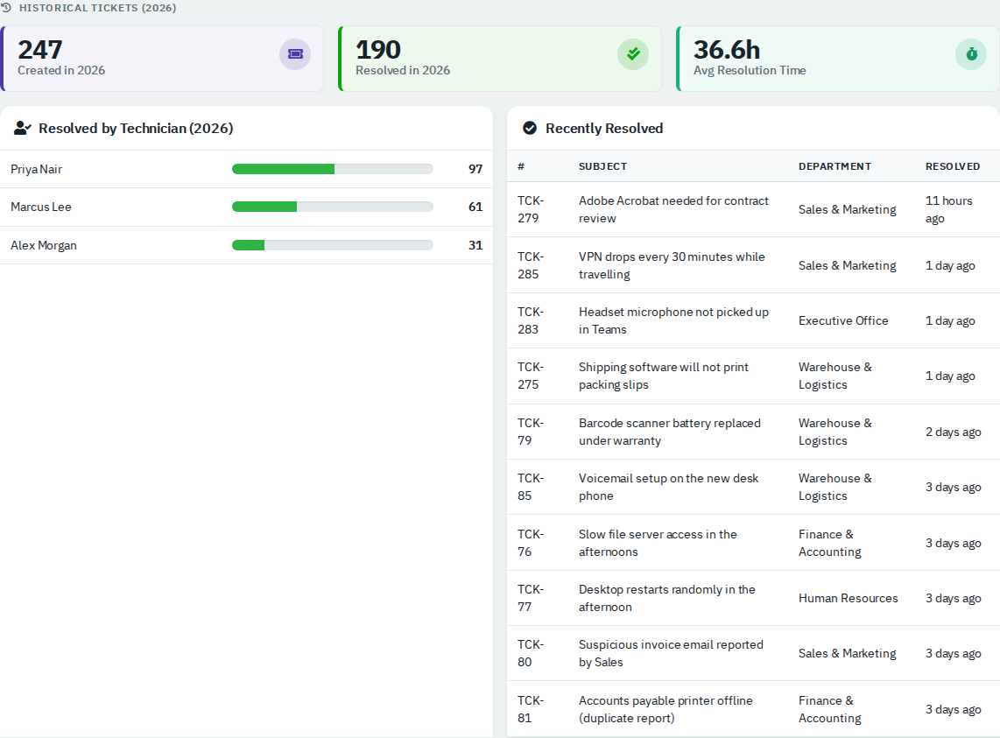
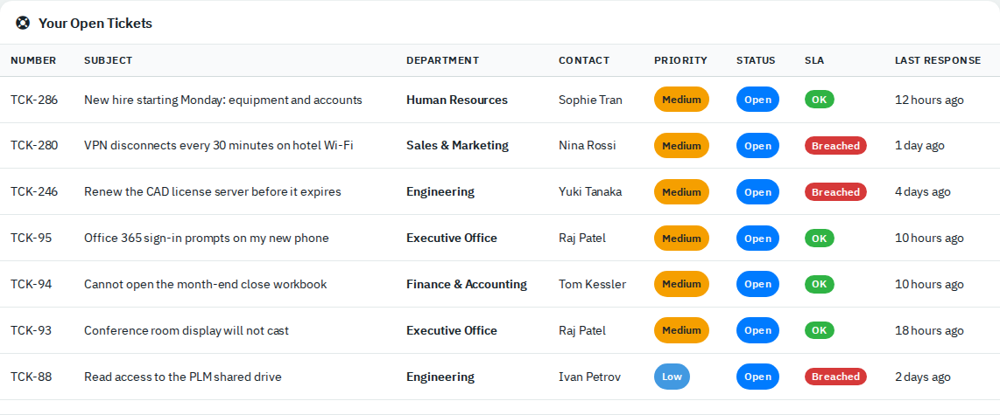
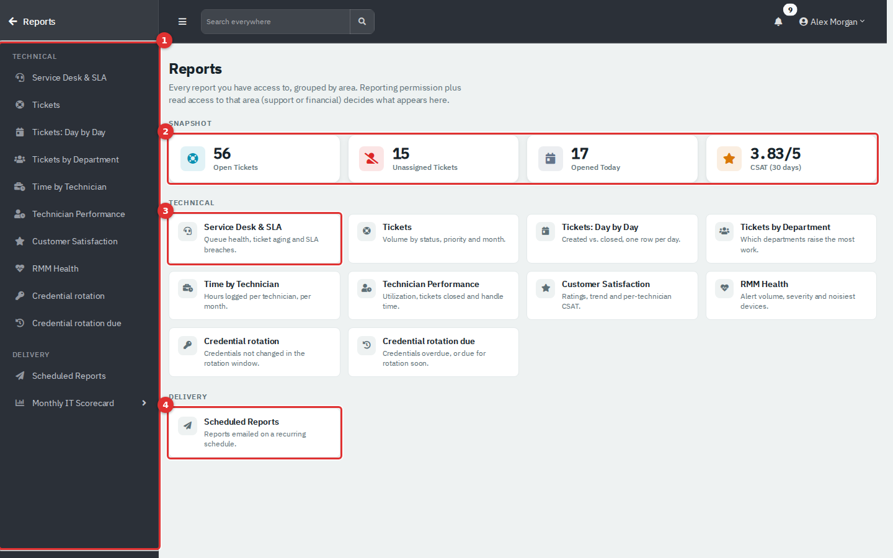
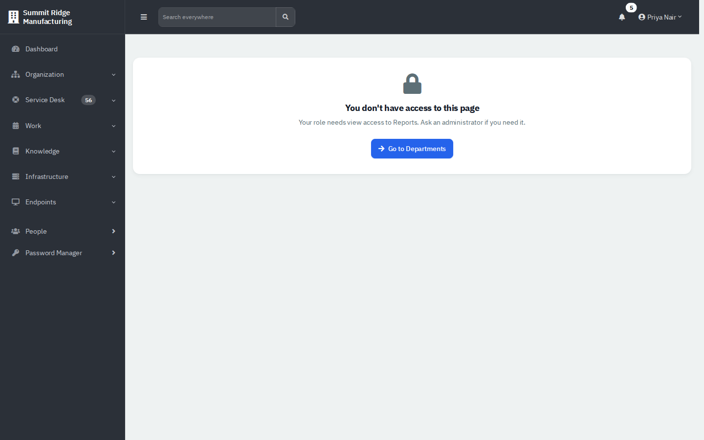
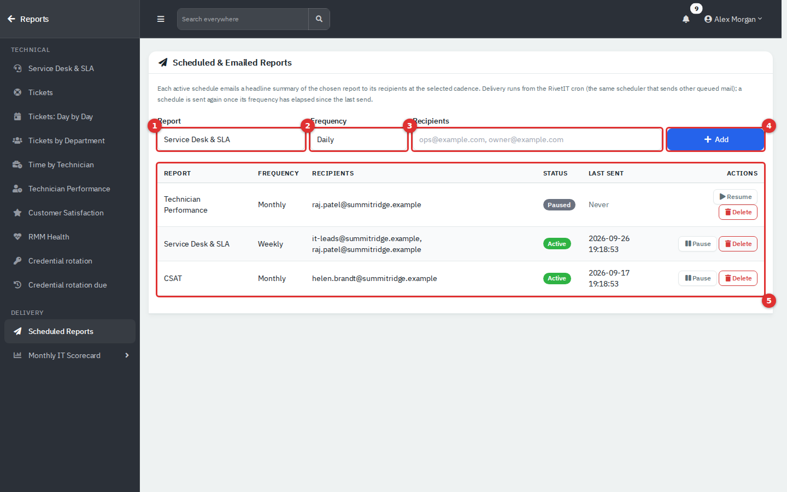

# Dashboard and Reports

The Dashboard is the page you land on when you sign in: a live summary of the service desk, with the things that need attention at the top. Reports are the longer-range view: how many tickets came in, how fast you answered, who logged the time, how satisfied people were, and which credentials are due for rotation. Any report can be printed, most can be exported to CSV, and a few can be emailed to people on a schedule.

| | |
|---|---|
| **Where to find it** | Dashboard: sidebar → **Dashboard** (the first item). Reports: sidebar → **Reports** (near the bottom of the sidebar). Both are company-wide: there is no per-department version, so they look the same from inside a department workspace. |
| **Who can use it** | Dashboard: any agent who has Departments, Tickets, assets & docs, or Assets. Each widget also checks its own permission (see [Who sees what](#who-sees-what-on-the-dashboard)). Reports: the role needs **Reporting** switched on, plus read access to the area a report covers (Tickets, assets & docs for the ticket reports, Credentials for the credential reports). Administrators always have everything. |
| **Turn it on** | Nothing to enable. CSAT tiles and the CSAT report need **Enable CSAT ratings** in Administration → Settings → Ticket. Scheduled email needs the cron job and outgoing mail (see [Scheduled reports](#scheduled-reports)). |

This page covers the Dashboard, how reports work in general, and scheduled reports. Each individual report is explained in [Report reference](10b-report-reference.md).

## What it's for

- **Start of day.** Open the Dashboard to see how many tickets are unassigned, which are yours, and whether anything is about to expire.
- **Spot trouble early.** The aging chart, the SLA columns and the low-rating chip show where work is slipping.
- **Answer "how are we doing?"** Use the reports for monthly volumes, response and resolution times, hours logged and satisfaction scores, with CSV export for a spreadsheet or a management pack.
- **Keep leaders informed.** Schedule a report so a headline summary lands in someone's inbox every week or month.

## A quick tour of the Dashboard

*Figure 1 — The top of the Dashboard. Everything on the page is a link to the list behind the number.*

1. **Dashboard** in the sidebar. The company name at the top of the sidebar leads to your start page, which is the Dashboard unless an administrator changed it.
2. The **Needs attention** strip. Amber chips have something to look at; grey chips are clear. When every chip is zero the label changes to **All clear**.
3. The first row of tiles: your headline numbers.
4. **Reports** in the sidebar, which opens the report hub.

The rest of the page scrolls in this order: the Assets and Onboarding cards, a band of tiles for the current year, the ticket charts, a **Historical Tickets** band, and two tables (**Recently Resolved** and **Your Open Tickets**).

### The Needs attention strip

| Chip | What it counts | Opens |
|---|---|---|
| **Unassigned tickets** | Tickets that are not closed and have no technician. | The ticket list filtered to unassigned. |
| **Domains expiring (30d)** | Domains whose expiry date is in the next 30 days. Already-expired and archived domains are not counted. | The domain list, soonest first. |
| **Certificates expiring (30d)** | The same rule for SSL certificates. | The certificate list, soonest first. |
| **Needs CSAT follow-up** | Tickets rated at or below the low-rating threshold whose status is not Closed (for example, re-opened after a bad rating). Only shown when CSAT is on. | The CSAT report. |
| **Training overdue** | Overdue training assignments in your training scope. Only shown when the Training module is on and you have Training access. | Training assignments, overdue. |
| **Qualifications expiring (30d)** | Staff qualifications that expire in the next 30 days. Same conditions as above. | The expiring-qualifications report. |

### The tiles

There are three bands of tiles. Each tile is a link.

**Top row**

| Tile | What it counts |
|---|---|
| **Open Tickets** | Tickets that are neither resolved nor closed. |
| **My Tickets** | Tickets assigned to you that are not closed. |
| **Active Departments** | Departments that are not archived. |
| **CSAT (30 days)** | Average rating out of 5 for ratings received in the last 30 days. Hidden when there are none. |
| **Onboarding/Offboarding In Progress** | Employee workflow runs still in progress. Hidden when there are none. |

**Current-year band**

| Tile | What it counts |
|---|---|
| **New Departments**, **New Contacts**, **New Assets** | Records created so far this calendar year. |
| **Active Tickets** | Every ticket that is not closed. This can be slightly higher than **Open Tickets**, which also leaves out resolved tickets. |
| **Opened Today** | Tickets created today. |
| **Resolved This Week** | Tickets closed in the last seven days. |
| **Waiting on Employee** | Open tickets whose status is named *Waiting on Employee* (or *Waiting on Customer*). The standard statuses do not include either name, so this tile stays at 0 until an administrator adds a status with that name in Administration → Ticketing → Ticket Statuses. |

**Historical Tickets band** (see [Historical band](#historical-band-and-your-tickets) below)

### Ticket charts

*Figure 2 — Tickets Opened vs Resolved for the current year. The Chart switch (1) changes how it is drawn.*

**Tickets Opened vs Resolved** plots, for each month of the year, how many tickets were created (blue) and how many were closed (green). It uses all tickets of the year, not only open ones. The **Chart** switch (1) toggles **Bar** and **Line**. The choice is saved for you alone and stays until you change it. If no ticket was opened or closed this year, a short note replaces the chart.

*Figure 3 — Breakdowns of the tickets that are not closed.*

The three doughnuts describe tickets that are not closed right now:

- **By Priority**: High (red), Medium (amber), Low (blue).
- **By Status**: uses the colours set for each status in Administration → Ticketing → Ticket Statuses (up to eight).
- **By Category**: uses each category's colour; tickets without a category show as *Uncategorized* (up to eight).

**Open Tickets by Technician** shows each technician's share of the open queue (top eight). A card is left out when it would be empty.

### Historical band and Your Open Tickets

*Figure 4 — The Historical Tickets band for the current year.*

| Item | What it shows |
|---|---|
| **Created in *year*** | Tickets created in the year. |
| **Resolved in *year*** | Tickets closed in the year. |
| **Avg Resolution Time** | Average hours from creation to closing, for tickets closed in the year. Tickets linked to a project are left out by default, and the tile shows **N/A** when nothing was closed. An administrator can hide it or include project tickets under Administration → Settings → Ticket → Reporting. |
| **Resolved by Technician (*year*)** | Tickets closed this year per technician (top eight). |
| **Recently Resolved** | The ten most recently closed tickets, with how long ago. Click one to open it. |

*Figure 5 — Your Open Tickets, with the SLA badge.*

**Your Open Tickets** lists every ticket assigned to you that is not closed. The **SLA** column reads **OK** (green), **OK** in amber when fewer than two hours remain, or **Breached** (red). Until a first reply has gone out it compares against the response deadline; afterwards, against the resolution deadline. A dash means the ticket has no SLA target. **Last Response** is how long ago the ticket was last updated, and a row in bold with *Never* has not been touched yet.

Below it, **Recent Automation Activity** lists the last ten ticket-automation actions on your tickets. It appears only when there are some.

### Assets and onboarding cards

Two cards sit under the first row when there is something to show:

- **Assets by Status**: active assets grouped by status, with the share of the total as a bar.
- **Onboarding / Offboarding In Progress**: each running employee workflow (person, type, department, start time), oldest first, up to 25. The arrow opens the workflow.

### Who sees what on the Dashboard

Every widget checks the module it draws on, so the page adapts to the role:

| Widget group | Needs |
|---|---|
| Ticket tiles, charts, tables, the attention chips for tickets, domains and certificates | Tickets, assets & docs (read) |
| Department and contact tiles, the onboarding card | Departments (read) |
| Asset tiles and the assets card | Assets, or Tickets, assets & docs (read) |
| Training chips | Training module on, and Training access |

If your account is limited to certain departments, the ticket numbers on the Dashboard count only those departments. Administrators are never limited.

**Module-only logins.** A role that has none of Departments, Tickets, assets & docs, or Assets (for example a Training manager) has no Dashboard. The **Dashboard** item is missing from their sidebar, and opening the dashboard address sends them to their own home instead: the first of Training, Knowledge Base, Reports, RMM or Alerts that their role holds, otherwise their account page.

Add `?year=2025` to the Dashboard address to see another year's yearly numbers. There is no on-screen year picker; the [Tickets report](10b-report-reference.md#tickets-summary-by-month) has one.

## Reports

### Open the report hub

1. Click **Reports** in the sidebar. The sidebar switches to the report menu; the **Reports** arrow at its top takes you back.
2. On the hub, read the **Snapshot** tiles (2), then pick a report card (3).

*Figure 6 — The report hub. Numbers here cover all departments.*

1. The report menu on the left, grouped **Technical** and **Delivery**.
2. **Snapshot**: **Open Tickets**, **Unassigned Tickets**, **Opened Today** and **CSAT (30 days)** (only when CSAT is on). Unlike the Dashboard, these ignore any department restriction.
3. A report card: its name and the question it answers.
4. **Scheduled Reports**, where you set up emailed summaries.

The hub only lists reports you may open, and finance reports appear only when the accounting module is on (it is off in this setup). If you have Reporting but no read access to Tickets, assets & docs, the hub shows *No reporting area unlocked yet*.

### The reports

| Report | Answers | Filter | Export |
|---|---|---|---|
| **Service Desk & SLA** | Are we keeping up, and are we within SLA? | Date range | CSV, Print |
| **Tickets** | How many tickets per month? | Year | CSV, Print |
| **Tickets: Day by Day** | What came in and went out each day? | Date range | CSV, Print |
| **Tickets by Department** | Which departments raise the most work? | Year, Month | Print |
| **Time by Technician** | How much time did each technician log this year? | Year | Print |
| **Technician Performance** | Utilization, tickets closed and handling time per technician | Date range | CSV, Print |
| **Customer Satisfaction** | How do people rate our service? | Date range | CSV, Print |
| **RMM Health** | Which monitored devices raise the most alerts? | Date range | Print |
| **Credential rotation** | Which credentials have not changed lately? | Days | Print |
| **Credential rotation due** | Which credentials are overdue or due soon? | Days ahead | Print |
| **Scheduled Reports** | Who gets which report by email? | — | — |

Each one is described in [Report reference](10b-report-reference.md).

### Date ranges

Most reports share the same **Date range** control.

1. Pick a range from the **Date range** list: **All time**, **Today**, **Yesterday**, **This week**, **Last week**, **This month**, **Last month**, **This year**, **Last year** or **Custom range**. The page reloads at once.
2. For your own dates, type into **From** and **To**. The list switches to **Custom range**. Click **Apply (custom)**.
3. The line under the filters (for example *Showing 2026-01-06 to 2026-09-29*) states the exact dates used. Check it when a number surprises you.

*All time* starts on the date of the first ticket, time entry, rating or alert (depending on the report) and ends today. Weeks start on Monday.

### Export and print

- **Export CSV** downloads the numbers behind the report as a spreadsheet-ready file (UTF-8, opens in Excel). The file name includes the report and the dates, for example `service_desk_2026-01-06_to_2026-09-29.csv`. It is only the main table of each report: the monthly series for **Service Desk & SLA**, the month list for **Tickets**, one row per day for **Day by Day**, one row per technician for **Technician Performance**, and one row per rating for **Customer Satisfaction**.
- **Print** opens the browser's print dialog. The menus, filters and buttons are hidden on paper. Choose *Save as PDF* in that dialog to make a PDF.
- Reports without **Export CSV** (**Tickets by Department**, **Time by Technician**, **RMM Health** and the credential reports) can only be printed.

### Who can open reports

*Figure 7 — A role without Reporting sees no Reports item, and the address shows this message.*

**Reporting** is a simple on/off permission in the role editor. The built-in **Technician** role does not have it, so technicians never see **Reports** in the sidebar. To grant it, open the user menu → **Administration** → **Roles**, edit the role and switch **Reporting** on. It opens every report the role's other permissions allow.

Reports are company-wide. They do not apply the department restrictions that limit what a person sees on the Dashboard and in lists, so give Reporting only to people who may see all departments' numbers.

## Scheduled reports

A schedule emails a short summary table of one report to a list of people on a fixed rhythm. It is a headline summary (a few key figures), not the full report and not an attachment. Recipients are told to sign in for the interactive report.

*Figure 8 — Add a schedule with the form (1 to 4); the list (5) shows what is set up.*

### Add a schedule

1. Open **Reports** → **Scheduled Reports**.
2. Choose the **Report** (1). The list offers **Service Desk & SLA**, **Technician Performance**, **Ticket Summary** and **CSAT**. It also contains finance entries that do nothing useful unless the accounting module is on.
3. Choose the **Frequency** (2): **Daily**, **Weekly** or **Monthly**.
4. Type the **Recipients** (3). Use email addresses separated by commas, semicolons or spaces. They can be anyone, inside or outside the company; they do not have to be RivetIT users. Invalid entries are dropped, and at least one valid address is required.
5. Click **Add** (4). The schedule starts as **Active** and has never been sent (*Last sent: Never*).

The email is a table of headline figures for the current month or year (for example opened, resolved, open now and SLA percentages for **Service Desk & SLA**). The subject reads *<Company name> report: <report name> (<date>)*.

### Pause, resume or delete

In the list (5), **Pause** stops a schedule without losing it and turns the button into **Resume**. **Delete** removes it after a confirmation, and cannot be undone. Both apply immediately. Creating and deleting a schedule are recorded in the audit log.

### When does it send?

The scheduler runs from RivetIT's cron job, which the installer sets to run every five minutes. On each run, an active schedule is sent when it has never been sent, or when its frequency has passed since **Last sent** (one day, seven days or one month). So the send time drifts to whenever the cron job first runs after the interval. Emails go into the mail queue and are delivered by your outgoing mail settings.

This depends on services outside the page: turn on **Enable Cron Job** under Administration → Settings → Notifications, make sure the server runs the cron entry, and configure outgoing mail under Administration → Settings → Mail. In the demo instance no mail server is connected, so the schedules are shown but nothing is sent.

Anyone who can open Reports can add, pause or delete schedules; there is no separate permission. Keep in mind that a schedule sends company-wide figures to whatever addresses are typed in.

## Tips and good practice

- Compare like with like. The Dashboard's **Open Tickets** and the hub's **Open Tickets** agree, but **Active Tickets** on the Dashboard also includes resolved-but-not-closed tickets.
- When a report is empty, check the **Date range** line first, then whether the data exists (a time report is empty until technicians log time; the CSAT report until people rate tickets).
- Encourage technicians to log time on tickets. **Technician Performance** and **Time by Technician** read only logged time.
- Use **Tickets by Department** and **Customer Satisfaction** together to see whether busy departments are also unhappy ones.
- Schedule **Service Desk & SLA** weekly for the IT lead and **CSAT** monthly for management.

## Related guides

- [Report reference](10b-report-reference.md): every report, filter and column.
- [Service Desk](03-service-desk.md): tickets, statuses, SLA and CSAT ratings.
