# Report reference

This page explains every report under **Reports**: the question it answers, its filters, how to read each figure and what you can export. For the Dashboard, the report hub, date ranges, permissions and scheduled email, start with [Dashboard and Reports](10-dashboard-and-reports.md).

| | |
|---|---|
| **Where to find it** | Sidebar → **Reports**, then the report in the left-hand menu. |
| **Who can use it** | **Reporting** switched on for the role, plus read access to the area: Tickets, assets & docs for the ticket, time, CSAT and RMM reports; Credentials for the two credential reports. |
| **Turn it on** | Nothing for ticket reports. CSAT needs **Enable CSAT ratings** (Administration → Settings → Ticket). RMM Health needs an RMM integration sending alerts. |

## What it's for

Use the reports to answer questions that the Dashboard cannot: trends over months, service levels, workload per person and customer feedback. All figures are read live from tickets, time entries, ratings, alerts and credentials, so a report is only as complete as the data your team records.

Two things apply to every ticket report:

- **Archived tickets.** Reports that take a date range leave archived tickets out. **Tickets** and **Tickets by Department** count them.
- **"Resolved" means closed.** In this app resolving a ticket closes it, so "resolved" and "closed" count the same tickets.

## Service Desk & SLA

**Answers:** Is the queue under control, how old are the open tickets, and are we meeting our SLA targets?

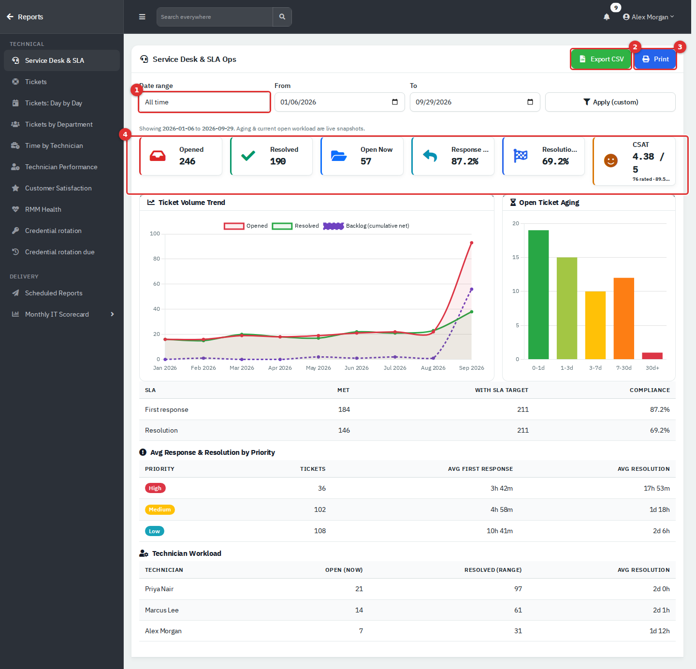

*Figure 1 — Service Desk & SLA. Date range (1), Export CSV (2), Print (3) and the headline tiles (4).*

**Filter:** **Date range** (default **All time**). Ageing and the current-workload numbers are live snapshots and ignore the range.

| Item | How to read it |
|---|---|
| **Opened** | Tickets created in the range. |
| **Resolved** | Tickets closed in the range. |
| **Open Now** | Tickets open at this moment, whatever the range. |
| **Response SLA** / **Resolution SLA** | Share of tickets created in the range that met the target (see the SLA table). A dash means no ticket in range has a target. |
| **CSAT** | Average rating (out of 5) of tickets created in the range that have been rated, with the count and the share rated 4 or 5. |
| **Ticket Volume Trend** | Per month: **Opened**, **Resolved** and **Backlog (cumulative net)**. The backlog line is the running total of opened minus resolved from the start of the range. It is not a count of open tickets, so it can differ from **Open Now** when the range does not start at the beginning. |
| **Open Ticket Aging** | Open tickets by age since creation: 0-1d, 1-3d, 3-7d, 7-30d, 30d+. Tall bars on the right mean neglected tickets. |
| **SLA table** | **First response** and **Resolution**: how many **Met**, how many had an SLA target, and the **Compliance** percentage. Only tickets that carry an SLA due date count. A ticket still open, or without a first reply, is counted as not met. |
| **Avg Response & Resolution by Priority** | Ticket count, average time to first reply and average time to resolution for High, Medium and Low. |
| **Technician Workload** | Per technician: tickets open now, tickets resolved in the range and their average resolution time. |

SLA due dates are set when a ticket is created, from an SLA policy (Administration → Ticketing → SLA Policies). Tickets created before a policy existed carry no target and do not count.

**Export CSV** gives the monthly table: Month, Opened, Resolved, Cumulative backlog.

## Tickets (summary by month)

**Answers:** How many tickets were raised each month of a year?

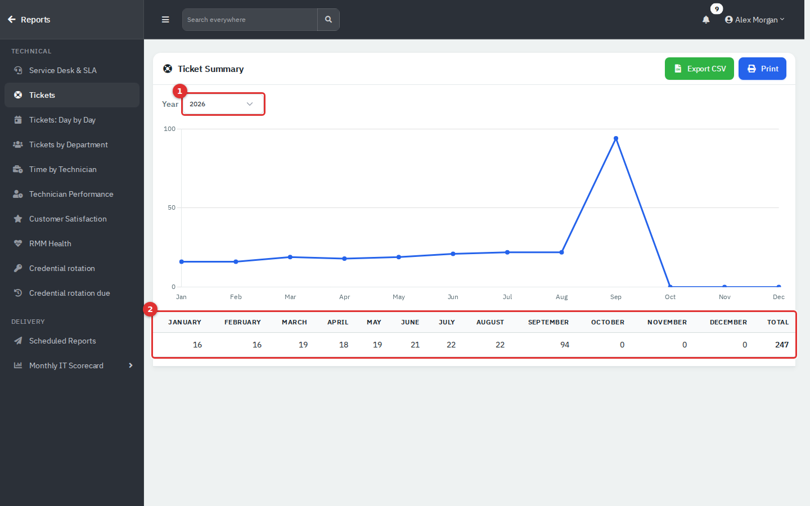

*Figure 2 — Tickets. Year picker (1) and the month-by-month totals (2).*

1. Choose the **Year** (1). Only years that contain tickets are listed.
2. Read the line chart and the table (2): one column per month and a **Total**. The count is by the date a ticket was created.

**Export CSV** gives Month and Tickets raised, plus a Total row. The page title reads *Ticket Summary*; the menu calls it **Tickets**.

## Tickets: Day by Day

**Answers:** How many tickets were created and closed on each day, and is the backlog growing?

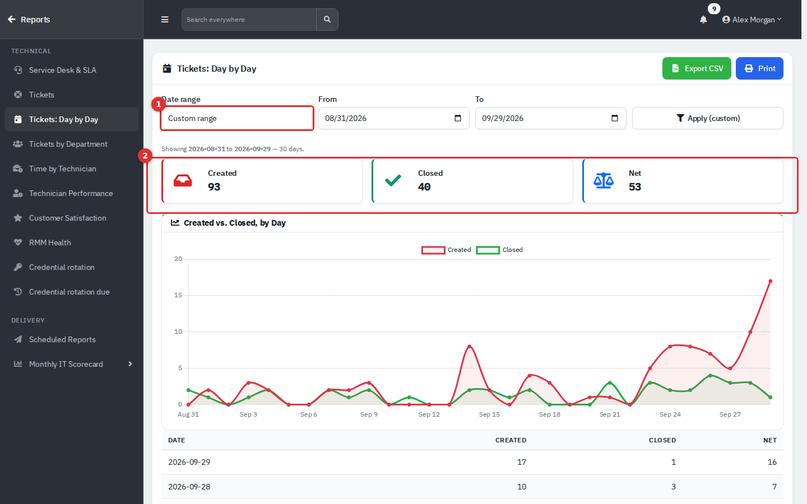

*Figure 3 — Day by Day. Date range (1) and the totals (2).*

- **Filter:** **Date range**. Opening the page without choosing a range shows the last 30 days, although the list may display *This month*. Pick a range to be sure.
- **Created**, **Closed** and **Net** (created minus closed) are totals for the range. The chart draws created against closed per day.
- The table lists the newest day first. A positive **Net** (red) means more tickets came in than were closed that day; a negative one (green) means you gained ground.
- The range is capped at 400 days; a warning appears if you ask for more.

**Export CSV**: Date, Created, Closed, Net, one row per day.

## Tickets by Department

**Answers:** Which departments raise the most tickets, how urgent are they, and how long do they take?

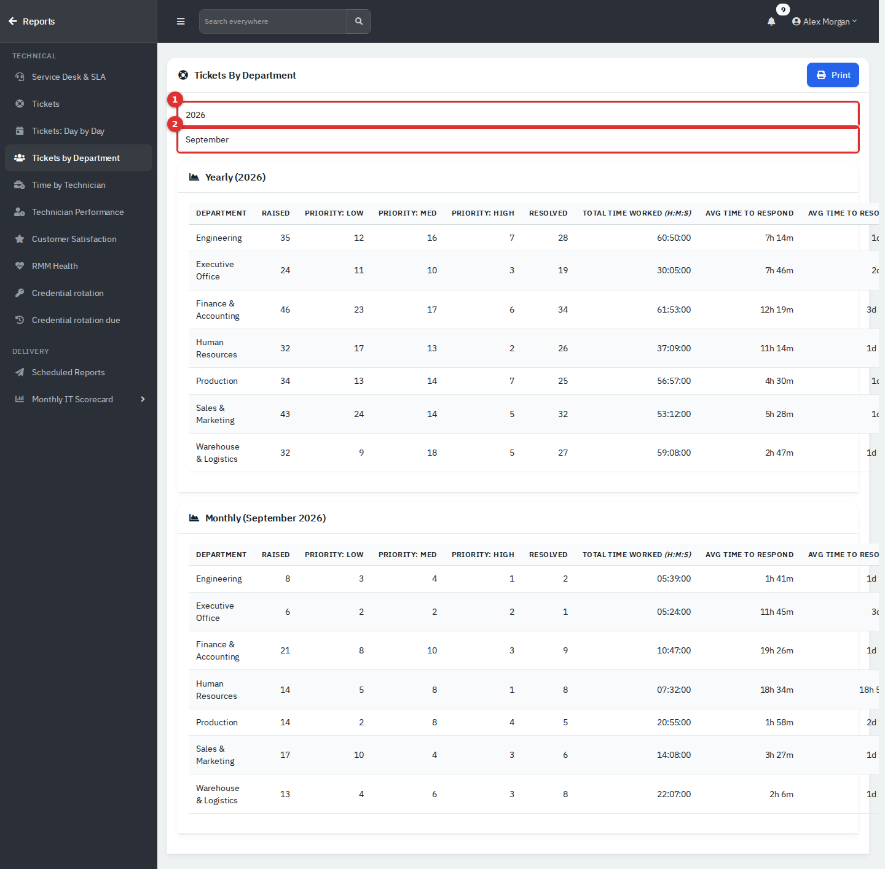

*Figure 4 — Tickets by Department. Year (1) and Month (2) apply as soon as you change them.*

There are two tables, **Yearly** for the chosen year and **Monthly** for the chosen month. Departments with no tickets in the period are left out.

| Column | Meaning |
|---|---|
| **Raised** | Tickets created in the period. |
| **Priority: Low / Med / High** | The same tickets split by priority. |
| **Resolved** | Of the tickets raised in the period, how many are now resolved. It is not "resolved during the period". |
| **Total Time worked (H:M:S)** | All time logged on those tickets. |
| **Avg time to respond** | Average from creation to first reply. |
| **Avg time to resolve** | Average from creation to resolution, over resolved tickets. |

Only **Print** is available. The tables are wide; on a narrow window, scroll sideways or print to see every column.

## Time by Technician

**Answers:** How much time did each technician log on tickets this year?

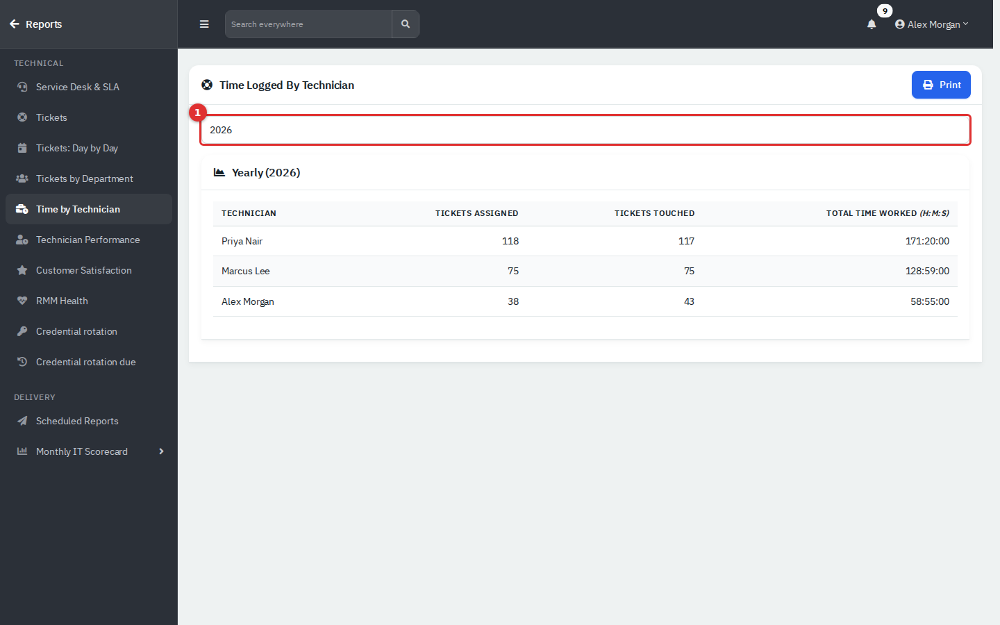

*Figure 5 — Time Logged by Technician for one year (1).*

Choose the **Year**. There is one row per active agent:

- **Tickets assigned**: tickets created in the year that are now assigned to them.
- **Tickets touched**: tickets they replied to in the year, plus tickets created in the year that they opened or closed.
- **Total time worked (H:M:S)**: time logged on tickets created in the year.

The hub card says "per month", but the page is a yearly table only. Only **Print** is available. For a date range and utilization, use **Technician Performance**.

## Technician Performance

**Answers:** How busy is each technician compared with a full working day, how many tickets do they close and how long does a ticket take?

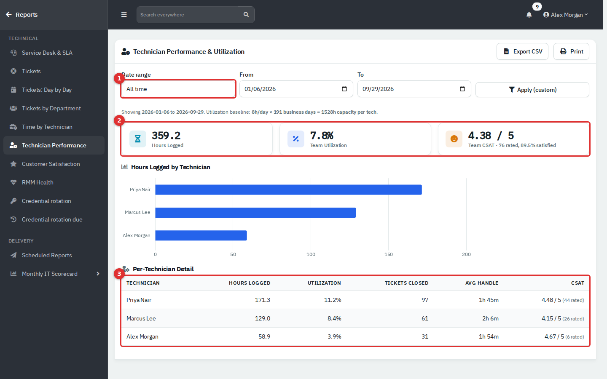

*Figure 6 — Technician Performance. Date range (1), headline tiles (2) and the per-technician table (3).*

**Filter:** **Date range** (default **All time**).

The grey line under the filter states the baseline: 8 hours a day times the business days (Monday to Friday) in the range. That is the capacity of one technician.

| Item | How to read it |
|---|---|
| **Hours Logged** | Every time entry made by an agent in the range, by the date it was entered. Closing a ticket with the reply form also adds a one-minute entry. |
| **Team Utilization** | Hours logged by all listed agents divided by capacity for all of them. It counts only time logged on tickets, so people who also do project or maintenance work will read low. |
| **Team CSAT** | Average rating for ratings received in the range, with how many were rated and the share satisfied (4 or 5). |
| **Hours Logged by Technician** | The same hours as a bar per person. If nobody logged time, a message replaces the chart. |
| **Utilization** (table) | That person's hours divided by one technician's capacity. |
| **Tickets Closed** | Tickets assigned to them and closed in the range. |
| **Avg Handle** | Their hours logged divided by tickets closed. |
| **CSAT** | Their average rating and how many ratings. |

Every active agent is listed, including those with no time. **Export CSV** has one row per technician with hours, utilization, tickets closed, average handling time (seconds) and the CSAT figures.

## Customer Satisfaction (CSAT)

**Answers:** How do people rate the service, which technicians and departments do best, and what are they saying?

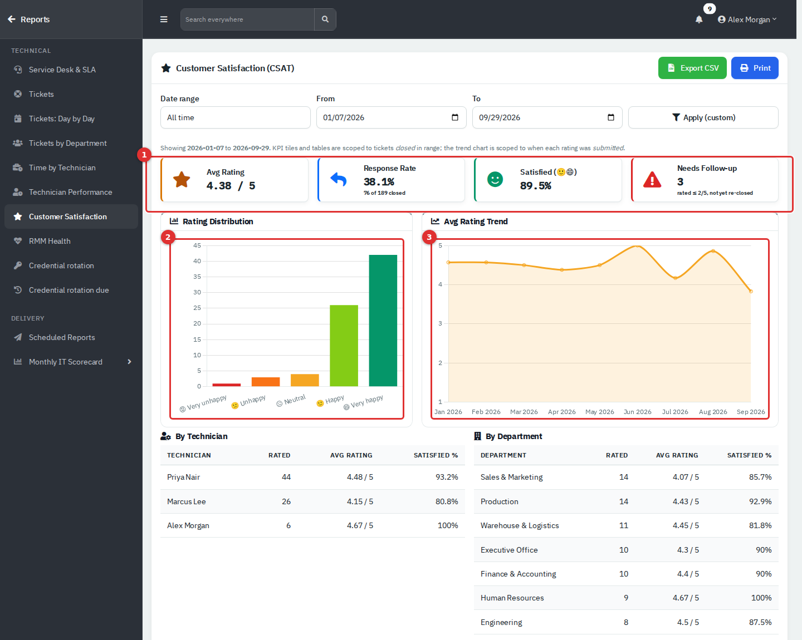

*Figure 7 — Customer Satisfaction: headline tiles (1), rating distribution (2) and monthly trend (3).*

Ratings are 1 to 5: Very unhappy, Unhappy, Neutral, Happy, Very happy. People give them from the link in the ticket-closed email or on the closed ticket in the Department Portal. A rating at or below the low-rating threshold re-opens the ticket. Set the threshold and switch CSAT on in Administration → Settings → Ticket.

**Filter:** **Date range** (default **All time**).

| Item | How to read it |
|---|---|
| **Avg Rating** | Average of ratings received in the range. |
| **Response Rate** | Of the tickets closed in the range, the share that has a rating by now. The small line under it shows ratings received in the range against tickets closed, so the two numbers can differ slightly. |
| **Satisfied** | Share of ratings that are 4 or 5. |
| **Needs Follow-up** | A live count: tickets rated at or below the threshold that are not Closed (for example, re-opened). It ignores the range. |
| **Rating Distribution** | How many ratings of each score. |
| **Avg Rating Trend** | Average rating per month, by the month the rating was given. The vertical axis is fixed at 1 to 5. |

The grey note under the filter says the tiles cover tickets closed in the range. In practice the ratings, distribution, tables and feedback list follow the date the rating was given, and only the response rate uses closed tickets.

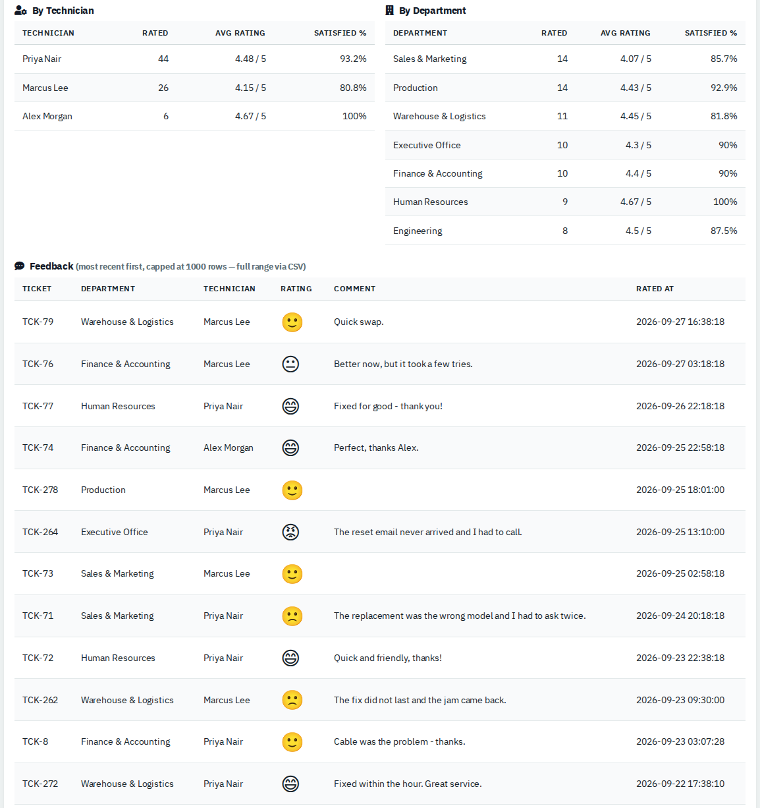

*Figure 8 — Ratings by technician, by department and the most recent feedback.*

- **By Technician** and **By Department** show ratings received, average and the satisfied share. Department names link to the department's overview.
- **Feedback** lists the most recent ratings first (up to 1,000 rows), with the ticket, technician, face, comment and time. Click a ticket number to open it.

**Export CSV** downloads the feedback list: ticket, department, technician, rating, comment and time.

## RMM Health

**Answers:** How noisy is monitoring, how fast are alerts acknowledged and fixed, and which devices and departments generate the most?

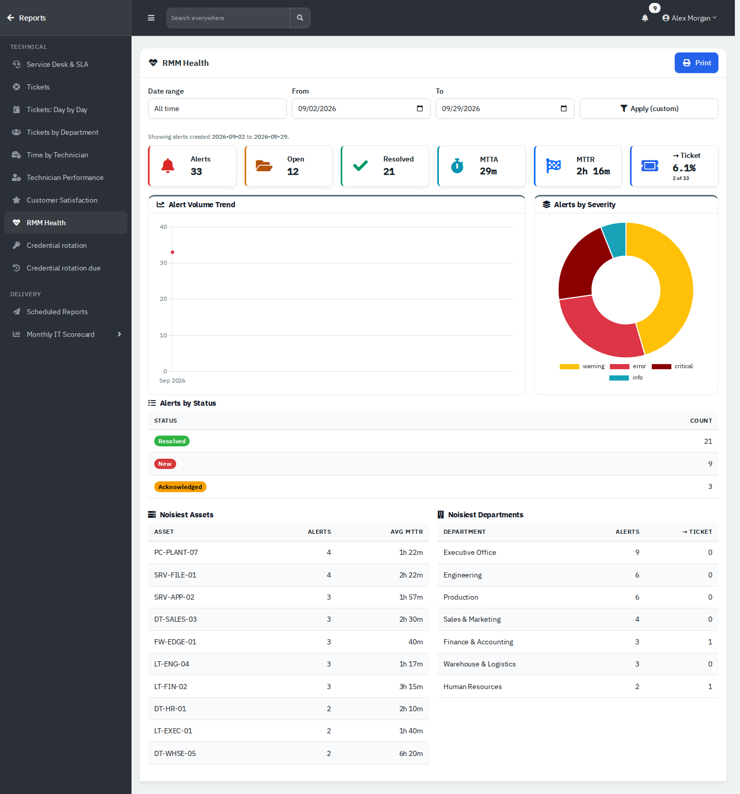

*Figure 9 — RMM Health, drawn from sample alerts.*

This report depends on an RMM integration (for example Tactical RMM) that sends alerts into RivetIT; the screenshot uses demo alerts. Without alerts the page shows *No RMM alerts have been recorded yet. Connect an RMM integration to populate this report.*

**Filter:** **Date range** (by the date each alert was created).

| Item | How to read it |
|---|---|
| **Alerts** / **Open** / **Resolved** | Alerts in the range; those not yet resolved; those resolved. |
| **MTTA** | Mean time to acknowledge, from alert to acknowledgement. |
| **MTTR** | Mean time to resolve, from alert to resolution. |
| **→ Ticket** | Share of alerts that raised a ticket, with the counts. |
| **Alert Volume Trend** | Alerts per month. |
| **Alerts by Severity** | Critical, error, warning, info. |
| **Alerts by Status** | New, acknowledged, resolved. |
| **Noisiest Assets** / **Noisiest Departments** | Top ten devices with alert count and average time to resolve; top ten departments with alert count and how many raised a ticket. |

Only **Print** is available.

## Credential rotation

**Answers:** Which credentials have not had their password changed for a long time?

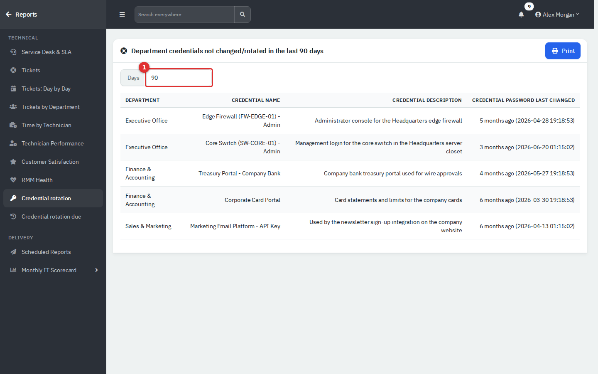

*Figure 10 — Credentials whose password has not changed in the last 90 days (days box at 1).*

Set **Days** (default 90). The table lists each credential whose password last changed more than that many days ago, with its department, name, description and the date. The list updates as soon as you change the number. Needs Credentials (read). Only **Print** is available.

## Credential rotation due

**Answers:** Which credentials are overdue for rotation, or due soon?

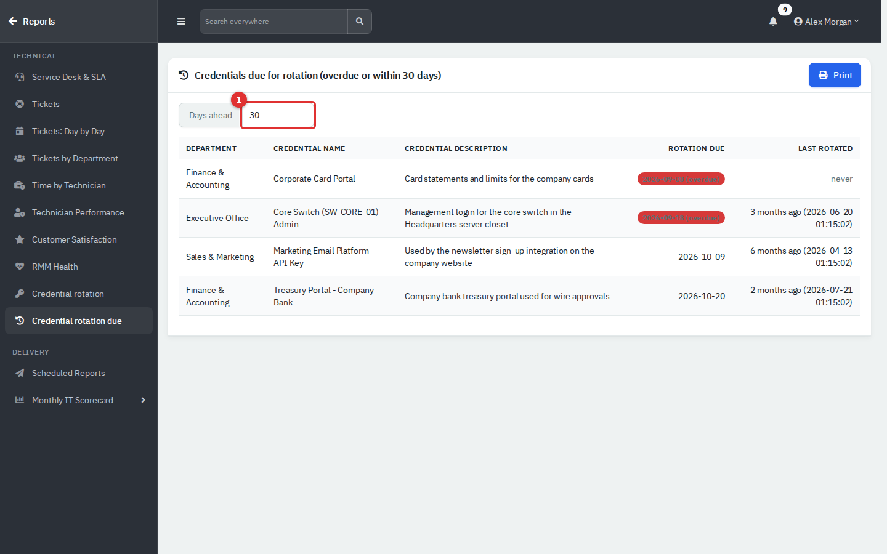

*Figure 11 — Credentials overdue or due within the next 30 days (days-ahead box at 1).*

Set **Days ahead** (default 30). It lists credentials that have a rotation date on or before today plus that many days, soonest first. Overdue dates carry a red **(overdue)** badge. **Last Rotated** shows *never* when no rotation has been recorded. Click a credential name to open its details in a pop-up. Credentials without a rotation date never appear. Set the date in the credential's **Rotation Due** field. Only **Print** is available.

## Tips and good practice

- Note the range line before quoting a figure, and export the CSV when you need to show your working.
- Read **Technician Performance** as a workload signal, not a score: it only sees logged time.
- Give every priority an SLA target if you want the SLA percentages to mean something.
- Review **Credential rotation due** at the start of each month and set rotation dates on new privileged credentials.

## Related guides

- [Dashboard and Reports](10-dashboard-and-reports.md): the Dashboard, the hub, permissions and scheduled email.
- [Service Desk](03-service-desk.md): tickets, time entries, SLA and CSAT ratings.
