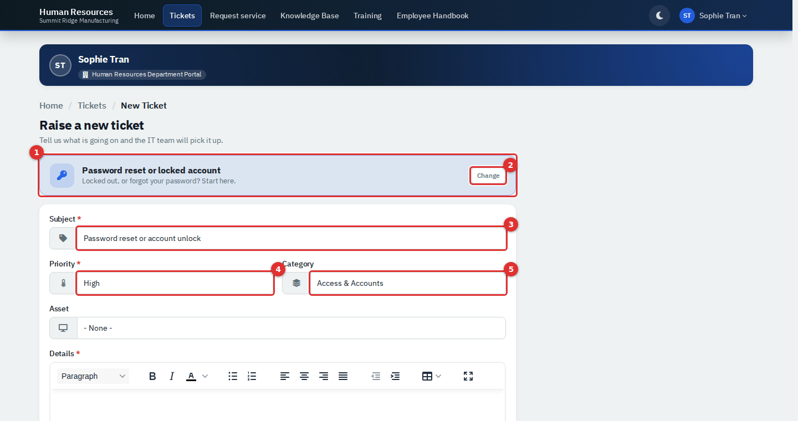
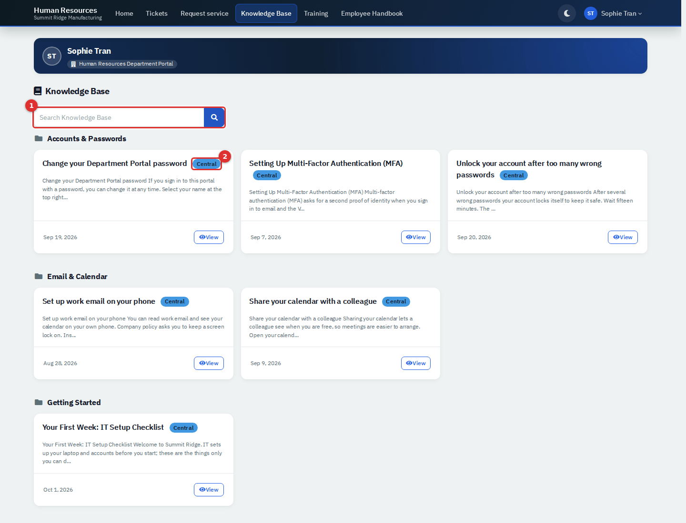
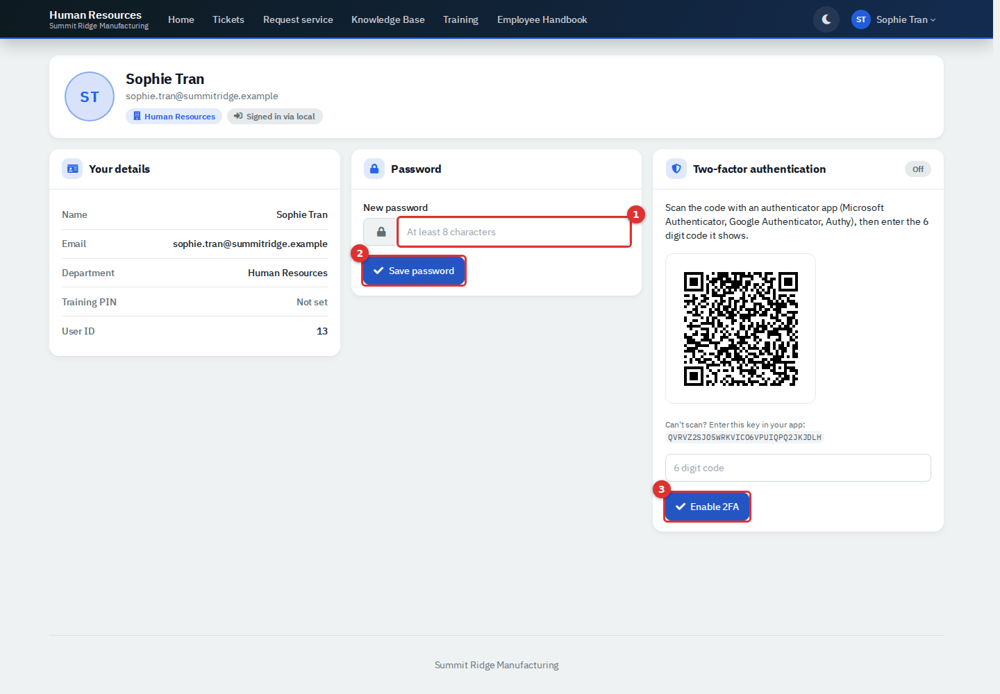
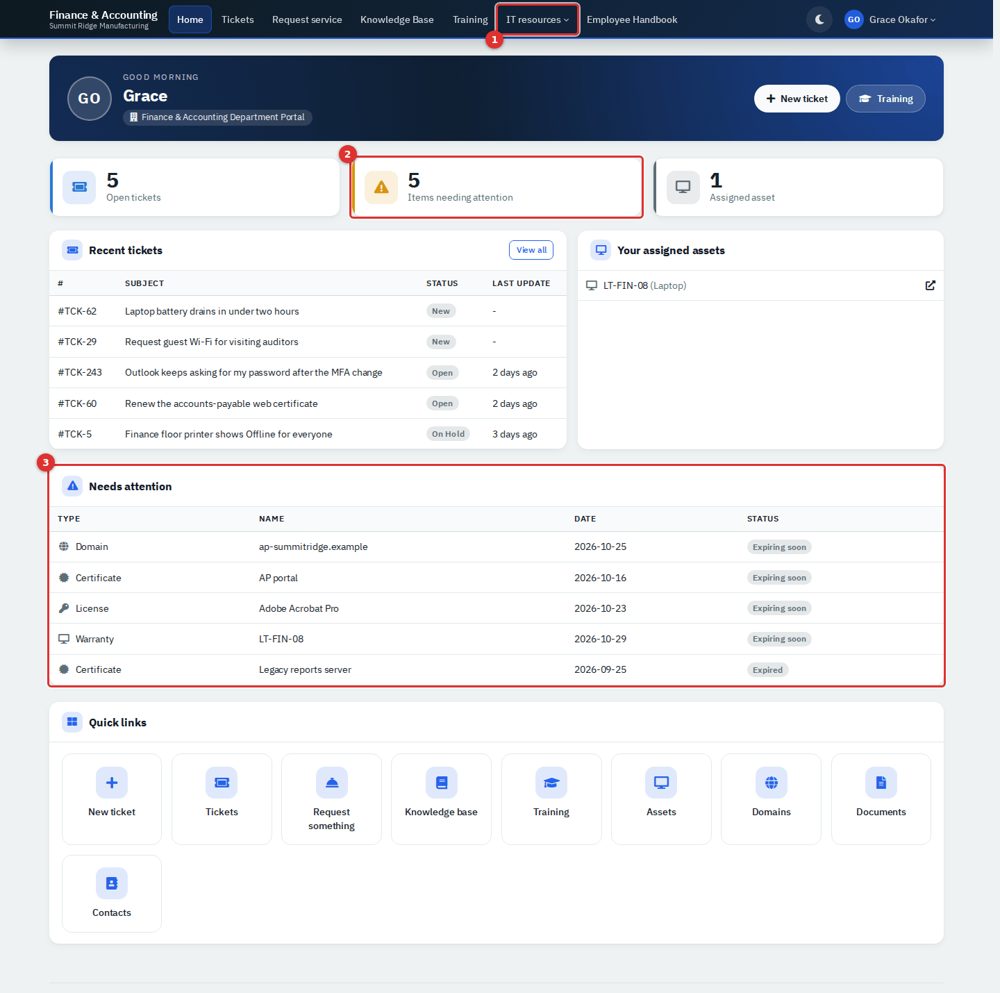
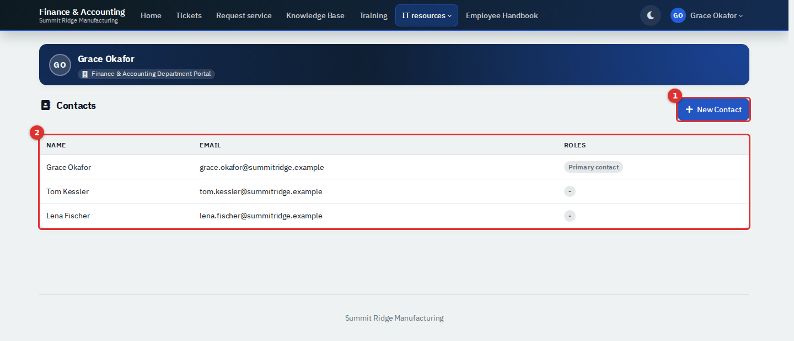
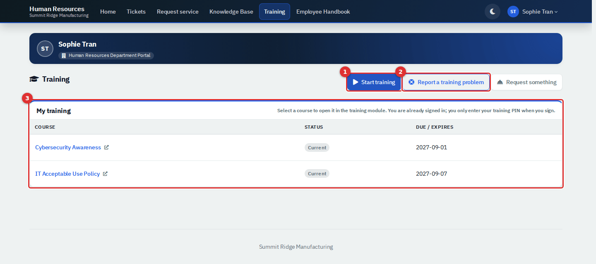
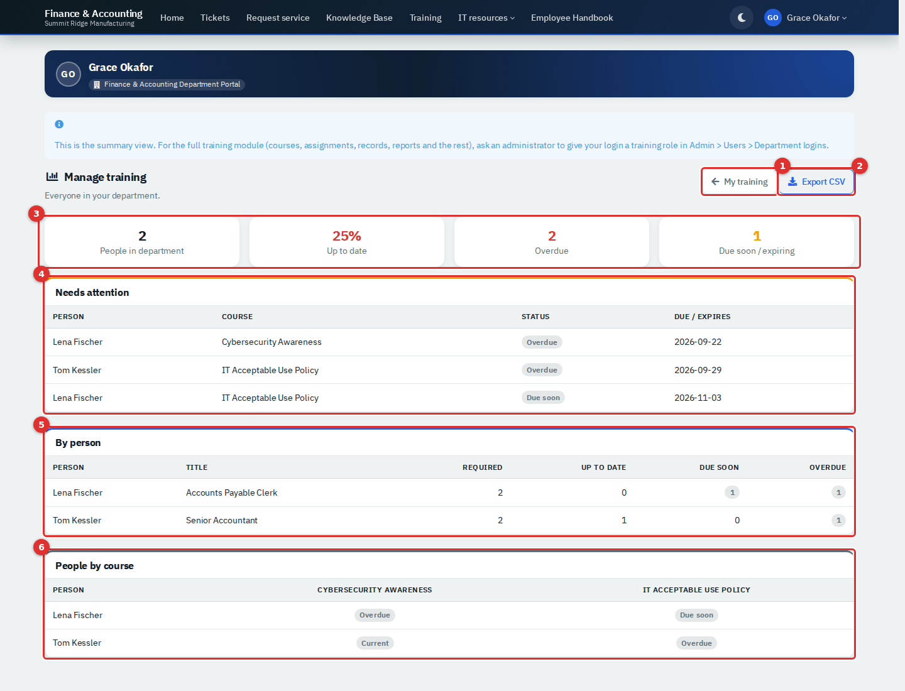
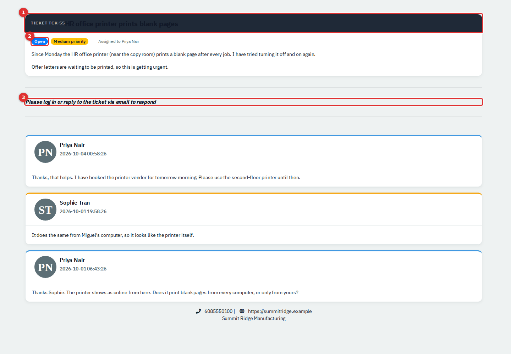
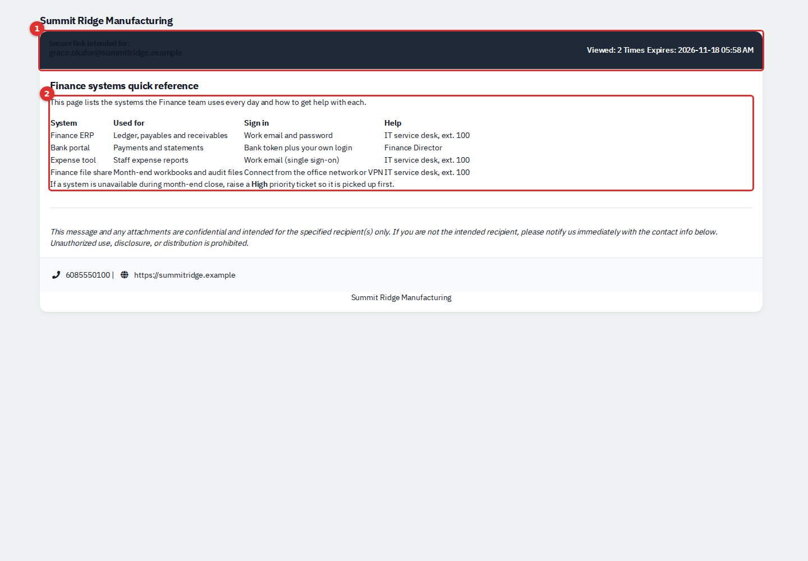

# Department Portal

The Department Portal is the web site your employees use to ask IT for help. They sign in, raise and follow tickets, request common things, read Knowledge Base articles, check their required training and, if they lead a department, see the department's assets, documents, colleagues and training. It has its own look and menu, follows the colour theme set under **Settings → Theme**, and never shows employees the agent screens.

| | |
|---|---|
| **Who can use it** | Employees need a portal login, not a RivetIT role. IT staff: **Departments: Modify** to give a person access; **Tickets, assets & docs: Modify** to create share links; administrators only for the Modules switch, Department logins, the preview, the Service Catalog and Custom Links. |

The first section is for the IT staff who set the portal up; the rest is for employees.

## For IT staff: set up and manage access

### Switch the portal on

1. Go to **Administration → Settings → Modules**.
2. Turn on **Enable Department Portal** (1) and select **Save**.

*Figure 1 — The switch that controls the whole portal.*

Switching it off stops new sign-ins and hides the Department Portal field on the People form. The portal pages do not re-check the switch, so someone who is already signed in may keep working until their session ends. **Show Knowledge Base**, **Show Training (LMS)** and **Show Live Chat on Tickets** add or remove the Knowledge Base menu, the Training menu and the ticket chat panel. **Show IT Documentation** must be on for leads to get the IT resources menu.

### Give a person a portal login

1. Open **People**, find the person and choose **Edit** from the row's actions menu.
2. Open the **Access** tab.
3. Set **Department Portal** (1):
   - **No Access**: the person cannot sign in.
   - **Using Set Password**: the person signs in with their email address and a password you set. Type it in **Password**, or select **?** to generate one.
   - **Using Azure Credentials**: the person signs in with Microsoft. This needs an identity provider (see below).
4. Tick **Send user e-mail with login details?** if you want the app to email the new login. This needs outgoing mail, and is offered only when you edit a person.
5. Select **Save**.

*Figure 2 — The Access tab of a person's form.*

The **Primary Contact** tick on the **Details** tab and the **Technical** role on the **Access** tab decide what the person sees (see "What department leads see"). In the People list, a small blue user icon marks people who have a login.

Archiving a person also archives their login. **No Access** stops sign-in but keeps the login record.

**Single sign-on.** Go to **Administration → Settings → Identity provider**, enter the Microsoft Entra application (client) ID and secret, and save. The sign-in page then shows **Login with Microsoft Entra**. The person's email address must match their Microsoft sign-in name, and their **Department Portal** must be **Using Azure Credentials**. The same page sets up OpenID Connect (**Login with company SSO**), and the Odoo integration adds **Login with Odoo**. None of these was tested in the demo.

**Forgotten passwords.** **Forgot password?** only appears when outgoing mail is configured. The employee receives a link to choose a new password (at least eight characters); it works only for people set to **Using Set Password**. Without mail, set a new password yourself on the Access tab. Mail could not be tested in the demo.

### Department logins with a portal role

Go to **Administration → Users** and use the **Department logins** toggle at the top (the other side is **Technicians**). **New Department Login** creates a login. The edit form adds three things the People form does not have:

- **Role.** **Standard** sees only their own training. **Supervisor** also sees everyone below them in the **Manager** chain set on the People form. **Manager** sees the whole department's training. The list shows only Supervisors and Managers until you select **Include other portal logins**.
- **Agent module access.** Optional. Pick a role made under **Administration → Roles** and the login can open those agent pages, company-wide. A role with Training opens the full training module from **Manage training**; any other role adds an **(agent workspace)** link under the person's name. Roles with Departments, Tickets/assets/docs, Assets or admin permissions are not offered.
- **Two-Factor Authentication.** **Require 2FA** makes the person set it up at their next sign-in. Until they have, the portal only lets them reach **Profile**. Supervisors and Managers land on **Training** after signing in instead of Home.

### Look at the portal as a department sees it

Administrators can open a read-only preview of any department's portal. Nothing can be changed while previewing, entering and leaving are written to the audit log, and a preview closes by itself after 12 hours.

1. Go to **Administration → Settings → Portal preview**. You can also use **View Department Portal** in a department's menu.
2. Find the department and select **View portal** (2). The **Portal logins** column shows how many people in it can sign in.
3. Select **Exit preview** on the orange banner when you have finished.

*Figure 3 — Portal Preview. (1) shows the portal is enabled; (2) opens the Finance & Accounting portal.*

*Figure 4 — A preview. (1) The banner says this is a preview; (2) Exit preview leaves it.*

A preview has no employee behind it, so assigned assets and recent tickets can show items that belong to nobody. Use it to check layout and menus, not one person's data.

### What else you control

| Task | Where |
|---|---|
| Add a link to the portal menu, such as an intranet page | **Administration → Tags & categories → Custom links**, **New Link**, with **Location** set to **Department Portal Nav** |
| Change the tiles on Request Something | **Administration → Templates → Service catalog** |
| Publish a Knowledge Base article to employees | Set **Visible to Department Portal** to **Yes** when you write it. Internal-only articles stay hidden |
| Publish a document to a department's leads | On the document, open **Portal Collaboration** and set it to visible. New documents are visible by default |
| Turn ticket ratings on or off | **Administration → Settings → Ticketing → Enable CSAT ratings** |

## Signing in

Employees and IT staff share one sign-in page. Employees enter their work email address and password (1, 2) and select **Sign In** (3). The portal opens on the Home page. If the same email address belongs to both an agent and a portal login, the page asks whether to **Log in as Agent** or **Log in as Department**. A login with two-factor authentication then asks for its 6 digit code. Depending on IT's setup, links under the form offer **Forgot password?**, **Login with Microsoft Entra**, **Login with company SSO** and **Login with Odoo**.

*Figure 5 — The sign-in page.*

A wrong password, or a switched-off portal, only gives "Incorrect username or password." To sign out, select your name at the top right and choose **Sign out**. The moon button beside your name switches between light and dark mode; the portal remembers the choice in that browser.

## A quick tour

This is the Home page of Sophie Tran, an HR Coordinator. Sophie is an ordinary employee. The heading greets you by first name and names your department.

*Figure 6 — The Home page.*

1. **Menu.** Home, Tickets, **Request service**, Knowledge Base and Training, plus any extra links IT has added (here, Employee Handbook). An item only appears when IT has that feature on.
2. **New ticket.** Starts a new request.
3. **Training.** Opens your training.
4. **Open tickets.** How many of your tickets are not closed yet. Select it to see them.
5. **Recent tickets.** Your five most recently updated tickets. **Last update** shows a dash for a ticket nobody has touched yet.
6. **Your name.** Opens **Profile** and **Sign out**.

Beside Recent tickets, **Your assigned assets** lists the equipment IT has recorded against you, and **Quick links** repeats the main pages. You only ever see your own tickets and assets on this page.

## Common tasks

### Raise a ticket

1. Select **New ticket** on Home, or **New Ticket** on the Tickets page.
2. Type a short **Subject** (1) that says what is wrong, such as "Laptop fan is very loud".
3. Choose a **Priority** (2). **Low** is a question or small annoyance, **Medium** is something slowing you down, **High** is work stopped.
4. Choose a **Category** (3) if you know it. It is optional.
5. If you have equipment assigned, an **Asset** list appears. Pick the device the problem is about.
6. Describe the problem in **Details** (4): what you expected, what happened and when it started.
7. Select **Raise ticket** (5).

*Figure 7 — The new ticket form.*

The ticket opens with a number such as TCK-4, and IT is told. You cannot attach files when you raise a ticket, but you can add them to a reply.

### Find your tickets

Select **Tickets**. The list shows only your tickets. The **My Tickets** box (2) switches between **Open**, **Closed** and **All** and shows how many are in each. **Open** means anything not closed, including on hold.

*Figure 8 — Your tickets. (1) The list; (2) the Open, Closed and All filter; (3) New Ticket.*

### Follow and answer a ticket

Select a ticket's number or subject.

*Figure 9 — An open ticket. (1) Resolve ticket; (2) State, Priority, Category and who it is Assigned to; (3) Live Chat; (4) the reply box; (5) Reply.*

- The top of the page shows the **State**, **Priority**, **Category** and who it is **Assigned to**, and how many **Tasks** are done. Replies are listed underneath, newest first, with short automatic notes such as "Ticket closed.".
- To reply, type in the box (4), add files with **Choose Files** if you need to, and select **Reply** (5). Replying sets the ticket to **Open** and tells the person it is assigned to.
- **Live Chat** (3) is for quick back-and-forth while the ticket is open: type a message and press the paper-plane button. It only shows when IT has switched live chat on.
- If a task needs your approval, an **Approvals** box appears with an **Approve task** link. If you are not allowed to approve it, the box names the kind of contact who is.

### Mark a ticket as done

When the problem is fixed, select **Resolve ticket** (1) and confirm. This resolves and closes the ticket in one step and adds a note. The button is hidden while tasks are unfinished, and once resolved you can no longer reply.

Sometimes IT marks a ticket **Resolved** but leaves it open. The page then says "Your ticket has been resolved" and offers **Reopen ticket** and **Close ticket**. Reopen puts it back in the queue; Close finishes it.

### Rate a closed ticket

When a ticket is closed and you have not rated it, the page shows **How did we do?** with five faces from Very unhappy to Very happy.

1. Select a face (1).
2. Add a comment if you like.
3. Select **Submit rating** (2).

*Figure 10 — Rating a closed ticket.*

You can rate a ticket once. A rating at or below the level IT sets as "low" (for example Unhappy) reopens the ticket so IT can follow up. If a problem returns after you have rated a ticket, raise a new one and mention the old number.

### Request something common

Select **Request service** in the menu. The page, headed **What do you need?**, shows one tile per common request, with its category and priority underneath. Type in the search box (1) or select a category (2) to narrow the list. The last tile, **Something else**, opens an empty ticket form.

*Figure 11 — Request Something. (1) Search; (2) category filter; (3) a tile.*

Selecting a tile (3) opens the new ticket form with the subject, priority and category already filled in. A banner names the request, and **Change** takes you back to the tiles. Adjust anything, add the details and select **Raise ticket**.

*Figure 12 — A pre-filled form. (1) The request banner; (2) Change; (3) Subject; (4) Priority; (5) Category.*

IT staff manage the tiles under **Administration → Templates → Service catalog**.

### Read the Knowledge Base

Select **Knowledge Base**. Articles are grouped by category; use the search box (1) to search titles and text. A **Central** label (2) marks an article for the whole company; others are shown only to your department. Select **View** to open one. Articles are read-only, and some contain checklists that remember what you have ticked.

*Figure 13 — The Knowledge Base.*

### Change your password

1. Select your name, then **Profile**.
2. Under **Password**, type a new password of at least eight characters (1).
3. Select **Save password** (2).

*Figure 14 — The Profile page. (1) New password; (2) Save password; (3) Enable 2FA.*

The Password and Two-factor authentication cards only appear if you sign in with a password. **Your details** shows your name, email address, department and **Training PIN**, which stays hidden until you select the eye button (it says **Not set** if IT has not given you one). The header badges show whether you are a primary or technical contact and how you signed in.

**Two-factor authentication.** Scan the QR code with an authenticator app, type the 6 digit code and select **Enable 2FA** (3). From then on you enter a code at every sign-in. **Turn off 2FA** asks for your current password and is not offered when your administrator requires 2FA.

## What department leads see

A department's primary contact, and anyone with the **Technical** role, also see an **IT resources** menu and extra parts of the Home page. Ordinary employees do not. If an ordinary employee opens one of these pages, for example from a saved link or the **Contacts** quick link on Home, the portal signs them out instead of showing a message. They only need to sign in again.

*Figure 15 — A lead's Home page. (1) The IT resources menu; (2) Items needing attention; (3) the Needs attention list.*

- **Items needing attention** (2) and the **Needs attention** list (3) show domains, certificates, licenses and equipment warranties that expire within 45 days or have already expired. Leads also get an **Assigned assets** count and more quick links.
- **IT resources** (1) opens Contacts, Assets, Contracts & Docs, Support Allowance, Documents, Domains, Certificates and All tickets. The two contract pages are not covered in this guide.
- **All Company Tickets** (on the Tickets page and under **IT resources → All tickets**) lists every ticket in the department with the name of the person who raised it, and can be filtered by status. A lead can open, reply to, resolve and close any of them.
- **Assets** lists every asset recorded for the department, with who has it, purchase and warranty dates and status.
- **Documents** lists the documents IT has made visible to the department. A lead can read them, add a **New Document**, or **Upload File**. Anything a lead adds is visible straight away.
- **Domains** and **Certificates** list expiry dates.

### Add a colleague to the portal

1. Go to **IT resources → Contacts**. The list shows everyone in the department, with a **Roles** column.
2. Select **New Contact** (1).
3. Enter the **Name** and **Email**. Tick **Technical** only if the person should also get the IT resources menu.
4. Under **Portal authentication**, choose **No portal access** or **Local (Email and password)**. **Azure (Microsoft 365)** is offered only when IT has set up Microsoft sign-in.
5. Select **Add**.

*Figure 16 — Contacts. (1) New Contact; (2) everyone in the department.*

The form also offers a **Billing** tick, but billing is not part of this edition. A colleague added this way gets a random password that nobody knows, so they must use **Forgot password?** (needs outgoing mail) or ask IT to set one. You cannot edit the primary contact or yourself from here.

## Training

When IT has **Show Training (LMS)** on, everyone sees a **Training** menu item and a **Training** button on Home. The portal only summarises training; the courses run in the training module.

### Your own training

*Figure 17 — Training. (1) Start training; (2) Report a training problem; (3) My training.*

**My training** (3) lists every course you must take, most urgent first, with a **Status** (such as **Current**, **Due soon**, **Overdue**) and a **Due / expires** date.

- **Start training** (1) opens the training module already signed in as you, on your own page. You do not search for your name or set up a device. Selecting a course name does the same and opens that course. You type your training PIN only when you sign a completion.
- **Report a training problem** (2) opens the new ticket form.
- **Request something** opens the request tiles.

### Seeing a team's training

What else you see depends on your login:

| Login | Training page |
|---|---|
| Ordinary employee | **My training** only |
| Supervisor (portal role) | Also **Manage training**, for the people below you in the Manager chain |
| Primary contact, Technical contact or Manager (portal role) | Also **Manage training**, for the whole department |
| Any login whose agent role includes Training | **Manage training** opens the full training module (courses, assignments, records, reports) instead of the summary |

*Figure 18 — Manage training for a department. (1) Back to My training; (2) Export CSV; (3) Summary tiles; (4) Needs attention; (5) By person; (6) People by course.*

The tiles (3) count the people in scope, the share of required training that is up to date, and the items that are **Overdue** or **Due soon / expiring**. **Needs attention** (4) lists each overdue or soon-due item, most urgent first. **By person** (5) totals each person's required courses and **People by course** (6) shows every person's status for every required course. **Export CSV** (2) downloads the same rows. The page is read-only and limited to your own department. A login that cannot see anyone else gets no button.

## Links you may receive without an account

Some links open without signing in. Anyone who has the whole link can open it, so do not forward one.

**A ticket link in an email.** Ticket emails from IT contain **View ticket**. It shows the subject, status, priority, who it is assigned to, the description and the replies. You cannot reply from this page: it says to log in or reply to the email. When a ticket is resolved but not closed you can **Reopen ticket** or **Close ticket**, and once it is closed you can rate it.

*Figure 19 — A ticket link. (1) The ticket; (2) status and priority; (3) the reminder that replies need a sign-in or an email.*

**A rating link.** The faces in a "how did we do?" email rate the ticket in one click and open the ticket link above. **An approval link** opens a page showing the task, with an **Approve Task** link while it is pending.

**A shared document, file or login.** IT can send you a secure link to one item. The page names who it is for, how many times it has been viewed and when it expires. A document is shown on the page, a file shows a download link, and a login shows the address, user name, password and any two-step code, decrypted in your browser. For a login, keep the whole link including the part after the `#`, or it will say the key is missing. An expired, switched-off or used-up link tells you to check with the sender.

*Figure 20 — A shared document. (1) Who it is for, views and expiry; (2) the document.*

IT staff create these links with **Share** on a document, a row of the Files list, or a login. In the **Share Link** pop-up choose who to share with, the expiry (1 hour to 1 month), whether to **Delete after view**, and an optional note, then select **Send and Show Link**. The link is emailed only when outgoing mail is configured. Every view is logged and raises a notification.

IT may also send a sign-off link for finished work. It opens a page where the named person can review and sign; only the person holding the link can sign.

## Reference

### What each kind of person sees

| | Ordinary employee | Primary contact or Technical role |
|---|---|---|
| Home, Tickets, Request service, Knowledge Base, Training (my own), Profile | Yes | Yes |
| Tickets they can open and reply to | Their own | All in the department |
| Needs attention list and counts | No | Yes |
| IT resources menu (Contacts, Assets, Documents, Domains, Certificates, All tickets) | Not shown. Opening those pages signs them out | Yes |
| Training for the whole department | No (Supervisors and Managers: see Training) | Yes |
| Add colleagues to the portal | No | Yes |
| Approve a task | Only tasks open to any contact | Yes |

### Ticket statuses as employees see them

**New** (nobody has picked it up), **Open** (IT is working on it; replying also sets this), **On Hold** (IT is waiting for something), **Resolved** (fixed, waiting for you to reopen or close it) and **Closed** (finished; you can rate it but not reply). IT can rename statuses.

## Tips and good practice

- Put one problem in each ticket, with a searchable subject, and say what you already tried.
- Search the Knowledge Base first for password, Wi-Fi and email questions.
- Use **High** only when work has stopped. Never put passwords in a ticket.
- IT staff: turn on outgoing mail before you roll the portal out, otherwise there is no **Forgot password?** link and no login emails.
- IT staff: keep department leads to the people who really need the IT resources menu, and check a document's portal visibility before you upload anything sensitive.

## Related guides

- The Service Desk guide, for how IT works the tickets that employees raise.
- The Knowledge Base guide, for writing the articles employees read.
- The People guide, for the rest of a person's record.
