# Department Portal

The Department Portal is the web site your employees use to ask IT for help. They sign in, raise and follow tickets, request common things, read Knowledge Base articles and, if they lead a department, see the department's assets, documents and colleagues. It has its own look and menu, and it never shows employees the agent screens.

| | |
|---|---|
| **Where to find it** | Employees: open your RivetIT address and sign in on the normal sign-in page; the portal opens at `/client/`. IT staff: **Administration → Settings → Modules** to switch it on, **People** to give someone access, **Administration → Settings → Portal Preview** to look at it. |
| **Who can use it** | Employees need a portal login, not a RivetIT role. IT staff: **Departments: Modify** to give a person access; **Tickets, assets & docs: Modify** to create share links; administrators only for the Modules switch, the preview, the Service Catalog and Custom Links. |
| **Turn it on** | **Administration → Settings → Modules → Enable Department Portal**, then **Save**. |

This page starts with a short section for the IT staff who set the portal up. Everything after it is written for employees.

## For IT staff: set up and manage access

### Switch the portal on

1. Go to **Administration → Settings → Modules**.
2. Turn on **Enable Department Portal** (1) and select **Save**.

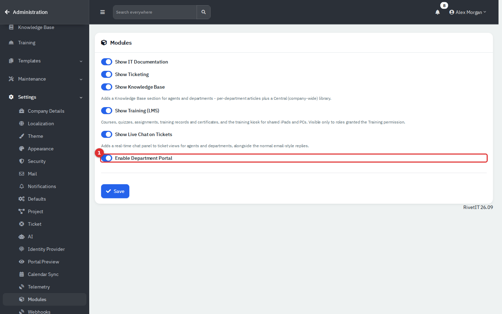

*Figure 1 — The switch that controls the whole portal.*

Switching it off stops new sign-ins and hides the Department Portal field on the People form. The portal pages do not re-check the switch, so someone who is already signed in may keep working until their session ends. The other switches on this page change what employees see: **Show Knowledge Base** adds or removes the Knowledge Base menu, **Show Live Chat on Tickets** adds or removes the chat panel on a ticket, and **Show IT Documentation** must be on for department leads to get the Technical menu.

### Give a person a portal login

Portal access is a setting on the person, not a separate user list.

1. Open **People**, find the person and choose **Edit** from the row's actions menu.
2. Open the **Access** tab.
3. Set **Department Portal** (1):
   - **No Access**: the person cannot sign in.
   - **Using Set Password**: the person signs in with their email address and a password you set. Type it in **Password**, or select the **?** button to generate a readable one.
   - **Using Azure Credentials**: the person signs in with Microsoft. This needs an identity provider (see below).
4. Tick **Send user e-mail with login details?** if you want the app to email the new login. This only works when outgoing mail is set up, and it is only offered when you edit a person, not when you add one.
5. Select **Save**.

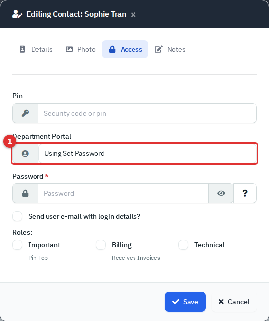

*Figure 2 — The Access tab of a person's form.*

On the **Details** tab, the **Primary Contact** tick next to the name and, on the **Access** tab, the **Technical** role decide what the person sees (see "What department leads see"). In the People list, a small blue user icon marks people who have a login.

Archiving a person also archives their login, so they are signed out on their next click. Setting **Department Portal** back to **No Access** stops sign-in but keeps the login record.

**Microsoft sign-in.** Go to **Administration → Settings → Identity Provider**, enter the Microsoft Entra application (client) ID and secret, and save. The sign-in page then shows **Login with Microsoft Entra**. The person's email address in RivetIT must match their Microsoft sign-in name, and their **Department Portal** must be **Using Azure Credentials**. This depends on your Microsoft tenant and was not tested in the demo.

**Forgotten passwords.** The **Forgot password?** link on the sign-in page only appears when outgoing mail is configured. The employee enters their email address and receives a link to choose a new password (at least eight characters). It works only for people set to **Using Set Password**. Without mail, set a new password yourself on the Access tab. Mail could not be tested in the demo.

### Look at the portal as a department sees it

Administrators can open a read-only preview of any department's portal. Nothing can be created or changed while previewing, and entering and leaving are written to the audit log. A preview closes by itself after 12 hours.

1. Go to **Administration → Settings → Portal Preview**. You can also use **View Department Portal** in a department's menu.
2. Find the department and select **View portal** (2). The **Portal logins** column shows how many people in it can sign in.
3. Select **Exit preview** on the orange banner when you have finished.

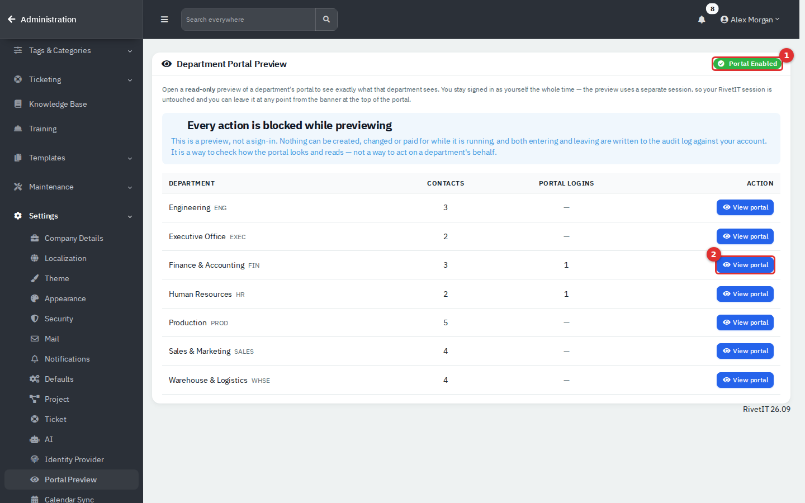

*Figure 3 — Portal Preview. (1) shows the portal is enabled; (2) opens the Finance & Accounting portal.*

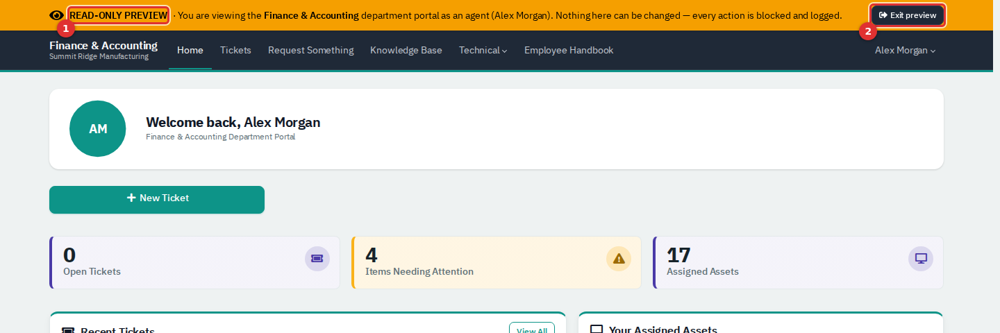

*Figure 4 — A preview. (1) The banner says this is a preview; (2) Exit preview leaves it.*

A preview has no employee behind it, so the "Your assigned assets" and "Recent tickets" areas can show items that belong to nobody. Use it to check the layout and the menus, not to check one person's data.

### What else you control

| Task | Where |
|---|---|
| Add a link to the portal menu, such as an intranet page | **Administration → Tags & Categories → Custom Links → New Link**, with **Location** set to **Department Portal Nav** |
| Change the tiles on Request Something | **Administration → Templates → Service Catalog** |
| Publish a Knowledge Base article to employees | Set **Visible to Department Portal** to **Yes** when you write it. Internal-only articles stay hidden |
| Publish a document to a department's leads | On the document, open **Portal Collaboration** and set it to visible. New documents are visible by default, so check any that hold sensitive detail |
| Turn ticket ratings on or off | **Administration → Settings → Ticket → Enable CSAT ratings** |

## Signing in

Employees and IT staff use the same sign-in page. Employees enter their work email address and password (1, 2) and select **Sign In** (3). The portal opens on the Home page. If the same email address belongs to both an agent and a portal login, the page asks whether to **Log in as Agent** or **Log in as Department**.

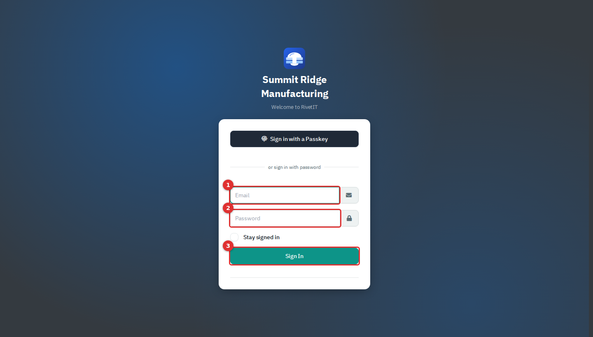

*Figure 5 — The sign-in page.*

If the password is wrong, or the portal is switched off, the page only says "Incorrect username or password." To sign out, select your name at the top right and choose **Sign out**.

## A quick tour

This is the Home page of Sophie Tran, an HR Coordinator. Sophie is an ordinary employee.

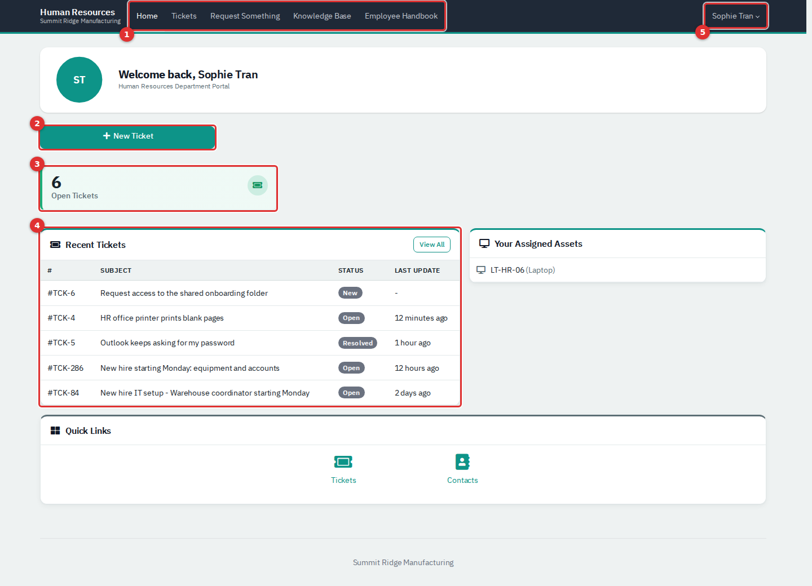

*Figure 6 — The Home page.*

1. **Menu.** Home, Tickets, Request Something and Knowledge Base, plus any extra links IT has added (here, Employee Handbook).
2. **New Ticket.** Starts a new request.
3. **Open Tickets.** How many of your tickets are not closed yet. Select it to see them.
4. **Recent Tickets.** Your five most recently updated tickets. **Last Update** shows a dash for a ticket nobody has touched yet.
5. **Your name.** Opens **Account** and **Sign out**.

Below these, **Your Assigned Assets** lists the equipment IT has recorded against you. You only ever see your own tickets and assets on this page.

## Common tasks

### Raise a ticket

1. Select **New Ticket**.
2. Type a short **Subject** (1) that says what is wrong, such as "Laptop fan is very loud".
3. Choose a **Priority** (2). **Low** is a question or small annoyance, **Medium** is something slowing you down, **High** is work stopped.
4. Choose a **Category** (3) if you know it. It is optional.
5. If you have equipment assigned, an **Asset** list appears. Pick the device the problem is about.
6. Describe the problem in **Details** (4): what you expected, what happened and when it started.
7. Select **Raise ticket** (5).

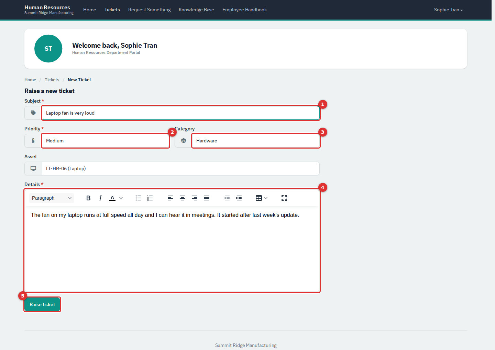

*Figure 7 — The new ticket form.*

The ticket opens straight away with a number such as TCK-4, and IT is told. You cannot attach files when you raise a ticket, but you can add them to a reply.

### Find your tickets

Select **Tickets**. The list shows only your tickets: the number, subject and status. The **My Tickets** box (2) switches between **Open**, **Closed** and **All** and shows how many are in each. **Open** means anything not closed, including tickets that are on hold.

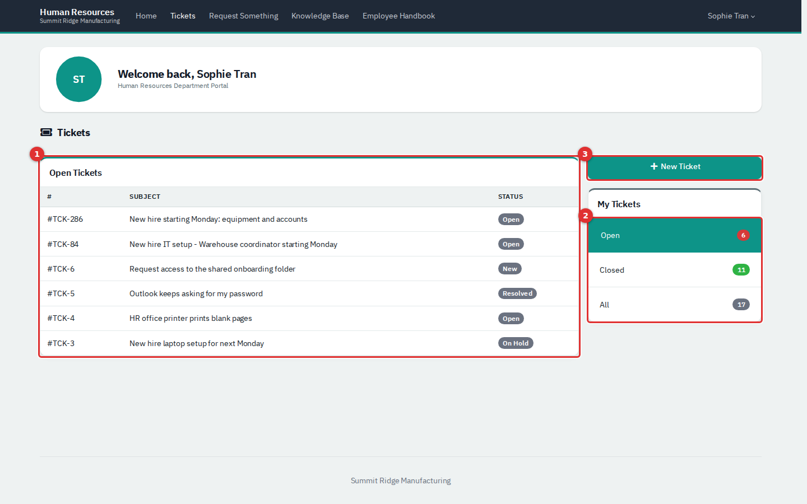

*Figure 8 — Your tickets. (1) The list; (2) the Open, Closed and All filter; (3) New Ticket.*

### Follow and answer a ticket

Select a ticket's number or subject.

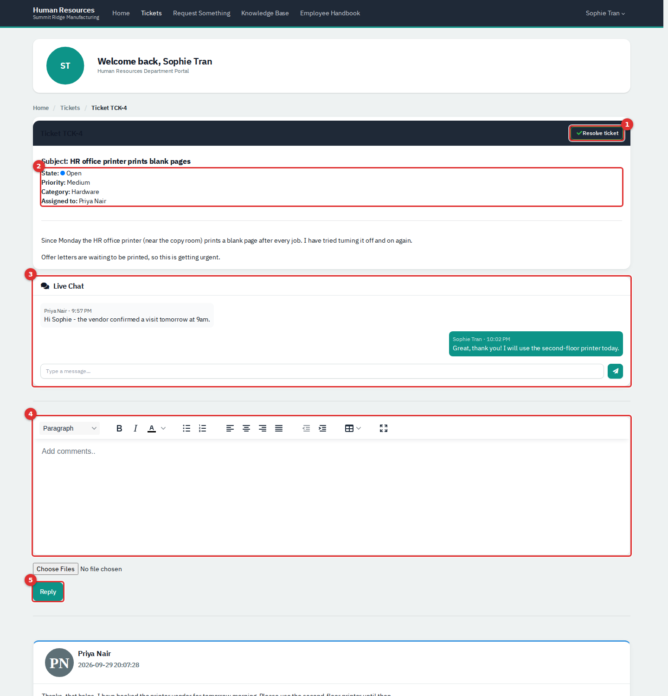

*Figure 9 — An open ticket. (1) Resolve ticket; (2) State, Priority, Category and who it is Assigned to; (3) Live Chat; (4) the reply box; (5) Reply.*

- The top of the page shows the **State**, **Priority**, **Category** and the IT person it is **Assigned to**. If the ticket has tasks, **Tasks** shows how many are done.
- Replies are listed underneath, newest first. Short automatic notes from IT's system, such as "Ticket closed.", appear there too.
- To reply, type in the box (4), add files with **Choose Files** if you need to, and select **Reply** (5). Replying sets the ticket to **Open** and tells the person it is assigned to.
- **Live Chat** (3) is for quick back-and-forth while the ticket is open. Type a message and press the paper-plane button. Your message appears in the chat for you and for IT. The chat only shows when IT has switched live chat on.
- If a task needs your approval, an **Approvals** box appears with an **Approve task** link. If you are not allowed to approve it, the box names the kind of contact who is.

The times shown on replies are the server's clock.

### Mark a ticket as done

When the problem is fixed, select **Resolve ticket** (1) and confirm. This marks the ticket resolved and closes it in one step, and adds a note saying you resolved it. The button is hidden while the ticket still has unfinished tasks, and once you have resolved it you can no longer reply.

Sometimes IT marks a ticket **Resolved** but leaves it open. The page then says "Your ticket has been resolved" and offers **Reopen ticket** and **Close ticket**. Reopen puts it back in the queue; Close finishes it.

### Rate a closed ticket

When a ticket is closed and you have not rated it, the page shows **How did we do?** with five faces from Very unhappy to Very happy.

1. Select a face (1).
2. Add a comment if you like.
3. Select **Submit rating** (2).

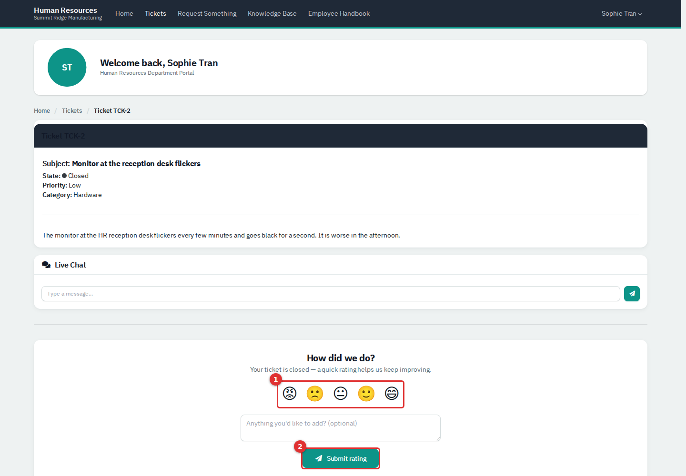

*Figure 10 — Rating a closed ticket.*

You can rate a ticket once. A rating at or below the level IT has set as "low" (for example Unhappy) reopens the ticket automatically so IT can follow up. If a problem returns after a ticket is closed and you have already rated it, raise a new ticket and mention the old number.

### Request something common

Select **Request Something**. Each tile is a common request, with its category and priority shown underneath. Select a tile to open the new ticket form.

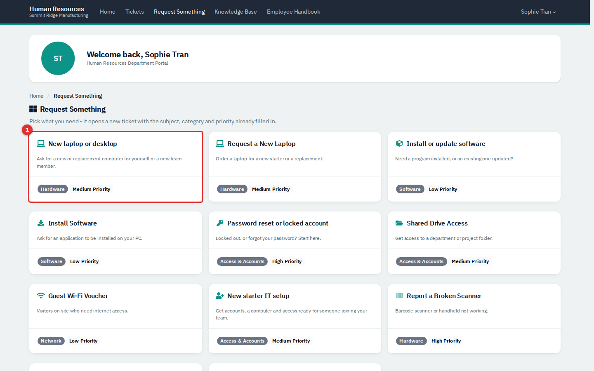

*Figure 11 — Request Something. Selecting a tile (1) opens the new ticket form.*

The page says the subject, category and priority will be filled in for you. In this version the form opens empty, so type the subject and choose the priority and category yourself. IT staff manage the tiles under **Administration → Templates → Service Catalog**.

### Read the Knowledge Base

Select **Knowledge Base**. Articles are grouped by category. Type in the search box (1) to search titles and text. A **Central** label (2) marks an article for the whole company; articles without it are only shown to your department. Select **View** to open one. Articles are read-only, and some contain checklists or step-by-step guides that remember what you have ticked.

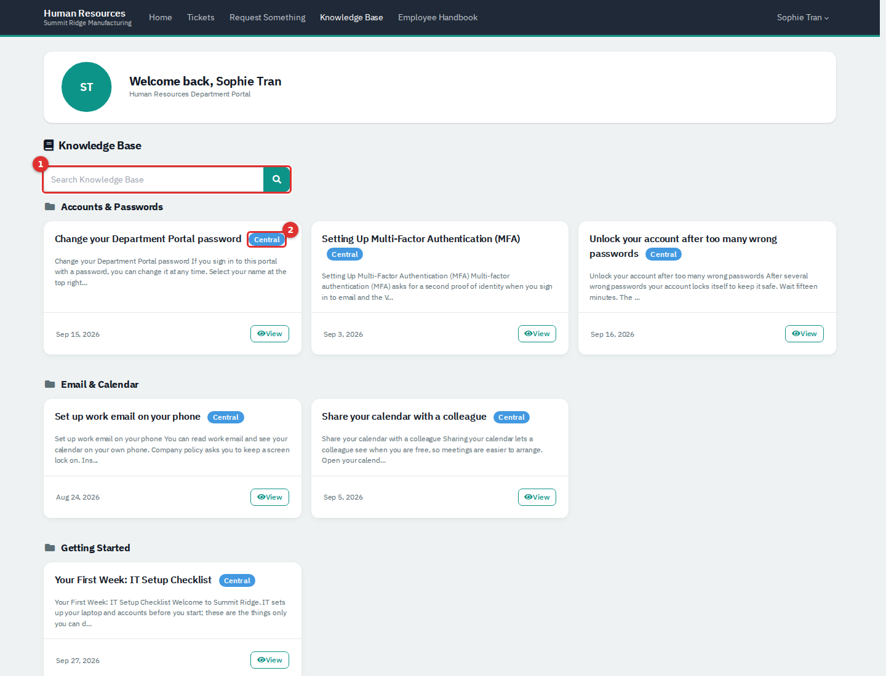

*Figure 12 — The Knowledge Base.*

### Change your password

1. Select your name, then **Account**.
2. Under **Password**, type a new password of at least eight characters (1).
3. Select **Save password** (2).

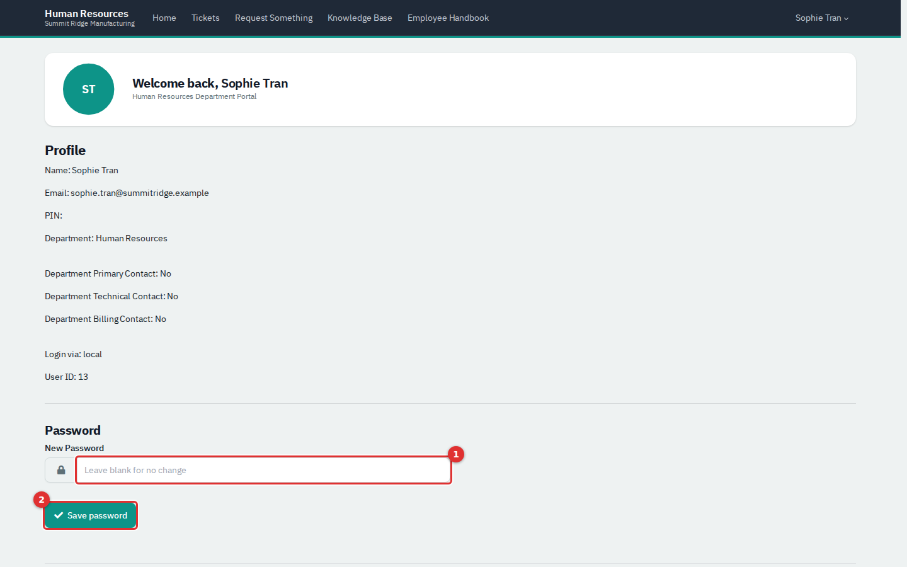

*Figure 13 — The Account page.*

The page also shows your name, email address, department, whether you are your department's primary or technical contact, and your **PIN**. The PIN is a security code IT keeps on file so they can check who you are when you contact them. The Password box only appears if you sign in with a password. The box says "Leave blank for no change" but it will not accept an empty entry; to leave your password alone, just leave the page.

## What department leads see

A department's primary contact, and anyone with the **Technical** role, also see a **Technical** menu and extra parts of the Home page. Ordinary employees do not. If an ordinary employee opens one of these pages, for example from a saved link or the **Contacts** shortcut on the Home page, the portal signs them out instead of showing a message. They only need to sign in again.

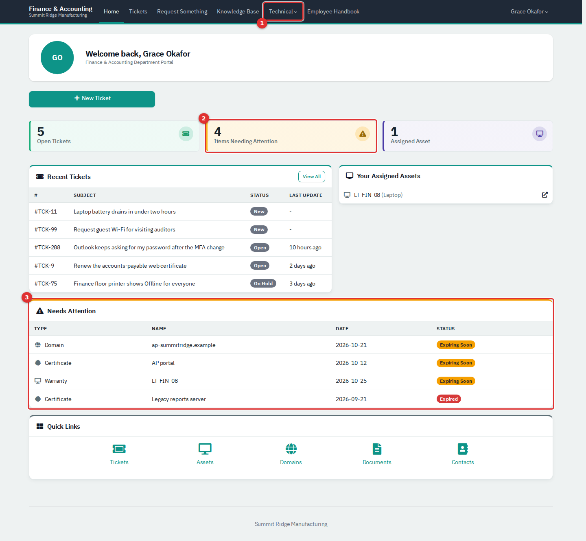

*Figure 14 — A lead's Home page. (1) The Technical menu; (2) Items Needing Attention; (3) the Needs Attention list.*

- **Items Needing Attention** (2) and the **Needs Attention** list (3) show domains, certificates, licenses and equipment warranties that expire within 45 days or have already expired.
- **Technical** (1) opens Contacts, Assets, Contracts & Docs, Support Allowance, Documents, Domains, Certificates and All tickets. The two contract pages are not covered in this guide.
- **All Company Tickets** (on the Tickets page and under **Technical → All tickets**) lists every ticket in the department with the name of the person who raised it, and can be filtered by status. A lead can open, reply to, resolve and close any of them.
- **Assets** lists every asset recorded for the department: type, model, serial number, who has it, purchase and warranty dates and status.
- **Documents** lists the documents IT has made visible to the department. A lead can read them, add a **New Document**, or **Upload File** (PDF, Word, text or similar). Anything a lead adds is visible straight away.
- **Domains** and **Certificates** list expiry dates. Dates within 30 days are shown in red.

### Add a colleague to the portal

1. Go to **Technical → Contacts**. The list shows everyone in the department, with a **Roles** column.
2. Select **New Contact** (1).
3. Enter the **Name** and **Email**. Tick **Technical** only if the person should also get the Technical menu.
4. Under **Portal authentication**, choose **No portal access** or **Local (Email and password)**. **Azure (Microsoft 365)** is offered only when IT has set up Microsoft sign-in.
5. Select **Add**.

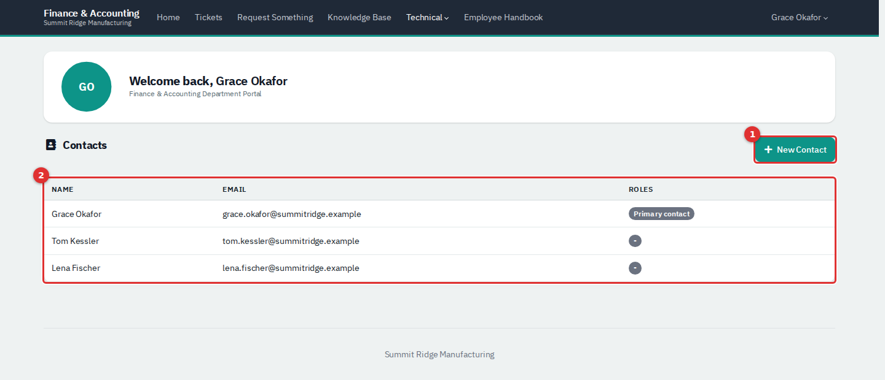

*Figure 15 — Contacts. (1) New Contact; (2) everyone in the department.*

A colleague added this way gets a random password that nobody knows. They must use **Forgot password?** on the sign-in page (only available when IT has set up outgoing mail), or ask IT to set a password for them. You cannot edit the primary contact or yourself from here.

## Links you may receive without an account

Some links open without signing in. Anyone who has the whole link can open it, so do not forward one.

**A ticket link in an email.** Ticket emails from IT contain **View ticket**. It shows the subject, status, priority, who it is assigned to, the description and the replies. You cannot reply from this page: it says to log in or reply to the email. When a ticket is resolved but not closed you can **Reopen ticket** or **Close ticket**, and once it is closed you can rate it.

*Figure 16 — A ticket link. (1) The ticket; (2) status and priority; (3) the reminder that replies need a sign-in or an email.*

**A rating link.** The faces in a "how did we do?" email rate the ticket in one click and then open the ticket link above.

**An approval link.** If a task needs your approval, the email links to a page showing the task, with an **Approve Task** link while it is pending.

**A shared document, file or login.** IT can send you a secure link to one item. The page names who it is for, how many times it has been viewed and when it expires. A document is shown on the page. A file shows a download link. A login shows the address, user name, password and, if there is one, a two-step code, decrypted in your browser. For a login, keep the whole link including the part after the `#`, or it will say the key is missing. If the link has expired, been switched off or reached its view limit, the page tells you to check with the person who sent it.

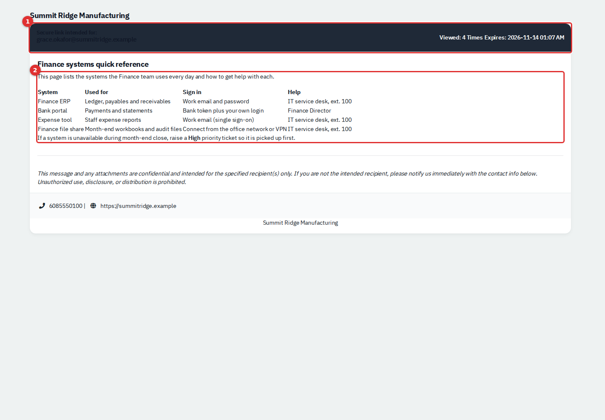

*Figure 17 — A shared document. (1) Who it is for, views and expiry; (2) the document.*

IT staff create these links from the item itself: **Share** on a document, on a row of the Files list, or on a login. In the **Share Link** pop-up choose who to share with, the expiry (1 hour, 1 day, 1 week or 1 month), whether to **Delete after view**, and an optional note the recipient sees, then select **Send and Show Link**. The link is emailed only when outgoing mail is configured. Creating a link needs **Tickets, assets & docs: Modify**. Every view is logged and raises a notification.

IT may also send a sign-off link for finished work. It opens a page where the named person can review and sign; only the person holding the link can sign.

## Reference

### What each kind of person sees

| | Ordinary employee | Primary contact or Technical role |
|---|---|---|
| Home, Tickets, Request Something, Knowledge Base, Account | Yes | Yes |
| Tickets they can open and reply to | Their own | All in the department |
| Assigned assets on Home | Yes | Yes |
| Needs Attention list, attention and asset counts | No | Yes |
| Technical menu (Contacts, Assets, Documents, Domains, Certificates, All tickets) | Not shown. Opening those pages signs them out | Yes |
| Add colleagues to the portal | No | Yes |
| Approve a task | Only tasks open to any contact | Yes |

### Ticket statuses as employees see them

| Status | Meaning here |
|---|---|
| **New** | Raised, and nobody has picked it up yet |
| **Open** | IT is working on it. Replying also sets this |
| **On Hold** | IT is waiting for something, such as a delivery |
| **Resolved** | Fixed, waiting for you to reopen or close it. Not common |
| **Closed** | Finished. You can rate it but not reply |

Your IT team can rename statuses, so the names may differ slightly.

## Tips and good practice

- Put one problem in each ticket, with a subject someone could search for later.
- Say what you already tried. It saves a round of questions.
- Search the Knowledge Base first for password, Wi-Fi and email questions.
- Use **High** only when work has stopped.
- Do not put passwords in a ticket or a reply.
- IT staff: turn on outgoing mail before you roll the portal out, otherwise there is no **Forgot password?** link and no login emails.
- IT staff: keep department leads to the people who really need the Technical menu, and check a document's portal visibility before you upload anything sensitive.

## Related guides

- The Service Desk guide, for how IT works the tickets that employees raise.
- The Knowledge Base guide, for writing the articles employees read.
- The People guide, for the rest of a person's record.
