# Administration: Users, Roles and Security

The Administration area is where administrators decide who can sign in to RivetIT, what each person can do, and how sign-in is protected. It also holds the API keys for integrations and three logs that show what happened: the audit log, the app log and the email log.

| | |
|---|---|
| **Where to find it** | Select your name at the top right, then **Administration**. In the Administration sidebar: **Users**, **Roles**, **API Keys** and **API Docs** are under **ACCESS**; **Security** and **Identity Provider** are under **Settings**; **Audit Logs**, **App Logs** and **Email Log** are under **Maintenance**. |
| **Who can use it** | Administrators only: people whose role has **Admin access: Yes**. Everyone else sees "You don't have access to this page". No permission level applies here; the permission levels described below are what the people you manage can do. |
| **Turn it on** | Nothing to switch on. **Identity Provider** appears only while the Department Portal is on (**Settings → Modules**). Some permission rows only take effect when their module is on. |

## What it's for

- **Users**: add people, give them a role, limit them to some departments, set or reset passwords and MFA, and disable or archive them when they leave.
- **Roles**: decide what each kind of person can see and change. A role is a set of permissions, one level per module.
- **Security settings**: the login message, an optional login key, how long a session lasts, how long logs are kept, and the credential vault key.
- **Identity Provider**: Microsoft sign-in for employees who use the Department Portal.
- **API Keys and API Docs**: let scripts and other systems talk to RivetIT, and read the reference for the API.
- **Logs**: find out who did what, why a scheduled job or email failed, and what happened to an incoming email.

## A quick tour

Only administrators see the **Administration** item in the name menu. It opens the Administration area, which has its own sidebar.

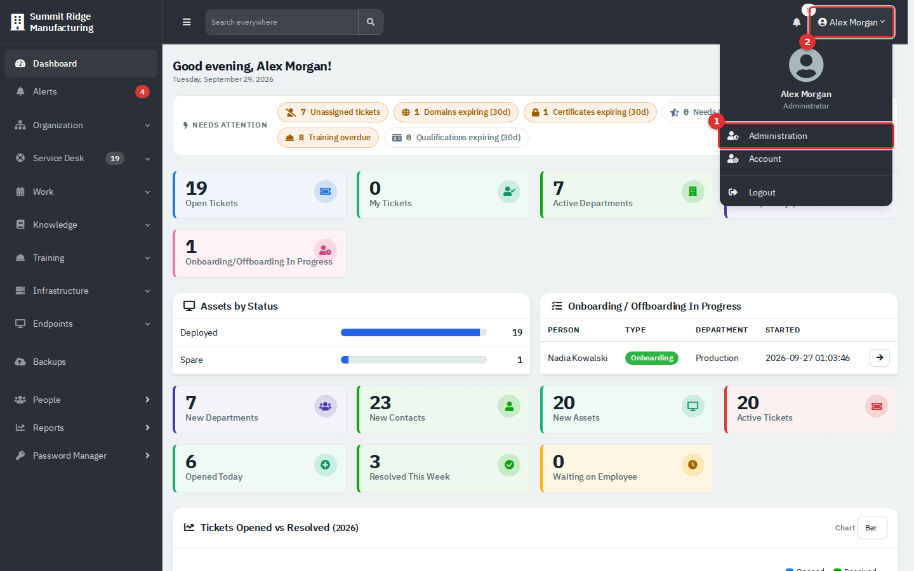

*Figure 1 — (1) Administration opens the Administration area. (2) Select your name to open this menu. It also holds Account and Logout.*

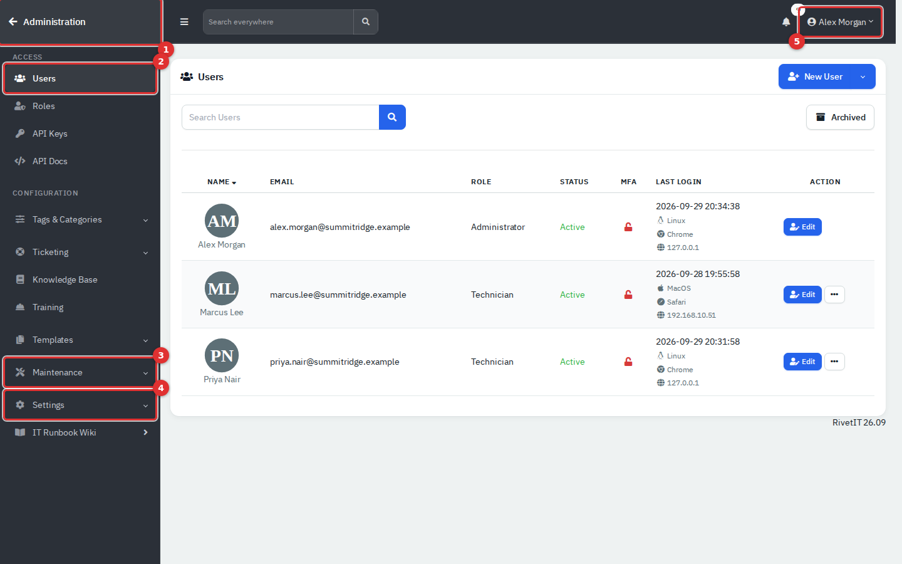

*Figure 2 — The Administration area. (1) The back arrow returns to the application. (2) ACCESS: Users, Roles, API Keys, API Docs. (3) Maintenance opens Cron, Mail Queue, Email Log, Audit Logs, App Logs, Backup, Credential Restore, Debug and Update. (4) Settings opens Security, Identity Provider and the other settings. (5) Your name menu.*

The other groups in the sidebar (**Tags & Categories**, **Ticketing**, **Knowledge Base**, **Training**, **Templates**) are covered in the guides for those modules. Several groups can be open at once.

## Users

**Administration → Users** lists the people who work in RivetIT (agents). Employees who only use the Department Portal are managed from **People**, not here.

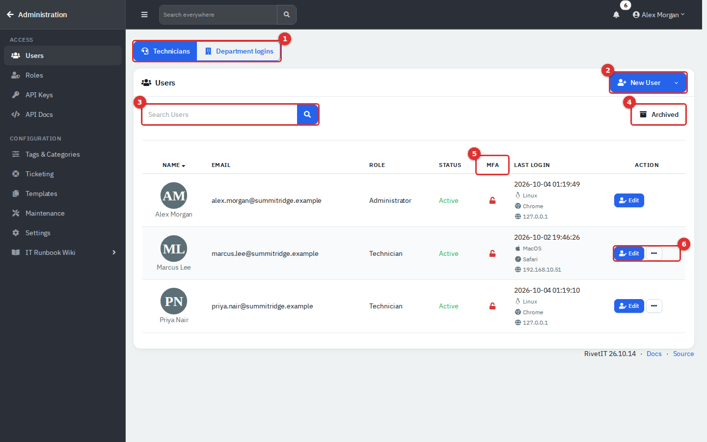

*Figure 3 — The Users list. (1) New User; its arrow opens Export and IR. (2) Search by name or email. (3) Archived switches to archived people. (4) The MFA column. (5) Edit and the row menu.*

- **Status** is **Active** (green) or **Disabled** (red). A blue **Invited** label exists, but nothing in the current screens sets it.
- **MFA** shows a green closed padlock when the person has set up an authenticator app and a red open padlock when not. A passkey does not change the icon.
- **Last Login** shows the date, system, browser and address of the latest sign-in, or **Never logged in**. It is read from the audit log, so it follows the log retention setting.
- Your own row has **Edit** but no row menu: you cannot disable or archive yourself.

### Add a user

1. Go to **Administration → Users** and select **New User**.
2. On the **Details** tab, fill in **Name**, **Email** (also the sign-in name) and **Role**. Choose the role with care: it decides everything the person can do (see "Roles and permissions").
3. Enter a **Password** of at least 8 characters. The eye button shows it and the dice button fills in a readable random one.
4. Tick **Force MFA on next login** if the person must set up an authenticator app straight away.
5. Optionally choose an **Avatar**.
6. Open the **Access** tab to limit the person to some departments (see the next task). Leave everything unticked for all departments.
7. Select **Create**. The person can sign in at once.

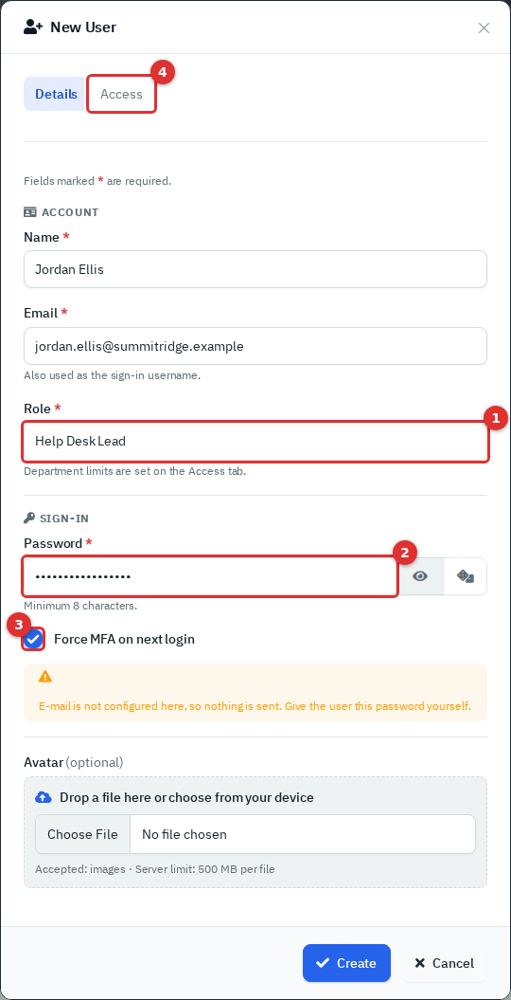

*Figure 4 — The New User pop-up. (1) Role. (2) Password. (3) Force MFA on next login. (4) The Access tab.*

If outgoing mail is set up, a tick box offers to email the person a welcome message with the sign-in link. The password is never included, so hand it over separately. If mail is not set up, the pop-up says so and nothing is sent.

Create users and set passwords while you are signed in with your password, not a passkey. The new person's vault key is made from your unlocked session.

### Limit a person to some departments

Open **Edit** on the person and choose the **Access** tab. Tick the departments this person works with. The blue box under the heading changes with the chosen role and says what your ticks will mean.

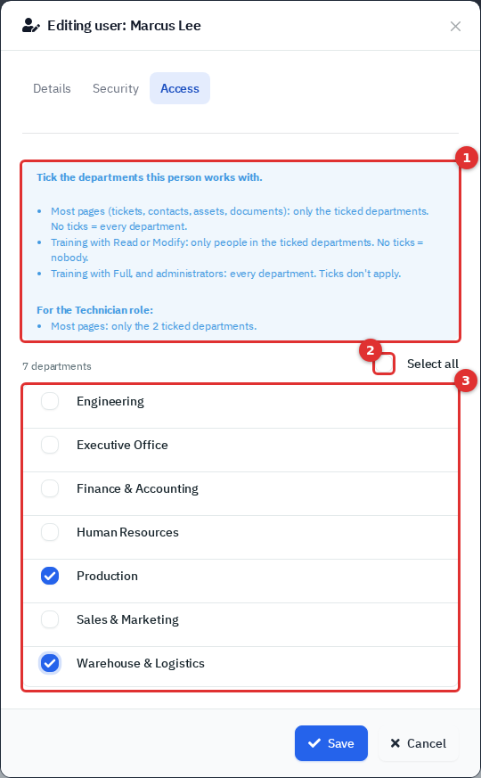

*Figure 5 — The Access tab. (1) What the ticks mean for this role. (2) Select all. (3) The department list.*

| Situation | Result |
|---|---|
| Most pages (tickets, people, assets, documents) with no ticks | The person sees every department. |
| Most pages with some ticks | Only the ticked departments. |
| Training at Read or Modify with no ticks | The person sees nobody in Training. |
| Training at Read or Modify with ticks | Only people in the ticked departments. |
| Training at Full, and administrators | Every department; ticks are ignored. |

### Change a role, a password or other details

1. Select **Edit** on the person's row, or select their name.
2. Change **Name**, **Email**, **Role** or **New Password**. Leave **New Password** empty to keep the current one.
3. Select **Save**.

A new role applies on the person's next click. They do not need to sign in again. The audit log records that the user was edited, but not what changed.

Do not change your own role here. Unlike the Roles page, the user form does not check that another administrator remains.

### Reset a password

- **You set it**: **Edit**, type a **New Password**, **Save**, then give it to the person by phone or in person and ask them to change it.
- **The person changes it**: name menu → **Account** → **Security** → **Password**. This needs their current password.
- **Everyone at once**: use **IR**, described below.

Agents cannot reset a forgotten password by email. The **Forgot password?** link on the sign-in page is for Department Portal accounts only.

### Require MFA and reset it

**Force MFA on next login** (on the **Details** tab) sends a person who has no authenticator app to a "Multi-Factor Authentication Enforced" page after they sign in. They scan a QR code and enter a 6-digit code. Once it is on, they cannot switch MFA off from their own account. The setting has no effect on people who already use MFA.

To reset MFA for someone who lost their phone, open **Edit → Security**. Under **Two-Factor Authentication** select **Disable** and confirm. The **Security** tab also lists the person's passkeys, each with a delete button, and, when MFA is on, their **Trusted Devices** (devices that skip the code) with **Revoke All**. The row menu offers the same as **Revoke N Remember Tokens**.

### Disable or archive a user

Open the row menu (the three dots) and choose **Disable** or **Archive**.

| | Disable | Archive |
|---|---|---|
| Confirmation | None. It takes effect the moment you select it. | A pop-up asks who takes over their open tickets and recurring tickets. Choose a person or **No one**, then select **Archive**. |
| Can sign in | No, and a person who is signed in is signed out on their next click. | No, likewise. |
| Their tickets | Open tickets and recurring tickets become unassigned. | Reassigned as you chose. |
| Mobile app tokens | Deleted. | Deleted. |
| Name and password | Unchanged. | The name gets " (archived)" added and the password is replaced by one nobody knows. |
| Where they appear | In the list, marked **Disabled**. | Only under **Archived**. |
| Undo | **Activate** in the row menu. | **Restore**. |

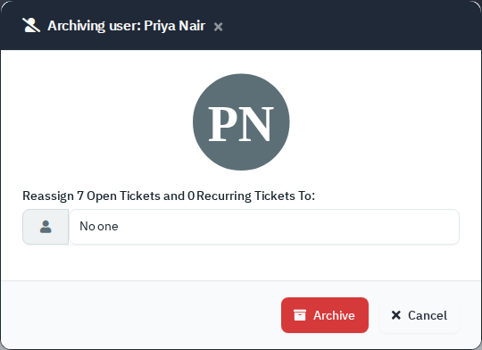

*Figure 6 — Archiving asks what happens to the person's open tickets.*

Nothing deletes a user. Archive people who have left: their tickets and history stay in place.

### Restore an archived user

1. Select **Archived** above the list.
2. Open the row menu and choose **Restore**.
3. Enter a new password, check the **Role**, and select **Restore**.

The person is active again under their original name. Do not use **Activate** on an archived person: it makes the status Active but leaves them archived and unable to sign in.

### Export users, and IR

The arrow on **New User** opens two more actions. They appear only when there is more than one user.

- **Export** → **Download CSV** saves a file with **Name**, **Email**, **Role**, **Status** and **Creation Date**. It lists every account, including archived people and Department Portal accounts.
- **IR** (incident response) resets passwords in one step. Enter your own password and select **Reset passwords**. Every account that is not archived, except yours, gets a new random password, and the list of email addresses and passwords appears once on a plain page. Copy it before you leave, and pass the passwords on by phone, not email. The reset does not check the account type, so Department Portal accounts are reset too. There is no undo.

## Roles and permissions

A role is a named set of permissions. Every user has exactly one role. **Administration → Roles** lists them.

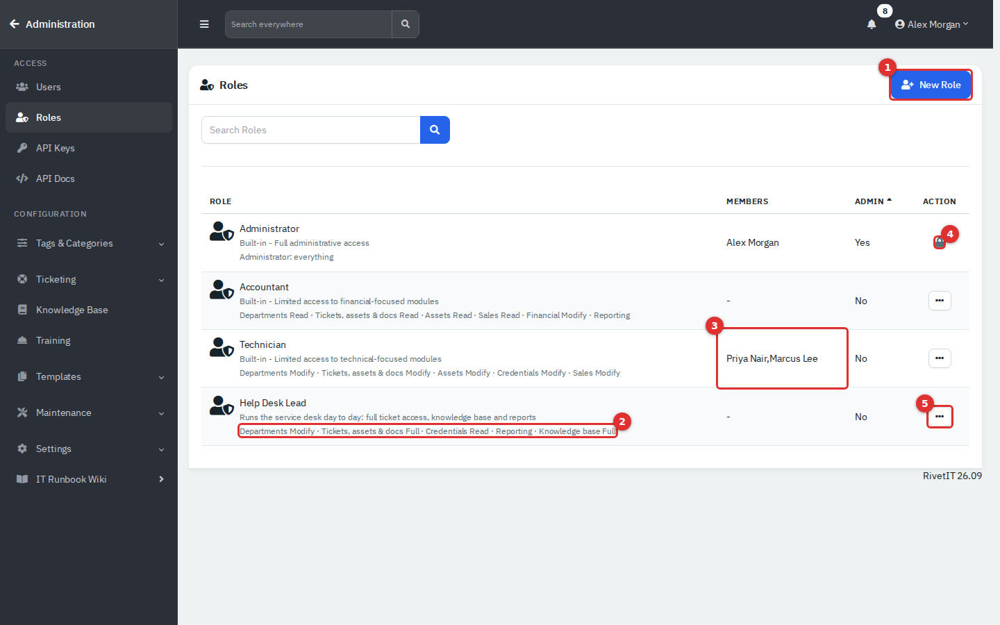

*Figure 7 — The Roles list. (1) New Role. (2) A one-line summary of what the role holds. (3) The people in the role. (4) The lock: the only administrator role in use cannot be edited or archived. (5) The row menu.*

Three roles exist from the start: **Administrator**, **Technician** and **Accountant**. "Built-in" is only a word in their description. You can edit or archive Technician and Accountant like any role you create. See "Built-in roles" below.

### Create a role

1. Select **New Role**.
2. On **Details**, enter a **Name** and a **Description**, and choose **Admin access**. **No** means the role uses the permissions tab. **Yes** gives full access to everything, including Administration, and the permissions no longer apply.
3. Open **Permissions**. Optionally pick a starting point under **Start from…**: **Training Manager**, **Training Supervisor (department)**, **Learner**, **Technician** (a copy of the current Technician role) or **Nothing**. A preset only fills in the form.
4. For each module, choose a level. The line under the buttons says what that level allows.
5. Check the **This role will see** panel. It shows the sidebar people in this role will get.
6. Select **Create**. Nothing is saved until you do.

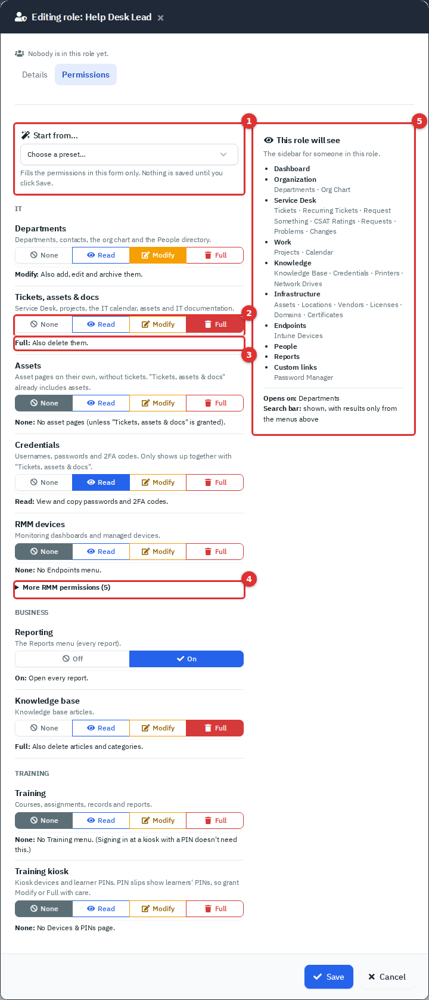

*Figure 8 — The Permissions tab. (1) Start from. (2) The level buttons. (3) What the chosen level allows. (4) More RMM permissions. (5) The sidebar preview. The two billing rows, Sales and Financial, are left out of the picture.*

Then give the role to people with **Users → Edit → Role**.

A grey badge such as **RMM is off** next to a module means it is switched off in **Settings → Modules**. You can set the level, but it does nothing until the module is on. The editor also shows **Sales** and **Financial** rows. They control the billing features, which this guide does not cover. Leave them at **None** unless you use those features. One exception: **company-wide vendors** (a vendor that does not belong to any department) are managed under **Financial**, not Tickets, assets & docs. A role needs Financial at Modify to add or edit one, even if it has Tickets, assets & docs at Modify.

### Change or archive a role

- **Edit** changes what everyone in the role can do, from their next click. The pop-up lists who is affected.
- If you edit the role you are in and remove admin access, the pop-up warns you.
- The **Administrator** role shows a lock while it is the only administrator role with an active user. It cannot lose admin access or be archived until another role has admin access and a user.
- **Archive** appears only for roles with no members, and asks you to confirm. Archived roles vanish from the list and the role pickers, and the interface has no way to bring one back.

### What each permission unlocks

Each module has a level: **None**, **Read**, **Modify** or **Full**. In the code they are 0, 1, 2 and 3. Each level includes the one before it. Administrators always have level 3 everywhere.

| Module | Read | Modify | Full |
|---|---|---|---|
| **Departments** | See departments, people, the org chart and department workspaces. | Add, edit and archive departments and people; also locations and department vendors. | Also delete them, and anonymise a person. |
| **Tickets, assets & docs** | See tickets (including internal notes), projects, the calendar, assets and IT documentation: documents, files, domains, certificates, licenses, printers, network drives, locations and vendors that belong to a department. | Create and edit all of those, and reply to tickets. | Also delete them. |
| **Assets** | See assets, and nothing else from Tickets, assets & docs. | Add, edit and archive assets. | Also delete assets. |
| **Credentials** | See and copy usernames, passwords and 2FA codes, and export credentials to a CSV file with the passwords in clear text. | Add, edit and import credentials. | Also delete credentials. |
| **Knowledge base** | Read articles. | Write, edit and review articles. | Also delete articles, categories and attachments. |
| **Training** | See published courses, learning paths, assignments, records and reports for people in the ticked departments. | Also write courses, quizzes and question banks, assign training, award badges and unlock locked courses; still only the ticked departments. | Everything in Training for every department, ticks ignored: trainers, groups, auto-assign rules, voiding records and Training settings. |
| **Training kiosk** | See kiosk devices and each person's PIN status. | Also unlock PINs, print PIN slips and clear kiosk cooldowns. | Also set up, reissue and revoke kiosk devices. |
| **RMM devices** | See the RMM dashboard, devices, checks and the network page. | Also edit checks and run patch scans and installs. | Same as Modify. |
| **RMM scripts** | See the script library. | Add and edit scripts, and run them on devices. | Also delete scripts. |

Notes on the table:

- **Departments**: with **None** there is no Organization or People menu, and no department workspaces.
- **Tickets, assets & docs**: this module also opens the Service Desk, Work, Knowledge (Printers, Network Drives) and Infrastructure menus. A department workspace needs **Departments** as well.
- **Assets** is already included in Tickets, assets & docs. Give it alone to someone who only handles equipment.
- **Credentials** shows in the main menu only together with Tickets, assets & docs (Read), and in a department workspace together with Departments (Read). **Read** is enough to export every password.
- **Knowledge base** also needs the module on. The Technician role does not include it.
- **Training** needs the Training module on. The Access-tab rule is in "Limit a person to some departments". Administrators use **Administration → Training**. People with Training at Full but no admin access use **Training → Training settings**.
- **Training kiosk**: **Devices & PINs** sits inside the Training menu, so the role also needs Training at Read or higher. A learner who signs in at a kiosk with a PIN needs no permission at all. PIN slips show learners' PINs, so grant Modify with care. Choosing a device from Assets needs Assets (Read).
- **RMM** rows only matter when RMM is on. There is no extra power at Full.

Some permissions are switches (**Off** or **On**) because the app only checks whether they are on:

| Switch | When it is On |
|---|---|
| **Reporting** | The **Reports** menu opens, with **Scheduled Reports**. Each report also needs read access to what it reports on: ticket, service desk, time and satisfaction reports need Tickets, assets & docs (Read); credential rotation reports need Credentials (Read). |
| **RMM alerts** | The **Alerts** page and the alert count appear. |
| **Acknowledge RMM alerts** | The person can acknowledge and resolve alerts. Otherwise alerts are view-only. |
| **RMM sync** | The person can start syncs with the RMM and network integrations (**Sync now**). |
| **RMM remote connect** | The person can open remote sessions, reboot devices and run commands. |

### Module-only logins

A role that is not an administrator and holds none of **Departments**, **Tickets, assets & docs** and **Assets** is a module-only (limited) login. A Training Manager, a Learner or a Knowledge Base editor are typical examples. These logins:

- land on their own module: the first of Training, Knowledge Base, Reports, RMM and Alerts that the role holds, or their **Account** page if none;
- can open only that module's pages, their **Account** pages and their notifications. Any other address answers "You don't have access to this page" and names the permission needed;
- have no Dashboard, Work menu, search box or custom links, and get notifications only for their own modules.

A role that holds any of the three IT modules, such as Technician, is never limited.

### Built-in roles

| Role | Admin access | What it holds |
|---|---|---|
| **Administrator** | Yes | Everything, including Administration. |
| **Technician** | No | Departments, Tickets, assets & docs, Assets and Credentials at Modify (and Sales at Modify). No Knowledge base, Reports or Training. |
| **Accountant** | No | Departments, Tickets, assets & docs and Assets at Read, and Reporting on (and Sales at Read and Financial at Modify). |

The **Help Desk Lead** role in the pictures is an example: Departments Modify, Tickets, assets & docs Full, Credentials Read, Reporting On and Knowledge base Full.

## Sign-in security

### Settings → Security

**Administration → Settings → Security** has two cards. Change a field and select **Save** on the **Security** card.

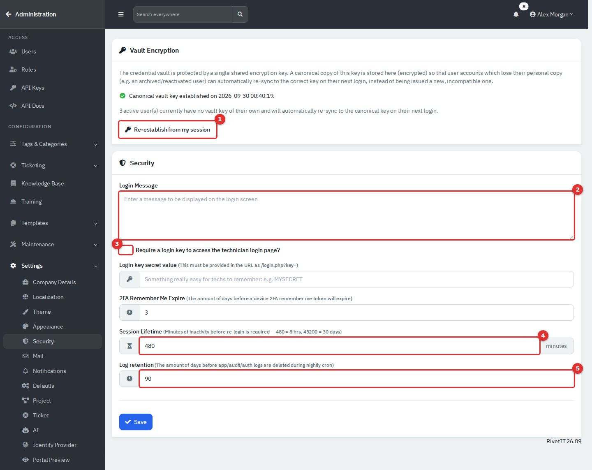

*Figure 9 — The Security settings page. (1) The vault key button. (2) Login Message. (3) The login key switch. (4) Session Lifetime. (5) Log retention.*

| Field | What it does |
|---|---|
| **Login Message** | Text shown on the sign-in page. |
| **Require a login key to access the technician login page?** | When on, agents must open the sign-in page as `/login.php?key=` followed by the secret. Without it, signing in returns to the sign-in page, and the email box says **Department Email**. |
| **Login key secret value** | The secret for the login key. Letters, digits and underscores, 3 to 99 characters. Turning the switch on with no secret leaves it off. |
| **2FA Remember Me Expire** | Days that a "trusted device" skips the MFA code. |
| **Session Lifetime** | Minutes of inactivity before signing in again. From 30 to 43200; 480 is 8 hours. |
| **Log retention** | Days to keep audit and app log entries. A nightly job deletes older ones. Enter a real number: 0 or blank deletes everything from before today. |

Other protections work without settings. Fifteen failed sign-ins (or wrong MFA codes) from one address in 10 minutes block that address, and the block is written to the audit log. When mail is set up, a person who signs in from a browser and address never seen before is emailed a notice.

### The credential vault key

The **Vault Encryption** card concerns the Credentials page. Stored credentials are encrypted with one shared key, and each person holds a personal copy locked with their password. RivetIT also keeps a "canonical" copy so a person who loses their copy, such as an archived and restored user, gets the right key back at their next password sign-in.

- If the card says **Canonical vault key established**, nothing is needed.
- If it warns that no key has been established, passkey sign-ins cannot open the vault. Sign in with your password and select **Establish from my session**, then confirm. It copies the key from your current session, so it fails if your vault is locked.
- The card also counts active users who have no key of their own. They fix themselves at their next sign-in.

### Identity Provider (Microsoft sign-in)

**Administration → Settings → Identity Provider** lets **Department Portal** users sign in with Microsoft Entra ID. It does not apply to agents.

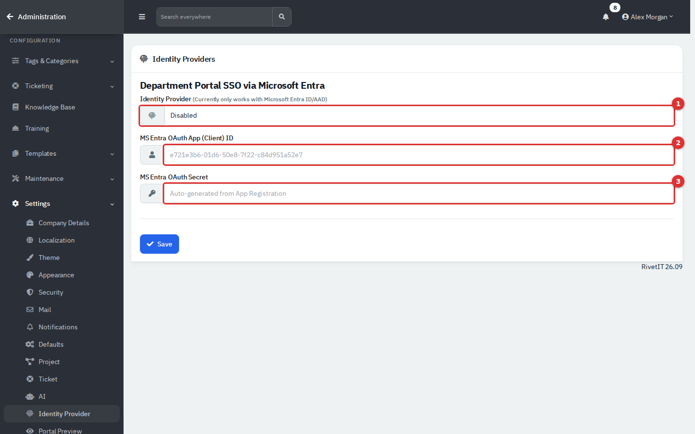

*Figure 10 — The Identity Providers page. (1) The provider: Disabled until an ID is saved. (2) The application (client) ID. (3) The client secret.*

1. In the Microsoft Entra admin center, register an application. Add the web redirect address `https://` followed by your RivetIT address and `/client/login_microsoft.php`, and create a client secret.
2. Enter the **MS Entra OAuth App (Client) ID** and the **MS Entra OAuth Secret**, then select **Save**.
3. On each employee's record, set their Department Portal login to **Using Azure Credentials** (see the [Department Portal guide](11-employee-portal.md)). Their RivetIT email must match their Microsoft sign-in name.

The sign-in page then shows **Login with Microsoft Entra**. Emptying the client ID turns the feature off. The provider list is informational: only Microsoft Entra works. This depends on your Microsoft tenant and was not tested in the demo.

## API keys and API docs

An API key lets a script or another system call the RivetIT API. Keys are not tied to a person or a role. A request with a key is handled as the oldest active user account, which is normally your first administrator, and appears under that name in the audit log. Treat a key like an administrator password.

### The API Keys list

**Administration → API Keys** lists every key with its department scope, permission, creation date and expiry.

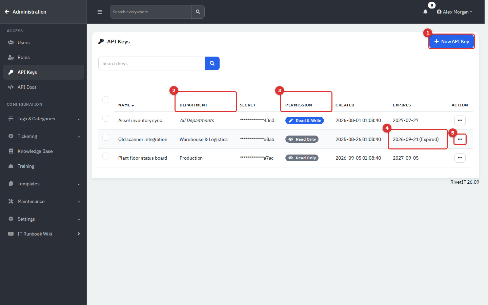

*Figure 11 — The API Keys list. (1) New API Key. (2) The department scope. (3) Read & Write or Read Only. (4) An expired key. (5) The row menu.*

- Only a fingerprint of each key is stored. The **Secret** column shows the last four characters of that fingerprint, not of your copy, so identify keys by name and date.
- **Revoke** (active keys, with confirmation) sets the expiry to now. **Delete** appears for expired keys.
- Tick rows to open **Bulk Action**, then **Delete**. It removes the selected keys at once, active or expired, with no confirmation.
- Disabling or archiving a user deletes that person's mobile app tokens. Each person sees their own under **Account → Security**.

### Create an API key

1. Select **New API Key**.
2. On **Details**, enter a **Name** that says what uses the key. Expiration defaults to **30 days**; choose 60 days, 90 days, or a custom date if needed. The key stops working at the start of that day.
3. Select a department under **Department Access**.
4. **Read only** is the default. Choose **Read & write** for create/update requests, and explicitly tick **Also allow deleting and archiving records** if needed. Under **Security restrictions**, optionally enter allowed IP addresses or CIDR networks, one per line.
5. Open the **Keys** tab. Copy the **API Key** and the **Login credential decryption password** now. They exist only in this pop-up.
6. Tick **I have made a copy of the key(s)** and select **Create**.

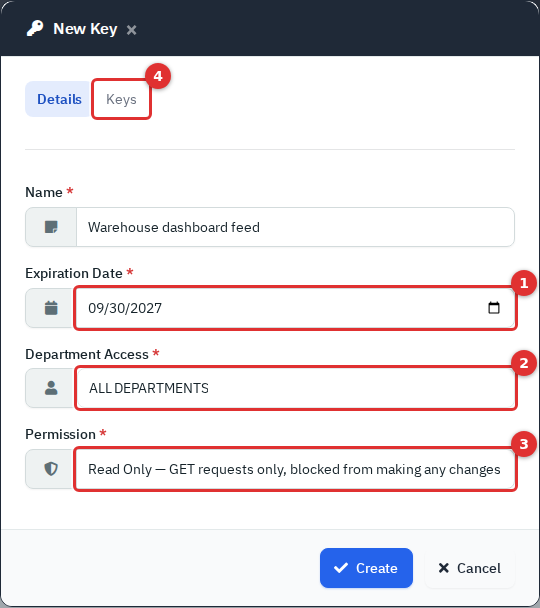

*Figure 12 — The New Key pop-up, filled in with example values. (1) Expiration Date. (2) Department Access. (3) Permission. (4) The Keys tab.*

Callers send the key in an `X-Api-Key` header. A key cannot read stored credentials; the API refuses that, so use a user token instead.

### API Docs

**Administration → API Docs** is a live reference for every endpoint.

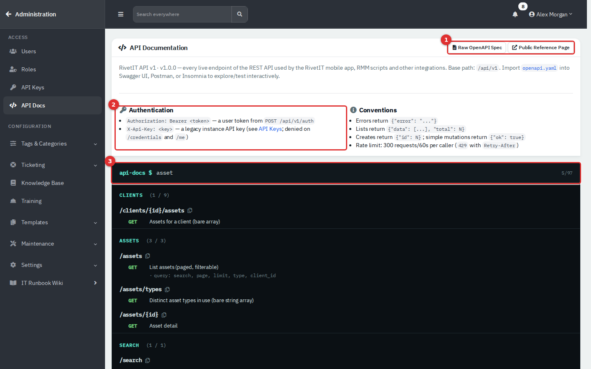

*Figure 13 — The public API reference with a search for asset endpoints.*

Use the search box and endpoint navigation to find operations. Expand an operation to see its parameters, request body and responses. **OpenAPI spec** downloads the specification for tools such as Postman or Insomnia; **Open full reference** opens the same reference without signing in. Callers may send `Authorization: Bearer <token>` or `X-Api-Key: <key>`, and each is limited to 300 requests per minute. The API still says **client** wherever the application says **Department**.

## Logs

All three logs are under **Administration → Maintenance**. They are read-only.

### Audit Logs

The audit log records who did what: sign-ins (successful, failed, blocked), and changes to users, roles, API keys, settings, tickets, credentials, training and more. Each entry has a **Timestamp**, **User**, **Department**, **Type** (the area), **Action**, **Description**, **IP Address** and **User Agent** (system and browser).

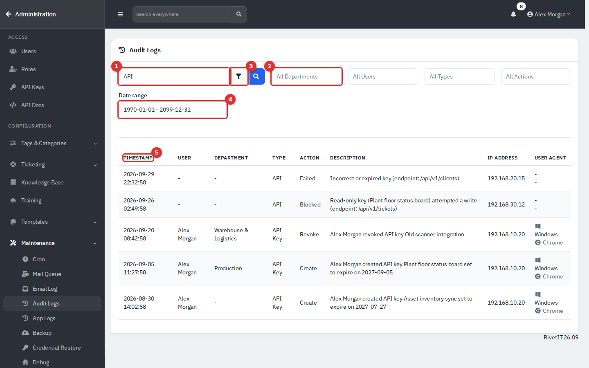

*Figure 14 — Audit Logs searched for "API". (1) The search box. (2) The filters, starting with Department; User, Type and Action follow. (3) The funnel opens the date range. (4) Date range. (5) Select a heading to sort.*

To find something:

1. Type a word in the search box and press Enter. It matches the type, action, description, address, browser text, user name and department name.
2. Narrow the list with **All Departments**, **All Users**, **All Types** and **All Actions**. The last two list only what exists.
3. Select the funnel and pick a range under **Date range**. The default covers all time.
4. Select a column heading to sort. With more than 5 results, page controls and a rows-per-page box appear below the list.

Useful searches: a person's name (their actions and sign-ins), an address such as a repeated failed sign-in, `Failed` or `Blocked`, `API` for integration problems, or `Credential` for who viewed or exported credentials.

A **Failed login attempt using …** entry has no user, because nobody was signed in. Failed and blocked API calls also have no user. Entries older than **Log retention** disappear.

### App Logs

The app log is what the application says about itself: scheduled jobs, mail sending, the mailbox poller, backups and mobile app crashes. Each entry has a **Type** (**info**, **warning** or **error**), a **Category** and **Details**.

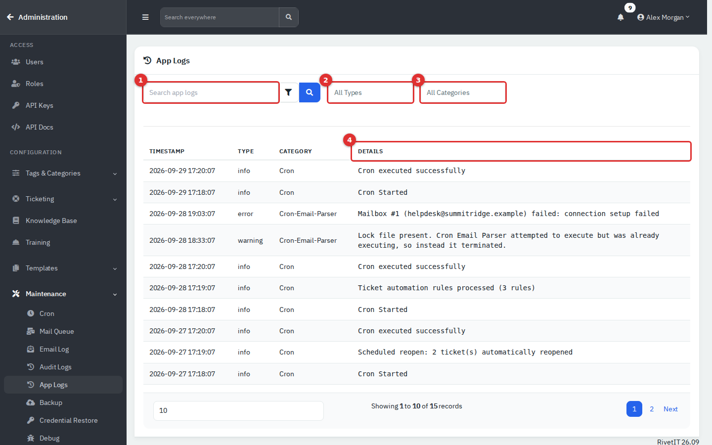

*Figure 15 — App Logs. (1) Search. (2) Type filter. (3) Category filter. (4) The details text.*

Look here when a scheduled job did not run, an email was not sent or a mailbox could not be read. Start with **All Types** set to **error**, or a category such as **Cron**, **Mail** or **Cron-Email-Parser**. Search and the date range work as in the audit log. Mailbox connection failures are logged here, not in the Email Log.

### Email Log

The email log shows every email the mailbox poller handled and what became of it. It stays empty until a mailbox is set up under **Administration → Ticketing → Mailboxes**.

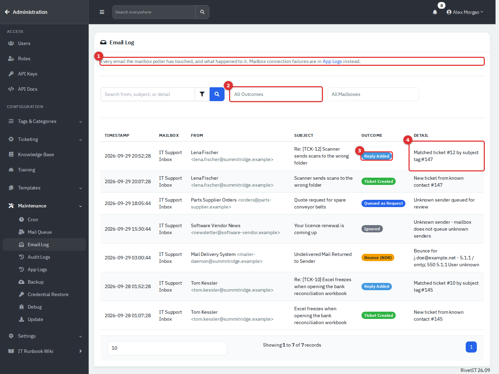

*Figure 16 — Email Log. (1) A reminder that connection failures are in App Logs. (2) Filter by outcome. (3) The outcome badge. (4) Detail, with a link to the ticket.*

| Outcome | Meaning |
|---|---|
| **Ticket Created** | A new ticket was made from a known contact, or from a known domain with a new contact added. |
| **Reply Added** | The email was added to a ticket, matched by the ticket number in the subject or by a similar subject. |
| **Queued as Request** | The sender was unknown. The email waits for review under **Service Desk → Requests**. |
| **Bounce (NDR)** | A delivery-failure notice came back to the mailbox. |
| **Ignored** | The email matched nothing and the mailbox does not queue unknown senders. |

The trailing number in **Detail** is a link to the ticket. Use **All Mailboxes** to look at one mailbox. The email log is not covered by **Log retention**.

## Tips and good practice

- Keep at least two administrators, and use named accounts for all of them.
- Give people the smallest role that lets them work. A custom role such as Help Desk Lead is safer than another administrator.
- The built-in Technician role has no Knowledge base, Reports or Training. Add them to a custom role instead of editing Technician for everyone.
- Treat **Credentials: Read** as the power to export every password. Check the audit log for **Credential** entries.
- Turn on **Force MFA on next login** for every agent, and remember that **Disable** under **Edit → Security** is how you reset lost MFA.
- Prefer read-only, single-department API keys with a short expiry. Revoke a key when its integration is retired, and watch the audit log for **API** entries such as failures from an expired key.
- Raise **Log retention** if your policy needs longer history than the default. Copy older evidence somewhere else before you shorten it.
- After a suspected incident: use **IR**, disable the accounts involved, then search the audit log for **Failed**, **Blocked** and unfamiliar addresses.
- Tell the person before you change their role, archive them or disable MFA. Each of these takes effect at once.

## Related guides

- The [Department Portal guide](11-employee-portal.md), for portal logins and Microsoft sign-in from the employee side.
- The Service Desk guide, for how tickets and the mailbox requests mentioned in the Email Log are worked.
- The Training guides, for what the Training and Training kiosk permissions open.
