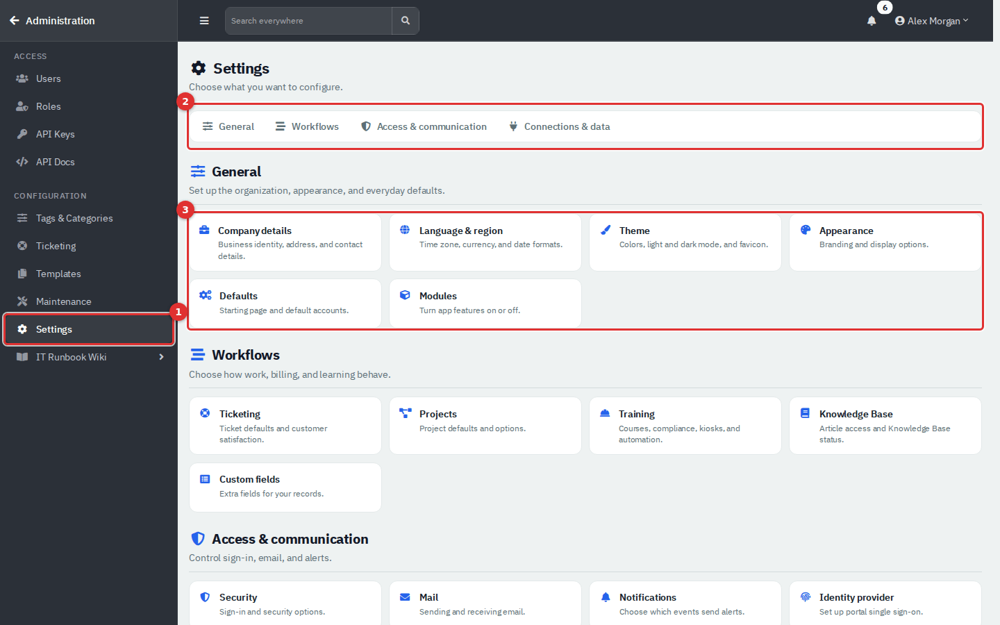
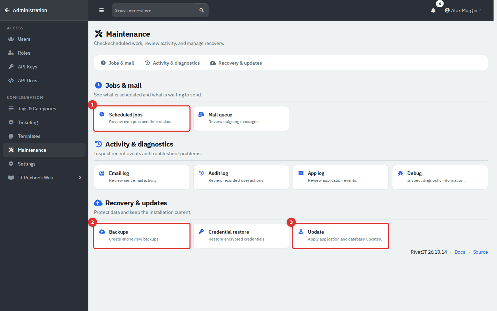
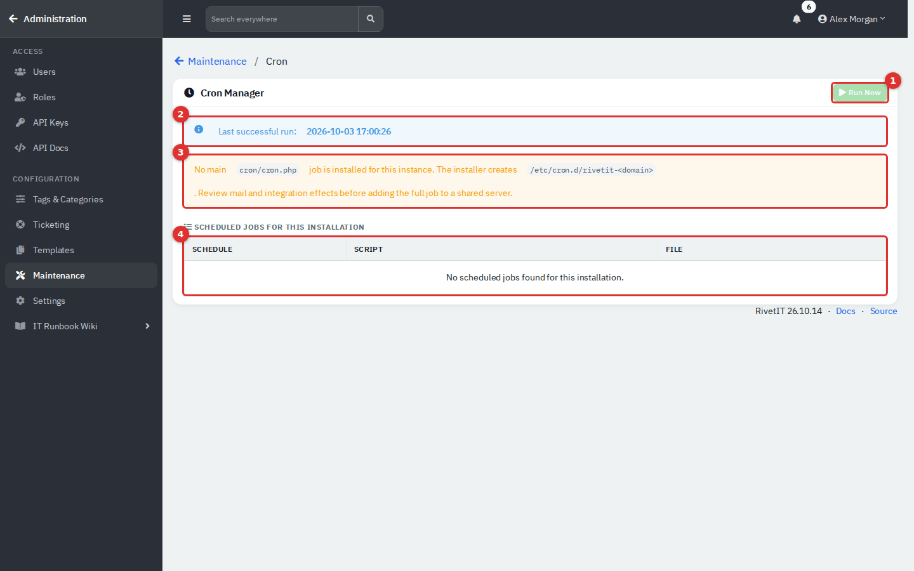
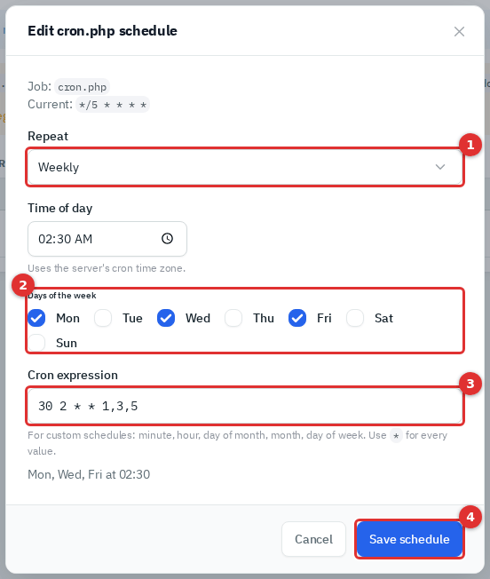
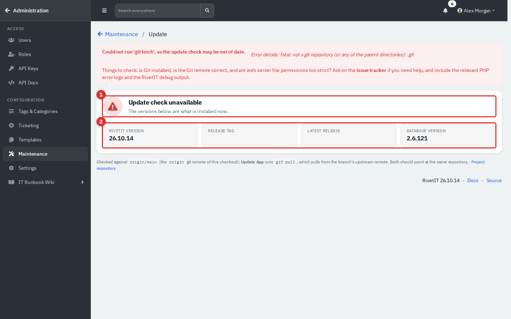

# Administration: System Settings, Mail and Maintenance

The Administration area is where an administrator decides which parts of RivetIT are switched on, how the company appears, how email flows in and out, which outside services are connected, and how the system is backed up and kept running. This page covers those system-wide settings. Integrations, webhooks and AI are in [Administration: Integrations, Webhooks and AI](13c-administration-integrations.md). Ticketing configuration (statuses, SLAs, templates, automation) and the lists you use to organise data (categories, tags, links, holidays) are in [Administration: Ticketing, Automation and Organising Data](13b-administration-ticketing-and-automation.md).

| | |
|---|---|
| **Where to find it** | Click your name at the top right → **Administration**. The **Administration** sidebar replaces the normal sidebar; the **← Administration** link at its top returns you to the app. |
| **Who can use it** | Administrators only: users whose role is flagged as Administrator (Administration → Roles). Anyone else who opens an `/admin/` address sees "You don't have access to this page" (HTTP 403). There are no read-only levels. |
| **Turn it on** | Nothing to enable. Some sections appear only when a module is on (see [Turn modules on or off](#turn-modules-on-or-off)). |

## What it's for

- Switch modules on or off, and set company details, language, time zone and look.
- Connect outgoing and incoming email so tickets can be created from messages.
- Decide which notifications go out and turn on the scheduler that sends them.
- Connect webhooks, an AI provider and calendar sync (see [Administration: Integrations, Webhooks and AI](13c-administration-integrations.md)).
- Take backups, check for updates, see when scheduled jobs last ran and change their schedules.

## A quick tour

*Figure 1 — Open the user menu (1) and choose **Administration** (2). The entry is shown only to administrators.*

*Figure 2 — The Administration area, shown on the Modules page. (1) Return to the app. (2) **Settings** in the sidebar. (3) The module switches. (4) **Save**. The breadcrumb above the card (**All settings / Modules**) returns to the page you came from.*

The sidebar has two groups. **ACCESS** holds **Users**, **Roles**, **API Keys** and **API Docs** (see [Administration: Users and Security](12-administration-users-and-security.md)). **CONFIGURATION** holds five entries. Each opens a directory page of tiles; click a tile to open that page. In this guide, **Settings → Modules** means the **Settings** entry in the sidebar, then the **Modules** tile.

| Sidebar entry | Tiles | Covered in |
|---|---|---|
| **Tags & Categories** | Tags, Categories, Custom links, AI settings, People import, Employee workflow templates | [13b](13b-administration-ticketing-and-automation.md); AI settings in [13c](13c-administration-integrations.md) |
| **Ticketing** | Ticket statuses, Labor types, Ticket automation, Mailboxes, Mail requests, SLA policies, Business hours, Holidays | [13b](13b-administration-ticketing-and-automation.md); mail pages below |
| **Templates** | Ticket, service catalog, canned response, worksheet, contract, project, document, onboarding, vendor and license templates | [13b](13b-administration-ticketing-and-automation.md) |
| **Maintenance** | Scheduled jobs, Mail queue, Email log, Audit log, App log, Debug, Backups, Credential restore, Update | Below (logs in their own guide) |
| **Settings** | General: Company details, Language & region, Theme, Appearance, Defaults, Modules. Workflows: Ticketing, Projects, Training, Knowledge Base, Custom fields. Access & communication: Security, Mail, Notifications, Identity provider, Portal preview. Connections & data: Integrations, Calendar sync, Webhooks, AI, Telemetry | Company details to Notifications and Mail below; Integrations, Webhooks, AI, Calendar sync and Telemetry in [13c](13c-administration-integrations.md); Security and Identity provider in [12](12-administration-users-and-security.md) |

*Figure 3 — The Settings directory. (1) **Settings** in the sidebar. (2) Shortcuts to the four groups. (3) The tiles of the **General** group.*

*Figure 4 — The Maintenance directory. (1) **Scheduled jobs**. (2) **Backups**. (3) **Update**.*

The Templates directory tiles carry a **New** button that creates one without opening the list first. Directory tiles appear only when they apply: **Ticketing** and **Projects** need the Ticketing module, **Identity provider** and **Portal preview** need the Department Portal, and **Knowledge Base** needs the Knowledge Base permission.

Two things to know. Custom links you create with location **Admin Nav** appear at the bottom of this sidebar. And the **Ticketing** entry disappears when the Ticketing module is off, and the **Templates** entry disappears when the IT Documentation module is off, even though ticket templates and canned responses live in it.

## Common tasks

### Turn modules on or off

1. Go to **Settings → Modules**.
2. Switch each module on or off.
3. Click **Save**. The change applies to everyone at once.

| Switch | What it turns on or off |
|---|---|
| **Show IT Documentation** | Agent sidebar: the **Infrastructure** group (Assets, Locations, Vendors, Licenses, Domains, Certificates) and Credentials, Printers and Network Drives under **Knowledge**. The same documentation pages in each department workspace. The **Templates** entry. |
| **Show Ticketing** | Agent sidebar: the **Service Desk** group (Tickets, Recurring Tickets, Request service, CSAT Ratings, Requests, Problems, Changes) and **Work → Projects**. The **Ticketing** entry, **Settings → Projects** and **Settings → Ticketing**. |
| **Show Knowledge Base** | **Knowledge → Knowledge Base** for agents and departments (per-department articles plus a company-wide library). |
| **Show Training (LMS)** | The **Training** group: courses, quizzes, assignments, records, certificates and the kiosk. Visible only to roles granted the Training permission. This switch is offered only when the Training pages are installed. |
| **Show Live Chat on Tickets** | A real-time chat panel on ticket views for agents and departments. |
| **Enable Department Portal** | The employee portal, plus **Settings → Identity provider** and **Portal preview** in this area. |
| **Enable Remote MCP** (badge **Experimental**) | An optional, read-only endpoint at `/mcp` that lets an outside AI client read the signed-in agent's profile and recent open tickets within that agent's permissions. Off by default. It also needs an OAuth provider and server settings, and each agent must be mapped to an identity under **Users**; see `docs/REMOTE_MCP.md`. The switch is greyed out until the database update that adds it is applied. The live sign-in flow has not been tested yet, so leave it off unless you are trialling it. |

A module switch hides menu entries; it does not delete data. Switching a module back on restores its pages and everything in them. Even with a switch on, an agent still needs the matching permission in their role to see the menu entry.

### Update company details

1. Go to **Settings → Company details**.
2. Edit the name, address, phone, email, website and tax ID. Upload a logo (JPG or PNG) if you want one; it appears on the sign-in page, at the top of the agent sidebar and on the employee portal. **Remove Logo** deletes it. A dark logo can vanish on those dark surfaces; set **Logo Background** under Appearance (below).
3. In **IT & Directory**, set the Microsoft/Entra Tenant ID, default email domain and the security and HR contact emails. These are used by directory sync and employee-lifecycle notifications once those are configured.
4. Click **Save company details**.

*Figure 5 — Company Details. The IT & Directory values shown here were typed in for the picture and not saved.*

The company country matters elsewhere: it sorts the holiday picker on SLA calendars.

### Set language, currency and time zone

Go to **Settings → Language & region**. **Language** sets the locale used when the app formats numbers and currency, **Currency** the currency code, and **Timezone** the time zone the app uses for times. A second card, **Phone Numbers**, sets the default country code for new phone fields and can show a WhatsApp click-to-chat icon next to mobile numbers. Each card has its own **Save**.

### Change the look and start page

- **Settings → Appearance** sets the accent colour (fifteen presets or a custom hex code), the card corner radius (0 to 40 px), the **Logo Background** and whether dark mode is the company default. Individual users can still choose dark mode in their own preferences. The sign-in page and agent sidebar are dark, so the company logo sits on a backing there: white by default (the **#FFFFFF** field, with a reset arrow), any colour you pick, or tick **No backing** to show a light or transparent logo directly on the backdrop.
- **Settings → Theme** offers a second picker with an older list of seventeen colour names and a favicon upload (`.ico` file). Clicking a colour saves it immediately. It writes the same accent setting as Appearance, so whichever you save last wins. Use Appearance for everyday changes.
- **Settings → Defaults** sets the **Start Page** (where people land after sign-in: Dashboard, Department Management or Support Tickets) and the **Calendar** pre-selected on new calendar events. The other fields on that page belong to billing features this guide does not cover.

*Figure 6 — Appearance. (1) Preset accent colours. (2) A custom hex colour overrides the preset. (3) Company-wide dark mode default. Between (2) and (3) are the card corner radius and the logo backing.*

### Choose which notifications go out

1. Go to **Settings → Notifications**.
2. Set the options you need, then click **Save Settings**.

*Figure 7 — Notification Settings. (1) The scheduler switch. (2) Alert email for new tickets. (3) Emails to departments. (4) Expiry alerts. The Invoice and Quote cards that normally sit between (3) and (4) belong to billing features and are left out of the picture.*

| Setting | What it does |
|---|---|
| **Enable Cron Job** | Master switch for scheduled work: email reminders, expiry alerts, recurring tickets, ticket automation, automatic backups and sending queued email. Off by default. The server must also run the cron scripts (see [Keep scheduled jobs running](#keep-scheduled-jobs-running)). This page holds only the switch; whether the jobs actually ran is shown on **Maintenance → Scheduled jobs**. |
| **New Ticket Alert Email** | Emails this address whenever a ticket is created. Leave blank for none. Ticket Settings has the same field; both edit one setting. |
| **Department Portal Notifications** | Emails departments when their tickets are opened or closed. |
| **Domain & Certificate Expiry** | In-app alerts at 45, 7 and 1 days before a domain or certificate expires. |

The **Mobile App Push Notifications** card sends push messages to staff phones through a Firebase project. It shows numbered setup steps and needs a Firebase service-account key and staff signed in to the mobile app, so it depends on those outside pieces and is not exercised in this guide.

### Set up outgoing email

Nothing is emailed until a provider is chosen. Go to **Settings → Mail**.

*Figure 8 — SMTP settings with example values. (1) **SMTP Provider**. (2) Host, port, encryption and credentials. (3) **Save**. The values are illustrative and not saved.*

1. In **SMTP Provider**, choose **Standard SMTP (Username/Password)**, **Google Workspace (OAuth)** or **Microsoft 365 (OAuth)**. **None (Disabled)** turns sending off.
2. For standard SMTP, fill in **SMTP Host**, **SMTP Port**, **Encryption** (None, TLS or SSL), **SMTP Username** and **SMTP Password**. Leave a saved password blank to keep it.
3. For OAuth, enter the Client ID, Client Secret, Tenant ID (Microsoft only) and refresh token in the OAuth block of the IMAP card below, which both cards share. For Microsoft 365, **Setup Guide** on that page walks through the Entra app registration.
4. Click **Save**.
5. Under **Mail From Configuration**, set the **System Default** and **Tickets** From email and name. Each From address must be allowed to send as the SMTP user.
6. When host, port and From details are filled in, a **Test Email Sending** card appears. Pick a From address, type a recipient and click **Send**.

The **IMAP Mail Settings** card is the older single-mailbox setup, superseded by Mailboxes; use Mailboxes instead. Every provider option depends on your mail service, which issues the values these fields ask for.

### Add a mailbox for email-to-ticket

Email-to-ticket needs a real mail server the app can reach. The demo has none, so these steps are described from the app rather than run.

1. Go to **Ticketing → Mailboxes** and click **Add Mailbox**.
2. Enter a **Mailbox Name**, **Email Address** and optional **From Name**.
3. Choose the **Mailbox Type**: **Standard IMAP** (host, port, encryption, username and password) or **Microsoft 365 (OAuth)**. Google Workspace is not offered for new mailboxes.
4. Tick **Queue unknown senders as Requests** if strangers' messages should wait for review. Leave it off and they stay unread in the mailbox.
5. Optionally pick a **Default Department** for senders that match no contact.
6. Click **Create**. For Microsoft 365, open the mailbox again with **Edit** and click **Connect Microsoft 365**.
7. In **Settings → Ticketing**, switch on **Email-to-ticket parsing**.

*Figure 9 — Mailboxes. (1) **Add Mailbox**. (2) **Connected?** shows Configured, Needs setup or Needs reconnect. (3) The default department for unmatched senders.*

*Figure 10 — Add Mailbox. (1) Type. (2) Queue unknown senders as Requests. (3) Default department.*

**Check Shared Mailbox Access** tests addresses you believe you have Full Access to through a connected Microsoft 365 mailbox.

#### How incoming email becomes a ticket

The script `cron/ticket_email_parser.php` polls each active mailbox, reads unread messages and decides what each one is, in this order:

| Order | If the message... | Result |
|---|---|---|
| 1 | has a ticket tag in the subject such as `[TCK-123]` (your Ticket Prefix plus the number) | Added as a reply to that ticket |
| 2 | is from a known contact or registered domain and its subject is at least 95% similar to a ticket that department opened in the last 7 days and is unresolved | Added as a reply to that ticket |
| 3 | is from an email address on a person's record (People) | New ticket for that person |
| 4 | is from a domain registered under Domains | New ticket; the sender is added as a new person in that department |
| 5 | is from anyone else and the mailbox has **Queue unknown senders as Requests** on | Goes to **Requests** |
| 6 | looks like a bounce (sender contains daemon, postmaster, bounce or mta) | Raises an in-app notification, and is noted on the ticket if its subject has a tag |
| 7 | matches nothing else | Left unread in the mailbox |

Handled messages are moved to a top-level mailbox folder named `ITFlow`, a name kept from an earlier version. **Maintenance → Email log** records the outcome of every message: Ticket Created, Reply Added, Queued as Request, Bounce (NDR) or Ignored.

### Review the mail queue

Outgoing email is queued first and sent by the script `cron/mail_queue.php`. Go to **Maintenance → Mail queue** to see what is waiting.

*Figure 11 — Email Queue. (1) Attempts. (2) Actions: view a message, force a resend, or cancel.*

| Status | Meaning |
|---|---|
| **Queued** | Waiting for the next run of the mail script |
| **Sending** | Being sent now |
| **Failed** | Could not be sent. After more than three attempts a green send icon appears; it queues the message for one more try |
| **Sent** | Delivered to the mail server |

The red trash button on a row cancels the message: it is marked Failed and never sent. It does not delete the row. Select rows with the checkboxes and use **Bulk Action** to cancel or truly **Delete** them. The scheduler removes queue rows older than 90 days.

### Review emails from unknown senders

**Ticketing → Mail requests** lists messages from senders that matched no contact or domain, for mailboxes with **Queue unknown senders as Requests** on. Agents also see this list under Service Desk.

*Figure 12 — Requests. (1) **View** shows the message and attachments. (2) **Convert to Ticket** opens a ticket. (3) **Dismiss** removes the request.*

1. Click **View** to read it.
2. To act on it, click **Convert to Ticket**, choose the **Department** (the mailbox's default is pre-selected; **None** creates an unassigned guest ticket) and click **Create Ticket**. The sender is added as a person in that department if they are not already there.
3. To discard it, click **Dismiss**. This deletes the stored copy of the message and its attachments and cannot be undone.

### Keep scheduled jobs running

Ticket automation, recurring tickets, reminders, expiry alerts and automatic backups all depend on the scheduler:

1. Tick **Enable Cron Job** in **Settings → Notifications** and save.
2. Make sure the server runs `cron/cron.php` every few minutes. The bare-metal installer adds a five-minute entry for this script and the container image loops it every five minutes.
3. On a bare-metal installation, the installer also schedules `cron/mail_queue.php` (sends queued email) and `cron/ticket_email_parser.php` (reads mailboxes), every five minutes. Each exits while its feature is disabled. Container installations schedule only `cron/cron.php`; add separate runners for mail and mailbox parsing if those features are used.

Open **Maintenance → Scheduled jobs** to see what the server really runs. The page reads the jobs in `/etc/cron.d/` that start this installation's own scripts. Its heading is **Cron Manager**.

*Figure 13 — Scheduled jobs on the demo server, which has no installed cron entry. (1) **Run Now**. (2) The time of the last successful run, read from the App log. (3) The installer notice shown when no main job is found. (4) The table of jobs.*

| Part | What it shows |
|---|---|
| **Run Now** | Starts `cron/cron.php` in the background and asks you to check the App log for the result. It is available only when exactly one main `cron/cron.php` job is installed for this instance and **Enable Cron Job** is on. |
| Status notices | **Last successful run**; a warning when no main job is installed (the installer writes `/etc/cron.d/rivetit-<domain>`); a red notice when several main jobs target this instance, which you must clean up on the server; the main job's schedule; and a reminder when **Enable Cron Job** is off, because the script then exits without running tasks. |
| Table | **Schedule** with a plain-language description, **Script** (open **Command** for the full command line) and **File** with its line number. The main `cron.php` row is highlighted. |
| **Edit schedule** | Beside each job that runs as the web user, when the server administrator has installed the Cron Manager helper. The bare-metal installer installs it. Without it the page says schedules are visible but a server administrator must install the helper to enable editing. |

To change a schedule, click **Edit schedule**.

*Figure 14 — The schedule builder, shown for the installer's five-minute entry switched to Mon, Wed and Fri at 02:30. The demo server cannot edit jobs, so this picture opens the app's own dialog on a sample job. (1) **Repeat**. (2) The controls that match the choice. (3) The resulting cron expression. (4) **Save schedule**.*

1. Choose **Repeat**: **Every few minutes** (1 to 59; intervals restart at the top of each hour), **Hourly** (minute of the hour), **Daily**, **Weekly** (tick the days), **Monthly** (day of the month; days 29 to 31 are skipped in shorter months) or **Custom cron expression**.
2. For Daily, Weekly and Monthly set the **Time of day**. It follows the server's cron time zone.
3. Check the **Cron expression** box and the plain-language summary under it. Only a custom schedule lets you type in the box.
4. Click **Save schedule**. The button stays disabled until the schedule is valid and different from the current one.

Only the five timing fields change; the job's command stays fixed. On shared hosts, adding the full cron job can send duplicate mail, so review the enabled modules and mail setup first.

### Back up RivetIT

Go to **Maintenance → Backups** (the page is titled **System Backup**).

*Figure 15 — Backup. (1) **Download Backup**. (2) **Save to Server**. (3) Scheduled backups. (4) Reveal the encryption key. Below are **Remote Storage (S3-compatible)** and **Backup History**. The demo has no bucket saved, so the S3 buttons described below are not shown.*

1. **Download Backup** builds a fresh zip and sends it to your browser without keeping a copy. **Save to Server** stores it in the server's `backups` folder, named `itflow_<timestamp>_manual.zip`.
2. Every zip holds `db.sql` (the database), `uploads.zip` (uploaded files), `version.txt` and a small manifest with what a restore onto a different server needs to read encrypted secrets, including the master key (`settings_enc_key`).
3. For automatic backups, tick **Enable automatic backups via cron**, choose **Daily** or **Weekly (Sunday)**, set **Keep last N backups** (older ones are deleted) and click **Save Schedule**. This needs the scheduler (above). Automatic files end in `_auto.zip`. The tiles at the top show the time of the last manual and automatic backup and whether the schedule is on.
4. Optionally set a **Backup encryption passphrase**. It encrypts only the manifest inside the zip; the rest of the zip is not encrypted, so store backups securely.
5. To send backups to S3-compatible storage (AWS S3, MinIO, RustFS), fill in **Remote Storage**: endpoint (blank for AWS), region, bucket, access key, secret key, optional prefix and **Path-style addressing**, tick **Upload backups to S3-compatible storage** to send every manual and automatic backup, then **Save Remote Storage** and **Test Connection**. The app retries transient S3 errors with a back-off, and a failed upload never undoes the local backup.
6. Once a bucket is saved, two more buttons appear. **Backup to S3** (next to **Save to Server**) builds a fresh backup and uploads it without keeping a copy on the server. The cloud-upload button on a **Backup History** row uploads that stored file, even when the upload switch is off. Each asks you to confirm.
7. Under **Encryption Key Backup**, enter your own password and click **Reveal** to see the master key that decrypts stored credentials after a restore. Keep a copy offline. Revealing it is written to the audit log and raises an in-app notification.

Restoring is not done on this page. A backup zip is restored from the setup wizard's **Restore from Backup** step or with `deploy/restore_admin_zip.sh` on the server (see `docs/DEPLOYMENT.md`, section 4.1). Both recover the master key from the manifest; the installer's restore form has a **Backup passphrase** field for an encrypted manifest. A restore replaces the whole database and uploads folder.

### Update RivetIT

Go to **Maintenance → Update**.

*Figure 16 — Update, on the demo, which has no git remote. (1) The status banner. (2) The version tiles: RivetIT version, Release tag, Latest release and Database version.*

The top card is a status banner with one of four messages: **You're up to date**, **Update available** (with the number of new changes), **Database update needed** (the code is newer than the database) or **Update check unavailable** (the version tiles then show what is installed). A red notice above it appears when `git fetch` fails. The page compares your checkout with the `origin` git remote.

When an update or database update is pending, a second card opens with the install button and a **Back up first** switch. The switch is on by default and marked **Recommended**:

1. Leave **Back up first** on. It saves a full backup to the server's backups folder before anything changes, and uploads it to remote storage when that is enabled. If the backup fails, the update does not run. The card shows the age of the last backup and links to **Manage backups**. Turn the switch off only to update without a backup.
2. If new code is available, click **Update App** and confirm; it runs `git pull`, and a **Pending changes** list shows each commit. Under **Advanced: force update**, **FORCE Update App** fetches and hard-resets to the remote and discards local changes to the code.
3. If the app files are newer than the database, **Update Database** replaces the install button. It runs the built-in database migration. Each click applies one version step, so if the button is still there afterwards, click it again until it disappears (the **Database** version then matches the latest). A backup taken in the last ten minutes counts, so a database update straight after an app update does not back up twice.

A progress overlay stays up while the update runs; keep the page open. The update check needs Git and a reachable remote. Without them (as on this demo) the page shows "Could not run 'git fetch'" and only the version numbers. Container installs are updated as described in `docs/DEPLOYMENT.md`.

## Reference

Scheduled scripts the server needs:

| Script | Does | Runs only when | Added by the installers |
|---|---|---|---|
| `cron/cron.php` | Reminders, expiry alerts, recurring tickets, auto-close, ticket automation, automatic backups, webhook delivery, clean-up | **Enable Cron Job** is on | Yes, every 5 minutes (bare-metal and container) |
| `cron/mail_queue.php` | Sends queued email | **Enable Cron Job** is on and an SMTP provider is set | Bare-metal installer only (every 5 minutes) |
| `cron/ticket_email_parser.php` | Reads mailboxes and creates tickets and requests | **Email-to-ticket parsing** is on | Bare-metal installer only (every 5 minutes) |

## Tips and good practice

- Turn on **Enable Cron Job** early. Missing emails, reminders and recurring tickets usually mean the scheduler is off.
- Send a test email as soon as SMTP is saved, and watch **Mail Queue** for failures.
- Test a restore on a spare machine; an untested backup is unproven.
- Keep an offline copy of the master key, or restored credentials cannot be read.
- Never paste API keys, secrets or the installation ID into tickets or screenshots.
- Switching a module off hides its pages from everyone; tell your team first.

## Related guides

- [Administration: Ticketing, Automation and Organising Data](13b-administration-ticketing-and-automation.md)
- [Administration: Integrations, Webhooks and AI](13c-administration-integrations.md)
- [Service Desk](03-service-desk.md)
