# Administration: System Settings, Mail, Integrations and Maintenance

The Administration area is where an administrator decides which parts of RivetIT are switched on, how the company appears, how email flows in and out, which outside services are connected, and how the system is backed up and kept running. This page covers those system-wide settings. Ticketing configuration (statuses, SLAs, templates, automation) and the lists you use to organise data (categories, tags, links, holidays) are in [Administration: Ticketing, Automation and Organising Data](13b-administration-ticketing-and-automation.md).

| | |
|---|---|
| **Where to find it** | Click your name at the top right → **Administration**. The **Administration** sidebar replaces the normal sidebar; the **← Administration** link at its top returns you to the app. |
| **Who can use it** | Administrators only: users whose role is flagged as Administrator (Administration → Roles). Anyone else who opens an `/admin/` address sees "You don't have access to this page" (HTTP 403). There are no read-only levels. |
| **Turn it on** | Nothing to enable. Some sections appear only when a module is on (see [Turn modules on or off](#turn-modules-on-or-off)). |

## What it's for

- Switch modules on or off, and set company details, language, time zone and look.
- Connect outgoing and incoming email so tickets can be created from messages.
- Decide which notifications go out and turn on the scheduler that sends them.
- Connect webhooks, an AI provider and calendar sync.
- Take backups, check for updates and see when scheduled jobs last ran.

## A quick tour

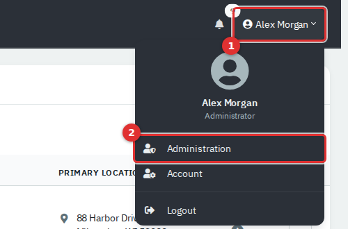

*Figure 1 — Open the user menu (1) and choose **Administration** (2). The entry is shown only to administrators.*

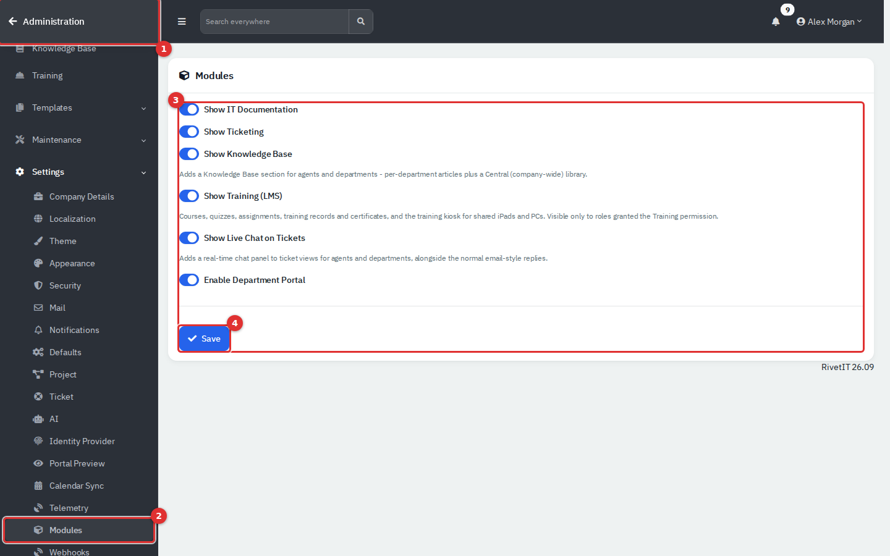

*Figure 2 — The Administration area, shown on the Modules page. (1) Return to the app. (2) The Settings group of the sidebar. (3) The module switches. (4) **Save**.*

The Administration sidebar has these groups:

| Group | What is inside | Covered in |
|---|---|---|
| **Access** | Users, Roles, API Keys, API Docs | Access guides |
| **Configuration → Tags & Categories** | Tags, Categories, Custom Links, AI Providers, People Import, Employee Workflow Templates | [13b](13b-administration-ticketing-and-automation.md); AI Providers below |
| **Ticketing** | Ticket Statuses, Labor Types, Mailboxes, Requests, Ticket Automation, SLA Policies, SLA Business Hours, Holidays | [13b](13b-administration-ticketing-and-automation.md); mail pages below |
| **Knowledge Base**, **Training** | Settings for those modules | Their own guides |
| **Templates** | Ticket, project, onboarding, document, worksheet, vendor, licence and contract templates; Service Catalog; Canned Responses | [13b](13b-administration-ticketing-and-automation.md) |
| **Maintenance** | Cron, Mail Queue, Email Log, Audit Logs, App Logs, Backup, Credential Restore, Debug, Update | Below (logs in their own guide) |
| **Settings** | Company Details, Localization, Theme, Appearance, Security, Mail, Notifications, Defaults, Project, Ticket, AI, Identity Provider, Portal Preview, Calendar Sync, Telemetry, Modules, Webhooks, Integrations | Below |

Two things to know. Custom links you create with location **Admin Nav** appear at the bottom of this sidebar. And the **Ticketing** group disappears when the Ticketing module is off, and the **Templates** group disappears when the IT Documentation module is off, even though ticket templates and canned responses live in it.

## Common tasks

### Turn modules on or off

1. Go to **Administration → Settings → Modules**.
2. Switch each module on or off.
3. Click **Save**. The change applies to everyone at once.

| Switch | What it turns on or off |
|---|---|
| **Show IT Documentation** | Agent sidebar: the **Infrastructure** group (Assets, Locations, Vendors, Licenses, Domains, Certificates) and Credentials, Printers and Network Drives under **Knowledge**. The same documentation pages in each department workspace. **Administration → Templates**. |
| **Show Ticketing** | Agent sidebar: the **Service Desk** group (Tickets, Recurring Tickets, Request Something, CSAT Ratings, Requests, Problems, Changes) and **Work → Projects**. **Administration → Ticketing**, **Settings → Project** and **Settings → Ticket**. |
| **Show Knowledge Base** | **Knowledge → Knowledge Base** for agents and departments (per-department articles plus a company-wide library). |
| **Show Training (LMS)** | The **Training** group: courses, quizzes, assignments, records, certificates and the kiosk. Visible only to roles granted the Training permission. This switch is offered only when the Training pages are installed. |
| **Show Live Chat on Tickets** | A real-time chat panel on ticket views for agents and departments. |
| **Enable Department Portal** | The employee portal, plus **Settings → Identity Provider** and **Portal Preview** in this area. |

A module switch hides menu entries; it does not delete data. Switching a module back on restores its pages and everything in them. Even with a switch on, an agent still needs the matching permission in their role to see the menu entry.

### Update company details

1. Go to **Settings → Company Details**.
2. Edit the name, address, phone, email, website and tax ID. Upload a logo (JPG or PNG) if you want one; it replaces the building icon at the top of the agent sidebar and appears on the employee portal. **Remove Logo** deletes it.
3. In **IT & Directory**, set the Microsoft/Entra Tenant ID, default email domain and the security and HR contact emails. These are used by directory sync and employee-lifecycle notifications once those are configured.
4. Click **Save**.

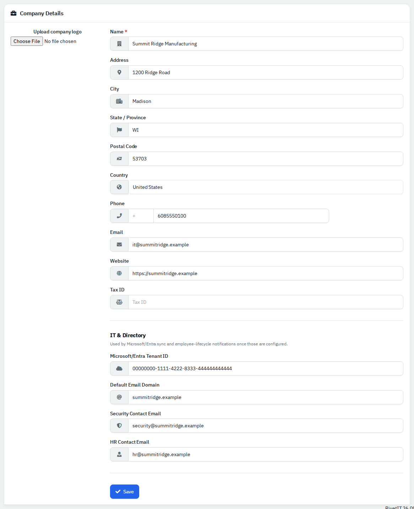

*Figure 3 — Company Details. The IT & Directory values shown here were typed in for the picture and not saved.*

The company country matters elsewhere: it sorts the holiday picker on SLA calendars.

### Set language, currency and time zone

Go to **Settings → Localization**. **Language** sets the locale used when the app formats numbers and currency, **Currency** the currency code, and **Timezone** the time zone the app uses for times. A second card, **Phone Numbers**, sets the default country code for new phone fields and can show a WhatsApp click-to-chat icon next to mobile numbers. Each card has its own **Save**.

### Change the look and start page

- **Settings → Appearance** sets the accent colour (fifteen presets or a custom hex code), the card corner radius (0 to 40 px) and whether dark mode is the company default. Individual users can still choose dark mode in their own preferences.
- **Settings → Theme** offers a second picker with an older list of seventeen colour names and a favicon upload (`.ico` file). Clicking a colour saves it immediately. It writes the same accent setting as Appearance, so whichever you save last wins. Use Appearance for everyday changes.
- **Settings → Defaults** sets the **Start Page** (where people land after sign-in: Dashboard, Department Management or Support Tickets) and the **Calendar** pre-selected on new calendar events. The other fields on that page belong to billing features this guide does not cover.

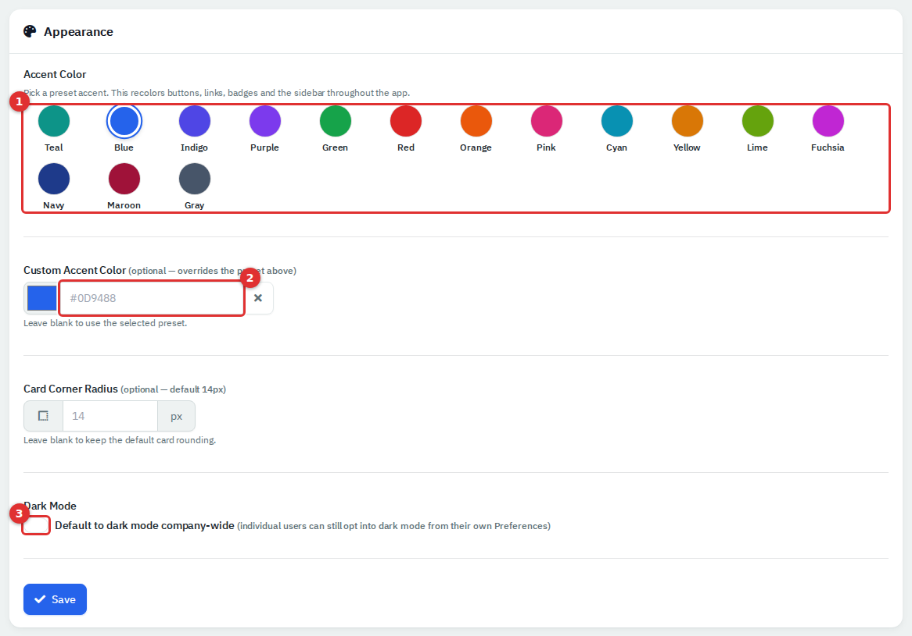

*Figure 4 — Appearance. (1) Preset accent colours. (2) A custom hex colour overrides the preset. (3) Company-wide dark mode default.*

### Choose which notifications go out

1. Go to **Settings → Notifications**.
2. Set the options you need, then click **Save Settings**.

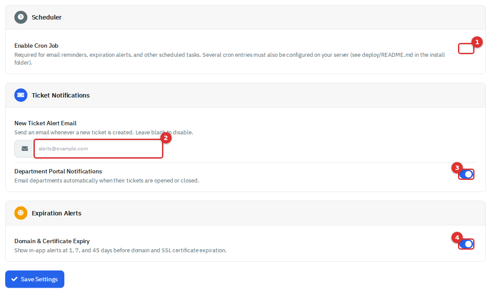

*Figure 5 — Notification Settings. (1) The scheduler switch. (2) Alert email for new tickets. (3) Emails to departments. (4) Expiry alerts. The Invoice and Quote cards that normally sit between (3) and (4) belong to billing features and are left out of the picture.*

| Setting | What it does |
|---|---|
| **Enable Cron Job** | Master switch for scheduled work: email reminders, expiry alerts, recurring tickets, ticket automation, automatic backups and sending queued email. Off by default. The server must also run the cron scripts (see [Keep scheduled jobs running](#keep-scheduled-jobs-running)). |
| **New Ticket Alert Email** | Emails this address whenever a ticket is created. Leave blank for none. Ticket Settings has the same field; both edit one setting. |
| **Department Portal Notifications** | Emails departments when their tickets are opened or closed. |
| **Domain & Certificate Expiry** | In-app alerts at 45, 7 and 1 days before a domain or certificate expires. |

The **Mobile App Push Notifications** card sends push messages to staff phones through a Firebase project. It shows numbered setup steps and needs a Firebase service-account key and staff signed in to the mobile app, so it depends on those outside pieces and is not exercised in this guide.

### Set up outgoing email

Nothing is emailed until a provider is chosen. Go to **Settings → Mail**.

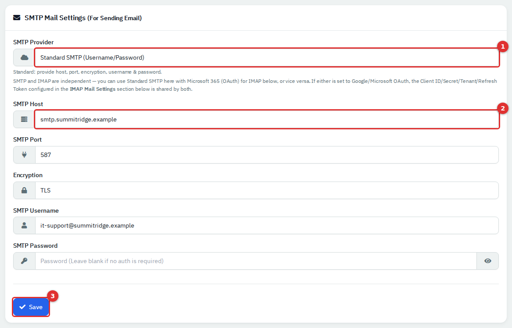

*Figure 6 — SMTP settings with example values. (1) **SMTP Provider**. (2) Host, port, encryption and credentials. (3) **Save**. The values are illustrative and not saved.*

1. In **SMTP Provider**, choose **Standard SMTP (Username/Password)**, **Google Workspace (OAuth)** or **Microsoft 365 (OAuth)**. **None (Disabled)** turns sending off.
2. For standard SMTP, fill in **SMTP Host**, **SMTP Port**, **Encryption** (None, TLS or SSL), **SMTP Username** and **SMTP Password**. Leave a saved password blank to keep it.
3. For OAuth, enter the Client ID, Client Secret, Tenant ID (Microsoft only) and refresh token in the OAuth block of the IMAP card below, which both cards share. For Microsoft 365, **Setup Guide** on that page walks through the Entra app registration.
4. Click **Save**.
5. Under **Mail From Configuration**, set the **System Default** and **Tickets** From email and name. Each From address must be allowed to send as the SMTP user.
6. When host, port and From details are filled in, a **Test Email Sending** card appears. Pick a From address, type a recipient and click **Send**.

The **IMAP Mail Settings** card is the older single-mailbox setup, superseded by Mailboxes; use Mailboxes instead. Every provider option depends on your mail service, which issues the values these fields ask for.

### Add a mailbox for email-to-ticket

Email-to-ticket needs a real mail server the app can reach. The demo has none, so these steps are described from the app rather than run.

1. Go to **Ticketing → Mailboxes** and click **Add Mailbox**.
2. Enter a **Mailbox Name**, **Email Address** and optional **From Name**.
3. Choose the **Mailbox Type**: **Standard IMAP** (host, port, encryption, username and password) or **Microsoft 365 (OAuth)**. Google Workspace is not offered for new mailboxes.
4. Tick **Queue unknown senders as Requests** if strangers' messages should wait for review. Leave it off and they stay unread in the mailbox.
5. Optionally pick a **Default Department** for senders that match no contact.
6. Click **Create**. For Microsoft 365, open the mailbox again with **Edit** and click **Connect Microsoft 365**.
7. In **Settings → Ticket**, switch on **Email-to-ticket parsing**.

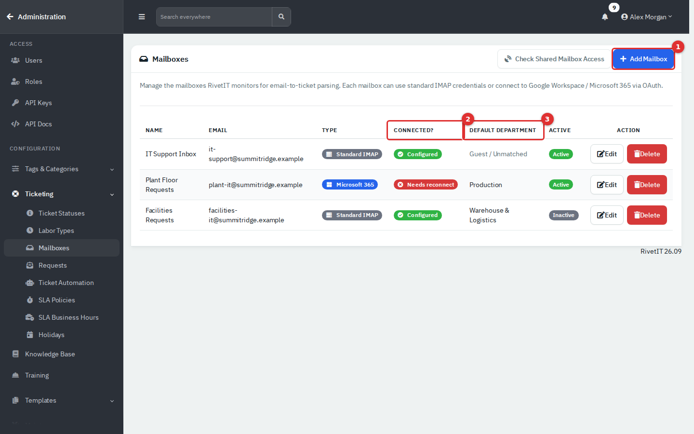

*Figure 7 — Mailboxes. (1) **Add Mailbox**. (2) **Connected?** shows Configured, Needs setup or Needs reconnect. (3) The default department for unmatched senders.*

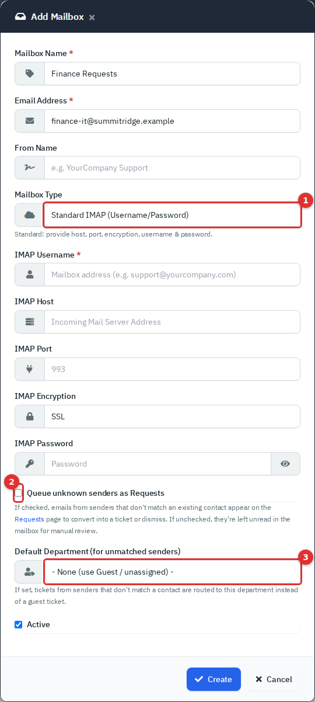

*Figure 8 — Add Mailbox. (1) Type. (2) Queue unknown senders as Requests. (3) Default department.*

**Check Shared Mailbox Access** tests addresses you believe you have Full Access to through a connected Microsoft 365 mailbox.

#### How incoming email becomes a ticket

The script `cron/ticket_email_parser.php` polls each active mailbox, reads unread messages and decides what each one is, in this order:

| Order | If the message... | Result |
|---|---|---|
| 1 | has a ticket tag in the subject such as `[TCK-123]` (your Ticket Prefix plus the number) | Added as a reply to that ticket |
| 2 | is from a known contact or registered domain and its subject is at least 95% similar to a ticket that department opened in the last 7 days and is unresolved | Added as a reply to that ticket |
| 3 | is from an email address on a person's record (People) | New ticket for that person |
| 4 | is from a domain registered under Domains | New ticket; the sender is added as a new person in that department |
| 5 | is from anyone else and the mailbox has **Queue unknown senders as Requests** on | Goes to **Requests** |
| 6 | looks like a bounce (sender contains daemon, postmaster, bounce or mta) | Raises an in-app notification, and is noted on the ticket if its subject has a tag |
| 7 | matches nothing else | Left unread in the mailbox |

Handled messages are moved to a top-level mailbox folder named `ITFlow`, a name kept from an earlier version. **Maintenance → Email Log** records the outcome of every message: Ticket Created, Reply Added, Queued as Request, Bounce (NDR) or Ignored.

### Review the mail queue

Outgoing email is queued first and sent by the script `cron/mail_queue.php`. Go to **Maintenance → Mail Queue** to see what is waiting.

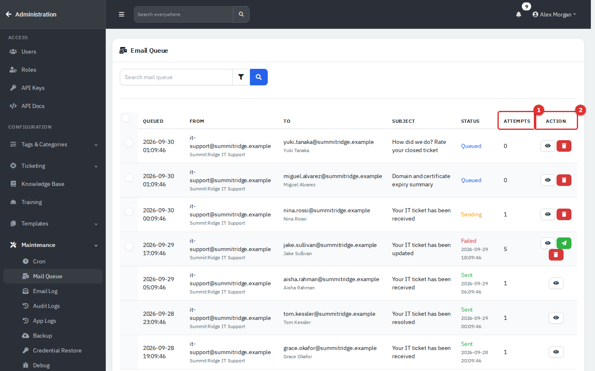

*Figure 9 — Email Queue. (1) Attempts. (2) Actions: view a message, force a resend, or cancel.*

| Status | Meaning |
|---|---|
| **Queued** | Waiting for the next run of the mail script |
| **Sending** | Being sent now |
| **Failed** | Could not be sent. After more than three attempts a green send icon appears; it queues the message for one more try |
| **Sent** | Delivered to the mail server |

The red trash button on a row cancels the message: it is marked Failed and never sent. It does not delete the row. Select rows with the checkboxes and use **Bulk Action** to cancel or truly **Delete** them. The scheduler removes queue rows older than 90 days.

### Review emails from unknown senders

**Ticketing → Requests** lists messages from senders that matched no contact or domain, for mailboxes with **Queue unknown senders as Requests** on. Agents also see this list under Service Desk.

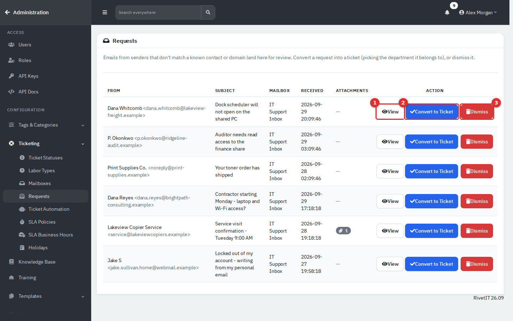

*Figure 10 — Requests. (1) **View** shows the message and attachments. (2) **Convert to Ticket** opens a ticket. (3) **Dismiss** removes the request.*

1. Click **View** to read it.
2. To act on it, click **Convert to Ticket**, choose the **Department** (the mailbox's default is pre-selected; **None** creates an unassigned guest ticket) and click **Create Ticket**. The sender is added as a person in that department if they are not already there.
3. To discard it, click **Dismiss**. This deletes the stored copy of the message and its attachments and cannot be undone.

### Keep scheduled jobs running

Ticket automation, recurring tickets, reminders, expiry alerts and automatic backups all depend on the scheduler:

1. Tick **Enable Cron Job** in **Settings → Notifications** and save.
2. Make sure the server runs `cron/cron.php` every few minutes. The bare-metal installer adds a five-minute entry for this script and the container image loops it every five minutes.
3. Add your own entries for `cron/mail_queue.php` (sends queued email) and `cron/ticket_email_parser.php` (reads mailboxes), every few minutes. The installers schedule only `cron/cron.php`; without the other two, no email is sent and none is read.

**Maintenance → Cron** shows the last successful run and lets you edit the schedule of `cron/cron.php` from a preset list (every 5 minutes up to daily) or a custom five-field expression, and start a run with **Run Now**. The page is written for one server layout: it reads and rewrites `/etc/cron.d/itflow` and runs the script from a fixed path. On an install made with the bundled installer (whose file is `/etc/cron.d/itflow-<domain>`), and on this demo, the job list reads "No jobs found" and the buttons may do nothing. Manage the schedule on the server in that case.

### Connect integrations, webhooks and AI

**Settings → Integrations** is the hub for outside systems. Each tab connects a different service and depends on that service being reachable, so this guide only introduces them.

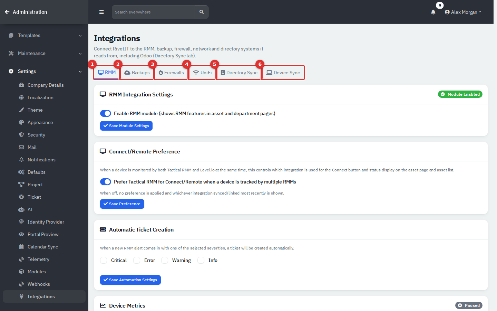

*Figure 11 — Integrations. (1) **RMM**: remote monitoring tools such as Tactical RMM, Level.io and Action1, with an on/off switch for the RMM module. (2) **Backups**: Comet Backup. (3) **Firewalls**: Sophos Central. (4) **UniFi**: network controllers. (5) **Directory Sync**: Microsoft 365 / Entra ID, Google Workspace and Odoo. (6) **Device Sync**: Intune.*

#### Webhooks

A webhook sends a message to another system's web address when something happens. Go to **Settings → Webhooks** and click **Add Webhook**.

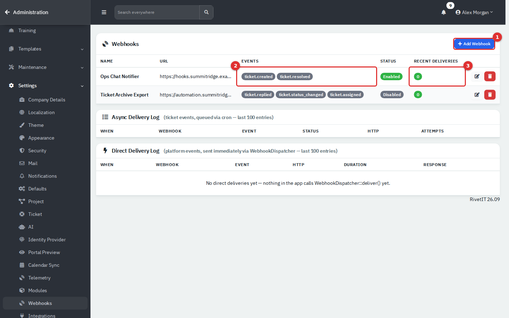

*Figure 12 — Webhooks. (1) **Add Webhook**. (2) The events each webhook listens for. (3) Deliveries in the last seven days: green delivered, amber pending, red failed.*

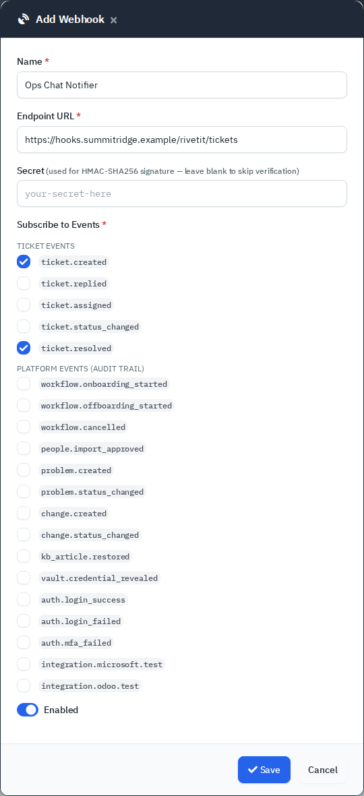

*Figure 13 — Add Webhook, with the two ticket events ticked. Nothing is saved until you click **Save**.*

1. Enter a **Name** and the **Endpoint URL**.
2. Optionally enter a **Secret**. When set, each request carries an HMAC-SHA256 signature of the body in the `X-RivetIT-Signature` header (`X-ITFlow-Signature` carries the same value for older receivers); leave it blank to skip signing.
3. Tick the events to send and leave **Enabled** on. Click **Save**.

Only the five **Ticket Events** are actually delivered: `ticket.created`, `ticket.replied`, `ticket.assigned`, `ticket.status_changed` and `ticket.resolved`. They are queued when agents or the API create, reply to, assign, change or resolve a ticket, then sent by the scheduler with up to five attempts and growing delays before being marked failed. The **Platform Events** group can be ticked, but nothing in the app sends them yet.

#### AI providers

**Settings → AI** has the company-wide **AI Features** switch, **Max Input Characters** (input beyond it is cut off) and **Request Timeout (seconds)**. **AI Providers** (under Tags & Categories) holds the connection.

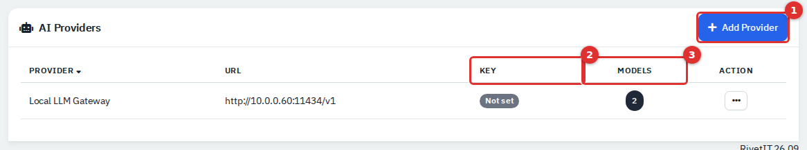

*Figure 14 — AI Providers. (1) **Add Provider**. (2) Whether an API key is stored. (3) How many models the provider has.*

1. Click **Add Provider**, enter a name, the base URL of an OpenAI-compatible API (the app adds `/chat/completions`) and the API key. Keys are stored encrypted and never shown again.
2. Open the models list (click the number in **Models**) and add a model: the provider, the model name, a **Use Case** (General, Tickets, Documentation or Reply Draft) and an optional prompt.

The app picks the model by use case and falls back to **General**, so one General model is enough. AI features send ticket or document text to the provider you configure. Choose a provider you are allowed to send that data to, or keep **AI Features** off.

#### Outlook calendar sync

**Settings → Calendar Sync** stores the Azure app credentials (Tenant ID, Application ID, Client Secret) and shows the Redirect URI to register in Azure. Once saved, users can connect their Outlook calendars from their own profile. It needs a Microsoft Entra app registration, so it depends on Microsoft 365.

#### Telemetry

**Settings → Telemetry** shows this installation's ID and the statement "RivetIT does not collect or send telemetry. Nothing about this installation is ever sent anywhere." (the feature came from ITFlow, whose optional telemetry service this fork does not use). There is nothing to configure or switch on.

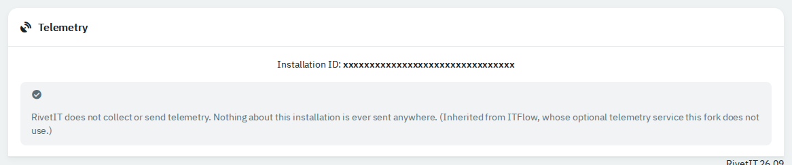

*Figure 15 — Telemetry. The installation ID is hidden in this picture: the app also uses it to sign calendar-feed links, so do not paste it into tickets or chat.*

### Back up RivetIT

Go to **Maintenance → Backup**.

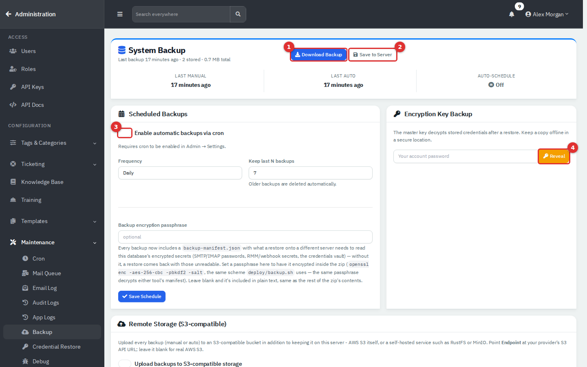

*Figure 16 — Backup. (1) **Download Backup**. (2) **Save to Server**. (3) Scheduled backups. (4) Reveal the encryption key. **Backup History** at the bottom lists stored backups with download and delete buttons.*

1. **Download Backup** builds a fresh zip and sends it to your browser without keeping a copy. **Save to Server** stores it in the server's `backups` folder, named `itflow_<timestamp>_manual.zip`.
2. Every zip holds `db.sql` (the database), `uploads.zip` (uploaded files), `version.txt` and a small manifest with what a restore onto a different server needs to read encrypted secrets.
3. For automatic backups, tick **Enable automatic backups via cron**, choose **Daily** or **Weekly (Sunday)**, set **Keep last N backups** (older ones are deleted) and click **Save Schedule**. This needs the scheduler (above). Automatic files end in `_auto.zip`.
4. Optionally set a **Backup encryption passphrase**. It encrypts only the manifest inside the zip; the rest of the zip is not encrypted, so store backups securely.
5. To also send every backup to S3-compatible storage (AWS S3, MinIO, RustFS), fill in **Remote Storage**: endpoint (blank for AWS), region, bucket, access key, secret key, optional prefix and **Path-style addressing**, then **Save Remote Storage** and **Test Connection**.
6. Under **Encryption Key Backup**, enter your own password and click **Reveal** to see the master key that decrypts stored credentials after a restore. Keep a copy offline. Revealing it is written to the audit log and raises an in-app notification.

Restoring is not done on this page. A backup zip is restored from the setup wizard's **Restore from Backup** step or with `deploy/restore_zip.sh` on the server (see `docs/DEPLOYMENT.md`, section 4.1). A restore replaces the whole database and uploads folder.

### Update RivetIT

Go to **Maintenance → Update**. The page shows the RivetIT version, release tag, latest release and database version, and compares your checkout with its `fork` git remote.

1. Take a backup first. The page warns you in red whenever an update is available.
2. If new code is available, click **Update App**; it runs `git pull`. **FORCE Update App** fetches and hard-resets to the remote and discards local changes to the code.
3. If the app files are newer than the database, an **Update Database** button appears. It runs the built-in database migration (`admin/database_updates.php`), which applies each schema change from your database version to the latest. There is no separate database-updates page.

The update check needs Git and a reachable remote. Without them (as on this demo) the page shows "Could not find execute 'git fetch'" and only the version numbers. Container installs are updated as described in `docs/DEPLOYMENT.md`.

## Reference

Scheduled scripts the server needs:

| Script | Does | Runs only when | Added by the installers |
|---|---|---|---|
| `cron/cron.php` | Reminders, expiry alerts, recurring tickets, auto-close, ticket automation, automatic backups, webhook delivery, clean-up | **Enable Cron Job** is on | Yes, every 5 minutes |
| `cron/mail_queue.php` | Sends queued email | **Enable Cron Job** is on and an SMTP provider is set | No |
| `cron/ticket_email_parser.php` | Reads mailboxes and creates tickets and requests | **Email-to-ticket parsing** is on | No |

## Tips and good practice

- Turn on **Enable Cron Job** early. Missing emails, reminders and recurring tickets usually mean the scheduler is off.
- Send a test email as soon as SMTP is saved, and watch **Mail Queue** for failures.
- Test a restore on a spare machine; an untested backup is unproven.
- Keep an offline copy of the master key, or restored credentials cannot be read.
- Never paste API keys, secrets or the installation ID into tickets or screenshots.
- Switching a module off hides its pages from everyone; tell your team first.

## Related guides

- [Administration: Ticketing, Automation and Organising Data](13b-administration-ticketing-and-automation.md)
- [Service Desk](03-service-desk.md)
