# Administration: Ticketing, Automation and Organising Data

This page covers the Administration pages that shape how the service desk behaves (ticket settings, statuses, SLAs, templates, canned responses, the request catalog and automation rules) and the lists agents pick from (categories, tags, custom links, holidays). System-wide settings, mail, integrations and backups are in [Administration: System Settings, Mail, Integrations and Maintenance](13-administration-settings.md).

| | |
|---|---|
| **Where to find it** | Click your name at the top right → **Administration**, then **Ticketing**, **Templates**, **Tags & Categories** or **Settings → Ticket** in the sidebar. |
| **Who can use it** | Administrators only (a role flagged Administrator). Other users get a "You don't have access to this page" message. |
| **Turn it on** | The **Ticketing** group and **Settings → Ticket** need **Show Ticketing** on. The **Templates** group needs **Show IT Documentation** on (Settings → Modules). |

## What it's for

- Decide how tickets are numbered, assigned, closed and rated.
- Define response and resolution targets (SLAs) that follow business hours.
- Save time with ticket templates, canned replies and a one-click request catalog.
- Let rules act on tickets automatically.
- Keep the categories, tags, links and holidays that agents choose from tidy.

## A quick tour

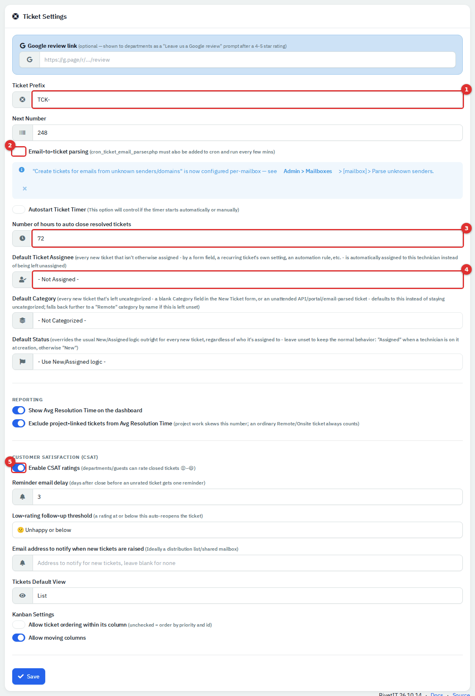

*Figure 1 — Ticket Settings. (1) Ticket Prefix. (2) Email-to-ticket parsing. (3) Hours before resolved tickets close. (4) Default Ticket Assignee. (5) CSAT ratings.*

| Page | Sidebar path | Use it to |
|---|---|---|
| Ticket Settings | Settings → Ticket | Numbering, defaults, auto-close, CSAT, kanban |
| Ticket Statuses | Ticketing → Ticket Statuses | Add your own statuses |
| SLA Business Hours, SLA Policies | Ticketing | Calendars and response/resolution targets |
| Holidays | Ticketing → Holidays | The list of holidays SLA calendars pick from |
| Ticket Automation | Ticketing → Ticket Automation | Rules that act on tickets |
| Ticket Templates, Canned Responses, Service Catalog | Templates | Faster ticket entry and replies |
| Tags, Categories, Custom Links | Tags & Categories | Lists agents choose from |
| Mailboxes, Requests | Ticketing | Email-to-ticket (see the other page) |

## Common tasks

### Set ticket numbering, defaults and ratings

1. Go to **Settings → Ticket**, change what you need and click **Save**.

| Field | What it does |
|---|---|
| **Ticket Prefix** | Letters and hyphens put in front of every ticket number (for example `TCK-`). Email replies are matched by this tag. |
| **Next Number** | The number the next ticket gets. It can only be raised, not lowered. |
| **Email-to-ticket parsing** | Lets the mail script read mailboxes. Needs a mailbox and a scheduled `cron/ticket_email_parser.php` (see the other page). |
| **Autostart Ticket Timer** | Chooses whether the ticket timer starts automatically or is started by hand. |
| **Number of hours to auto close resolved tickets** | After this many hours (minimum 24) a Resolved ticket becomes Closed. Needs the scheduler. |
| **Default Ticket Assignee** | Technician given every new ticket that nobody else assigned. |
| **Default Category** | Category given to tickets created without one. |
| **Default Status** | Starting status for every new ticket. Left unset, a new ticket starts as **New**, or as a status named exactly **Assigned** if one exists and a technician is already on the ticket. The built-in set has no such status. |
| **Reporting** switches | Show the average resolution time on the dashboard, and leave project tickets out of it. |
| **Enable CSAT ratings** | Departments and guests can rate closed tickets. **Reminder email delay** sends one reminder after that many days; **Low-rating follow-up threshold** reopens a ticket rated at or below the chosen face. |
| **Email address to notify when new tickets are raised** | Same setting as **New Ticket Alert Email** under Notifications. |
| **Tickets Default View** | List, Compact or Kanban. Two kanban switches allow ordering inside a column and moving between columns. |

### Add a ticket status

Five built-in statuses always exist: **New**, **Open**, **On Hold**, **Resolved** and **Closed**. You can add your own.

1. Go to **Ticketing → Ticket Statuses** and click **New Ticket Status**.
2. Enter a **Name** and pick a **Color**. Click **Create**.
3. To change one later, open the row's actions menu (**...**) and click **Edit**. You can change the color, the **Order** and whether it is **Active**.

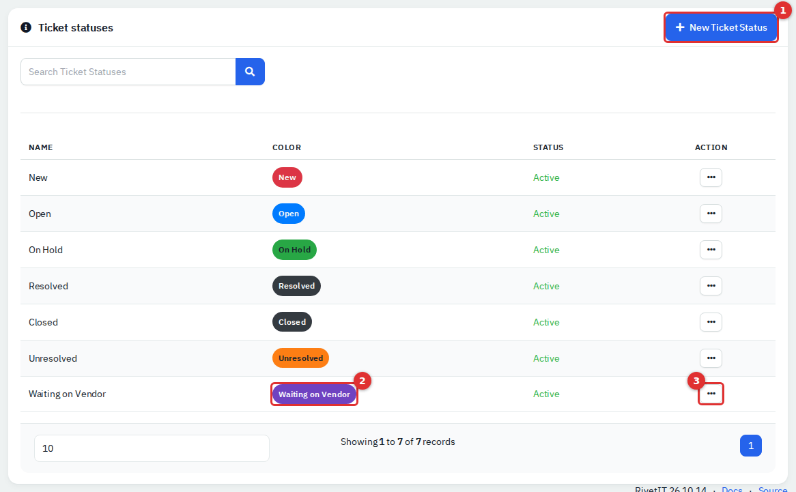

*Figure 2 — Ticket statuses. (1) **New Ticket Status**. (2) A custom status, shown as agents will see it. (3) The actions menu.*

Built-in statuses cannot be renamed, deactivated or deleted. A custom status can be deleted only after it is made inactive; the **Delete** entry then appears in its menu.

### Set up SLA targets

An SLA here is a pair of due times on each ticket: a **response** target and a **resolution** target, counted in minutes of business time. Set it up in three steps.

**1. A business-hours calendar.** Go to **Ticketing → SLA Business Hours** and click **New Calendar**. Enter a name and time zone; the calendar starts as Monday to Friday, 09:00 to 17:00. Open it to tick the open days, set open and close times, and manage holidays. A calendar with no open days counts as 24/7.

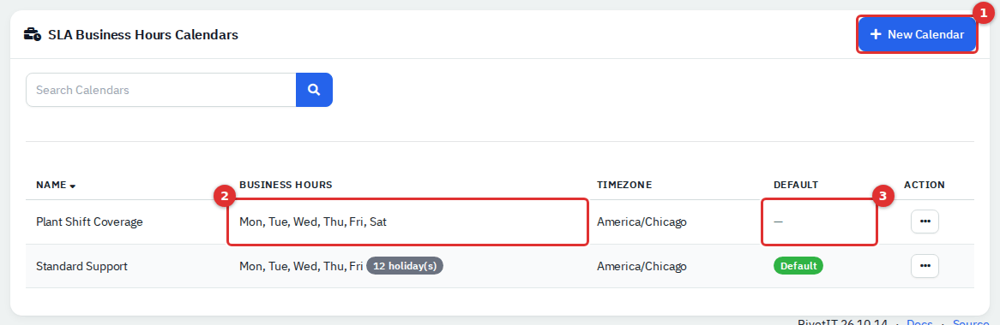

*Figure 3 — Calendars. (1) **New Calendar**. (2) The open days, with a holiday count. (3) The default calendar. Use the actions menu to set another default or delete.*

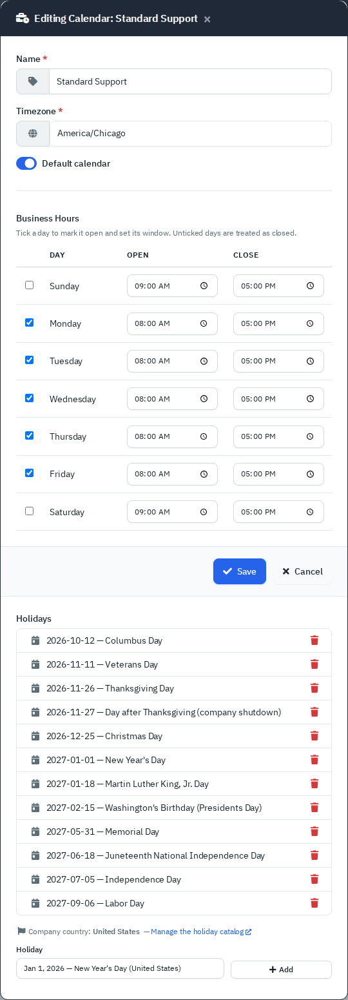

*Figure 4 — Editing a calendar: days and hours at the top, holidays below. Pick a holiday from the catalog in the **Holiday** list and click **Add**, or choose **Enter a custom holiday**.*

Holidays you add to a calendar are copied in, so later edits to the catalog do not change calendars. The default calendar cannot be deleted; deleting any other calendar switches its policies to 24/7.

**2. A policy.** Go to **Ticketing → SLA Policies** and click **New Policy**. Choose the calendar, the **Pause Statuses**, and the response and resolution minutes for **Low**, **Medium** and **High** priority. Turn on **Default policy** for the one that should apply to everyone.

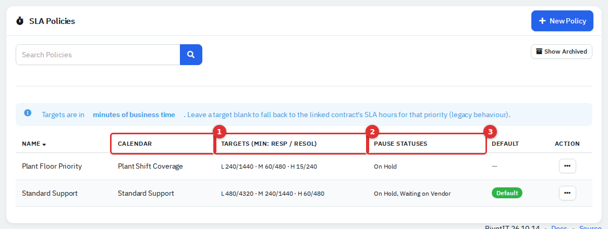

*Figure 5 — Policies. (1) The calendar each policy counts on. (2) Targets shown as response/resolution minutes per priority (L, M, H). (3) Statuses that pause the clock.*

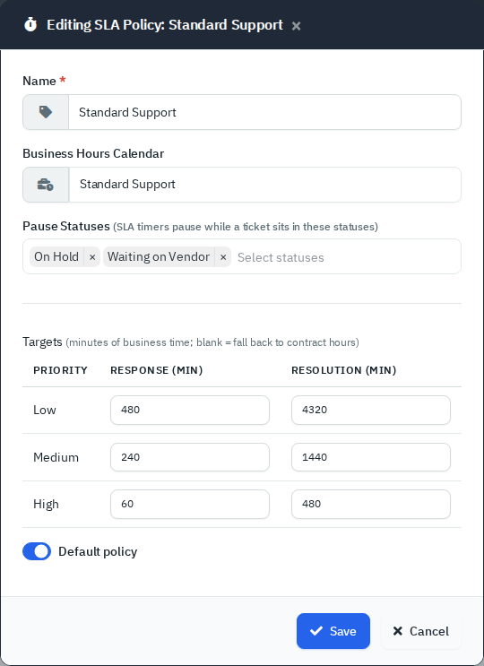

*Figure 6 — Editing a policy. Leaving a target blank means no policy target for that priority.*

**3. Watch it on tickets.** A ticket gets its due dates when it is created and again when its subject, category or priority changes. Its **SLA** panel then shows Response and Resolution meters: a countdown, **Paused**, **Outside hours**, **Met** or **Breached**, with the bar turning amber at 75% and red at 90%. The clock pauses while the ticket sits in a pause status.

Good to know:

- A ticket keeps the policy it was given. Changing the default later affects new tickets only, and archiving a policy makes its tickets fall back to the default.
- Tickets created before any policy existed have no due dates until they are next recalculated.
- Priorities other than Low and Medium use the High targets. Policies are archived, not deleted; **Show Archived** lists them and **Unarchive** restores one.
- Rules can act on SLAs too (see below), using breached and percent-consumed conditions.

### Create a ticket template

A ticket template pre-fills the New Ticket form and adds a checklist of tasks.

1. Go to **Templates → Ticket Templates** and click **New Ticket Template**.
2. Enter the **Template Name**, **Subject**, the details text and a short **Description**. To include it in a project template, pick one under **Add it to a Project Template?**. Click **Create Template**.
3. Click the template's name to open it. Type a task in **Create a task** and click the tick; drag the handle to reorder tasks; use the task's menu to edit or delete.

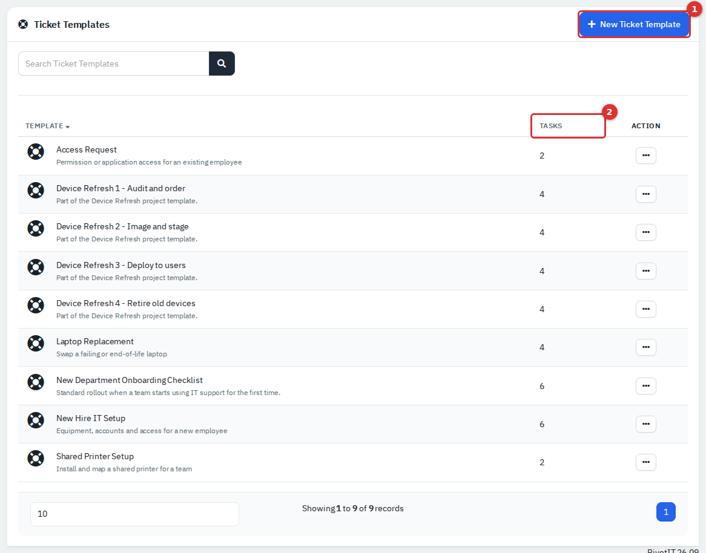

*Figure 7 — Ticket templates. (1) **New Ticket Template**. (2) The number of tasks in each.*

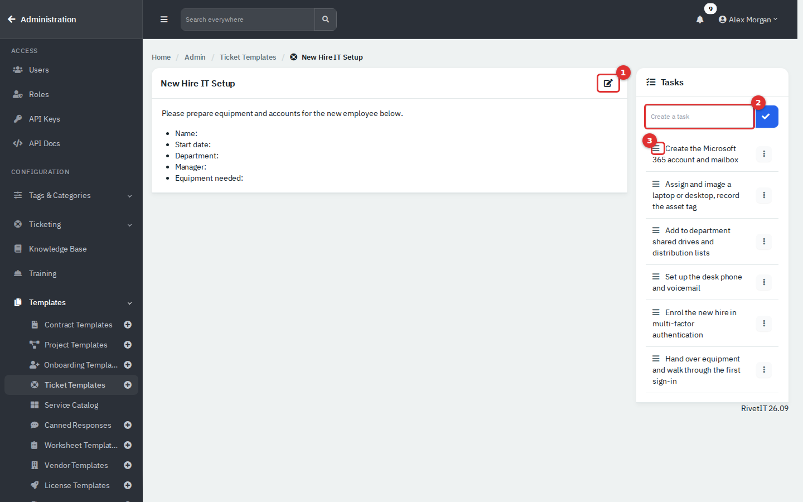

*Figure 8 — A template. (1) Edit its name, subject and details. (2) Add a task. (3) Drag to reorder.*

Agents use a template from the **Template** list on the New Ticket form: it fills the subject and details, and the template's tasks are added to the new ticket. The subject is used as typed, with no merge fields. **Delete** on the list removes the template and its tasks permanently.

### Add a canned response

1. Go to **Templates → Canned Responses** and click **New Canned Response**.
2. Enter a **Name** and the **Message** (formatted text) and click **Create Canned Response**.

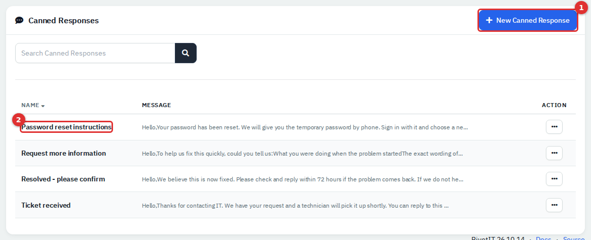

*Figure 9 — Canned responses. (1) **New Canned Response**. (2) Click a name to edit it.*

On a ticket, agents click **Insert Canned Response** above the reply box and pick one; its text lands in the reply for them to edit before sending. Deleting a canned response is permanent.

### Build the Request Something catalog

Catalog items are tiles agents (and departments on the portal) click to start a ticket.

1. Go to **Templates → Service Catalog** and click **New Catalog Item**.
2. Enter the **Name**, a **Description** shown on the tile, an **Icon** (a Font Awesome class such as `fa-laptop`) and a **Sort Order**.
3. Enter the **Ticket Subject** (used as typed), a **Ticket Category** and a **Default Priority** (Low, Medium or High).
4. Leave **Active** on to show the tile. Click **Create**.

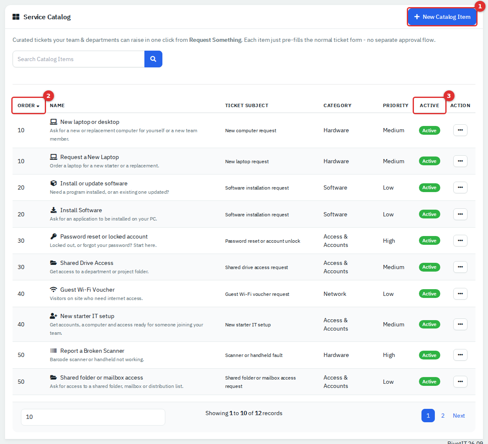

*Figure 10 — Service catalog. (1) **New Catalog Item**. (2) Order controls tile position. (3) Inactive items are hidden.*

In an item's menu, **Deactivate** hides it without deleting; **Delete** is permanent. For agents a tile opens **New Ticket** with subject, category and priority filled in. The employee portal lists the same tiles under **Request Something**, but its ticket form does not read those values yet, so an employee gets the normal blank form.

### Automate tickets with rules

Go to **Ticketing → Ticket Automation**. Each rule has a trigger, conditions that must all match, and actions that run in order.

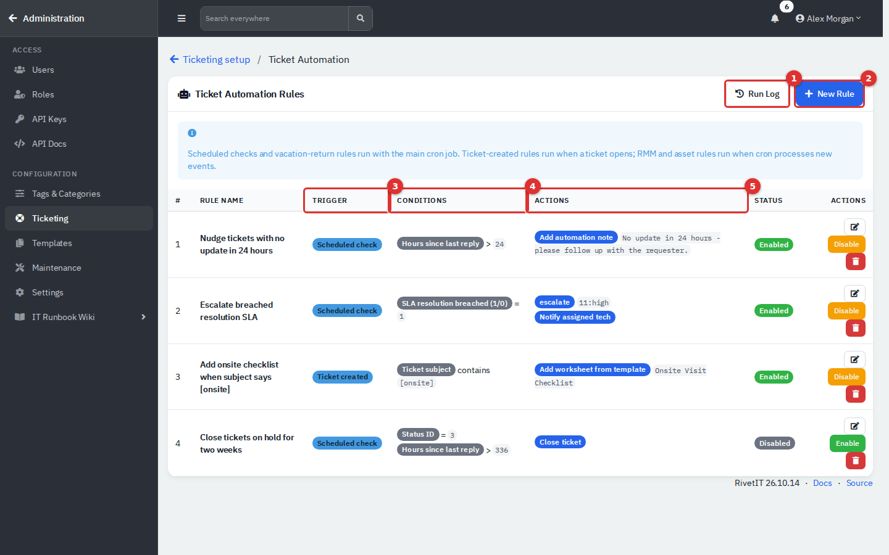

*Figure 11 — Rules. (1) **Run Log**. (2) **New Rule**. (3) Trigger. (4) Conditions. (5) Actions. **Disable**, **Enable** and the bin sit at the right; the pencil edits.*

1. Click **New Rule** and enter a **Rule Name**.
2. Pick a **Trigger** (table below). The condition choices change with it.
3. Set conditions: a field, an operator (equals, not equals, greater than, less than, contains) and a value. Use **Add condition** for more. A rule needs at least one condition, except **Ticket created** and **Requester returns from vacation**, where none means every eligible ticket.
4. Set the actions; use **Add action** for more.
5. Set **Order** (lower runs first) and click **Save Rule**. Rows with an empty value are dropped.

For a **Scheduled check**, turn on **Run once per ticket** when you want the rule to stop after its first successful action on each matching ticket. Leave it off to keep checking on every cron pass. Notes and AI triage already avoid duplicate actions on the same ticket.

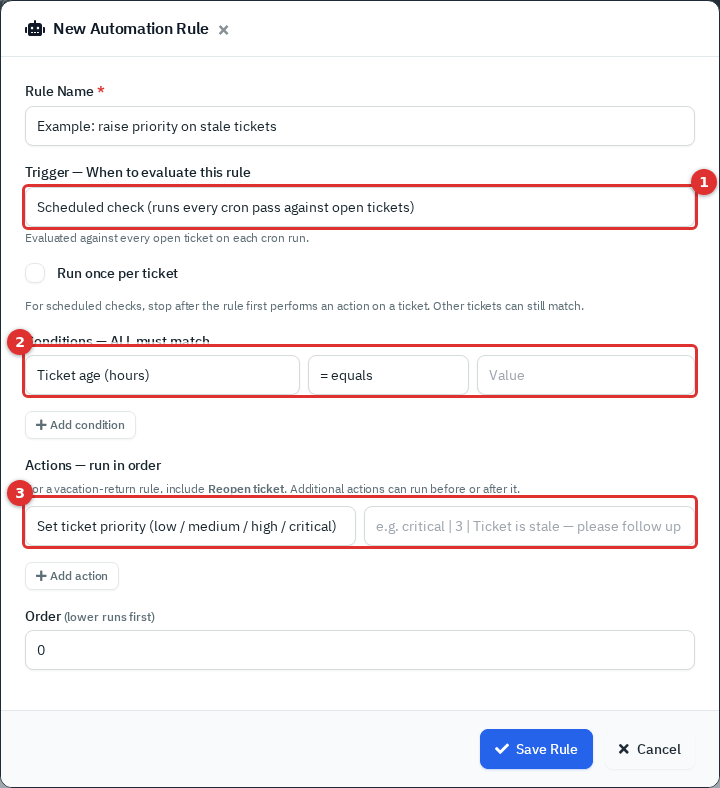

*Figure 12 — New rule. (1) Trigger. (2) Conditions, all of which must match. (3) Actions, run in order.*

| Trigger | When it runs | Example conditions |
|---|---|---|
| **Scheduled check** | Every scheduler pass, against every open ticket | Ticket age (hours), Hours since last reply, Priority, Status ID, Assigned to (user ID), Ticket category, SLA response or resolution breached (1/0), SLA % consumed |
| **Ticket created** | Immediately, once, as each ticket is created by an agent, email, portal, API or alert | Priority, Ticket category, Department ID, Ticket subject or body (contains) |
| **Requester returns from vacation** | On a cron pass after the requester's recorded vacation ends, for tickets closed during that vacation and after the rule was created | Priority, Ticket category, Department ID, Assigned to, Ticket subject |
| **New RMM alert**, **Asset goes offline**, **Asset comes back online** | When the RMM integration reports one | Severity, message, asset, department, hostname |

The last group needs an RMM integration. The main actions are: set priority, assign to a user ID, escalate (reassign and raise priority as `userID:priority`), set status ID, add an automation note, notify the assigned technician, close the ticket and add a worksheet from a template. AI triage posts a suggested category, priority and assignee as a note, and needs an AI provider.

To reopen tickets after vacation, enter both dates on the employee's contact record, then create a **Requester returns from vacation** rule with the **Reopen ticket** action. The dates include the first and last day away. The rule runs once per eligible closed ticket after the end date. Tickets already closed before the rule was created, archived or merged tickets, and tickets with a separate scheduled reopen are left alone.

Things to know:

- Rules ask for numeric IDs. Built-in status IDs are 1 New, 2 Open, 3 On Hold, 4 Resolved, 5 Closed; custom statuses follow in the order created. Hover a user's name in **Users** to see their **UserID**.
- Scheduled rules re-check every open ticket on every pass. Adding a note or AI triage happens once per rule and ticket; other actions are simply re-applied.
- Rules only run when **Enable Cron Job** is on and the server runs `cron/cron.php` (see the other page). **Ticket created** rules run at once without waiting.
- The **Run Log** lists each time a rule acted: time, rule, trigger, department, ticket or asset, and what it did. Deleting a rule does not erase its earlier log lines.

### Organise categories, tags and links

**Ticket categories.** Go to **Tags & Categories → Categories**. The page opens on the **Expense** tab (a billing list); click **Ticket** to manage ticket categories. A category at the top level is a **Group**; give a category a Group and it becomes a child, shown as "Group / Name". In pick lists, a group with children becomes a heading and only its children can be chosen; a group with no children is chosen itself. **Archive** hides a category; the **Archived** tab offers **Restore** and permanent **Delete**. The other tabs are option lists other modules use: Network Interface, Asset Status, Software Type, Rack Type and Contact Note Type.

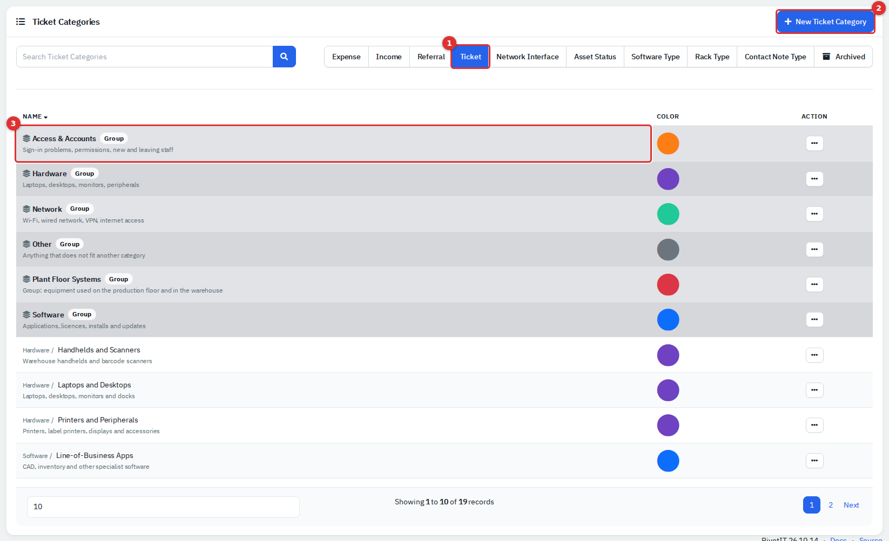

*Figure 13 — Ticket categories, shown on a wide screen because the tab row overlaps the search box at 1440 px. (1) The **Ticket** tab. (2) **New Ticket Category** (group, name, color, description). (3) A group; children appear beneath.*

**Tags.** Go to **Tags & Categories → Tags**. Tags come in six types: Department, Location, Contact, Credential, Asset and Ticket. Use the buttons above the list to switch type, then **New ... Tag** for a name, color and icon (a Font Awesome name without the `fa-` prefix, such as `star`). A tag's type is fixed when created. Deleting a tag is permanent.

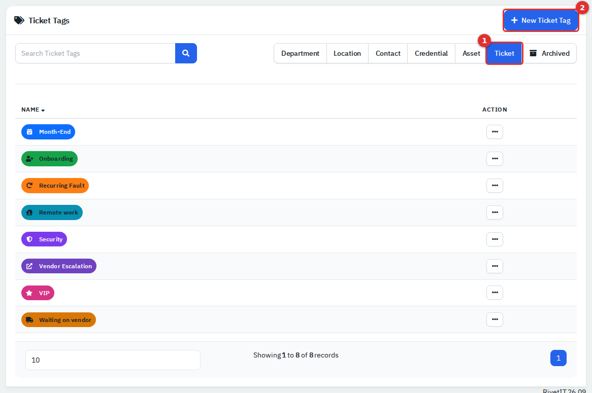

*Figure 14 — Ticket tags. (1) The **Ticket** type. (2) **New Ticket Tag**.*

**Custom links.** Go to **Tags & Categories → Custom Links** and click **New Link**. Enter a name, order, the address (tick the box beside it to open a new tab) and an icon name. **Location** decides where the link appears.

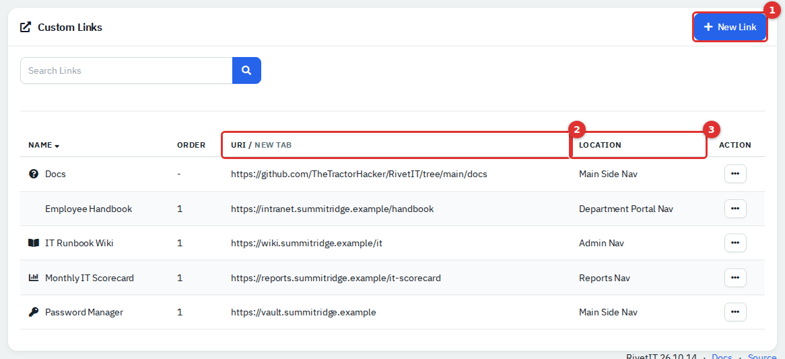

*Figure 15 — Custom links. (1) **New Link**. (2) Address and new-tab flag. (3) Where each link shows.*

| Location | Where it appears |
|---|---|
| **Main Side Nav** | Bottom of the agent sidebar |
| **Top Nav (Icon Required)** | Icon in the top bar |
| **Department Portal Nav** | Employee portal menu |
| **Admin Nav** | Bottom of the Administration sidebar |
| **Reports Nav** | Reports sidebar |

**Holidays.** Go to **Ticketing → Holidays**, the catalog SLA calendars pick from. **Load Holidays** generates public holidays for the United States, United Kingdom, Canada or Australia for a range of up to ten years and skips dates already present. Its arrow menu has **Custom Holiday** for your own dates. Filter by country and year, and bulk-delete with the checkboxes. Nothing in the catalog affects an SLA until you add it to a calendar.

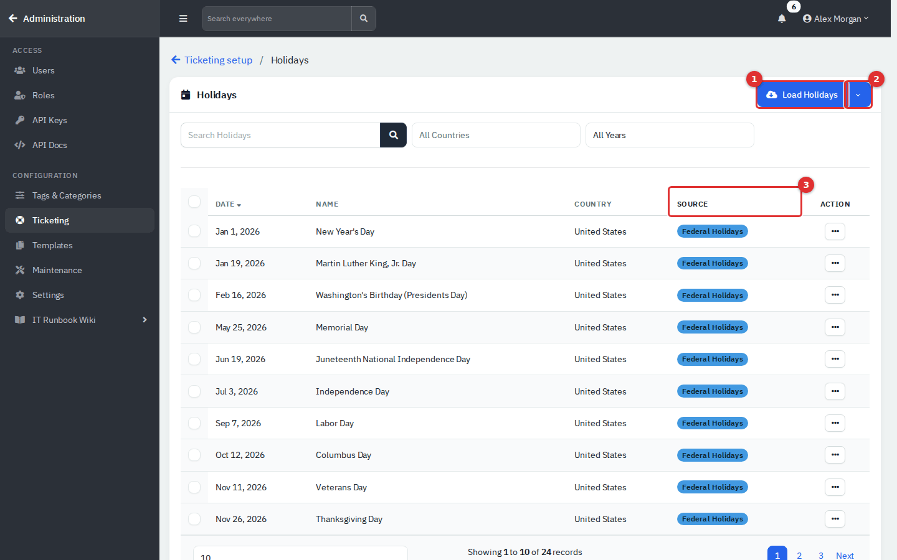

*Figure 16 — Holidays. (1) **Load Holidays**. (2) **Custom Holiday**. (3) Built-in entries show the country's term; your own show **Custom**.*

**Custom fields.** There is no sidebar entry. Type "custom field" into the top search bar and open the **Custom Fields** result under Settings. You can define **Text** fields for **Assets** or **Departments**. In this version the definitions are stored but no asset or department page shows or saves values for them, so they have no visible effect yet.

### Other templates

Most are under **Templates**, and most have a plus icon beside them in the sidebar for creating a new one.

| Template | What it is for |
|---|---|
| **Project Templates** | Reusable project plans made of ticket templates and tasks; chosen when creating a project. |
| **Onboarding Templates** | A project template marked for onboarding a new department: a checklist of tasks, with an optional contract. |
| **Worksheet Templates** | Forms a technician fills in on a ticket's **Worksheets** panel. Fields can be text, text area, checkbox, dropdown (options one per line), signature or heading; drag to reorder; mark required. Rules can attach one automatically. |
| **Document Templates** | Starting text for a new document in a department's documentation. |
| **Vendor Templates**, **License Templates** | Pre-filled vendors and licences; the vendor and licence lists can create a record from one. |
| **Contract Templates** | Preset contract terms for a department's contracts, applied to departments with **Apply to Departments**. |
| **Employee Workflow Templates** (under Tags & Categories) | Onboarding and offboarding checklists started from a person's page, with dependencies, due dates, approvals and automated tasks ([details](../EMPLOYEE-LIFECYCLE-WORKFLOWS.md)). |

## Reference

| Ticket priority | Used by |
|---|---|
| Low, Medium, High | New Ticket form, catalog items, SLA targets (anything else uses High) |

| SLA meter | Meaning |
|---|---|
| Countdown ("in 2h 15m") | Running inside business hours |
| **Paused** | Ticket is in a pause status |
| **Outside hours** | Clock is not counting because the calendar is closed |
| **Met** / **Breached** | Target reached in time / missed |

## Tips and good practice

- Start with one calendar and one default policy; add a second only when a team truly needs different hours.
- Set the **Default Category** and **Default Assignee** so nothing lands unsorted.
- Name templates by task ("Laptop Replacement"), not by team, so agents find them.
- Test a new automation rule with **Ticket created** and a narrow condition before broadening it, and check the **Run Log**.
- Archive rather than delete when a category or policy is retired, so history stays readable.

## Related guides

- [Administration: System Settings, Mail, Integrations and Maintenance](13-administration-settings.md)
- [Service Desk](03-service-desk.md)
