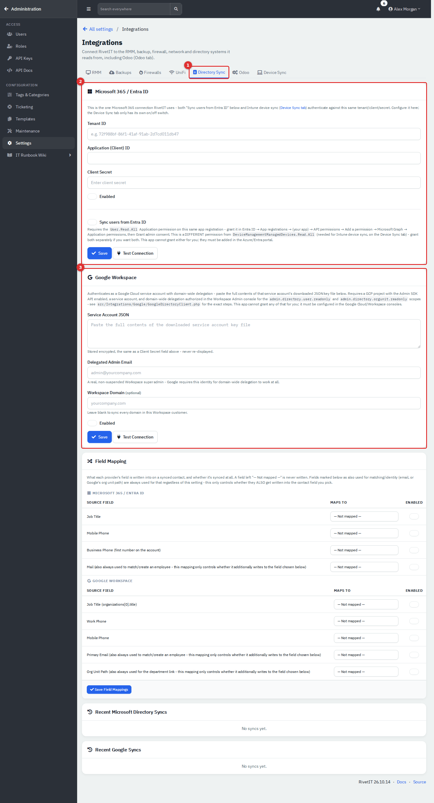
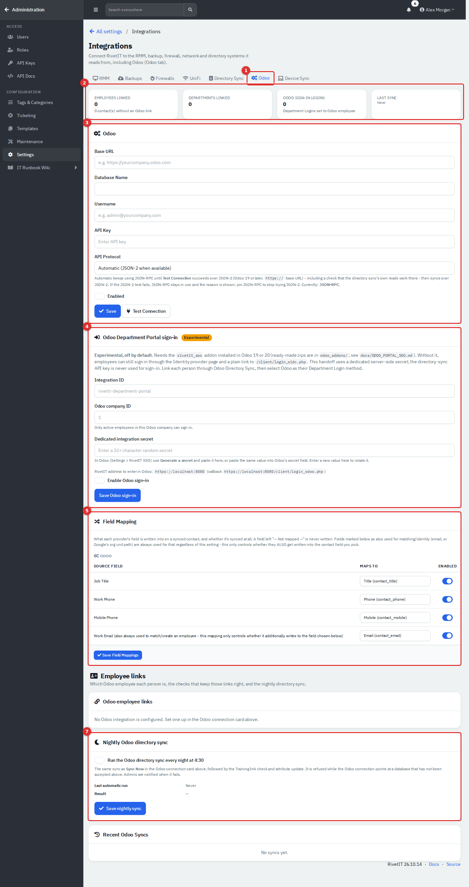

# Administration: Integrations, Webhooks and AI

This page covers the Administration pages that connect RivetIT to outside systems: the Integrations hub (RMM, backups, firewalls, UniFi, directory sync, Odoo and Intune), webhooks, AI providers, Outlook calendar sync and the Telemetry page. Company details, mail, scheduled jobs, backups and updates are in [Administration: System Settings, Mail and Maintenance](13-administration-settings.md).

| | |
|---|---|
| **Where to find it** | Click your name at the top right → **Administration**, then **Settings** in the sidebar and the **Integrations**, **Webhooks**, **AI**, **Calendar sync** or **Telemetry** tile. **AI** is also reached from **Tags & Categories → AI settings**. |
| **Who can use it** | Administrators only (a role flagged Administrator). |
| **Turn it on** | Nothing to enable for the pages themselves. Each integration needs its outside service, and the RMM tab has its own module switch. |

## What it's for

- Pull people and departments from Microsoft 365, Google Workspace or Odoo.
- Connect monitoring, backup, firewall, network and device tools.
- Send ticket events to other systems with webhooks.
- Connect an AI provider for ticket and document features.

## Common tasks

### Connect integrations

**Settings → Integrations** is the hub for outside systems. Each tab connects a different service and depends on that service being reachable, so this guide only introduces them.

*Figure 1 — Integrations. (1) **RMM**: remote monitoring tools such as Tactical RMM, Level.io and Action1, with an on/off switch for the RMM module. (2) **Backups**: Comet Backup. (3) **Firewalls**: Sophos Central. (4) **UniFi**: network controllers. (5) **Directory Sync**: Microsoft 365 / Entra ID and Google Workspace. (6) **Odoo**. (7) **Device Sync**: Intune.*

**Directory Sync** now covers Microsoft 365 / Entra ID and Google Workspace only. The Microsoft card holds the tenant, client ID and secret that Intune device sync shares, and a **Sync users from Entra ID** switch. The Google card takes a service-account key, a delegated admin email and an optional workspace domain. Each has **Save** and **Test Connection**, and **Sync Now** appears once the provider is enabled. **Field Mapping** below decides which provider fields are written into contact fields, and **Recent Microsoft Directory Syncs** and **Recent Google Syncs** log the last runs.

*Figure 2 — Directory Sync. (1) The tab. (2) Microsoft 365 / Entra ID. (3) Google Workspace. Below them are the field mapping and the sync logs. The demo has neither provider connected.*

The **Odoo** tab connects the company's Odoo server as a source of people and departments. From the top:

*Figure 3 — The Odoo tab on an installation with no Odoo connection. (1) The tab. (2) Summary tiles. (3) The connection. (4) Department Portal sign-in. (5) Field mapping. (6) Employee links. (7) The nightly sync.*

- **Summary tiles** count linked employees, linked departments, Odoo sign-in logins and the last sync.
- **Odoo** (connection) takes the **Base URL**, **Database Name**, **Username** and an **API Key**, plus **API Protocol**: **Automatic** switches to the newer JSON-2 interface once **Test Connection** succeeds over it (Odoo 19 or later, an `https://` address), otherwise JSON-RPC stays in use; the other choice pins JSON-RPC. Tick **Enabled**, **Save**, **Test Connection**, then **Sync Now**.
- **Odoo Department Portal sign-in** (off by default) lets employees sign in through an Odoo addon; see `docs/ODOO_PORTAL_SSO.md`. Without it, employees can still sign in with the methods set on the **Identity provider** page (see [12](12-administration-users-and-security.md)).
- **Field Mapping** chooses which Odoo fields (job title, phones, work email) are also written into the contact.
- **Employee links** shows which Odoo employee each person is. **Check now** compares every link with Odoo and flags names that changed, links that were re-pointed and employees missing in Odoo; you **Confirm**, **Relink**, **Unlink** or mark **No Odoo record**, one at a time or in bulk with the checkboxes. If the connection points at a different Odoo database, directory sync stays blocked until the links check out or you type **ACCEPT** with a reason. The training chapters use these links for Odoo sign-in at the kiosk.
- **Nightly Odoo directory sync** runs the same sync every night at 4:30 followed by the link check, and tells administrators when it fails. **Recent Odoo Syncs** lists the last five runs.

The Odoo tab depends on a reachable Odoo server and is not exercised in this guide beyond the empty state.

### Webhooks

A webhook sends a message to another system's web address when something happens. Go to **Settings → Webhooks** and click **Add Webhook**.

*Figure 4 — Webhooks. (1) **Add Webhook**. (2) The events each webhook listens for. (3) Deliveries in the last seven days: green delivered, amber pending, red failed. Below the list, **Queued deliveries** logs the latest 100 ticket-event deliveries (when, webhook, event, status, HTTP code, attempts) and **Immediate deliveries** the latest 100 platform-event deliveries.*

*Figure 5 — Add Webhook, with the two ticket events ticked. Nothing is saved until you click **Save**.*

1. Enter a **Name** and the **Endpoint URL**.
2. Optionally enter a **Secret**. When set, each request carries an HMAC-SHA256 signature of the body in the `X-RivetIT-Signature` header (`X-ITFlow-Signature` carries the same value for older receivers); leave it blank to skip signing.
3. Tick the events to send and leave **Enabled** on. Click **Save**.

Only the five **Ticket Events** are actually delivered: `ticket.created`, `ticket.replied`, `ticket.assigned`, `ticket.status_changed` and `ticket.resolved`. They are queued when agents or the API create, reply to, assign, change or resolve a ticket, then sent by the scheduler with up to five attempts and growing delays before being marked failed. The **Platform Events (Audit Trail)** group lists fifteen more events, such as `auth.login_failed` and `vault.credential_revealed`. They can be ticked, but nothing in the app sends them yet, so **Immediate deliveries** stays empty.

### AI providers

**Settings → AI** (also reached as **Tags & Categories → AI settings**) is one page. Its top card has the company-wide **AI Features** switch, **Max Input Characters** (input beyond it is cut off) and **Request Timeout (seconds)**; click **Save AI settings**. The **AI Providers** card below holds the connections.

*Figure 6 — AI settings and providers. (1) **Add Provider**. (2) Whether an API key is stored (**Not set** on the demo provider). (3) How many models the provider has. **Manage Models** lists every model.*

1. Click **Add Provider**, enter a name, the base URL of an OpenAI-compatible API (the app adds `/chat/completions`) and the API key. Keys are stored encrypted and never shown again.
2. Open the models list (click the number in **Models**, or **Manage Models**) and add a model: the provider, the model name, a **Use Case** (General, Tickets, Documentation or Reply Draft) and an optional prompt.

The app picks the model by use case and falls back to **General**, so one General model is enough. AI features send ticket or document text to the provider you configure. Choose a provider you are allowed to send that data to, or keep **AI Features** off.

### Outlook calendar sync

**Settings → Calendar sync** stores the Azure app credentials (Tenant ID, Application ID, Client Secret) and shows the Redirect URI to register in Azure. Once saved, users can connect their Outlook calendars from their own profile. It needs a Microsoft Entra app registration, so it depends on Microsoft 365.

### Telemetry

**Settings → Telemetry** shows this installation's ID and the statement "RivetIT does not collect or send telemetry. Nothing about this installation is ever sent anywhere." (the feature came from ITFlow, whose optional telemetry service this fork does not use). There is nothing to configure or switch on.

*Figure 7 — Telemetry. The installation ID is hidden in this picture: the app also uses it to sign calendar-feed links, so do not paste it into tickets or chat.*

## Tips and good practice

- Use **Test Connection** after every change to credentials, before the first sync.
- Never paste API keys, secrets or the installation ID into tickets or screenshots.
- Choose an AI provider you are allowed to send ticket text to, or keep **AI Features** off.

## Related guides

- [Administration: System Settings, Mail and Maintenance](13-administration-settings.md)
- [Administration: Ticketing, Automation and Organising Data](13b-administration-ticketing-and-automation.md)
- [Endpoints and Integrations](09-endpoints-and-integrations.md)
