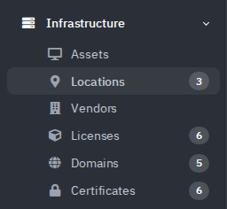
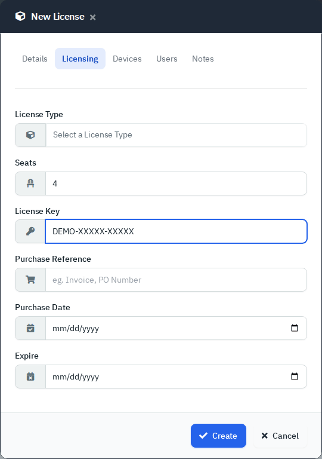
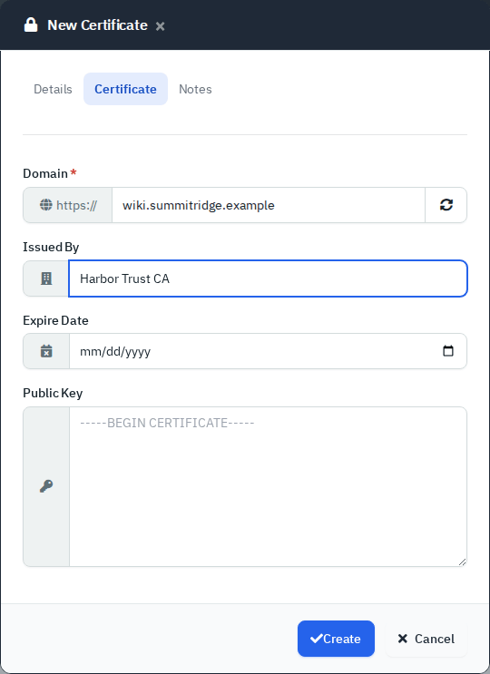
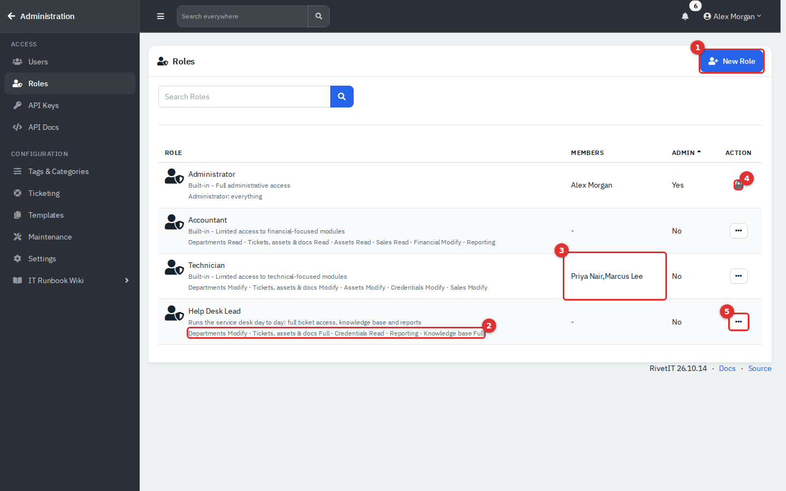
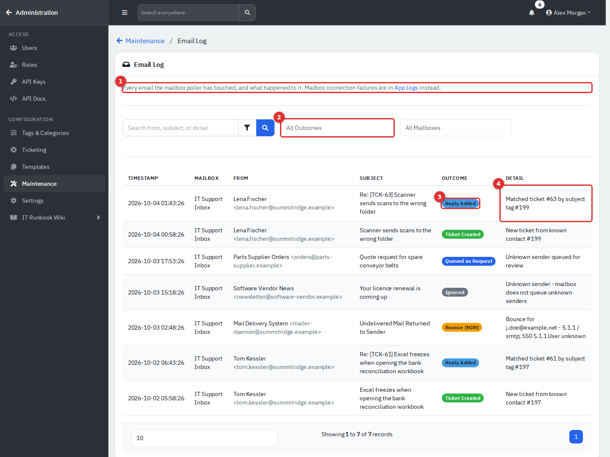

# Visual tour

A picture-first walk through RivetIT, module by module. Each picture links to the page that explains it. Numbered red badges mark the controls the text describes. The company, people and numbers are made up.

Start with [Getting started](01-getting-started.md) if you want words as well. The full list of pages is in the [guide index](README.md).

## Set up and get around

### First-time setup

[Read the page: First-time setup](00-first-time-setup.md)

*The welcome page.*

*Step 4, Company Details.*

*What you see when you open the sign-in page over plain `http://` on a default install.*

### Getting started

[Read the page: Getting started](01-getting-started.md)

*The sign-in page.*

*Search everywhere.*

*The Archived view.*

## Daily work

### Departments and people

[Read the page: Departments and people](02-departments-and-people.md)

*Sidebar → Organization → Departments.*

*The ⋮ menu.*

*Archived (1) view; Restore (2) and Delete (3) in the Bulk Action menu.*

### Onboarding, offboarding and people import

[Read the page: Onboarding, offboarding and people import](02b-people-import-and-workflows.md)

*Download the template (1), choose the file (2), Preview Import (3).*

*A template's tasks.*

*Add an item (1), drag to reorder (2), edit or delete an item (3).*

### Service Desk: Tickets

[Read the page: Service Desk: Tickets](03-service-desk.md)

*The Service Desk group.*

*A ticket.*

***Share with all agents** is honored only at Full; otherwise the view stays private.*

### Service Desk: Recurring Tickets and Request Something

[Read the page: Service Desk: Recurring Tickets and Request Something](03b-recurring-tickets-and-request-catalog.md)

*Recurring Tickets.*

***Schedule**.*

*The form after clicking a tile.*

### Service Desk: Problems, Changes, Requests and CSAT Ratings

[Read the page: Service Desk: Problems, Changes, Requests and CSAT Ratings](03c-problems-changes-mail-requests-csat.md)

*Problems.*

***New Change**.*

*CSAT Ratings.*

### Projects and Calendar

[Read the page: Projects and Calendar](04-projects-and-calendar.md)

*The project list.*

*The Kanban board.*

*A project template.*

## Documentation

### Knowledge Base

[Read the page: Knowledge Base](05-knowledge-base.md)

*The Knowledge Base list.*

*Import Word Document.*

*The portal, shown here through **Administration** → **Settings** → **Portal Preview**.*

### Credentials, Printers and Network Drives

[Read the page: Credentials, Printers and Network Drives](05b-credentials-printers-network-drives.md)

*Credentials.*

*The credential dialog: username, password, TOTP, address, notes and recent history.*

*New Network Drive.*

### Assets

[Read the page: Assets](06-assets.md)

*The Assets list, Workstations tab.*

*Purchase tab.*

*The archived view.*

### Locations, vendors, licenses, domains and certificates

[Read the page: Locations, vendors, licenses, domains and certificates](06b-locations-vendors-licenses-domains-certificates.md)

*The Infrastructure group.*

*Licensing details.*

*Certificate details.*

### Networks, racks, services, contracts and files

[Read the page: Networks, racks, services, contracts and files](06c-networks-racks-services-contracts-files.md)

*Networks (1), Racks (2), Services (3), Contracts (4) and Files (5) in the Executive Office workspace.*

*Services.*

*The New menu inside the Runbooks folder.*

## Training

### Training: Courses and Content

[Read the page: Training: Courses and Content](07-training-courses-and-content.md)

*Training → Courses.*

*The Settings tab.*

*Compare to draft.*

### Training: Quizzes, Paths and Badges

[Read the page: Training: Quizzes, Paths and Badges](07b-training-quizzes-paths-and-badges.md)

*The quiz builder.*

*The path editor.*

*Administration → Settings → Training, General & media.*

### Training: Assignments, Records and Reports

[Read the page: Training: Assignments, Records and Reports](08-training-assignments-and-records.md)

*Training → Overview.*

*Training → Records & sessions → Records.*

*Training → People → Roster.*

### Training: Kiosks, Learners and Certificates

[Read the page: Training: Kiosks, Learners and Certificates](08b-training-kiosks-learners-certificates.md)

*Training → Devices & PINs → Devices, with a revoked device ticked.*

*A finished course appears under **My courses** with the score, and under **My certificates** with its number and **Valid** status.*

*Training → Awarded badges.*

## Connections and insight

### Endpoints and Integrations

[Read the page: Endpoints and Integrations](09-endpoints-and-integrations.md)

*Alerts (1) is always near the top and carries a red count of new alerts.*

*A completed run and its output.*

*The Backups tab.*

### Dashboard and Reports

[Read the page: Dashboard and Reports](10-dashboard-and-reports.md)

*The top of the Dashboard.*

*Your Open Tickets, with the SLA badge.*

*Add a schedule with the form (1 to 4); the list (5) shows what is set up.*

### Report reference

[Read the page: Report reference](10b-report-reference.md)

*Service Desk & SLA.*

*Technician Performance.*

*Credentials overdue or due within the next 30 days (days-ahead box at 1).*

### Department Portal

[Read the page: Department Portal](11-employee-portal.md)

*The switch that controls the whole portal.*

*Request Something.*

*A shared document.*

## Administration

### Administration: Users, Roles and Security

[Read the page: Administration: Users, Roles and Security](12-administration-users-and-security.md)

*(1) Administration opens the Administration area.*

*The Roles list.*

*Email Log.*

### Administration: System Settings, Mail and Maintenance

[Read the page: Administration: System Settings, Mail and Maintenance](13-administration-settings.md)

*Open the user menu (1) and choose **Administration** (2).*

*Mailboxes.*

*Update, on the demo, which has no git remote.*

### Administration: Ticketing, Automation and Organising Data

[Read the page: Administration: Ticketing, Automation and Organising Data](13b-administration-ticketing-and-automation.md)

*Ticket Settings.*

*Canned responses.*

*Holidays.*

### Administration: Integrations, Webhooks and AI

[Read the page: Administration: Integrations, Webhooks and AI](13c-administration-integrations.md)

*Integrations.*

*Webhooks.*

*Telemetry.*

---

This page is generated from the guide by `tools/build-visual-tour.py` (75 pictures). Do not edit it by hand.
